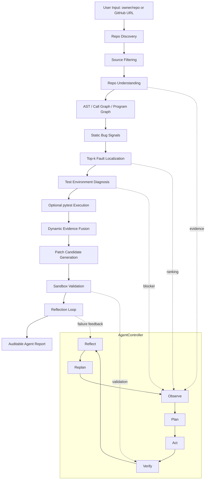

# GitHub 展示入口：Code Intelligence Agent

> 面向公开 Python GitHub 仓库的代码智能 Agent。用户输入 `owner/repo` 或 GitHub URL 后，系统自动完成仓库发现、源码筛选、结构建模、静态缺陷信号挖掘、函数级 Top-k 缺陷定位、测试环境诊断、可选 pytest 执行、补丁生成与沙箱验证，并通过 `AgentController` 形成 `Observe -> Plan -> Act -> Verify -> Reflect -> Replan` 的可审计闭环。

## 当前项目定位

这个项目不是简单的 LLM 代码生成器，也不是固定顺序的脚本工作流。它的核心是一个带状态感知和 blocker 处理能力的代码智能 Agent：

- **Repo Understanding**：解析 GitHub 仓库、ref、源码列表、配置文件、测试框架和可运行命令。
- **Program Graph Modeling**：基于 AST / Call Graph / Program Graph 建模函数、调用、静态规则和测试证据。
- **Fault Localization**：融合 `StaticRuleScore`、`GraphScore`、`DynamicEvidenceScore`、`SBFLScore` 得到 `FinalScore`，输出函数级 Top-k suspicious ranking。
- **Test Diagnosis**：诊断 pytest / unittest / tox / nox 等测试命令、依赖环境、执行结果和 blocker。
- **Patch Validation**：在候选函数范围内生成补丁，经 safety gate 后进入 sandbox pytest 验证。
- **Reflection Loop**：当补丁失败时，根据失败类型、旧 diff、测试输出和函数上下文生成 refined candidate。
- **Auditable Agent Report**：每轮 Observe / Plan / Act / Verify / Reflect / Replan 都落到 JSON/Markdown artifact。

## 一条命令运行

```bash
python -m code_intelligence_agent.evaluation.github_repo_intelligence pypa/sampleproject --agent --format markdown
```

也可以直接输入 GitHub URL：

```bash
python -m code_intelligence_agent.evaluation.github_repo_intelligence https://github.com/pytest-dev/pluggy --agent --format markdown
```

验收套件复现命令：

```bash
python -m code_intelligence_agent.evaluation.github_repo_intelligence_suite datasets/github_cases/repo_intelligence_agent_cli_default_output_acceptance.example.json outputs_smoke/repo_intelligence_agent_cli_default_output_acceptance_current --require-success
```

## 推荐阅读顺序

如果只是评估这个项目是否适合写进简历或上传 GitHub，建议先看：

1. [docs/showcase/github_release_guide.md](docs/showcase/github_release_guide.md)：最终发布入口、能力边界、简历写法和验收命令。
2. [docs/showcase/p3_product_robustness_matrix.md](docs/showcase/p3_product_robustness_matrix.md)：P3 9 仓库真实验证矩阵，包含 stage、blocker、selected action、next action 和 artifact 路径。
3. [docs/examples/README.md](docs/examples/README.md)：3 类真实 GitHub 仓库案例。
4. [docs/showcase/report_samples.md](docs/showcase/report_samples.md)：面试可读的报告摘录。
5. [RESUME_AGENT_PROJECT.md](RESUME_AGENT_PROJECT.md)：可直接改写进简历的项目描述。
6. [INTERVIEW_QA_AGENT_PROJECT.md](INTERVIEW_QA_AGENT_PROJECT.md)：Agent/算法/边界相关面试问答。

## Agent 决策闭环

P3 9 仓库产品化鲁棒性矩阵：

```bash
python -m code_intelligence_agent.evaluation.github_repo_intelligence_suite datasets/github_cases/repo_intelligence_p3_product_robustness.example.json outputs_smoke/repo_intelligence_p3_product_robustness_current --reuse-existing-reports --require-success
```

Detailed matrix index:

`docs/showcase/p3_product_robustness_matrix.md`

The P3 matrix currently covers 9 public GitHub repositories:
`pypa/sampleproject`, `pytest-dev/pluggy`, `psf/requests`, `pallets/click`,
`Textualize/rich`, `tiangolo/fastapi`, `TheAlgorithms/Python`,
`octocat/Hello-World`, and `karpathy/nanoGPT`. The latest verified P3 run has
9/9 agent-passed runs, 9/9 objective-compliance runs, 9/9 AgentController loop
complete runs, 8 repository-structure modeled runs, 8 repo-graph ready runs,
1 source-import blocker, 1 no-test-command blocker, and 1 patch/reflection
repair-ready case.



## 每次运行的主要输出

- `github_repo_intelligence.json/md`：总报告，汇总仓库状态、分析阶段、测试诊断、定位结果和修复状态。
- `github_repo_agent_controller.json/md`：AgentController 的 Observe / Plan / Act / Verify / Reflect / Replan 决策链。
- `repository_structure.json/md`：仓库结构、源码文件、函数和模块信息。
- `repo_graph.json/md`：仓库图和程序结构图摘要。
- `fault_localization.json/md`：Top-k suspicious functions、FinalScore 和信号来源。
- `analysis_readiness.json/md`：当前是否具备进入下一阶段的证据。
- `repository_test_environment.json/md`：测试环境、依赖、runner 和 blocker 诊断。
- `repository_test_execution_plan.json/md`：计划执行的测试命令、风险和范围。
- `repository_test_execution_result.json/md`：pytest/unittest 执行结果、失败类型和上下文。
- `repository_test_dynamic_evidence.json/md`：动态失败证据、traceback、失败测试和定位线索。
- `repository_test_patch_candidates.json/md`：候选补丁、规则、变体和风险。
- `repository_test_patch_validation.json/md`：sandbox 验证结果、成功补丁和失败归因。
- `reflection_trace.json/md`：失败补丁到 refined candidate 的反思轨迹。

## 当前验收结果

最近一次 `repo_intelligence_agent_cli_default_output_acceptance` 覆盖 5 个真实 GitHub 仓库：

| 指标 | 结果 |
| --- | ---: |
| Runs | 5 |
| Agent Passed Runs | 5/5 |
| Objective Compliance Pass Runs | 5/5 |
| Agent Controller Loop Complete Runs | 5/5 |
| Agent Decision Timeline Complete Steps | 10/10 |
| Repository Structure Modeled Runs | 4 |
| Repo Graph Ready Runs | 4 |
| Planned Repository Test Command Runs | 3 |
| Repository Test Patch Validation Successes | 1 |
| Repository Test Reflection Successes | 1 |

真实仓库示例见 [docs/examples](docs/examples/README.md)，GitHub 展示包见 [docs/showcase](docs/showcase/README.md)：

- `pytest-dev/pluggy`：测试可执行，`139 passed`，Agent 将 passing tests 转成 regression guard。
- `octocat/Hello-World`：非 Python / 无可分析源码，Agent 输出 `source_import_or_parse_missing` blocker。
- `TheAlgorithms/Python`：gronsfeld case 中 Top-1 定位 `gronsfeld`，reflection 生成 depth=1 成功补丁。

## DeepSeek LLM 自动修复闭环验收

当前已跑通真实 DeepSeek/LLM 参与的自动修复链路，且所有 API key 只通过环境变量注入，报告中只记录 provider、model、key presence 和短指纹，不写入原始 key。

三类 LLM Agent showcase matrix 已完成：

| 类别 | 说明 | Artifact |
| --- | --- | --- |
| `llm_direct_success` | DeepSeek 初始 LLM patch 直接通过 AST/scope safety gate 和 sandbox pytest | `outputs_smoke/repo_intelligence_llm_repair_smoke_deepseek_direct_attempt/github_repo_intelligence_suite.json` |
| `llm_reflection_success` | 初始 LLM patch 失败后，LLM reflection 基于 pytest 反馈生成 refined patch 并通过 sandbox pytest | `outputs_smoke/repo_intelligence_llm_repair_smoke_deepseek_pass/github_repo_intelligence_suite.json` |
| `llm_blocker` | LLM key 缺失时 Agent 不伪造成功，输出 blocker；hybrid 模式下 rule candidate 仍可验证 | `outputs_smoke/repo_intelligence_hybrid_no_key_showcase/github_repo_intelligence_suite.json` |

合并矩阵：

```bash
python -m code_intelligence_agent.evaluation.llm_repair_showcase_matrix \
  outputs_smoke/repo_intelligence_llm_repair_smoke_deepseek_direct_attempt/github_repo_intelligence_suite.json \
  outputs_smoke/repo_intelligence_llm_repair_smoke_deepseek_pass/github_repo_intelligence_suite.json \
  outputs_smoke/repo_intelligence_hybrid_no_key_showcase/github_repo_intelligence_suite.json \
  outputs_smoke/llm_repair_showcase_matrix_complete \
  --require-complete
```

当前矩阵结果：`llm_direct_success=1`、`llm_reflection_success=1`、`llm_blocker=1`，`status=pass`。

每个 showcase case 的 `github_repo_agent_controller.json/md` 都包含 `llm_repair_action_audit`，矩阵中也展开了 `agent_loop_evidence`：可以直接审计 `Observe -> Plan -> Act -> Verify -> Reflect -> Replan` 如何对应到 `generate_llm_patch_candidates`、`run_llm_patch_reflection_loop` 或 `generate_hybrid_patch_candidates` / `missing_llm_api_key` blocker。LLM judge 只参与候选排序辅助，最终成功仍以 sandbox pytest 为准。

此外，`outputs_smoke/llm_controller_action_examples/llm_controller_action_examples.json` 固化了 AgentController 在三种关键状态下的 `selected_action`：LLM patch 生成、LLM reflection、hybrid missing-key blocker。

P6 Agent 优化已经启动：AgentController 现在会写出标准 `agent_action_registry.json/md` 与 `agent_policy_trace.json/md`。Action Registry 覆盖 `clone_or_load_repository`、`discover_tests`、`generate_llm_patch_candidates`、`run_llm_patch_reflection_loop`、`emit_blocker_report` 等 13 个核心动作；Policy Trace 会把当前 selected action 映射到 canonical action，并展开 `Observe -> Plan -> Act -> Verify -> Reflect -> Replan` 六步证据。

Phase 2 已开始补强真实 GitHub 仓库 onboarding 审计：系统现在会写出独立 `repository_test_discovery.json/md`，并新增 `github_onboarding_matrix.json/md` 汇总多个仓库的源码、layout、测试发现、环境诊断、执行计划、blocker 和 Agent policy trace 覆盖情况。矩阵工具支持 `--backfill-derived-artifacts`，可以从旧版 `github_repo_intelligence.json` / `github_repo_agent.json` 中回填可推导的审计 artifact，便于把历史真实仓库运行结果纳入统一审计。注意：这一步目前完成的是 matrix 基础设施、旧报告回填能力和本地真实报告回填验证；新的 10 仓库可复现实跑矩阵仍是后续工作。阶段性审计见 `P6_AGENT_OPTIMIZATION_PROGRESS.md`。

Phase 3 的 LLM patch 多候选链路也已补强：`LLMPatchGenerator` 现在支持一次响应返回多个 `fixed_sources`，每个候选都会记录 `candidate_id`、LLM candidate index、target function、diff、JSON parse 结果、prompt context audit、AST/scope/signature validation 和 safety gate 结果；`repository_test_patch_candidates.json/md` 会提升 `llm_generation_audit`，展示每次 LLM 调用请求了几个候选、解析出几个、接受/拒绝几个，以及缺失哪些 prompt 上下文字段。

Phase 4 的 reflection 审计也已增强：`RepairLoop` 和 `BeamPatchSearch` 会对 refined child patch 基于自身源码重新执行 AST/scope/signature safety gate，避免复用 parent patch 的旧安全结论；被阻断的 child patch 会记录为 `safety_gate_blocked` 且不进入 pytest。LLM reflection prompt 现在显式包含 parent candidate、previous patch fingerprint、failure evidence、reflection strategy、target function source、related caller/callee context 和可选 judge feedback；`repository_test_patch_validation.json/md` 与 `reflection_trace.json/md` 会提升 `llm_reflection_audit`，展示 prompt 字段缺口、JSON/schema parse、accepted/rejected candidate 统计和 sandbox result，用于审计 `Reflect -> Verify -> Replan` 是否有足够证据。

Phase 6 的 LLM repair 评估层也开始补齐：`llm_repair_showcase_matrix` 现在除旧版 `llm_repair_showcase_matrix.json/md` 外，还会写出 P6 命名的 `llm_repair_evaluation_matrix.json/md` 与 `llm_repair_metrics_report.json/md`，集中汇总 LLM direct success、reflection success、blocker case、Patch Success@1/@3/@5、sandbox pass rate、safety gate block rate、judge-sandbox agreement、patch judge outcome counts、平均运行时间、LLM token/cost 统计和每个 case 的 Agent loop trace。评估矩阵现在会额外区分 case class、evidence completeness 与 blocker category：直接成功、reflection 成功和 blocker 都必须具备 provider/model、key 审计、候选数量、sandbox authority、patch validation artifact、reflection audit 或下一步 action 等证据；blocker 会被归类为 `llm_failed_blocker`、`environment_blocker`、`no_test_oracle_blocker` 或 `safety_gate_blocker`，缺类时不会计入对应 P6 target。Patch judge 目标也会要求 LLM judge ready、judge 接受 sandbox 成功候选、judge 拒绝 sandbox 失败候选；`accept_failure` / `reject_success` 会被保留为 judge-sandbox outcome mismatch，最终成功仍由 `sandbox_pytest_decides_success` 决定。完整 P6 目标仍要求后续补足 20 个 repair/evaluation case、5 个 direct success、3 个 reflection success 和 5 个 blocker case。

## 边界说明

当前项目可以写作“面向公开 Python GitHub 仓库的智能分析 Agent”，但不应夸大为“任意语言、任意依赖、任意真实 bug 都能 100% 自动修复”。对于无 Python 源码、无测试 oracle、环境不可复现或缺少 failing test 的仓库，Agent 会输出 blocker、恢复策略和下一步建议，而不是虚构修复结果。

---

# Code Intelligence Agent System（CIA）技术设计文档 v1.1

## 项目速览

Code Intelligence Agent System（CIA）是一个面向 Python 代码仓库的算法向代码智能体原型，目标是把程序静态分析、图推理、缺陷定位、补丁搜索、沙箱验证和实验评估串成可复现闭环。项目重点不是简单调用 LLM 生成代码，而是用 AST / CFG / Call Graph / Data-flow、SBFL、GraphScore、StaticRuleScore、FinalScore、Beam Search、PatchScore 和 ablation study 证明每个算法组件的贡献。

### 当前可展示结果

| 指标 | 当前 62-case suite |
| --- | ---: |
| Benchmark Cases | 62 |
| Top-1 Localization | 1.0000 |
| Top-3 Localization | 1.0000 |
| MAP | 1.0000 |
| Patch Success Rate | 1.0000 |
| Beam Success Rate | 0.9516 |
| Cross-function Data-flow Cases | 22 |
| Program Slice Cases | 62 |
| Slice-grounded Cases | 62 |
| Average Top-1 Slice Support | 0.9839 |
| Generated Hard Cases | 5 |
| Generated Score Inversions | 2 |
| Generated Diversity-Assisted Successes | 1 |
| Generated Diversity Success Lift | 3.0000 |
| Generated Diversity Success Bonus | 0.5900 |
| Ablation-linked Generated Cases | 5 |

### 快速复现

```bash
python -m code_intelligence_agent.evaluation.run_experiment_suite datasets/github_cases/mutation_templates.example.json outputs_smoke/experiment_suite_62case_showcase_final --format markdown --no-dynamic-coverage --top-n 10 --source-cache-dir outputs_smoke/github_raw_source_cache --run-quality-gate --run-showcase-report --hard-case-catalog outputs_smoke/experiment_suite_52case/source_mining_catalog.json --hard-case-max-total-cases 5
```

运行后核心 artifact：

- `outputs_smoke/experiment_suite_62case_showcase_final/suite.json`
- `outputs_smoke/experiment_suite_62case_showcase_final/suite.md`
- `outputs_smoke/experiment_suite_62case_showcase_final/showcase_report.json`
- `outputs_smoke/experiment_suite_62case_showcase_final/showcase_report.md`
- `outputs_smoke/experiment_suite_62case_showcase_final/resume_showcase.md`

如果重新运行 suite 后首页指标发生变化，可以同步 README 顶部展示表：

```bash
python -m code_intelligence_agent.evaluation.readme_showcase_sync README.MD outputs_smoke/experiment_suite_62case_showcase_final/showcase_report.json --in-place
```

也可以在 `run_experiment_suite` 命令后追加 `--sync-readme-showcase README.MD`，让 suite 结束时自动同步首页指标。

### 简历/答辩展示入口

优先查看 `outputs_smoke/experiment_suite_62case_showcase_final/resume_showcase.md`。该文件会自动汇总项目定位、核心指标、FinalScore 置信度校准（raw/calibrated Brier Score、ECE、平均置信度）、FinalScore attribution（信号贡献、Top-1 margin、counterfactual flip）、Phase 1-4 算法栈、代表 case trace、generated hard-case evidence（含 generated diversity reranking、candidate deduplication pressure、reflection depth、slice grounding、provenance-selected cases、average provenance bonus、stable ref / license / leakage risk 摘要）、ablation-linked hard cases（含 generated signal / algorithm component 聚合与 strongest delta）和简历 bullet，适合作为 GitHub 首页、简历项目附件或面试答辩材料。

### 四阶段能力闭环

| 阶段 | 能力 |
| --- | --- |
| Phase 1 | Repo Parser、AST Analyzer、Call Graph、Data-flow、Rule-based Bug Detector |
| Phase 2 | Program Graph、Program Slice Evidence、Slice-grounded Localization、StaticRuleScore、GraphScore、FinalScore、Top-k Suspicious Ranking、FinalScore Attribution |
| Phase 3 | Patch Generation、Patch Apply、pytest Sandbox、Execution Feedback、Reflection Loop |
| Phase 4 | Beam Search、Benchmark Cases、Quality Gate、Metric Reports、Ablation Study、Hard-case Generation |

## 1. 项目概述

### 1.1 项目目标

构建一个面向 Python 代码仓库的智能代码分析与自动修复 Agent 系统。系统结合程序静态分析、异构程序图、缺陷定位算法、LLM 推理和沙箱执行验证，实现从仓库理解到自动修复的闭环。

核心目标：

- 代码仓库理解（Repo Understanding）
- 程序结构建模（AST / CFG / Call Graph / Data Dependency）
- 异构程序图构建（Heterogeneous Program Graph）
- Bug 检测（Rule-based + Graph-based + LLM reasoning）
- Bug 定位（SBFL + Graph Ranking + LLM Scoring）
- 自动修复（Patch Generation + Patch Search）
- 执行验证（Sandbox Execution）
- 自我修复（Reflection Loop）
- 实验评估（Localization Accuracy / Patch Success Rate / Ablation Study）

### 1.2 系统定位

```text
Code Intelligence Agent
= Program Analysis
+ Graph-based Fault Localization
+ Search-based Patch Generation
+ LLM Reasoning
+ Execution Feedback Loop
```

本项目不是简单的 LLM 代码生成工具，而是一个以算法驱动的代码智能体系统。LLM 主要承担语义理解、候选解释和补丁生成，核心决策由程序图、缺陷定位排序、搜索策略和执行反馈共同约束。

### 1.3 MVP 范围

第一版聚焦 Python 仓库：

- 支持 Python 3.10+
- 支持单文件和小型多文件项目
- 支持 pytest 测试执行
- 支持 AST 和函数级 Call Graph
- 支持基础函数内 def-use / data dependency 图边
- 支持基础函数内 control-flow statement / controls 图边
- 支持函数内 basic-block CFG 节点和 `cfg_next / cfg_branch / cfg_loop / cfg_exception` 边
- 支持函数级 Bug Localization
- 支持 diff-based patch generation
- 支持最多 3 轮 reflection repair

跨文件高级数据流分析、调用栈级 path-sequence coverage 和向量检索作为后续增强模块。

## 2. 总体架构

```text
User Input
  repo_path / bug_report / failing_test
        |
        v
[1] Repo Parser Layer
        |
        v
[2] Program Graph Builder
    AST + CFG + Call Graph + Data Dependency
        |
        v
[3] Fault Localization Engine
    SBFL + Graph Ranking + Static Rules + LLM Score
        |
        v
[4] Planning Agent
    ReAct + Beam Search + ToT Hypothesis Search
        |
        v
[5] Patch Generation Agent
    diff-based + AST-aware editing
        |
        v
[6] Execution Sandbox
    pytest + timeout + isolated workspace
        |
        v
[7] Reflection Loop
    error classification + patch refinement
        |
        v
Final Output
  report + suspicious ranking + patch + execution trace
```

## 3. 技术栈

必须使用：

- Python 3.10+
- `ast`
- `subprocess`
- `pytest`
- `networkx`
- `dataclasses` / `pydantic`

可选增强：

- OpenAI / DeepSeek / Qwen / Claude API
- FAISS / Chroma / pgvector
- Tree-sitter
- Docker sandbox
- FastAPI + React Dashboard

## 4. 核心数据结构

### 4.1 Code Entity

```python
@dataclass
class CodeEntity:
    id: str
    type: str  # file | class | function | statement | variable | test
    name: str
    file_path: str
    start_line: int
    end_line: int
    source: str
    metadata: dict
```

### 4.2 Program Graph

系统构建异构程序图，而不是只保存 AST 节点。

```text
Node Types:
- FileNode
- ClassNode
- FunctionNode
- StatementNode
- VariableNode
- TestNode

Edge Types:
- contains
- imports
- calls
- defines
- uses
- controls
- data_depends_on
- key_flows_to_subscript
- arg_flows_to_param
- return_flows_to_var
- tested_by
```

图结构：

```python
ProgramGraph = {
    "nodes": [
        {
            "id": "src.math_utils.add",
            "type": "function",
            "name": "add",
            "file": "src/math_utils.py",
            "start_line": 10,
            "end_line": 18,
            "features": {}
        }
    ],
    "edges": [
        {
            "source": "tests.test_add.test_negative",
            "target": "src.math_utils.add",
            "type": "tested_by",
            "weight": 1.0
        }
    ]
}
```

## 5. 模块设计

### 5.1 Repo Parser Module

功能：

- 扫描 Python 仓库
- 提取文件、类、函数、测试函数
- 识别 import 依赖
- 生成代码 chunk
- 建立函数签名索引

输入：

```python
repo_path: str
```

输出：

```python
{
    "files": [...],
    "classes": [...],
    "functions": [...],
    "tests": [...],
    "chunks": [...]
}
```

### 5.2 Program Graph Builder

功能：

- AST 解析
- CFG 构建
- Call Graph 构建
- 变量 def-use 关系提取
- 测试函数到业务函数的覆盖关系建模

第一版必须实现：

- 函数级 AST 节点提取
- 函数调用关系提取
- import 依赖提取
- 测试函数识别
- 函数级 Program Graph

增强版实现：

- 基本块级 CFG：`basic_block` 节点、`cfg_entry`、`cfg_next`、`cfg_branch`、`cfg_loop`、`cfg_exception` 边
- def-use chain
- 跨文件调用解析
- 动态测试覆盖映射

### 5.3 Fault Localization Engine

该模块是系统的核心算法模块，负责对可能出错的函数进行排序。

输入：

```python
{
    "program_graph": ProgramGraph,
    "test_results": TestResult,
    "traceback": str,
    "bug_report": str | None
}
```

输出：

```python
[
    {
        "function_id": "src.math_utils.divide",
        "score": 0.87,
        "rank": 1,
        "signals": {
            "sbfl": 0.72,
            "graph": 0.81,
            "static": 0.60,
            "semantic": 0.75,
            "llm": 0.90,
            "risk": 0.20
        },
        "reason": "covered by failing test and close to traceback frame"
    }
]
```

### 5.4 Bug Detection Agent

功能：

- 基于 AST 规则检测常见 Bug
- 基于程序图识别异常依赖模式
- 基于 LLM 进行多类别原因分析

Bug 类型：

- boundary error
- null / None error
- type error
- condition error
- loop termination error
- off-by-one error
- API misuse
- exception handling error
- performance issue
- security issue

规则示例：

```text
if len(x) >= 0:
    always true condition

for i in range(len(arr)):
    arr[i + 1]
    possible boundary error

except Exception:
    pass
    swallowed exception
```

### 5.5 Planning Agent

Planning Agent 不只生成自然语言计划，而是生成可执行的搜索状态。

状态定义：

```python
PlanningState = {
    "bug_hypothesis": str,
    "target_functions": list[str],
    "current_patch": str | None,
    "test_result": dict | None,
    "score": float
}
```

动作空间：

```text
Action:
- inspect_function
- inspect_callers
- inspect_callees
- generate_patch
- run_tests
- refine_patch
- rollback_patch
```

支持三种策略：

- ReAct Planning：Thought -> Action -> Observation
- Beam Search：保留 top-k patch candidates
- Tree of Thoughts：维护多条 bug hypothesis reasoning paths

### 5.6 Patch Generation Agent

功能：

- 根据缺陷定位结果选择 top-k 函数
- 注入函数源码、调用上下文、失败测试和错误栈
- 生成 unified diff
- 控制 patch 尺寸
- 避免修改无关文件

输出格式：

```diff
--- a/src/math_utils.py
+++ b/src/math_utils.py
@@
- return a / b
+ if b == 0:
+     raise ValueError("division by zero")
+ return a / b
```

约束：

- 优先生成最小 patch
- 优先修改 suspicious ranking 靠前的函数
- 不允许删除测试来通过验证
- 不允许跳过失败测试
- 不允许大规模重构

### 5.7 Execution Sandbox

功能：

- 在隔离临时目录中应用 patch
- 执行 pytest
- 设置 timeout
- 收集 stdout、stderr、traceback
- 统计通过测试数和失败测试数

输出：

```python
{
    "success": False,
    "passed": 18,
    "failed": 2,
    "timeout": False,
    "stdout": "...",
    "stderr": "...",
    "traceback": "..."
}
```

### 5.8 Reflection Agent

当 patch 执行失败时，Reflection Agent 根据测试反馈修复 patch。

输入：

```python
{
    "previous_patch": str,
    "execution_result": dict,
    "suspicious_functions": list,
    "program_graph_context": dict
}
```

处理流程：

```text
execution failure
  -> error classification
  -> failed assertion extraction
  -> patch impact analysis
  -> regenerate or refine patch
  -> rerun tests
```

最大重试次数：

```python
MAX_REFLECTION_ROUNDS = 3
```

## 6. 核心算法设计

### 6.1 异构程序图构建

给定仓库中的 Python 文件集合 `F`，系统将每个代码实体映射为节点，将结构、调用、依赖和测试关系映射为边。

```text
G = (V, E)

V = V_file ∪ V_class ∪ V_function ∪ V_statement ∪ V_variable ∪ V_test

E = E_contains ∪ E_imports ∪ E_calls ∪ E_def_use ∪ E_controls ∪ E_tested_by
```

节点特征：

```text
feature(v) = [
    node_type,
    line_span,
    cyclomatic_complexity,
    call_in_degree,
    call_out_degree,
    test_coverage_count,
    static_rule_hits,
    embedding(optional)
]
```

### 6.2 Spectrum-Based Fault Localization（SBFL）

系统引入 SBFL 作为缺陷定位的基础信号。

对函数 `f` 定义：

```text
failed_covered(f): 覆盖 f 的失败测试数量
passed_covered(f): 覆盖 f 的通过测试数量
total_failed: 失败测试总数
```

Ochiai 分数：

```text
Ochiai(f) = failed_covered(f)
          / sqrt(total_failed * (failed_covered(f) + passed_covered(f)))
```

直觉：

- 被失败测试覆盖越多，越可疑
- 被大量通过测试覆盖，嫌疑下降
- 没有被失败测试覆盖，分数为 0

### 6.3 Graph-based Suspiciousness Ranking

程序图用于补充 SBFL 无法表达的结构信息。

```text
GraphScore(f) =
    a1 * TracebackHit(f)
  + a2 * TestCoverage(f)
  + a3 * CallGraphProximity(f, failing_test)
  + a4 * DependencyCentrality(f)
  + a5 * StaticRuleHit(f)
  - a6 * PatchRisk(f)
```

其中：

```text
TracebackHit(f):
    f 是否出现在错误栈中

CallGraphProximity(f, failing_test):
    failing test 到 f 的调用图最短路径距离，距离越短分数越高

DependencyCentrality(f):
    f 在调用图中的 PageRank / in-degree / out-degree 特征

PatchRisk(f):
    修改 f 影响的调用者数量，影响范围越大风险越高
```

距离分数：

```text
Proximity(f, t) = 1 / (1 + shortest_path_distance(t, f))
```

语句级覆盖可疑度：

```text
StatementSBFL(f) =
    max_{line in executable_lines(f)} Ochiai(line)

Ochiai(line) =
    failed_covered(line)
    / sqrt(total_failed * (failed_covered(line) + passed_covered(line)))
```

`StatementSBFL` 用于区分“失败测试独有覆盖语句”和“失败/通过测试共同覆盖语句”，当前作为 `GraphScore` 的细粒度动态覆盖分量，并可通过 `without_line_coverage` 消融一并关闭其图分数贡献。

分支级覆盖可疑度：

```text
BranchSBFL(f) =
    max_{outcome in branch_outcomes(f)} Ochiai(outcome)

branch_outcome examples:
    if:<line>:true
    if:<line>:false
    loop:<line>:taken
    loop:<line>:skipped
    try:<line>:except:<handler_line>
```

`BranchSBFL` 基于 AST 分支结构和 pytest trace 覆盖行推断条件分支、循环分支和异常处理分支的 outcome 覆盖，用于区分失败测试独有路径和通过测试共同路径，并可通过 `without_branch_coverage` 单独消融。

路径片段覆盖可疑度：

```text
PathSBFL(f) =
    max_{fragment in path_fragments(f)} Ochiai(fragment)

path_fragment examples:
    test_name -> function
    function_a -> function_b
    function_a -> function_b -> function_c
    pathseq:test_name -> caller -> callee
    asyncseq:test_name -> async_caller -> async_callee
    exception:test_name -> function:ExceptionType
    exception_path:test_name -> caller -> callee:ExceptionType
    loopseq:test_name -> function:line:zero|single|multi
```

当前实现使用 pytest trace 覆盖到的函数集合、仓库内 line-event 执行序列、exception event、repo 内调用栈、async coroutine call event 和循环体命中次数生成路径片段，用于区分失败测试独有路径片段、调用序列、异步调用序列、异常单点片段、异常传播链片段和 `zero/single/multi` 循环边界路径，并可通过 `without_path_coverage` 单独消融。后续可以继续把该信号扩展为跨进程路径和更细粒度跨线程传播链。

### 6.4 LLM Reasoning Score

LLM 不直接决定最终结果，只作为一个可解释信号。

输入上下文：

- top-k suspicious functions
- traceback
- failing tests
- function source
- callers / callees
- static rule hits

输出：

```python
{
    "function_id": "...",
    "llm_score": 0.0,
    "bug_type": "...",
    "reason": "...",
    "evidence": [...]
}
```

### 6.5 Final Localization Score

最终缺陷定位分数：

```text
FinalScore(f) =
    w1 * SBFL(f)
  + w2 * GraphScore(f)
  + w3 * StaticRuleScore(f)
  + w4 * SemanticSimilarity(f, error_message)
  + w5 * LLMScore(f)
  - w6 * PatchRisk(f)
```

默认权重：

```text
w1 = 0.30
w2 = 0.25
w3 = 0.15
w4 = 0.10
w5 = 0.15
w6 = 0.05
```

当前实现支持两种模式：

- 默认固定权重，用于快速、可解释的 baseline。
- 通过验证集执行 grid search，按 `MAP / MRR / nDCG@3 / 1-EXAM / Top-1 / Top-3` 的组合目标选择更优 `FinalScore` 权重，并在 robust score、Top-k/MAP/MRR/nDCG 与 holdout gap 之间标注 Pareto frontier，避免只靠单一指标选择被支配的权重 profile。

learning-to-rank 可以作为后续增强，在 benchmark 扩大后引入 LambdaMART / RankNet 等监督排序模型。

### 6.6 Patch Search

Patch 生成不是一次性输出，而是搜索问题。

```text
State:
    current_code
    selected_function
    bug_hypothesis
    patch_candidate
    test_result

Action:
    modify_condition
    add_boundary_check
    change_loop_bound
    fix_api_usage
    add_exception_handling
    replace_expression

Reward:
    test_pass_ratio
    localization_confidence
    patch_minimality
    static_check_pass
    regression_penalty
```

Patch 候选评分：

```text
PatchScore(p) =
    b1 * TestsPassedRatio(p)
  + b2 * LocalizationConfidence(p)
  + b3 * StaticCheckPass(p)
  + b4 * PatchPrior(p)
  + b5 * ExecutionFeedbackScore(p)
  + b6 * SuccessBonus(p)
  - b7 * DiffSize(p)
  - b8 * PatchRisk(p)
  - b9 * NewWarningCount(p)
```

Beam Search：

```text
1. 从 top-k suspicious functions 中生成 patch candidates
2. 对每个 patch 执行静态检查和测试
3. 保留 PatchScore 最高的 beam_width 个候选
4. 对失败候选进行 reflection refinement
5. 最多搜索 max_depth 轮
```

默认参数：

```python
BEAM_WIDTH = 3
MAX_SEARCH_DEPTH = 3
TOP_K_SUSPICIOUS_FUNCTIONS = 5
```

### 6.7 Reflection Loop

Reflection 不是简单重试，而是基于错误类型选择修复策略。

错误分类：

```text
SyntaxError:
    修复语法或 diff 应用问题

ImportError / AttributeError:
    检查依赖、命名和 API 调用

AssertionError:
    对比 expected / actual，重新分析逻辑条件

TimeoutError:
    优先检查循环边界、递归终止和算法复杂度

Regression Failure:
    说明 patch 破坏已有行为，增加 PatchRisk 惩罚
```

## 7. 主 Agent 执行流程

```python
def run_agent(repo_path: str, bug_report: str | None = None):
    # 1. Parse repository
    parsed_repo = repo_parser(repo_path)

    # 2. Build heterogeneous program graph
    program_graph = build_program_graph(parsed_repo)

    # 3. Run baseline tests
    baseline_result = sandbox.run_tests(repo_path)

    # 4. Extract failure signals
    failure_context = extract_failure_context(baseline_result, bug_report)

    # 5. Rank suspicious functions
    suspicious = fault_localizer.rank(
        program_graph=program_graph,
        failure_context=failure_context,
    )

    # 6. Generate search plan
    plan = planner.create_plan(
        program_graph=program_graph,
        suspicious_functions=suspicious,
        failure_context=failure_context,
    )

    # 7. Search patch candidates
    patch_candidates = patch_search.generate(
        plan=plan,
        suspicious_functions=suspicious,
    )

    # 8. Execute and score patches
    best_patch = None
    for patch in patch_candidates:
        result = sandbox.apply_and_test(repo_path, patch)
        patch.score = score_patch(patch, result)
        best_patch = select_best_patch(best_patch, patch)

    # 9. Reflection loop
    rounds = 0
    while not best_patch.success and rounds < MAX_REFLECTION_ROUNDS:
        refined_patch = reflector.refine(
            patch=best_patch,
            execution_result=best_patch.execution_result,
            program_graph=program_graph,
        )
        result = sandbox.apply_and_test(repo_path, refined_patch)
        best_patch = update_best_patch(best_patch, refined_patch, result)
        rounds += 1

    # 10. Generate final report
    return build_final_report(
        suspicious=suspicious,
        patch=best_patch,
        execution_trace=best_patch.execution_trace,
    )
```

## 8. 项目目录结构

```text
code_intelligence_agent/
|
├── main.py
├── config.py
|
├── agents/
│   ├── planner.py
│   ├── bug_detector.py
│   ├── llm_fault_scorer.py
│   ├── llm_patch_generator.py
│   ├── multi_patch_repair.py
│   ├── patch_generator.py
│   ├── reflector.py
│   └── llm_client.py
|
├── core/
│   ├── repo_parser.py
│   ├── ast_analyzer.py
│   ├── cfg_builder.py
│   ├── call_graph.py
│   ├── program_graph.py
│   ├── state_builder.py
│   └── fault_localizer.py
|
├── search/
│   ├── beam_search.py
│   ├── beam_patch_search.py
│   ├── hypothesis_search.py
│   ├── patch_risk.py
│   ├── patch_search.py
│   └── scoring.py
|
├── rules/
│   ├── base.py
│   ├── boundary_rules.py
│   ├── type_rules.py
│   ├── control_flow_rules.py
│   └── security_rules.py
|
├── tools/
│   ├── sandbox.py
│   ├── test_runner.py
│   ├── diff_utils.py
│   └── coverage_runner.py
|
├── evaluation/
│   ├── benchmark_loader.py
│   ├── metrics.py
│   ├── ablation.py
│   └── report.py
|
├── datasets/
│   ├── toy_bugs/
│   └── benchmark_cases/
|
├── tests/
│   ├── test_repo_parser.py
│   ├── test_program_graph.py
│   ├── test_fault_localizer.py
│   └── test_patch_search.py
|
└── utils/
    ├── logger.py
    └── json_utils.py
```

## 9. MVP 开发阶段

### Phase 1：单文件静态分析

目标：

- 解析单个 Python 文件
- 提取函数、类、调用关系
- 实现基础 AST 规则检测
- 输出可疑函数列表

交付物：

- `repo_parser.py`
- `ast_analyzer.py`
- `call_graph.py`
- `bug_detector.py`

### Phase 2：函数级缺陷定位

目标：

- 构建函数级 Program Graph
- 实现 SBFL / GraphScore / StaticScore
- 实现 FinalScore 排序
- 输出 top-k suspicious functions

交付物：

- `program_graph.py`
- `fault_localizer.py`
- `scoring.py`

### Phase 3：自动修复闭环

目标：

- 生成 diff patch
- 应用 patch
- 沙箱执行 pytest
- 根据失败结果进行 reflection

交付物：

- `patch_generator.py`
- `patch_search.py`
- `sandbox.py`
- `reflector.py`

### Phase 4：搜索增强与实验评估

目标：

- 实现 Beam Search Patch Search
- 实现 ToT bug hypothesis search
- 构建 benchmark cases
- 输出评估报告和消融实验

交付物：

- `beam_search.py`
- `beam_patch_search.py`
- `patch_risk.py`
- `ablation.py`
- `metrics.py`
- `report.py`

## 10. Evaluation 指标

### 10.1 Bug Localization Metrics

```text
Top-1 Localization Accuracy:
    正确 bug 函数排在第 1 位的比例

Top-3 Localization Accuracy:
    正确 bug 函数出现在前 3 位的比例

Mean Reciprocal Rank（MRR）:
    正确 bug 函数排名倒数的平均值

Mean Average Precision（MAP）:
    多 bug 场景下的平均定位质量
```

### 10.2 Patch Metrics

```text
Patch Success Rate:
    生成 patch 后所有测试通过的比例

Execution Pass Rate:
    patch 能够成功执行且无运行时错误的比例

Regression Rate:
    patch 导致原本通过的测试失败的比例

Average Repair Iterations:
    平均修复轮数

Average Patch Size:
    平均 diff 行数
```

### 10.3 Agent Metrics

```text
Tool Call Count:
    平均工具调用次数

Token Cost:
    平均 token 消耗

Planning Depth:
    平均搜索深度

Reflection Success Rate:
    首次失败后通过 reflection 修复成功的比例
```

## 11. Ablation Study

必须设计消融实验，用于证明每个算法模块的贡献。

```text
Full Model:
    SBFL + Program Graph + Static Rules + LLM Score + Reflection

- without SBFL:
    去掉测试覆盖缺陷定位信号

- without Program Graph:
    去掉调用图距离、依赖中心性和 PatchRisk

- without Line Coverage:
    去掉函数内语句覆盖比例和 StatementSBFL 信号

- without Branch Coverage:
    去掉条件分支、循环分支和异常路径 outcome 的 BranchSBFL 信号

- without Path Coverage:
    去掉测试到函数和局部函数路径片段的 PathSBFL 信号

- without Data Dependency:
    去掉函数内 def-use / data dependency 图信号

- without Control Flow:
    去掉函数内控制语句 / controls 图信号

- without PageRank:
    去掉调用图 PageRank 中心性信号

- without Caller Impact:
    去掉多跳 production caller impact 信号；该信号沿 `calls` / `awaits` 反向传播，并对跨文件 caller 与 awaited call 加权

- without Static Rules:
    去掉 AST 规则检测

- without Rule Precision Filter:
    保留旧的宽松规则触发逻辑，用于量化误报过滤对 Rule Precision 的贡献

- without LLM Score:
    只使用程序分析和测试反馈

- without Reflection:
    只生成一次 patch，不进行自我修复

- without Beam Search:
    只保留单个 patch candidate

- without Multi-Patch Repair:
    禁用跨函数 patch bundle，只评估单函数修复链路

- without graph bundle search:
    保留 MultiPatchRepair，但关闭 ProgramGraph 驱动的 bundle 排序，用于量化调用边、跨模块依赖边、relative import / package-distance 证据和跨函数数据流边对组合修复搜索顺序的贡献
```

对比指标：

- Top-1 Accuracy
- Top-3 Accuracy
- MRR / MAP
- Rule Recall / Rule Precision / Extra Rules
- Patch Success Rate
- Beam Success Rate
- Multi-Patch Success Rate
- Average Repair Rounds
- Average Patch Size
- Token Cost

## 12. 最终输出格式

```json
{
  "status": "success",
  "bugs": [
    {
      "bug_type": "boundary error",
      "location": {
        "file": "src/math_utils.py",
        "function": "divide",
        "start_line": 10,
        "end_line": 18
      },
      "confidence": 0.87,
      "ranking_signals": {
        "sbfl": 0.72,
        "graph": 0.81,
        "static": 0.60,
        "semantic": 0.75,
        "llm": 0.90,
        "risk": 0.20
      },
      "reason": "Function is covered by failing test and appears in traceback."
    }
  ],
  "plan": [
    "inspect suspicious function",
    "generate boundary-condition patch",
    "run pytest",
    "refine patch if needed"
  ],
  "patch": "--- a/src/math_utils.py\n+++ b/src/math_utils.py\n...",
  "execution_result": {
    "success": true,
    "passed": 20,
    "failed": 0,
    "timeout": false
  },
  "reflection_rounds": 1,
  "confidence": 0.91,
  "explanation": "Patch passed all tests and did not increase affected caller risk."
}
```

## 13. 简历表达方向

项目一句话：

```text
基于异构程序图、SBFL 缺陷定位和 LLM Patch Search 的代码智能分析与自动修复 Agent。
```

简历描述：

```text
构建面向 Python 仓库的代码智能 Agent，结合 AST、调用图、测试覆盖和 SBFL 实现函数级缺陷定位；设计融合 GraphScore、StaticRuleScore、SemanticSimilarity 和 LLMScore 的 suspiciousness ranking 算法，对候选缺陷函数进行 Top-k 排序；实现 Beam Search Patch Generation、pytest 沙箱验证和 reflection loop，在自建 benchmark 上评估 Top-1/Top-3 定位准确率、Patch Success Rate 和消融实验结果。
```

算法亮点：

- 异构程序图建模
- 函数级 SBFL、语句级 StatementSBFL、分支级 BranchSBFL 和路径片段级 PathSBFL 缺陷定位
- 图距离、PageRank、调用链和多跳 caller impact 打分
- Patch Search 候选搜索
- 执行反馈驱动的自我修复
- 消融实验验证模块贡献

## 14. 当前实现状态

当前已完成一个可运行的算法 MVP，覆盖 Phase 1 到 Phase 4 的基础闭环：

```text
Phase 1:
  repo parser / AST analyzer / import-aware call graph with alias resolution / rule-based bug detector / static rule negative-sample filters

Phase 2:
  program graph / program-slice evidence around suspicious functions / slice-grounded localization support score / function-level def-use, subscript key-flow and data dependency edges / cross-function arg-to-param and return-to-variable data-flow edges / static-import, package submodule import, package re-export, module-level and control-flow-sensitive function-local imported-symbol alias propagation, `__all__`-aware star-import, relative-import and statically-resolved dynamic-import call graph resolution / direct, static-member and assigned-alias `getattr(...)` dynamic-import member-call resolution / dynamic-imported function/class member aliases with `dynamic_member` metadata / `self/cls` method-receiver alias resolution / local, self-attribute and context-manager instance-method alias resolution / super-method inheritance call resolution / async awaited-call edges / asyncio task/gather scheduled-call edges with `async_kind` metadata / cross-module module_depends_on edges / control-flow statement nodes and controls edges / basic-block CFG nodes and cfg_next-cfg_branch-cfg_loop-cfg_exception edges / call graph PageRank / shortest call-chain path / multi-hop cross-file caller impact / module_dependency graph signal / async_call graph signal / dynamic pytest trace coverage / line coverage / statement-level covered lines / branch outcome coverage / path fragment coverage / SBFL Ochiai / StatementSBFL / BranchSBFL / PathSBFL / GraphScore / StaticScore / token-overlap SemanticSimilarity / optional LLMScore / configurable FinalScore weights / validation-set grid search

Phase 3:
  rule-based patch generation / optional top-k constrained LLM patch generation / minimal-diff prompt constraints / AST-level patch validation / scope-risk filtering / patch apply / graph-aware multi-patch bundle apply / pytest sandbox / reflection decision / execution-feedback LLM refinement / repair loop / multi-patch repair

Phase 4:
  beam search / multi-depth beam patch search / multi-child reflection expansion / ToT bug hypothesis search / Top-1, Top-3, MRR, MAP, nDCG@3 and EXAM evaluation / hypothesis Top-1, MRR, MAP, nDCG@3 and EXAM evaluation / multi-bug MAP and multi-patch benchmark manifest / catalog-driven multi-bug template composition / multi-bug multi-hop cross-file benchmark composition / 62-case cross-repo GitHub mutation benchmark / GitHub raw-source cross-file dynamic trace case / multi-source raw cross-module case / checked-in multi-bug multi-patch hard cases / checked-in wide-beam multi-patch hard cases / fourth-source-group Click benchmark cases / balanced pluggy benchmark cases / depth-0 rule candidate evaluation / reflection-expanded candidate tracing / patch candidate competition / sandbox-budget candidate fingerprint deduplication / deduplication savings reporting / confidence-calibrated patch prior / data-flow-aware patch risk scoring and self-edge filtered bundle graph evidence / execution-feedback patch scoring and reranking / patch score weight search / patch failure taxonomy / benchmark difficulty stratification / cross-project generalization and leave-one-project-out holdout gap report / hard-case mining for failure-driven benchmark expansion / slice-grounding gap mining / fragile Top-1 margin mining / risk weighted hard-case candidate generation from mining gaps / beam-search trajectory analysis / search efficiency metrics / budgeted search success curve / localization confidence calibration / FinalScore attribution and counterfactual ranking audit / bootstrap metric confidence intervals / ablation impact scoring / 5-case toy benchmark manifest / cross-file patch-risk case / benchmark template validator / benchmark runner / metrics / SBFL, semantic and LLMScore detail report / executable ablation study / FinalScore weight search / experiment-suite artifact export / algorithm showcase report / LLM-as-judge report / case-level judge reliability calibration

Benchmark Sources:
  local toy repo / CPython raw source / TheAlgorithms/Python raw source / pytest-dev/pluggy raw source / pallets/click raw source / GitHub raw source fetcher / root-level source cache / benchmark materializer / SHA256 verification
```

运行测试：

```bash
python -m pytest -q
```

Fast development loop:

```bash
python -m pytest -q -m "not slow"
python -m pytest tests/test_repository_test_failure_overlay.py::test_repository_test_failure_overlay_supports_returned_nested_factory_collection_and_path_stubs -q
```

`slow` covers subprocess-heavy failure-overlay integration tests. Use the first
command for quick parser/localizer/repair/search regression checks while
developing, then run the full `python -m pytest -q` before finalizing a larger
change.

运行单文件分析：

```bash
python -m code_intelligence_agent.main tests/fixtures/buggy_sample.py
```

使用 LLM patch generator：

```bash
set CIA_LLM_API_KEY=your_api_key
set CIA_LLM_PROVIDER=deepseek
set CIA_LLM_MODEL=deepseek-v4-pro
set CIA_LLM_BASE_URL=https://api.deepseek.com/chat/completions
python -m code_intelligence_agent.main tests/fixtures/buggy_sample.py --patch-mode llm
```

LLM patch generator 默认只会在 Top-5 suspicious functions 内请求候选补丁，prompt 明确要求只修改当前 top-k 内函数并返回最小 corrected `fixed_source`；生成的候选 metadata 会记录 `suspicious_rank`、`suspicious_top_k` 和 `top_k_suspicious_minimal_diff` 约束，便于后续报告和审计。

LLM 候选补丁进入 sandbox/search 前会经过 AST 级校验：`fixed_source` 必须能解析为单个原函数，保持原函数名、装饰器和缩进范围；默认禁止签名变更，仅对 `mutable_default_arg` 这类规则必要场景开放白名单；同时记录 changed lines、line change ratio、AST node delta，并过滤明显超大的非最小 diff。校验结果写入候选 metadata 的 `validation` 字段，用于后续 patch risk、报告和失败归因。

PatchRisk 会结合 diff size、受影响 caller、跨文件 caller、文件变更数，以及补丁 changed lines 上的变量集合、return/control 变更标记和 def-use/data dependency fanout。data dependency fanout 从 ProgramGraph 的 `data_depends_on` 边计算，用于衡量一个变量改动会沿函数内数据依赖传播到多少下游变量；这些字段会写入 `best_patch_risk` 和 benchmark 的 Patch Risk Details 表，便于解释 patch 搜索排序。

Rule-based patch candidates 会写入 confidence calibration 元数据：以静态 finding confidence 为基础，结合 rule prior、证据强度、variant rank 和 diff size 计算 `rule_confidence`，并保留 `raw_rule_confidence`、`confidence_calibration.reasons`。PatchSearch / BeamPatchSearch 的 prior ranking 会使用该校准置信度，使主修复变体优先于保守或证据较弱的候选。

PatchSearch / BeamPatchSearch 会在 sandbox 前执行 diversity-aware greedy reranking：在 prior score 接近时优先覆盖新的 target function、rule、variant 和 patch-risk bucket，并把 `search_diversity.base_rank / rank / bonus / score / reasons` 写入候选 metadata。Benchmark summary 的 `search_competition_analysis` 会进一步聚合 `budget_sensitive_diversity_success_count`、`projected_without_diversity_success_delta`、`average_success_budget_gap_before_rerank` 和 `average_success_budget_margin_after_rerank`，每个 case 的 `search_competition_audit` 也会保留 `success_base_rank`、`success_diversity_rank`、`success_budget_gap_before_rerank`、`success_budget_margin_after_rerank` 与 `counterfactual_condition`。该机制用于让 candidate pool 保留不同修复假设，而不是只评估同一规则的近重复补丁；如果需要做 ablation，可通过 `use_diversity_reranking=False` 关闭。

PatchSearch、BeamPatchSearch 和传统 RepairLoop fallback 会在进入 sandbox 前执行候选指纹去重。指纹由 `target_function_id`、`relative_file_path`、规范化 `new_source` 和规范化 diff 组成，用于过滤不同 generator / variant id 产生的完全等价补丁，避免固定 beam/search budget 被重复候选消耗。保留的 canonical candidate 会记录 `search_deduplication.canonical_id / duplicate_count / duplicate_ids / fingerprint` 和 `search_duplicate_count`，用于后续候选竞争、预算效率和 ablation 审计；如果需要隔离该模块贡献，可通过 `use_candidate_deduplication=False` 关闭。

BenchmarkRunner 会把 candidate deduplication 写入 `patch_search_results`、`beam_search_results`、`repair_results` 和 `search_analysis`：包括 `deduplicated_candidates`、`effective_candidate_pool` 与 `deduplication_savings_ratio`。`search_budget_analysis` 会进一步汇总 `dedupe_affected_case_count`、`total_deduplicated_candidates`、`average_deduplicated_candidates` 和 `average_duplicate_pressure`，让报告能量化“同等 sandbox budget 下少执行了多少重复补丁”，而不是只声明做了去重。

针对 candidate deduplication，测试集中加入了 deduplication pressure case：同一目标函数下 4 个完全等价失败 candidate 先占据候选池，第 5 个唯一 candidate 才是真正可通过 sandbox 的 patch。开启去重时，4 个重复失败补丁会折叠成一个 canonical candidate，成功候选进入 Beam/Repair 执行预算；关闭 `without_candidate_deduplication` 后，重复候选会耗尽前几轮预算，使 Patch Success 和 Beam Success 同时退化为 0，用于隔离证明“去重节省 sandbox budget”对搜索成功率的贡献。

针对 diversity reranking，测试集中加入了 diversity reranking pressure case：同一目标函数下 4 个同规则 decoy candidate 先占据候选池，第 5 个不同规则 candidate 才是真正可通过 sandbox 的 patch。开启 diversity reranking 时，成功候选会凭借 `new_rule/new_variant` bonus 进入 Beam/Repair 执行预算；关闭 `without_diversity_reranking` 后，Patch Success 和 Beam Success 会同时退化为 0，用于隔离证明“多修复假设候选池”对搜索成功率的贡献。

PatchSearch / BeamPatchSearch 会在每个候选补丁经过 sandbox 执行后写入 `execution_feedback` 元数据。该信号基于 failure taxonomy、测试通过比例和目标 traceback 命中情况计算 `feedback_score`，并额外记录 `failure_stage`、`recoverability`、`prompt_summary` 和 `refinement_hints`：语法错误、patch apply 错误、timeout 等硬失败会被降权并提示保持函数边界或修复语法；断言失败但已有部分测试通过的候选会保留较高搜索价值，并提示优先比较失败断言、保留已通过行为。`score_patch` 会把 `feedback_score` 作为显式评分项，最终候选排序再用 `feedback_score` 做同分 tie-breaker，使搜索过程能区分“完全不可执行的补丁”和“接近正确但仍需 refinement 的补丁”。

BeamPatchSearch 支持 feedback-aware candidate retention：可以先执行一个比 `beam_width` 更宽的 candidate pool，再依据 sandbox success、failure type、passed ratio、feedback score 和目标函数/规则/失败类型/retention bucket 多样性保留下一层 beam。成功节点优先保留；`test_failure`、部分测试通过和可恢复 runtime failure 会作为更有价值的 refinement seed；syntax error、patch apply error、import error、timeout 等硬失败会被降权。每个节点会写入 `beam_retention` 元数据，记录 `bucket`、`reason`、`failure_type`、`feedback_score`、`passed_ratio` 和 `diversity_key`。

BeamPatchSearch 支持 multi-child reflection expansion：如果 refiner 实现 `refine_many(..., limit=N)`，每个失败父节点可以按 `refinement_width` 展开多个 refined patch children；否则自动回退到旧的单 `refine(...)` 接口。LLM refiner 在批量模式下会请求 `fixed_sources` 列表，并对每个候选逐个做 AST/scope 校验、source/edit diversity scoring、去重和 metadata 标注，避免重复执行 original source、上一轮已经失败的 fixed source 或批内近重复修复。

传统 RepairLoop fallback 也支持 multi-child refinement：当 BeamPatchSearch 未命中成功补丁时，RepairLoop 会优先调用批量 `refine_many`，按 `refinement_width` 将多个子补丁插入后续执行队列，并基于 `(target_function_id, new_source, diff)` 去重；每个子补丁会记录 `repair_loop_parent_id`、`repair_loop_child_index`、`repair_loop_sibling_count` 和 `repair_loop_round_index`，用于报告失败父节点到 refined patch 的搜索轨迹。

`reflection_analysis` 会统一分析 BeamPatchSearch 和 RepairLoop fallback 的自我修复轨迹：统计 `reflection_case_count`、`reflection_candidate_count`、`successful_reflection_candidate_count`、case/candidate 级成功率、平均 reflection depth、成功 reflection depth、相对父补丁的 score delta，并按 parent `failure_type` / `retention_bucket` 聚合“哪类失败最容易被 refined child 修复”。Benchmark summary、Markdown 报告和 showcase 的 `search_and_repair` evidence 都会保留这些字段；如果主 benchmark 中 `reflection_candidate_count=0`，这会被视为后续 hard-case 生成需要补齐的 reflection-depth 证据缺口，而不是用 multi-patch rounds 冒充 reflection 成功。

默认 `PatchGenerator` 现在也实现了规则型 `refine/refine_many`：当 depth-0 近似补丁因为 sandbox 测试失败时，系统可以把 `overly_conservative_range_bound` 精炼为 `reflection_shrink_range_upper_bound`，或把 `return_default_on_empty` 精炼为 `reflection_insert_len_zero_guard`。Benchmark 可通过 `patch_score_profile=reflection_depth_probe` 强制首轮只执行失败 seed，再验证 refined child 是否在 depth=1 成功；`hard_case_generator` 会在 `reflection_analysis` 缺少成功 refined-child 证据时自动生成这种 probe case，从而把“反思修复”从 metadata 标签变成可执行的 benchmark 证据。

当 `source_mining_catalog` 缺失或没有命中 `REFLECTION_DEPTH_RULES` 时，`hard_case_generator` 会回退到 catalog-independent 的 `reflection_depth_probe_synthetic` / `ablation_reflection_depth_probe_synthetic` 样例：该样例用 `possible_index_overrun` 构造 depth-0 保守补丁失败、depth-1 refined child 成功的可执行压力测试，避免 generated benchmark 的 reflection gate 依赖已经丢失的旧 catalog artifact。

BenchmarkRunner 默认以 BeamPatchSearch 作为主修复策略：先运行 depth-0 和 reflection-expanded beam candidate，若 beam 中出现成功节点，则 `repair_strategy=beam_search`，`best_patch_rule_id`、`best_patch_risk`、`repair_rounds` 和 patch success 直接来自该 beam 节点；只有 beam 未成功时才回退到传统 RepairLoop 和 MultiPatchRepair。报告中的 Beam Search Results 表会保留每个节点的 candidate、parent、depth、child index、sibling count、score、feedback、retained、retention bucket/reason、passed/failed、failure taxonomy 和 trace。

跨文件 refinement prompt 会从 ProgramGraph 自动构造 `refinement_context`：对当前 patch target 收集 production callers、callees、`module_depends_on` 跨模块依赖、`arg_flows_to_param` / `return_flows_to_var` 跨函数数据流邻居，并按跨文件、relative import、package distance 等证据优先保留少量源代码片段。BeamPatchSearch 和 RepairLoop fallback 在调用 refiner 前会把该上下文写入候选 metadata；LLM reflection prompt 以 `cross_file_context` 字段注入这些 graph neighbors，同时仍要求只返回当前目标函数的 corrected `fixed_source`，避免跨文件上下文诱导模型输出多文件补丁。

MultiPatchRepair 支持 graph-aware bundle search：在组合多个函数补丁时，bundle priority 不只看定位分、规则多样性、diff size 和 patch risk，还会读取 ProgramGraph 中的 `calls`、`module_depends_on`、`arg_flows_to_param`、`return_flows_to_var` 边，计算 direct call edges、module dependency edges、relative import edges、package distance、cross-function data-flow edges、shortest call distance、cross-file bundle 和 `graph_bonus`。这让跨函数/跨文件/跨包组合修复优先尝试具有调用、依赖或数据流关系的候选组合，而不是仅按函数名或局部分数枚举。

PatchScore 使用可配置 `PatchScoreWeights`，覆盖测试通过率、定位置信度、静态检查、patch prior、执行反馈、diff penalty、risk penalty、warning penalty 和 success bonus。默认 `prior=0`，主流程仍以 sandbox execution evidence 为核心；benchmark 可以显式启用 `prior_decoy_score_inversion` stress profile，用高 prior decoy 压力测试执行反馈是否能把失败候选和成功候选区分开，也可以启用 `diversity_reranking_probe` profile，用同签名失败候选挤占基础 candidate pool，验证 diversity-aware reranking 是否能把不同规则的成功候选提前到可执行预算内。`PatchWeightSearchRunner` 会先真实执行每个候选 patch 一次，再离线重排不同权重 profile，输出 Top-1 Success、Patch MRR、First Success Rank 和 Success Margin，用于分析 patch prior、执行反馈、风险惩罚和 diff 惩罚对补丁搜索排序的贡献。如果传入 patch-level judge，runner 会先缓存每个候选的 calibrated `patch_judgment`，再额外评估 `patch_judge_weight` profile，报告中保留 Judge Weight，并输出 Patch Judge Fusion Summary，对比最佳非 judge profile 与最佳 judge-weight profile 的 ValidationScore、Top-1 Success、Patch MRR、Success Margin 和 First Success Rank delta，用于验证候选级 LLM judge 融合权重是否真的提升 Top-1 Success、Patch MRR 或成功边际。

BeamPatchSearch 还支持可选 patch-level LLM judge：启用 `patch_judge` 后，系统会把候选 id、规则、定位分、sandbox 统计、validation、execution feedback、patch risk、candidate diversity 和跨文件 context 摘要发送给 judge，但不会上传 `old_source`、`new_source` 或 raw diff。judge 返回 raw `score / verdict / reason` 后，系统会再用 sandbox passed ratio、validation、execution feedback、patch risk 做校准，写入 `calibrated_score`、`agreement` 和 `calibration_reasons`：syntax/import/patch apply/timeout 等硬失败会设置上限，sandbox success 会设置最低可信 floor，避免 LLM judge 单独把不可执行补丁抬高。BeamSearch 按 `patch_judge_weight` 融合 calibrated judge score 与原 PatchScore，作为候选排序的一部分。Benchmark Markdown 会额外输出 Patch Judge Audit，汇总 raw/calibrated 分数差、agreement 分布和校准原因，用于人工审计 judge 是否与执行证据一致；同时输出 candidate-level Patch Judge Reliability，用 calibrated judge score 对 sandbox success 做 Brier Score、Expected Calibration Error、agreement rate 和 optimism gap 分析，验证 judge 是否真的和执行证据一致。该能力用于“候选级判别闭环”，区别于只对最终 case 结果打分的 `LLM-as-judge report`。

Rule-based detector 默认启用静态负样本过滤：`missing_len_zero_guard` 会识别对原集合的 `not values` / `len(values) == 0` 等 guard；`stringified_numeric_value` 会过滤明显的 dict/mapping lookup；`inplace_api_return_value` 会过滤 `self/cls` 属性上的自定义 builder-style API。Ablation 的 `without_rule_precision_filter` 会回放这些过滤前的宽松规则，用于量化 Rule Precision 和 Extra Rules 的变化。

LLM 模式支持 execution-feedback reflection：当首轮 patch 未通过 pytest 时，系统会把 previous diff、stdout、stderr、traceback、测试统计、结构化 `execution_feedback`、面向提示词的 `failure_analysis`、`cross_file_context`、`failed_patch_memory` 和 `diversity_requirements` 注入下一轮 prompt；`failure_analysis` 会暴露 failure type、失败阶段、可恢复性和 refinement hints，帮助模型区分断言差异、运行时异常、语法错误、导入错误、patch apply 错误和 timeout；`cross_file_context` 会提供调用方、被调函数、跨模块依赖和跨函数数据流邻居，用于保持目标函数对外契约；`failed_patch_memory` 会记录上一轮失败 fixed source / diff 的规范化 fingerprint，并要求模型避开已失败 source fingerprint；`diversity_requirements` 会要求批量 fixed_sources 覆盖不同修复策略。系统还会在解析响应后计算 `source_novelty`、`edit_novelty` 和 `novelty_score`，过滤批内近重复候选，再生成 refined patch candidate 进入 sandbox 验证。

可选环境变量：

```text
CIA_LLM_API_KEY     patch generation LLM API key
CIA_LLM_MODEL       patch generation model name, default deepseek-v4-pro
CIA_LLM_BASE_URL    OpenAI-compatible chat completions endpoint, default https://api.deepseek.com/chat/completions
CIA_LLM_PROVIDER    optional provider name, default deepseek; supports openai / alibaba / deepseek
CIA_LLM_TIMEOUT     optional patch/reflection HTTP timeout in seconds, default 60
CIA_JUDGE_TIMEOUT   optional judge HTTP timeout in seconds, default 60
```

Repository-test patch validation can also use LLM reflection for real GitHub
checkout repair attempts:

```bash
python -m code_intelligence_agent.evaluation.github_repo_agent owner/repo outputs/repo_agent \
  --checkout-repository-tests \
  --repository-test-reflection-mode llm \
  --repository-test-reflection-rounds 1 \
  --repository-test-reflection-width 2
```

When `--repository-test-reflection-mode llm` is enabled, the validator still
runs depth-0 sandbox validation first. If no candidate passes, it uses the
`CIA_LLM_*` client to generate refined child patches from execution feedback.
If the API key is missing, the artifact records `reflection_refiner_status =
unavailable` and keeps the depth-0 validation evidence instead of failing the
whole onboarding run.

使用 DeepSeek 系列大模型作为 benchmark judge：

```bash
set CIA_JUDGE_API_KEY=your_deepseek_api_key
set CIA_JUDGE_PROVIDER=deepseek
set CIA_JUDGE_MODEL=deepseek-v4-pro
set CIA_JUDGE_BASE_URL=https://api.deepseek.com/chat/completions
python -m code_intelligence_agent.evaluation.run_benchmark datasets/toy_bugs/manifest.json --format markdown --judge-mode llm
```

启用候选级 patch judge，让 LLM judge 参与 BeamSearch 候选排序：

```bash
python -m code_intelligence_agent.evaluation.run_benchmark datasets/toy_bugs/manifest.json --format markdown --patch-judge-mode llm
```

`CIA_JUDGE_*` 用于 LLM-as-judge report 和可选 patch-level judge，不参与 patch generation。默认 judge provider 是 DeepSeek，默认 judge model 是 `deepseek-v4-pro`；如果账号开通了更新或更强的 DeepSeek 模型，可以通过 `CIA_JUDGE_MODEL` 覆盖。`CIA_JUDGE_MODEL=deepseekv4PRO` 这类大小写/分隔符写法会被归一化为 `deepseek-v4-pro`。DeepSeek API key 可以放在角色专用的 `CIA_JUDGE_API_KEY` / `CIA_LOCALIZATION_LLM_API_KEY`，也可以放在通用的 `DEEPSEEK_API_KEY` 里作为兜底。API key 只应通过环境变量注入，不要写入代码、README、测试或评测报告。Alibaba/Qwen 仍然可用：将 `CIA_JUDGE_PROVIDER=alibaba`、`CIA_JUDGE_MODEL=qwen3-max-thinking`、`CIA_JUDGE_BASE_URL=https://dashscope.aliyuncs.com/compatible-mode/v1/chat/completions` 即可切回。

在真正运行 DeepSeek judge 前，可以先做一次本地配置审计，不会联网，也不会打印原始 API key：

```bash
python -m code_intelligence_agent.evaluation.llm_config_audit --judge-mode llm --patch-judge-mode llm --llm-score-mode llm --format markdown
```

审计结果会显示启用的 LLM 角色、provider、model、base_url、API key 是否存在、key 来源环境变量和 `sha256` 短指纹。`run_experiment_suite` 也会把同样的 `llm_config_audit` 写入 `suite.json` 和 `suite.md`，用于证明评测时启用了哪类 judge/LLMScore 配置，同时避免泄露密钥。

使用 DeepSeek 系列大模型作为 fault-localization LLMScore：

```bash
set CIA_LOCALIZATION_LLM_API_KEY=your_deepseek_api_key
set CIA_LOCALIZATION_LLM_PROVIDER=deepseek
set CIA_LOCALIZATION_LLM_MODEL=deepseek-v4-pro
set CIA_LOCALIZATION_LLM_BASE_URL=https://api.deepseek.com/chat/completions
python -m code_intelligence_agent.evaluation.run_benchmark datasets/toy_bugs/manifest.json --format markdown --llm-score-mode llm
```

`LLMScore` 默认关闭；启用后会把失败测试上下文、静态规则证据和候选函数源码摘要发送给模型，让模型返回 `function_id -> score`，再作为 `FinalScore` 的一个可解释分量。该信号可以通过 ablation 里的 `without_llm_score` 单独关闭。

运行 benchmark 评估：

```bash
python -m code_intelligence_agent.evaluation.run_benchmark datasets/toy_bugs/manifest.json --format markdown
```

Benchmark 报告会输出：

```text
coverage_mode
failed_covered / passed_covered
function-level line coverage ratio
function-level data dependency score
function-level control-flow score from statement controls and basic-block CFG edges
Ochiai SBFL score
StaticScore / GraphScore
SemanticSimilarity from failing test names and pytest failure output
LLMScore from optional DeepSeek fault-localization scorer
GraphScore components: traceback_hit / test_coverage / line_coverage / statement_sbfl / branch_sbfl / path_sbfl / data_dependency / control_flow / pagerank / proximity / caller_impact / module_dependency / async_call / dynamic_test_evidence / centrality / patch_risk
Data-flow details: direct call arguments flow into callee parameters through `arg_flows_to_param`; assigned call returns flow back into caller variables through `return_flows_to_var`; subscript access records key variables flowing into mapping lookups through `key_flows_to_subscript`; these edge families contribute to the `data_dependency` GraphScore component and can be ablated with `without_data_dependency`.
Program Slice Evidence: each Top-k suspicious function now keeps a compact graph slice over calls / awaits / tested_by / module_depends_on / defines / uses / data_depends_on / key_flows_to_subscript / arg_flows_to_param / return_flows_to_var / controls / cfg_* edges, reporting node and edge counts, edge-type distribution, incoming callers, outgoing callees, variables, control statements, basic blocks and compact edge examples.
Slice-grounded Localization: each Top-k suspicious function additionally receives a diagnostic support score from failed-test reachability, failing coverage ratio, call-chain edge coverage, data-flow support, control/CFG support and cross-boundary graph support. This does not replace FinalScore ranking; it audits whether a high-ranked function is backed by an executable program-slice explanation.
Cross-module dependency details: `import x as y`, `from x import f as g`, `from x import *`, package submodule imports such as `from pkg import worker`, package-relative imports such as `from .worker import f as g` / `from .worker import *` / `from . import worker as w`, package facade re-exports such as `pkg/__init__.py` containing `from .worker import run as exported_run`, `from . import worker as worker_api`, or assignment facades such as `ExportedWorker = worker.Worker`, `importlib.import_module(expr)` / aliased `import_module(expr)`, and `__import__(expr)` are resolved into concrete call graph edges when `expr` can be statically evaluated from string constants, local/module constants, `+` concatenation, or f-strings. Direct package submodule imports bind `worker` to the in-repo `pkg.worker` module when that module exists, so `worker.run(...)` and `worker.Worker().compute(...)` resolve through normal module alias and instance-method logic. Module-level and function-local imported-symbol aliases such as `api = worker`, `handler = worker.run`, and `Handler = worker.Worker` are propagated into module/function/class alias maps, so follow-up calls like `api.run(...)`, `handler(...)`, and `Handler().compute(...)` resolve to parsed cross-file targets while preserving `is_symbol_alias`, `symbol_alias_scope` and `symbol_alias_source` evidence; local aliases are updated in statement order, a later reassignment shadows the previous alias inside the same function, and `if/else`, `try/except/else/finally`, `for` / `async for` / `while` states are merged conservatively so a path-local or loop-body-local alias only survives after the control-flow join when every possible continuing path keeps the same source. Re-exported functions, classes and submodules are represented as module export context, so downstream `from pkg import exported_run`, `from pkg import ExportedWorker`, `from pkg import worker_api`, and `from pkg import *` can resolve to the original parsed target while preserving `is_reexport`, `reexport_module` and `reexport_name` evidence. Star imports are conservatively expanded only for parsed in-repo top-level functions/classes/modules and re-exported symbols. Without `__all__`, private `_name` exports are skipped; with a statically evaluable module-level `__all__`, only listed names are exported, including explicit private names, and hidden names are filtered even from qualified-name / unique-name fallback resolution. Star-import call edges retain `is_star_import=true`, and `__all__`-governed edges additionally retain `star_import_uses_all=true`. The resolver supports both local module aliases such as `mod = import_module(expr); mod.run()` and direct member calls such as `import_module(expr).run()` / `getattr(import_module(expr), "run")()` when the callee exists in the parsed repo; the `getattr` member can also come from a statically evaluable string variable, concatenation, or f-string such as `member = f"{prefix}pute"; getattr(mod, member)(...)`. Assigned dynamic member aliases such as `handler = getattr(import_module(expr), "run"); handler(...)`, `handler = mod.run; handler(...)`, `WorkerAlias = getattr(import_module(expr), "Worker"); WorkerAlias().compute(...)`, and `WorkerAlias = mod.Worker; WorkerAlias().compute(...)` are recorded as `dynamic_member` imports, preserving `import_alias`, `import_module`, `import_name` and `import_kind` on call graph / `module_depends_on` evidence. For built-in `__import__`, dotted imports follow Python runtime semantics: without a static non-empty `fromlist`, `__import__("pkg.worker").run()` resolves against the top-level `pkg` package; with `fromlist`, `__import__("pkg.worker", fromlist=["run"]).run()` or `mod = __import__("pkg.worker", None, None, ("run",)); mod.run()` resolves against `pkg.worker`. Same-class receiver calls such as `self.compute()` / `cls.compute()` are resolved through the current method receiver and decorator metadata, while `@staticmethod` business parameters are not treated as receivers. It also infers local instance aliases from constructor assignments such as `worker = Worker()` / `worker = module.Worker()` / `worker = ExportedWorker()` / `worker = pkg_worker.Worker()`, self-attribute aliases such as `self.worker = Worker()`, and context manager bindings such as `with Worker() as worker`, resolving `worker.compute()` or `self.worker.compute()` to `Worker.compute`, including imported and re-exported classes. Inheritance calls such as `super().compute()` are resolved from the current method's class bases, including imported base classes; cross-file production calls add `module_depends_on` edges and contribute to the `module_dependency` GraphScore component, which can be ablated with `without_module_dependency`.
Module dependency calibration: `module_depends_on` edges retain `import_level`, `import_kind`, `is_relative_import`, `is_star_import`, `star_import_uses_all`, `is_reexport`, `reexport_module`, `reexport_name`, `is_symbol_alias`, `symbol_alias_scope`, `symbol_alias_source`, `instance_alias`, `receiver_alias`, `class_name`, `class_module`, `base_class`, `base_module` and `package_distance`; `module_dependency` gives the callee-side dependency signal a small boost for relative imports and longer package-distance edges, so cross-package defects can be ranked above shallow wrapper modules when coverage/static evidence is otherwise tied.
Caller impact details: `caller_impact` uses a reverse BFS over production `calls` / `awaits` edges, applies distance decay for indirect callers, and boosts cross-file and awaited caller paths so deeply reused bug-prone functions are ranked above thin wrapper functions.
Async call details: direct `await callee(...)` calls are marked as `async_kind=await`; direct coroutine calls passed into `asyncio.create_task(...)`, `asyncio.ensure_future(...)`, or `asyncio.gather(...)` are marked as `async_kind=task` / `async_kind=gather` using asyncio module aliases and `from asyncio import ... as ...` aliases. The collector also propagates function-local scheduler aliases from `loop = asyncio.get_running_loop()` / `loop = asyncio.get_event_loop()` and `async with asyncio.TaskGroup() as group`, so `loop.create_task(coro(...))` and `group.create_task(coro(...))` retain scheduled-call evidence. These scheduled-call edges generate `awaits` graph edges without pretending the nested call was syntactically awaited, and contribute to the `async_call` GraphScore component and `without_async_call_graph` ablation.
Data-flow Evidence summary: Top-1 suspicious function data-flow case count / cross-function data-flow case count / subscript key-flow case count / average Top-1 data_dependency score
Data-flow Evidence table: per-case Top-1 function internal data-dependency edges / key-flow edges / arg-flow edges / return-flow edges / cross-function edges / total data-flow edges
Program Slice Evidence summary: Top-1 slice case count / average slice edge count / average cross-function slice data-flow edge count
Program Slice Evidence table: per-case Top-1 function slice nodes / edges / call edges / data-flow edges / cross-function data-flow edges / control-flow edges / CFG edges / module dependency edges / variables / callers / callees
Slice-grounded Localization summary: Top-1 slice-grounded case count / average Top-1 slice support / failed-test reachability / call-chain edge coverage
Slice-grounded Localization table: per-case Top-1 support score / grounded flag / failed-test reachability / coverage / call-chain coverage / data-flow support / control-CFG support / cross-boundary support / support reasons / shortest failed call chain
Repair Results table: per-case repair-loop sandbox execution evidence, failure taxonomy, patch score and reflection signal
Reflection Analysis: reflection case count / refined candidate count / retained refined candidates / successful refined candidates / case-level and candidate-level reflection success rate / parent failure type recovery distribution / success reflection depth / score delta from parent patch
Shortest failing call chain: failing test -> caller chain -> suspicious function
StatementSBFL details: failed-covered executable lines vs passed-covered executable lines
BranchSBFL details: failed-covered branch outcomes vs passed-covered branch outcomes
PathSBFL details: failed-covered path fragments vs passed-covered path fragments, including pathseq, asyncseq, exception, exception_path and loopseq fragments
PatchRisk details: diff_size / affected_callers / cross_file_callers / target_file_changes
PatchSearch details: candidate variant / calibrated rule confidence / prior score / diversity rank / diversity bonus / diversity score / execution score / execution feedback score / sandbox success / passed / failed / risk / failure type
Multi-Patch Repair: candidate bundle / functions / rules / variants / bundle score / graph bonus / cross-file flag / call edges / module dependency edges / relative import edges / package distance / data-flow edges / sandbox success
BeamSearch details: depth / parent candidate / child index / sibling count / reflection trace / refined patch score / diversity rank / diversity bonus / diversity score / feedback retention bucket / retained flag
Patch Judge Audit: raw judge score / calibrated judge score / score delta / agreement / calibration reasons
Patch Judge Reliability: judged candidates / successful candidates / Brier Score / Expected Calibration Error / agreement rate / optimism gap / calibration bins
Patch Judge Failure Clusters: failure type / retention bucket / judge-evidence agreement / calibration pattern / examples
Patch Judge Benchmark Mining: priority / benchmark focus / suggested case shape / rationale / evidence examples / template seed / raw recipe generation / auto catalog / catalog realization
Localization Metrics: Top-1 / Top-3 / MRR / MAP / nDCG@3 / EXAM / per-case average precision
Localization Confidence Calibration: FinalScore confidence / post-hoc leave-one-out Beta binning calibration / leave-one-source-group-out holdout calibration / raw and calibrated Brier Score / Expected Calibration Error / source-group, bug-type and expected-rule stratification / overconfidence rate / calibration bins
FinalScore Attribution: weighted SBFL / Graph / Static / Semantic / LLM / Risk contributions / Top-1 margin / primary component entropy / counterfactual component removal flip / fragile Top-1 case mining / reconstruction error
Metric Uncertainty: bootstrap confidence intervals for Top-1 / Top-3 / MRR / MAP / nDCG@3 / EXAM / Patch Success
Benchmark Difficulty: bucket metrics and labels for single-function direct, patch candidate competition, cross-function trace, cross-function data-flow, cross-file patch, high patch risk, multi-ground-truth and multi-patch bundle cases
Benchmark Generalization: per-upstream source-group metrics / leave-one-project-out holdout split / Top-1, MAP, Patch Success and Search Efficiency gap / normalized source balance entropy / worst holdout gap score / stability score / risk level

Benchmark Provenance Audit: source provenance coverage / source SHA256 coverage / materialized mutation coverage / duplicate bug signature detection / source-file concentration / leakage risk score
Hard-Case Mining: prioritized next-case suggestions from difficulty coverage gaps / source-group imbalance / ablation regressions / search competition gaps / budget-sensitive diversity reranking gaps / weak slice-grounding coverage and support / fragile Top-1 attribution margins / automatic hard-case candidate generation from source-mining catalog
Ablation Impact: delta vs full variant / weighted impact score / signal-level contribution attribution / dominant regression signal / regression-improvement direction / calibrated ECE and Brier regression link
Patch Search Ranking Metrics: Top-1 success / MRR / first-success-rank
Beam Search Trajectory Analysis: evaluated nodes / successful nodes / max depth / first-success rank / failed attempts before success / success-score margin / search efficiency
Search Budget Analysis: Success@budget / Success@1 / Budget AUC / normalized effort / wasted nodes after success / dedupe affected cases / total deduplicated candidates / duplicate pressure
Search Competition Analysis: multi-candidate case count / top-rank success / score inversion rate / failure pressure / rule diversity / failure-type diversity / retention-bucket diversity / multi-candidate-only rule/failure/bucket diversity / diversity lift case rate / diversity-assisted success rate / average success diversity lift / average success diversity bonus / budget-sensitive diversity success count / projected without-diversity success delta / case-level counterfactual condition
Search Diversity Reranking Evidence: `without_diversity_reranking` ablation direction / impact score / Patch Success delta / Beam Success delta / diversity-assisted success count / average success diversity lift / average success diversity bonus / budget-sensitive diversity success count / projected without-diversity success delta / per-case counterfactual condition / combined proof flag
ToT Bug Hypothesis Search: static-rule hypothesis / test-graph evidence expansion / patch-evidence expansion / reasoning steps / hypothesis score
Hypothesis Metrics: Hypothesis Top-1 / Hypothesis MRR / Hypothesis MAP / Hypothesis nDCG@3 / Hypothesis EXAM / average hypothesis depth / average hypothesis evidence count
Metrics by Bug Type: per-type Top-1 / Top-3 / MRR / MAP / nDCG@3 / EXAM / Rule Recall / Rule Precision / Patch Success / Multi-Patch Success / Patch Search MRR / Search Efficiency
Metrics by Expected Rule: per-rule case count / Top-1 / Top-3 / MRR / MAP / nDCG@3 / EXAM / Hypothesis MAP / Hypothesis nDCG@3 / Hypothesis EXAM / Patch Success / Patch Search MRR / Search Efficiency
Rule Precision and Extra Rules: expose detector over-reporting beyond expected_rule_ids
LLM Judge Results: verdict / score / model / reason
LLM Judge Reliability: Brier Score / Expected Calibration Error / evidence agreement / optimism gap / calibration bins
Patch Failure Taxonomy: success / test_failure / syntax_error / timeout / patch_apply_error / runtime_error / execution_error
FinalScore Weight Search: profile / Pareto frontier / dominates count / dominated-by count / robust score / validation score / source groups / min group cases / Top-1 gap / MAP gap / Top-1 / Top-3 / MRR / MAP / nDCG@3 / EXAM / SBFL weight / Graph weight / Static weight / Semantic weight / LLM weight / Risk penalty
PatchScore Weight Search: profile / Pareto frontier / dominates count / dominated-by count / validation score / Top-1 Success / Patch MRR / First Success Rank / Success Margin / prior weight / feedback weight / diff penalty / risk penalty
Experiment Suite Artifacts: suite.json / suite.md / materialized manifest / benchmark report / ablation report / FinalScore weight search report / PatchScore weight search report / benchmark mining report / benchmark mining template seeds / hard-case generation report / generated hard-case benchmark report
Average Repair Rounds
Multi-Patch Success Rate
Average Patch Candidates
Average Patch Size
Average Patch Risk
Reflection Success Rate
Beam Success Rate
Average Beam Depth
Average Evaluated Nodes
Average Failed Attempts Before Success
Average Success Depth
Average Success Score Margin
Search Efficiency
MAP
Hypothesis Top-1
Hypothesis MRR
Hypothesis MAP
Average Hypothesis Depth
Average Hypothesis Evidence Count
Patch Success Rate
```

多 bug MAP benchmark：

```bash
python -m code_intelligence_agent.evaluation.run_benchmark datasets/toy_bugs/multi_bug_manifest.json --format markdown
```

该 manifest 包含两个 buggy functions，用于验证多 ground-truth 场景下的 Average Precision / MAP，以及 multi-patch repair 对多个独立函数 patch 的组合修复能力。

快速 benchmark，不运行动态 coverage：

```bash
python -m code_intelligence_agent.evaluation.run_benchmark datasets/toy_bugs/manifest.json --format markdown --no-dynamic-coverage
```

运行 62-case cross-repo GitHub mutation benchmark：

```bash
python -m code_intelligence_agent.evaluation.run_template_benchmark datasets/github_cases/mutation_templates.example.json outputs_smoke/github_mutation_62case_verify --format markdown --no-dynamic-coverage --source-cache-dir outputs_smoke/github_raw_source_cache
```

该命令会在输出目录保存 `benchmark_report.json` 和 `benchmark_report.md`，用于后续复现实验指标、报告表格和 patch search 轨迹。

Template benchmark 入口包含七个跨文件、多缺陷、搜索压力和跨项目泛化证据层级：

1. 真实 GitHub raw + overlay wrapper：TheAlgorithms/Python `maths/average_mean.py` 中的 `mean` 被 mutation 删除空输入保护，overlay 的 `average_service.compute_average` 跨文件调用该函数，失败测试 `test_average_service_empty_input_raises_value_error` 可通过 pytest trace 定位到 `test -> wrapper -> buggy function` 调用链，并验证 `missing_len_zero_guard` patch 可以通过 sandbox。
2. 双 GitHub raw source 跨模块调用：CPython `Lib/statistics.py` 真实导入 `Lib/bisect.py`，测试调用 `statistics.median_grouped`，实际缺陷位于 `bisect_left`。动态 trace 证明调用链为 `test_median_grouped_uses_bisect_left_without_overrun -> median_grouped -> bisect_left`，62-case suite 的 manifest fallback 报告也保留该调用链、`affected_callers=2`、`cross_file_callers=1` 和 patch-risk evidence。
3. 双 GitHub raw source + two-hop wrapper multi-bug：TheAlgorithms/Python 同时注入 `average_mean.mean` 的空列表 guard 缺失和 `bubble_sort_recursive` 的越界循环，两个失败测试分别通过 `test -> wrapper -> wrapper_hop2 -> buggy function` 调用链触发。该样例的 `multi_patch_success_rate=1.0`、`multi_patch_bundle_size=2`，并被 difficulty analysis 标记为 `hard`、`multi_ground_truth`、`multi_patch_bundle`、`cross_file_patch`、`failed_before_success`、`reflection_depth` 和 `patch_candidate_competition`。
4. 双 possible-index-overrun wide-beam multi-patch：TheAlgorithms/Python 同时注入 `bubble_sort_recursive` 和 `average_mode.mode` 的越界循环，并新增 `bubble_sort_iterative + average_mode.mode` 的第二个 wide-beam hard case。每个 case 中的两个函数各产生 2 个候选补丁，合计 4 个 beam 初始评估节点；单补丁均不能通过全部测试，组合补丁一次成功。该类样例被标记为 `wide_beam_search`、`multi_ground_truth`、`multi_patch_bundle`、`failed_before_success`、`reflection_depth` 和 `patch_candidate_competition`。
5. 第四 source group 的 API misuse case：pallets/click `src/click/formatting.py` 中的 `join_options` 被注入 `rv = rv.sort(...)` in-place API misuse，overlay 提供最小 `click.parser.split_opt` 和 `click._compat.term_len` 依赖。该样例使 `generalization_report.source_group_count=4`，并验证 `inplace_api_return_value` 可在非 CPython / 非 TheAlgorithms / 非 pluggy 代码风格上定位和修复。
6. Click formatting 方法族补强：pallets/click `wrap_text` 中的缩进宽度 `orig_len - term_len(line)` 被变异为字符串，`HelpFormatter.write_dl` 继续覆盖 `first_col` 数值布局被字符串化、`rows.sort()` in-place 返回值误用、`lines.sort()` in-place 返回值误用三个中等难度样例。新增样例使 pallets/click holdout case 达到 5，覆盖 `stringified_numeric_value` 和 `inplace_api_return_value` 两类规则，并在真实格式化文本路径上验证 cross-function trace、data-flow evidence 和 patch-risk scoring。
7. pluggy tracing 方法族补强：pytest-dev/pluggy `_tracing.py` 在 `TagTracer.get`、`TagTracer.setprocessor` 和 `TagTracerSub.get` 上覆盖 mutable default state leakage，并保留 `_format_message` 的 boundary error 与 API misuse 样例。新增样例使 pluggy holdout case 达到 5，消除 hard-case mining 中的 pluggy balance 建议，并验证同一上游项目内多个类方法的 state-leakage 定位和自动修复。

当前模板覆盖 `exception handling error`、`condition error`、`boundary error`、`state leakage`、`api misuse`、`type error`、`zero division error`、`off-by-one counting error` 和 `multi bug`，并通过 SHA256 校验固定 CPython `statistics.py`、TheAlgorithms/Python 算法文件、pytest-dev/pluggy tracing 文件和 pallets/click formatting 文件来源。

当前 62-case cross-repo GitHub mutation benchmark 的 smoke 结果：

```text
case_count=62
top1=1.0
top3=1.0
mrr=1.0
map=1.0
expected_rule_recall=1.0
expected_rule_precision=1.0
patch_success_rate=1.0
multi_patch_success_rate=1.0
beam_success_rate=0.9516
patch_search_top1_success_rate=0.9516
hypothesis_map=1.0
data_flow_evidence_case_count=62
cross_function_data_flow_case_count=22
average_top1_data_dependency=0.4822
patch_failure_taxonomy={success: 69, test_failure: 28}
difficulty_buckets={easy: 39, medium: 18, hard: 5}
difficulty_labels={cross_file_patch: 3, cross_function_data_flow: 50, cross_function_trace: 13, failed_before_success: 3, high_patch_risk: 12, multi_ground_truth: 3, multi_patch_bundle: 3, patch_candidate_competition: 9, reflection_depth: 3, single_function_direct: 10, wide_beam_search: 2}
source_groups={python/cpython: 31, TheAlgorithms/Python: 21, pytest-dev/pluggy: 5, pallets/click: 5}
leave_one_project_out_max_gap={top1: 0.0, map: 0.0, patch_success: 0.0, search_efficiency: 0.1429}
hard_case_mining_focus={}
patch_score_weight_search={top1_success=0.9516, mrr=0.9516, max_execution_feedback_weight=0.0800}
quality_gate=PASS
```

62-case 模板中的规则覆盖：`always_true_len_check=3`、`broad_exception_pass=3`、`possible_index_overrun=9`、`mutable_default_arg=10`、`inplace_api_return_value=14`、`stringified_numeric_value=14`、`missing_len_zero_guard=8`、`enumerate_start_zero_counter=2`。

62-case 难度分层会基于 ground-truth 函数数量、失败调用链 hops、跨函数 data-flow、跨文件 caller、候选补丁竞争、beam 搜索节点、失败后成功深度、multi-patch bundle 和 patch risk 生成 `easy / medium / hard` bucket，并在 `difficulty_report` 中输出每个 bucket / label 的 Top-1、MAP、Patch Success、平均候选数、平均搜索节点和平均 patch risk。该指标用于证明 Agent 不只在单函数直接缺陷上有效，也能单独追踪跨函数、跨文件、多缺陷、宽 beam 搜索和组合补丁场景的表现。`generalization_report` 会进一步按 `metadata.upstream` 分组，输出 CPython、TheAlgorithms/Python、pytest-dev/pluggy 和 pallets/click 的 source-group 指标，并计算 leave-one-project-out holdout 的 Top-1、MAP、Patch Success 和 Search Efficiency gap；同时输出 source balance entropy、source imbalance ratio、worst holdout gap score、stability score 和 risk level，用于展示跨项目泛化稳定性与数据覆盖均衡性。`benchmark_provenance_audit` 会检查每个 case 的来源字段、source SHA256、stable ref coverage、license coverage、materialized mutation、重复 bug signature 和 source-file concentration，并把 floating branch ref、缺少 hash、重复签名和来源集中度计入 leakage risk score，用于证明 benchmark 不是由缺少来源、不可复现分支、重复样例或单一文件过度集中支撑的表面高分。新增第二个 wide-beam hard case 后，pallets/click 与 pytest-dev/pluggy holdout case 均补足到 5，`wide_beam_search` 从 1 提升到 2，`hard` bucket 从 4 提升到 5；当前 hard-case mining 不再只检查“是否达标”，还会用更严格的 mining target 持续提出 search competition、ablation regression 和 slice reachability 补强建议。

最近一次 55-case ablation baseline 中的规则过滤收益：

```text
full: Rule Recall=1.0, Rule Precision=1.0, Extra Rules=0.0
without_rule_precision_filter: Rule Recall=1.0, Rule Precision=0.755, Extra Rules=0.491
```

最近一次 55-case ablation baseline 中的修复搜索链路：

```text
full: Patch Success=1.0, Beam Success=0.9636, Multi-Patch Success=0.0364
without_beam_search: Patch Success=1.0, Beam Success=0.0
without_multi_patch_repair: Patch Success=0.9636, Multi-Patch Success=0.0
```

multi-bug repair ablation 中的 multi-patch 收益：

```text
full: Patch Success=1.0, Multi-Patch Success=1.0
without_multi_patch_repair: Patch Success=0.0, Multi-Patch Success=0.0
```

运行 LLM benchmark：

```bash
python -m code_intelligence_agent.evaluation.run_benchmark datasets/toy_bugs/manifest.json --format markdown --patch-mode llm
```

运行带 DeepSeek judge 的 LLM benchmark：

```bash
python -m code_intelligence_agent.evaluation.run_benchmark datasets/toy_bugs/manifest.json --format markdown --patch-mode llm --judge-mode llm
```

运行同时启用 LLMScore、LLM patch generation、候选级 patch judge 和 DeepSeek case judge 的完整 LLM benchmark：

```bash
python -m code_intelligence_agent.evaluation.run_benchmark datasets/toy_bugs/manifest.json --format markdown --llm-score-mode llm --patch-mode llm --patch-judge-mode llm --judge-mode llm
```

运行消融实验：

```bash
python -m code_intelligence_agent.evaluation.run_ablation datasets/toy_bugs/manifest.json --format markdown
```

Ablation 默认启用 pytest trace coverage，因此会真实评估 `StatementSBFL`、`BranchSBFL` 和 `PathSBFL`；大规模 benchmark 需要快速验证时可以加 `--no-dynamic-coverage` 使用 manifest fallback。Ablation 报告会输出 `Top-1 / Top-3 / MRR / MAP / nDCG@3 / Mean EXAM Score / Rule Recall / Rule Precision / Extra Rules / Localization Calibrated ECE / Localization Calibrated Brier / Patch Success / Beam Success / Multi-Patch Success / Repair Rounds`，并额外输出 `Ablation Impact`：以 `full` 为基线计算各 variant 的 delta、weighted impact score、signal-level weighted contribution attribution、dominant signal、regression/improvement signal count、`regression / neutral / improvement` 方向，以及 `delta_calibrated_ece_improvement / delta_calibrated_brier_improvement`，用于说明某个算法模块不仅影响定位准确率，也能解释具体由哪个排序、规则、修复或校准信号主导退化。其中 `without_rule_precision_filter` 用于对比规则收紧前后的误报变化，`without_branch_coverage` 用于量化 BranchSBFL 对定位排序的贡献，`without_path_coverage` 用于量化 PathSBFL 对定位排序的贡献，`without_module_dependency` 用于量化跨模块依赖信号贡献，`without_async_call_graph` 用于量化 async awaited-call、asyncio task/gather scheduled-call、event-loop alias 和 TaskGroup alias 图信号贡献，`without_beam_search` 用于量化候选搜索贡献，`without_patch_prior` 用于量化候选 prior 排序对修复搜索的贡献，`without_diversity_reranking` 用于单独关闭 sandbox 前的 diversity-aware greedy reranking，量化多修复假设候选池对 beam/search 的贡献，`without_candidate_deduplication` 用于单独关闭 sandbox 前的 candidate fingerprint deduplication，量化重复补丁过滤对固定搜索预算的贡献，`without_multi_patch_repair` 用于量化多函数组合修复贡献，`without_graph_bundle_search` 用于量化 ProgramGraph 对 multi-patch bundle 排序的贡献；最近一次 55-case cross-repo ablation baseline 中，full variant 的 Rule Recall 和 Rule Precision 均为 1.0。

运行 FinalScore 权重搜索：

```bash
python -m code_intelligence_agent.evaluation.run_weight_search datasets/toy_bugs/manifest.json --format markdown --top-n 10
```

Weight Search 会先计算每个 case 的 SBFL、Graph、Static、Semantic、LLM 和 PatchRisk 信号，再对候选权重进行离线 rerank；验证目标为 `0.25 * MAP + 0.25 * MRR + 0.20 * nDCG@3 + 0.15 * Top-1 + 0.10 * Top-3 + 0.05 * (1 - MeanEXAM)`，用于量化不同信号权重对定位排序的贡献。搜索结果还会按 `metadata.upstream / source_project / source_repo / repo / project` 推断 source group，执行 leave-one-source-out holdout 稳健性分析，并以 `RobustScore = ValidationScore - 0.10 * max_abs(Top-1 gap) - 0.10 * max_abs(MAP gap)` 作为优先排序目标；同时对候选 profile 做多目标 Pareto frontier 标注，在 `RobustScore / ValidationScore / Top-1 / Top-3 / MRR / MAP / nDCG@3` 最大化和 `MeanEXAM / Top-1 gap / MAP gap` 最小化之间计算 `pareto_optimal`、`dominates_count` 和 `dominated_by_count`。报告会保留 source group 数、最小 group case 数、每个 source group 的 Top-1/MAP/MRR/nDCG/EXAM、每个 holdout split 的 train-vs-holdout Top-1/MAP gap、最大 Top-1/MAP gap，以及 Pareto frontier 摘要，用于避免某组 source 上过拟合或被其他 profile 支配的 FinalScore profile 被误选为最佳权重。

如果已有 `suite.json` 是旧版本 artifact、缺少 FinalScore robust weight search 字段，可以只刷新权重搜索和依赖报告，而不重新 materialize benchmark / 运行 ablation / 执行 patch 搜索：

```bash
python -m code_intelligence_agent.evaluation.refresh_suite_weight_search outputs_smoke/experiment_suite_52case/suite.json --in-place --no-dynamic-coverage --format markdown
```

该命令会读取 suite 中的 `manifest_path`，重算 `weight_search_results`，保留原 quality gate 阈值并重建 `quality_gate`，如果 suite 中已有 `showcase_report` 路径也会同步刷新 `showcase_report.json/md`、`resume_showcase.md` 和 `suite.md` 中的 FinalScore Weight Search / Quality Gate / Algorithm Showcase Report 章节。

运行 PatchScore 权重搜索：

```bash
python -m code_intelligence_agent.evaluation.run_patch_weight_search datasets/toy_bugs/manifest.json --format markdown --top-n 10 --no-dynamic-coverage
```

启用 patch-level judge 权重验证：

```bash
python -m code_intelligence_agent.evaluation.run_patch_weight_search datasets/toy_bugs/manifest.json --format markdown --top-n 10 --patch-judge-mode llm --no-dynamic-coverage
```

PatchScore Weight Search 会真实执行每个候选 patch 一次，然后离线重排不同 `PatchScoreWeights` profile；验证目标结合 Top-1 Success、Patch MRR 和 Success Margin，用于量化 patch prior、execution feedback、diff penalty、risk penalty 和可选 `patch_judge_weight` 对补丁搜索排序的贡献。搜索结果还会在 `ValidationScore / Top-1 Success / Patch MRR / Success Margin` 最大化和 `First Success Rank` 最小化之间标注 PatchScore Pareto frontier，并输出 `pareto_optimal / dominates_count / dominated_by_count`，用于判断最佳补丁排序权重是否是非支配解，而不是只靠单一成功率或单一 margin 取巧；当存在 judge-weight profile 时，还会输出 Patch Judge Fusion Summary，把最佳 judge profile 相对最佳非 judge baseline 的 Validation/Top-1/MRR/Margin/Rank delta 固化为可审计证据。

运行完整实验套件并固化 artifact：

```bash
python -m code_intelligence_agent.evaluation.run_experiment_suite datasets/github_cases/mutation_templates.example.json outputs_smoke/experiment_suite_52case --format markdown --no-dynamic-coverage --top-n 10 --source-cache-dir outputs_smoke/github_raw_source_cache --run-quality-gate --run-showcase-report
```

如果已经有 `source_mining_catalog.json`，可以在同一次 suite 中自动生成 hard-case candidate artifact：

```bash
python -m code_intelligence_agent.evaluation.run_experiment_suite datasets/github_cases/mutation_templates.example.json outputs_smoke/experiment_suite_52case --format markdown --no-dynamic-coverage --top-n 10 --source-cache-dir outputs_smoke/github_raw_source_cache --run-quality-gate --run-showcase-report --hard-case-catalog outputs_smoke/experiment_suite_52case/source_mining_catalog.json --hard-case-max-total-cases 5
```

该集成模式会把 `hard_case_mining` 的缺口分析继续传给 `hard_case_generator`，并在输出目录写入 `hard_case_generation.json` 与 `hard_case_generation.md`；只有生成 case 非空时才会额外写入 `hard_case_generated_template.json`，避免无缺口时留下不可校验的空 benchmark template。缺口来源不仅包括 difficulty/source-group/ablation/search competition，也会读取 `Slice-grounded Localization` 的 grounded case ratio、support、failed-test reachability、call-chain coverage，以及 FinalScore attribution 中的 fragile Top-1 margin，把弱 slice 解释和近似平分的定位排序转成下一批 benchmark seed。默认情况下，suite 还会把这个 generated template 继续 materialize 并运行成独立的 `hard_case_generated_benchmark`，输出目录为 `hard_case_generated_benchmark/`，从而把 `难例缺口 -> 候选生成 -> 执行评估` 串成闭环；如果只想生成候选 artifact，可追加 `--skip-hard-case-generated-benchmark`。`run_experiment_suite` 还会自动运行 patch-level judge cluster mining，写入 `benchmark_mining.json` 与 `benchmark_mining.md`；当从 Patch Judge Audit 中挖掘到 template seed 时，再额外写入 `benchmark_mining_template_seeds.json`。这样一次实验 artifact 就能覆盖 `评估 -> judge 失败聚类 -> benchmark seed -> 难例缺口挖掘 -> 候选难例生成 -> 生成难例评测` 的闭环。

该命令会串联 template validator、materializer、benchmark runner、ablation study、FinalScore weight search、PatchScore weight search、hard-case mining、hard-case candidate benchmark、benchmark mining、LLM 配置审计、可选 quality gate 和可选 showcase report，并在输出目录写入 `suite.json` 与 `suite.md`。其中 `suite.json` 保留结构化指标，`suite.md` 用于直接展示 Top-k 定位、Patch Success、规则分组、bug_type 分组、Top-1 data-flow evidence、难度分层、跨项目泛化 holdout gap、下一批 hard-case benchmark 建议、生成难例 benchmark、Patch Judge Benchmark Mining、LLM Configuration Audit、搜索轨迹、消融结果、定位权重搜索结果、补丁评分权重搜索结果、README 验收门禁结果和算法展示摘要。开启 `--run-showcase-report` 时还会额外写入 `showcase_report.json`、`showcase_report.md` 与面向简历/答辩展示的 `resume_showcase.md`。对于 1-case smoke run，可显式追加 `--run-quality-gate --quality-gate-min-cases 1 --quality-gate-min-difficulty-medium-cases 0 --quality-gate-min-difficulty-hard-cases 0 --quality-gate-min-difficulty-cross-file-patch-cases 0 --quality-gate-min-difficulty-patch-competition-cases 0 --quality-gate-min-difficulty-cross-function-data-flow-cases 0 --quality-gate-min-bug-type-count 1 --quality-gate-min-expected-rule-count 1 --quality-gate-min-cases-per-bug-type 1 --quality-gate-min-cases-per-expected-rule 1 --quality-gate-min-generalization-source-groups 1 --quality-gate-min-generalization-holdout-cases 0`，只降低样本覆盖类门槛，其余准确率和 patch success 阈值仍沿用默认验收标准。

补充：如果 1-case smoke run 也启用了 `localization_calibration`，还需要追加 `--quality-gate-min-localization-source-holdout-splits 0 --quality-gate-min-localization-holdout-train-cases 0`；完整 62-case suite 保持默认门槛，用于检查跨 source-group holdout calibration 是否退化。

对 multi-bug + two-hop cross-file template 运行 focused experiment suite：

```bash
python -m code_intelligence_agent.evaluation.run_experiment_suite outputs_smoke/experiment_suite_52case/multi_bug_cross_file_template.json outputs_smoke/experiment_suite_52case/multi_bug_cross_file_suite --format markdown --no-dynamic-coverage --skip-weight-search --skip-patch-weight-search --source-cache-dir outputs_smoke/github_raw_source_cache
```

该 focused suite 会复用 `multi_bug_cross_file_template.json`，输出 `multi_bug_cross_file_suite/suite.json` 和 `suite.md`，并把复杂 case 纳入 ablation study。当前 smoke 中 full variant 的 Patch Success=1.0、Multi-Patch Success=1.0、Repair Rounds=4；`without_multi_patch_repair` 的 Patch Success=0.0、Multi-Patch Success=0.0，证明该 case 必须依赖组合补丁才能修复；`without_graph_bundle_search` 在该 2-function case 上仍能成功，用作后续构造更强 graph-bundle 排序样例的基线。

为了单独验证 ProgramGraph 对 multi-patch bundle 排序的贡献，测试集中加入了 `graph_bundle_pressure` ablation regression：10 个 decoy functions 与 `z_left -> z_right` 真实调用对共同产生候选 bundle，full variant 依靠 graph-connected evidence 命中 `{z_left_patch, z_right_patch}`，而 `without_graph_bundle_search` 会在前 8 次尝试中消耗错误 bundle 并失败。这个样例把“组合修复能力”和“图引导组合排序能力”拆开评估。

从 patch-level judge 失败聚类挖掘下一批 benchmark template seed：

```bash
python -m code_intelligence_agent.evaluation.benchmark_mining outputs_smoke/experiment_suite_52case/suite.json --format markdown --output-json outputs_smoke/experiment_suite_52case/benchmark_mining.json --output-markdown outputs_smoke/experiment_suite_52case/benchmark_mining.md --output-template-seeds outputs_smoke/experiment_suite_52case/template_seeds.json
```

该命令会读取 `suite.json` 或单独的 `benchmark_report.json`，从 Patch Judge Audit 中抽取 judge/evidence disagreement cluster，输出 `priority`、`benchmark_focus`、`mutation_strategy`、`test_strategy` 和 `evidence_examples`，并生成接近现有 GitHub/raw template schema 的 `template_seeds.json`。seed 中会保留 `seed_status=needs_human_source_selection`，表示还需要补齐真实 GitHub source、精确 mutation 和 pytest 内容后再进入 materializer。

把 hard-case mining 缺口自动转成候选 benchmark template：

```bash
python -m code_intelligence_agent.evaluation.hard_case_generator outputs_smoke/experiment_suite_52case/suite.json outputs_smoke/experiment_suite_52case/source_mining_catalog.json --format markdown --max-total-cases 5 --output-json outputs_smoke/experiment_suite_52case/hard_case_generation.json --output-markdown outputs_smoke/experiment_suite_52case/hard_case_generation.md --output-template outputs_smoke/experiment_suite_52case/hard_case_generated_template.json
```

`hard_case_generator` 会先复用 `hard_case_mining_report` 识别 `hard`、`multi_patch_bundle`、`wide_beam_search`、`cross_file_patch`、`cross_function_trace`、source-group balance、generalization gap、ablation regression、search competition gap、search budget deduplication gap、budget-sensitive diversity reranking gap 和 slice-grounding gap 等缺口，再把不同信号映射到已有 composer：multi-bug / multi-patch 类缺口调用 `benchmark_multi_bug_composer`，cross-file / multi-hop trace 与 slice reachability 类缺口调用 `benchmark_cross_file_composer`，source-group balance 则从 catalog 中选择目标 upstream 的直接 recipe case。对于 `without_static_rules` 回归，generator 会优先选择非 index-overrun 的强静态规则候选（包括 data-access/dict key guard），避免和 beam-search 压力样例抢同一个 catalog case；对于 `without_rule_precision_filter` 回归，generator 会生成带真实 `possible_index_overrun` anchor 与 filtered false-positive decoys 的 synthetic pressure case，验证 full variant 维持 Rule Precision=1.0，而关闭 precision filter 后 `missing_len_zero_guard`、`stringified_numeric_value` 和 `inplace_api_return_value` 等过滤前宽松规则会拉低 precision 并增加 Extra Rules；对于 `without_beam_search` 回归，优先尝试 multi-bug 组合，若 catalog 中同类候选不足，则 fallback 到带候选竞争证据的单 case；对于 `search_score_inversion`、`search_candidate_competition`、`search_diversity_reranking`、`candidate_deduplication_pressure` 和 `search_failure_pressure`，generator 会使用 `search_competition_candidate_priority`，并按不同 target signal 切换规则空间和权重：candidate competition 偏向 index-overrun + dict key-access + API / stringified decoy，score inversion 生成带 `prior_decoy_score_inversion` profile 的 probe case，让 `overly_conservative_range_bound` 这类高 prior decoy 排在后续成功候选之前，diversity reranking 生成带 `diversity_reranking_probe` profile 的 probe case，用 4 个同规则/同 variant 失败 decoy 填满基础 candidate pool，并验证不同规则成功候选是否通过 diversity-aware reranking 获得 base-rank lift，candidate deduplication 生成带 `candidate_deduplication_probe` profile 的 probe case，用 4 个完全等价失败补丁填满基础 sandbox budget，并验证 fingerprint deduplication 是否把后续唯一成功补丁推进执行预算；当 `search_competition_analysis` 缺少 `budget_sensitive_diversity_success_count` 时，mining 会把该信号提升为高优先级，并从 summary rows 与 case-level `search_competition_audit` 中优先展示 `base_rank_outside_budget_and_reranked_inside_budget` 或最接近的 counterfactual examples，确保下一批样例能够证明关闭 diversity reranking 会真实丢失成功候选；当 `search_budget_analysis` 缺少 `dedupe_affected_case_count`、`total_deduplicated_candidates` 或 `average_duplicate_pressure` 证据时，mining 会提出 `candidate_deduplication_pressure` 建议，让下一批样例证明重复补丁过滤确实节省 sandbox budget；failure pressure 偏向 broad-exception / mutable-default / dict key-access / stringified 等可保留失败候选，从而在 catalog 只有少量 index-overrun anchor 时仍能生成不同的 beam 压力组合。候选进入 composer 前会经过 risk weighted priority scoring 和 greedy diversity rerank：先综合目标 signal、expected rule、bug type、failure-type diversity、benchmark focus、是否可跨文件包装、是否可改写测试 import、source group 匹配等信号计算基础分，再对后续候选奖励新规则、新 bug type、新 upstream、新函数和新 source，避免生成样例集中在同一种缺陷或同一个函数上。生成的 `hard_case_generation.md/json` 会保留 selection policy、selected candidate ids、candidate scores 和 selection reasons，便于解释为什么某个候选被选中，并在 `selection_audit` 中汇总 selected candidate count、rule / bug type / function / source / upstream 覆盖数、平均 candidate score、平均 diversity bonus 和最大 diversity bonus。当生成 case 非空时，输出的 `hard_case_generated_template.json` 会带上 `hard_case_generated`、`hard_case_generation_strategy`、`hard_case_target_signal`、`hard_case_target_signals`、`hard_case_selection_policy`、`hard_case_selected_candidate_scores` 和 `hard_case_selected_candidate_reasons` 元数据，并可继续交给 `benchmark_validator`、`benchmark_materializer`、`run_template_benchmark` 或 `run_experiment_suite` 验证；在 suite 集成模式下，默认还会产出 `hard_case_generated_benchmark`，记录生成难例的 Top-k、Patch Success、Search Competition Analysis、Search Budget Analysis 和 sandbox evidence。当前 final 62-case suite 的 hard-case mining 会从 ablation regression、search competition gap 和 slice-grounding gap 中提出 `without_static_rules`、`without_beam_search`、`search_score_inversion`、`search_candidate_competition`、`search_diversity_reranking`、`search_failure_pressure` 和 `weak_failed_test_reachability` 等建议，并自动生成 5 个可验证候选，其中 `weak_failed_test_reachability` 会生成 cross-file slice-grounding composition case；当难度覆盖、泛化覆盖、候选竞争压力、budget-sensitive diversity reranking 证据、candidate deduplication budget pressure 或 slice-grounding reachability 低于 mining target 时，它也会自动产出下一批可验证候选，而不是只给人工建议。

补充：`hard_case_generator` 的 candidate priority 现在会复用 `benchmark_provenance_summary` 计算 provenance-aware bonus；只有候选已经命中目标规则、signal rule weight、bug type/focus、cross-file wrapping 条件或目标 source group 等实际 hard-case 信号后，才会根据 case provenance、source SHA256、stable ref、license coverage 和 leakage risk 加小权重 tie-breaker。对于带 `include_rules` 的缺口，候选必须先和目标规则集合有交集才允许拿 provenance bonus，因此来源完整但规则不匹配的 candidate 不会单独压过真正的 search/slice/ablation hard-case 目标。该 bonus 会写入 `selection_reasons` 的 `provenance_bonus` 与 `provenance_metrics`，便于在 `hard_case_generation.md/json` 和最终 showcase 中解释“为什么选择这个真实 GitHub candidate”。

从 GitHub/raw source candidates 自动生成候选 recipe、catalog 和 template：

```bash
python -m code_intelligence_agent.evaluation.benchmark_recipe_generator datasets/github_cases/recipe_sources.example.json --recipe missing_len_zero_guard --format markdown --source-cache-dir outputs_smoke/github_raw_source_cache --output-json outputs_smoke/experiment_suite_52case/recipe_generation.json --output-markdown outputs_smoke/experiment_suite_52case/recipe_generation.md --output-catalog outputs_smoke/experiment_suite_52case/recipe_catalog.json --output-template outputs_smoke/experiment_suite_52case/recipe_template.json
```

生成 boundary/index-overrun recipe：

```bash
python -m code_intelligence_agent.evaluation.benchmark_recipe_generator datasets/github_cases/recipe_sources.example.json --recipe possible_index_overrun --format markdown --source-cache-dir outputs_smoke/github_raw_source_cache --output-json outputs_smoke/experiment_suite_52case/index_recipe_generation.json --output-markdown outputs_smoke/experiment_suite_52case/index_recipe_generation.md --output-catalog outputs_smoke/experiment_suite_52case/index_recipe_catalog.json --output-template outputs_smoke/experiment_suite_52case/index_recipe_template.json
```

生成 data-access/dict missing key guard recipe：

```bash
python -m code_intelligence_agent.evaluation.benchmark_recipe_generator datasets/github_cases/recipe_sources.example.json --recipe dict_missing_key_guard --format markdown --source-cache-dir outputs_smoke/github_raw_source_cache --output-json outputs_smoke/experiment_suite_52case/dict_recipe_generation.json --output-markdown outputs_smoke/experiment_suite_52case/dict_recipe_generation.md --output-catalog outputs_smoke/experiment_suite_52case/dict_recipe_catalog.json --output-template outputs_smoke/experiment_suite_52case/dict_recipe_template.json
```

生成 API misuse/in-place return-value recipe：

```bash
python -m code_intelligence_agent.evaluation.benchmark_recipe_generator datasets/github_cases/recipe_sources.example.json --recipe inplace_api_return_value --format markdown --source-cache-dir outputs_smoke/github_raw_source_cache --output-json outputs_smoke/experiment_suite_52case/api_recipe_generation.json --output-markdown outputs_smoke/experiment_suite_52case/api_recipe_generation.md --output-catalog outputs_smoke/experiment_suite_52case/api_recipe_catalog.json --output-template outputs_smoke/experiment_suite_52case/api_recipe_template.json
```

生成 type-error/stringified numeric recipe：

```bash
python -m code_intelligence_agent.evaluation.benchmark_recipe_generator datasets/github_cases/recipe_sources.example.json --recipe stringified_numeric_value --format markdown --source-cache-dir outputs_smoke/github_raw_source_cache --output-json outputs_smoke/experiment_suite_52case/type_recipe_generation.json --output-markdown outputs_smoke/experiment_suite_52case/type_recipe_generation.md --output-catalog outputs_smoke/experiment_suite_52case/type_recipe_catalog.json --output-template outputs_smoke/experiment_suite_52case/type_recipe_template.json
```

生成 state-leakage/mutable default recipe：

```bash
python -m code_intelligence_agent.evaluation.benchmark_recipe_generator datasets/github_cases/recipe_sources.example.json --recipe mutable_default_arg --format markdown --source-cache-dir outputs_smoke/github_raw_source_cache --output-json outputs_smoke/experiment_suite_52case/state_recipe_generation.json --output-markdown outputs_smoke/experiment_suite_52case/state_recipe_generation.md --output-catalog outputs_smoke/experiment_suite_52case/state_recipe_catalog.json --output-template outputs_smoke/experiment_suite_52case/state_recipe_template.json
```

生成 exception-handling/broad exception recipe：

```bash
python -m code_intelligence_agent.evaluation.benchmark_recipe_generator datasets/github_cases/recipe_sources.example.json --recipe broad_exception_pass --format markdown --source-cache-dir outputs_smoke/github_raw_source_cache --output-json outputs_smoke/experiment_suite_52case/exception_recipe_generation.json --output-markdown outputs_smoke/experiment_suite_52case/exception_recipe_generation.md --output-catalog outputs_smoke/experiment_suite_52case/exception_recipe_catalog.json --output-template outputs_smoke/experiment_suite_52case/exception_recipe_template.json
```

生成 condition/always-true len recipe：

```bash
python -m code_intelligence_agent.evaluation.benchmark_recipe_generator datasets/github_cases/recipe_sources.example.json --recipe always_true_len_check --format markdown --source-cache-dir outputs_smoke/github_raw_source_cache --output-json outputs_smoke/experiment_suite_52case/condition_recipe_generation.json --output-markdown outputs_smoke/experiment_suite_52case/condition_recipe_generation.md --output-catalog outputs_smoke/experiment_suite_52case/condition_recipe_catalog.json --output-template outputs_smoke/experiment_suite_52case/condition_recipe_template.json
```

生成 condition/inverted empty guard recipe：

```bash
python -m code_intelligence_agent.evaluation.benchmark_recipe_generator datasets/github_cases/recipe_sources.example.json --recipe inverted_empty_guard --format markdown --source-cache-dir outputs_smoke/github_raw_source_cache --output-json outputs_smoke/experiment_suite_52case/inverted_guard_recipe_generation.json --output-markdown outputs_smoke/experiment_suite_52case/inverted_guard_recipe_generation.md --output-catalog outputs_smoke/experiment_suite_52case/inverted_guard_recipe_catalog.json --output-template outputs_smoke/experiment_suite_52case/inverted_guard_recipe_template.json
```

生成 off-by-one/enumerate counter recipe：

```bash
python -m code_intelligence_agent.evaluation.benchmark_recipe_generator datasets/github_cases/recipe_sources.example.json --recipe enumerate_start_zero_counter --format markdown --source-cache-dir outputs_smoke/github_raw_source_cache --output-json outputs_smoke/experiment_suite_52case/counter_recipe_generation.json --output-markdown outputs_smoke/experiment_suite_52case/counter_recipe_generation.md --output-catalog outputs_smoke/experiment_suite_52case/counter_recipe_catalog.json --output-template outputs_smoke/experiment_suite_52case/counter_recipe_template.json
```

生成 comparison-semantics/identity literal recipe：

```bash
python -m code_intelligence_agent.evaluation.benchmark_recipe_generator datasets/github_cases/recipe_sources.example.json --recipe identity_comparison_literal --format markdown --source-cache-dir outputs_smoke/github_raw_source_cache --output-json outputs_smoke/experiment_suite_52case/identity_recipe_generation.json --output-markdown outputs_smoke/experiment_suite_52case/identity_recipe_generation.md --output-catalog outputs_smoke/experiment_suite_52case/identity_recipe_catalog.json --output-template outputs_smoke/experiment_suite_52case/identity_recipe_template.json
```

生成 iterator/runtime-state double-consumption recipe：

```bash
python -m code_intelligence_agent.evaluation.benchmark_recipe_generator datasets/github_cases/recipe_sources.example.json --recipe iterator_double_consumption --format markdown --source-cache-dir outputs_smoke/github_raw_source_cache --output-json outputs_smoke/experiment_suite_52case/iterator_recipe_generation.json --output-markdown outputs_smoke/experiment_suite_52case/iterator_recipe_generation.md --output-catalog outputs_smoke/experiment_suite_52case/iterator_recipe_catalog.json --output-template outputs_smoke/experiment_suite_52case/iterator_recipe_template.json
```

`benchmark_recipe_generator` 会读取 `sources` 中的 GitHub/raw 文件，优先复用 `--source-cache-dir` 中的 SHA256 缓存，再做 AST 模式匹配。当前已支持十二类 deterministic recipe：`missing_len_zero_guard` 自动识别“空输入 guard + len-derived denominator”的函数，生成删除 guard 的 mutation、pytest oracle、benchmark ground truth 和可供 seed realization 使用的 catalog candidate；`possible_index_overrun` 自动识别 `range(len(x) - 1)` 或 `length = len(x); range(length - 1)` 且循环体读取 `x[i + 1]` 的函数，生成扩大 loop bound 的 mutation 和越界测试 oracle；`dict_missing_key_guard` 自动识别 mapping-like 参数上的 `scores.get(name, 0)` 默认值访问，生成未保护的 `scores[name]` mutation，并用缺失 key oracle 验证修复器能恢复 `.get(..., 0)` 默认语义；`inplace_api_return_value` 自动识别 `x = sorted(values)` / typed assignment 形式，生成误用 `values.sort()` 返回值的 mutation，并为排序返回值或 median 类函数生成确定性 pytest oracle；`stringified_numeric_value` 自动识别 `x = len(...)` / numeric binop 赋值以及后续算术、数值比较或下标使用，生成 `x = str(...)` mutation，并用扩展 mutation span 避免同名赋值跨函数误替换；`mutable_default_arg` 为可重复调用验证的函数注入 `_cache=[]` 签名和状态泄漏分支，生成连续调用 oracle，验证 `None` guard 修复是否能消除共享默认值；`broad_exception_pass` 将单参数函数的 docstring 后可执行主体包进 `try/except Exception: pass`，并生成原函数本应抛出异常的 pytest oracle，验证 `raise` 修复是否恢复异常传播；`always_true_len_check` 将空输入 guard 和后续主逻辑重写为 `if len(x) >= 0` 的恒真条件，生成空输入 oracle，验证 `len(x) > 0` 修复是否恢复非空 guard；`inverted_empty_guard` 自动识别原本应只拦截空输入的 guard 被反转成非空输入触发异常的缺陷，例如 `if values:`、`if len(values) > 0:` 或 `if n != 0:`，生成非空输入 oracle，并验证修复器能恢复为 `not values`、`len(values) == 0` 或 `n == 0` 等 empty guard；`enumerate_start_zero_counter` 自动识别 yielding loop 中的 `enumerate(..., start=1)` / positional `1` 计数器，生成 `start=0` off-by-one mutation，并用单元素 iterator oracle 验证 one-based counter 修复；`identity_comparison_literal` 自动识别直接返回的字符串 literal equality/inequality 比较，生成 `is` / `is not` identity mutation，并用动态拼接字符串 oracle 稳定区分 equality 与 identity 语义，验证修复器能恢复 `==` / `!=`；`iterator_double_consumption` 自动识别先 `values = list(values)` 物化、再 `sum(values)` / `len(values)` 计算平均值的安全模式，生成删除物化且改成 `len(list(values))` 的 mutation，并用生成器输入 oracle 验证修复器能在首次消费前恢复 iterator materialization。生成的 `recipe_template.json`、`index_recipe_template.json`、`dict_recipe_template.json`、`api_recipe_template.json`、`type_recipe_template.json`、`state_recipe_template.json`、`exception_recipe_template.json`、`condition_recipe_template.json`、`inverted_guard_recipe_template.json`、`identity_recipe_template.json`、`iterator_recipe_template.json` 或 `counter_recipe_template.json` 可以直接交给 `benchmark_validator`、`benchmark_materializer` 或 `run_template_benchmark` 验证。

`broad_exception_pass` 已支持无参可实例化类的方法级模板生成：例如 `MeanStats.mean(self, nums)` 的可执行主体可以被包进 `try/except Exception: pass`，pytest oracle 会导入 `MeanStats` 并调用 `MeanStats().mean([])` 验证原本应传播的 `ValueError` 没有被吞掉，benchmark ground truth 记录为 `MeanStats.mean`。这使异常传播类缺陷也能覆盖真实 GitHub 仓库中的 OO service/helper 方法。

`missing_len_zero_guard` 已支持无参可实例化类的方法级模板生成：例如 `MeanStats.mean(self, nums)` 中的空输入 guard 会被自动删除并改写为 `n = len(nums); return sum(nums) / n`，pytest oracle 会导入 `MeanStats` 并调用 `MeanStats().mean([])` 验证空输入仍应抛出 `ValueError`，benchmark ground truth 记录为 `MeanStats.mean`。这使最基础的 zero-division guard 缺陷也能覆盖真实 GitHub 仓库中常见的 OO service/helper 类。

`always_true_len_check` 也已支持无参可实例化类的方法级模板生成：例如同一个 `MeanStats.mean(self, nums)` 可以被变异为 `if len(nums) >= 0:` 恒真分支，让空输入错误地进入主逻辑；pytest oracle 仍通过 `MeanStats().mean([])` 验证空输入异常语义，ground truth 记录为 `MeanStats.mean`。这补强了 guard condition 类缺陷在 OO 代码中的 benchmark 覆盖。

`inverted_empty_guard` 已支持无参可实例化类的方法级模板生成：例如 `MeanStats.mean(self, nums)` 中的 `if not nums:` 可以被变异为 `if nums:`，让非空输入错误地触发空输入异常；pytest oracle 会导入 `MeanStats` 并调用 `MeanStats().mean([1, 2, 3])` 验证主逻辑仍应返回 `2`，benchmark ground truth 记录为 `MeanStats.mean`。这和 `missing_len_zero_guard`、`always_true_len_check` 一起覆盖空输入 guard 被删除、被恒真化、被反转三类条件缺陷。

`enumerate_start_zero_counter` 已支持无参可实例化类的方法级模板生成：例如 `AverageCounter.iterator_average(self, iterable)` 内部的 `count_items()` 生成器里，`enumerate(iterable, start=1)` 可以被变异为 `start=0`；pytest oracle 会导入 `AverageCounter` 并调用 `AverageCounter().iterator_average(one_item_generator())` 验证 one-based counter 语义，benchmark ground truth 记录到 `AverageCounter.iterator_average.count_items`，保留内部生成器级定位。

`iterator_double_consumption` 已支持无参可实例化类的方法级模板生成：例如 `IterableAverager.average_iterable(self, values)` 中的 `values = list(values); total = sum(values); count = len(values)` 会被变异为删除首次 materialization 并改成 `count = len(list(values))`，pytest oracle 会导入 `IterableAverager` 并调用 `IterableAverager().average_iterable(one_two_three())` 验证生成器输入不会被提前消费，benchmark ground truth 记录为 `IterableAverager.average_iterable`。

`identity_comparison_literal` 已支持无参可实例化类的方法级模板生成：例如 `TokenClassifier.is_admin(self, token)` 中的 `return token == 'admin'` 会被变异为 `return token is 'admin'`，pytest oracle 会导入 `TokenClassifier`，用动态拼接字符串构造等值但非同一对象的输入，并调用 `TokenClassifier().is_admin(value)` 验证 equality 语义，benchmark ground truth 记录为 `TokenClassifier.is_admin`。

`inplace_api_return_value` 已进一步支持无参可实例化类的方法级模板生成：例如 `SortingBox.sort_values(self, values)` 中的 `values.sort()` 可以自动变异为 `values = values.sort()`，pytest oracle 会导入 `SortingBox` 并调用 `SortingBox().sort_values([3, 1, 2])`，benchmark ground truth 记录为 `SortingBox.sort_values`。这使 GitHub repo onboarding 不只覆盖顶层工具函数，也能覆盖常见 OO helper / formatter / tracer 类中的 API misuse 缺陷。

一键 GitHub benchmark onboarding：从 GitHub tree/search 或保存好的 discovery JSON 直接生成 `sources.json`、`source_mining.json/md`、`source_mining_catalog.json` 和 `source_mining_template.json`：

最常用的 repo URL / `owner/repo` 一键入口会先解析仓库地址；如果没有传 `--ref`，会先读取 GitHub repository metadata 中的 `default_branch`，再复用 GitHub tree onboarding 链路。`--preset smoke` 适合简历展示或小样本端到端验收，`--preset mining` 适合先做大仓库候选挖掘和质量筛选；如果要严格复现实验，仍建议显式传入 commit SHA 作为 `--ref`：

Every repo-agent and repo-intelligence report now records a `repo_input` audit
block with `kind` (`owner_repo`, `github_url`, `github_url_without_scheme`, or
`github_ssh_url`), `normalized_repo`, `url_inferred_ref`, `explicit_ref`,
resolved ref, and `ref_selection_source` (`cli_ref`, `url_path_ref`, or
`default_branch`). The Controller observations and Agent goal-readiness
evidence surface the same fields, so URL parsing and ref provenance are
auditable from the final Markdown report instead of only implied by the GitHub
API request. When a GitHub `/tree/...` or `/blob/...` URL may refer to a branch
name containing `/`, the Agent first tries the conservative first segment and,
on a GitHub 404, retries longer URL ref candidates; `ref_fallback_used`,
`ref_fallback_attempt_count`, and `ref_fallback_attempts` record that
Observe-Verify-Reflect path in the final reports.

Recommended one-command repo-agent entry:

```bash
python -m code_intelligence_agent.evaluation.github_repo_agent https://github.com/TheAlgorithms/Python outputs_smoke/github_repo_agent_live_thealgorithms --ref 6c0462028f547fc905a4d9a8cc956daed8a00cd8 --include maths/average_mean.py --preset smoke --format markdown --require-success
```

Arbitrary-repo static intelligence fallback: `github_repo_agent.json/md` now
lifts a first-class `static_intelligence_*` summary even when natural repository
tests are not executable yet. The report shows imported/selected source counts,
selected vs total static signals, mined rule and bug-type distributions,
source-hit rate, candidate density, quality score, dynamic-validation level,
the primary `source_mining.md` artifact, and the next action needed to turn
static signals into benchmark or repository-test evidence. This makes the
one-command GitHub path useful for initial codebase analysis before the repo has
been fully benchmarkized or repaired.

Fast arbitrary-repository intelligence entrypoint:

```bash
python -m code_intelligence_agent.evaluation.github_repo_intelligence owner/repo outputs/repo_intelligence --format markdown --require-analysis-ready
```

One-command Agent Controller entrypoint:

```bash
python -m code_intelligence_agent.evaluation.github_repo_intelligence owner/repo --agent --format markdown
```

`--agent` is the shortest path for the target arbitrary-repo Agent behavior. It
uses the `agent-auto` execution profile, enables AgentController actions,
raises the default auto-action budget to four steps, defaults the source cache
to `<output_dir>/source_cache` when `--source-cache-dir` is omitted, and keeps
the same Observe -> Plan -> Act -> Verify -> Reflect -> Replan artifacts and
stop-state audit described below. The generated intelligence report records this launch
configuration in `agent_invocation`, including the effective profile, whether
the `--agent` shortcut was used, auto-action budget, checkout/test/retry
settings, source filters, candidate limits, and reflection mode. Token values
are never written to the report; only token presence is recorded.
`output_dir` is optional; when omitted the command writes to a deterministic
`outputs/repo_intelligence_agent_<owner>_<repo>` directory. You can still pass
an explicit output directory as the second positional argument when you want a
custom location. `agent_invocation.json/md` records `output_dir_defaulted` and
`default_output_dir`, and the top-level Markdown summary includes
`output-defaulted=true/false`, so reviewers can audit whether the one-command
default path or a custom output directory was used.

Checkout-backed Phase 3 fast profile:

```bash
python -m code_intelligence_agent.evaluation.github_repo_intelligence owner/repo outputs/repo_intelligence_phase3 --execution-profile phase3-fast --format markdown --require-analysis-ready
```

This wrapper defaults to `preset=mining`, so it prioritizes repository
understanding and static bug-signal analysis instead of forcing immediate
benchmark materialization. It still writes the full `github_repo_agent.json/md`
and execution-plan artifacts, always writes `github_repo_intelligence.json/md`
as the concise top-level intelligence report, then prints or optionally writes a
`GitHub Repository Intelligence Summary` with static-intelligence status,
source coverage, selected/total signals, rule and bug-type counts, quality
score, dynamic-validation level, phase-level analysis readiness, next action,
and key artifact paths. The readiness block reports the current stage
(`phase1_repo_understanding`, `phase2_static_graph_fault_localization`,
`phase2_dynamic_fault_localization`, etc.), completed phases, the next stage,
the primary blocker, and whether the run can already produce a static report,
attempt dynamic repository tests, or attempt patch repair. The
summary also reads the imported source cache and adds a repository-structure
section: analyzed Python files, parse/source-read errors, LOC, function/class
counts, import/call-site counts, top directories, top imported modules, and
cyclomatic-complexity hotspots. It also emits a lightweight repo graph summary
with internal file dependency edges, resolvable function call edges, unresolved
call-site count, and degree/complexity-ranked top file and function nodes. The
same summary now includes a static Phase-2 localization table that maps mined
static candidates back to graph function nodes and reports `StaticRuleScore`,
`GraphScore`, `SourceRoleScore`, and weighted `FinalScore` for Top-k suspicious
functions. `SourceRoleScore` classifies application, support, project
automation, test automation, and test files so broad static signals from
`noxfile.py`, `tox` helpers, or tests do not silently dominate application-code
rankings in real GitHub repositories. The Agent Answers section now also
reports application-candidate coverage: whether Top-k contains any
application-source functions, which source roles dominate the ranking, and
which package/src hints should be used before treating automation-only findings
as application bugs. Suite summaries aggregate the same audit through
application-candidate run counts, no-application-candidate run counts,
non-application top-ranked counts, and source-role distributions so a multi-repo
matrix can expose whether localization is truly targeting business code.
`AgentController` consumes this audit directly: when static Top-k is dominated
by non-application roles and no application-source candidate is ranked, it
selects `adjust_application_source_focus` before proceeding to repair-oriented
actions, and the auto controller can broaden mining/source filters once before
requiring external failing evidence or a more precise source scope. The same
controller also treats usable failing-test or traceback evidence as a
first-class Observe signal: even if the blocker text is coarse, it selects
`build_dynamic_fault_localization` before source-focus or overlay actions when
dynamic evidence can be fused into Top-k localization. Use the
summary-level `fault_localization` block as the stable arbitrary-repo entry:
repository-test dynamic localization is preferred when available
(`mode=dynamic`), while static graph localization remains available as a
fallback (`mode=static_fallback`) when tests cannot be executed yet. Use the
same `github_repo_intelligence` command with `--checkout-repository-tests`,
`--repository-test-root`, `--run-repository-test-environment-setup`,
`--run-repository-test-retry`, `--run-repository-test-retry-prerequisites`, or
`--auto-repository-test-retry` to move the arbitrary-repo path from static
analysis into checkout-backed repository test execution and dynamic evidence.
When rerunning the same repo/output directory, add
`--prefer-cached-discovery` to reuse a matching `discovery.json` before calling
the GitHub tree API. This keeps repeat analysis deterministic and reduces
network/API pressure while still recording the cache source in the report.
For faster iteration, `--execution-profile checkout` enables shallow checkout
and repository-test execution planning, while `--execution-profile phase3-fast`
also enables controlled auto retry with default `pytest`/`unittest` runner
filters and a 30-second repository-test timeout unless explicitly overridden
with `--repository-test-timeout`; an explicit user timeout is preserved even
when `checkout`, `phase3-fast`, `agent-auto`, or `--agent` applies profile
defaults.
Use the full `github_repo_agent` command when you want smoke benchmark
execution or lower-level report control.

Recent live smoke coverage for these profiles:

- `repo_intelligence_agent_auto_smoke.example.json` under
  `outputs_smoke/repo_intelligence_agent_auto_current/` passes on
  `pypa/sampleproject` through the `--agent` shortcut with
  `agent_shortcut_count=1`, `execution_profile=agent-auto`,
  `agent_auto_loop_progress_count=2`, `agent_auto_complete_loop_count=1`,
  `agent_auto_action_loop_complete_count=2`,
  `agent_auto_action_loop_incomplete_count=0`,
  `repository_test_dynamic_evidence_level_kind_count=1`,
  `min_repository_test_execution_result_count=1`,
  `min_repository_test_counted_run_count=1`,
  `min_repository_test_count=1`, and
  `artifact_inventory_status_counts={pass: 1}`. The current smoke records
  `repository_test_dynamic_evidence_level_counts={passing_tests: 1}`,
  `planned_repository_test_runner_counts={unittest: 1}`,
  `planned_repository_test_runner_fallback_reason_counts={missing_runner:nox: 1}`,
  `planned_repository_test_result_status_counts={pass: 1}`,
  `repository_test_count_source_counts={unittest_summary: 1}`, and
  `repository_test_count=1` / `repository_test_passed_count=1`, verifying that
  the controller can execute checkout-backed tests, fall back from a missing
  preferred runner to a safe unittest command, parse the real test-count
  summary, convert passing tests into a regression guard, classify non-usable
  dynamic evidence, and replan without pretending the repository is
  repair-ready. The completed action-loop count proves that each executed auto
  action records observe, plan, act, verify, reflect, and replan fields rather
  than only a final stop reason.
- `repo_intelligence_agent_matrix.example.json` is the broader arbitrary-repo
  Agent matrix entrypoint. It defines six public GitHub runs covering
  `owner/repo` input, GitHub URL input, default-branch discovery, pinned refs,
  include filtering, source-cache reuse intent, shallow checkout, src-layout
  packages, pytest/nox/unittest signals, dependency-sensitive repositories,
  no-Python blocker handling, static fallback, `agent-auto`, and a repair
  candidate repository. The default matrix is intentionally a fast
  multi-repository analysis gate; checkout-backed Phase 3 patch validation is
  still covered by `repo_intelligence_repair_smoke.example.json` and
  `repo_intelligence_agent_auto_repair_smoke.example.json`. Dependency-sensitive
  or no-Python coverage runs can declare
  `test_execution_disabled` so the fast matrix still checks checkout-backed
  modeling and blocker reporting without launching broad repository test
  suites. Some fast coverage runs may legitimately finish with
  `blocker=no_static_candidates`: that means the repository slice was modeled
  but did not trigger a repair/localization candidate, so the Agent reports a
  passing auditable blocker state and next action rather than claiming a patch
  or marking the whole analysis as broken. The controller now replans this
  state explicitly: if repository tests can be collected it selects
  `run_repository_tests_with_checkout`; if tests are not currently collectable
  it selects `expand_static_candidate_search`, broadening candidate mining with
  higher `max_sources`/`max_candidates` and relaxed source scope before treating
  the state as terminal. Each run declares
  `scenario_tags`; the suite now aggregates them into
  `scenario_tag_counts` and generated threshold metrics such as
  `scenario_tag_src_layout_count`, `scenario_tag_no_python_blocker_count`, and
  `repo_input_kind_github_url_count`. This lets the matrix fail if coverage of
  important repository shapes disappears, instead of only checking whether a
  single smoke run passed. The matrix also gates real src-layout evidence with
  `repository_structure_src_layout_detected_count`, so the pluggy case must
  include `src/pluggy/__init__.py`, expose `src_layout_packages`, and infer a
  `recommended_target_prefix` rather than only carrying a scenario tag. The
  suite also reports
  `scenario_coverage_blocked_count` and `scenario_coverage_blocker_counts`;
  GitHub fetch blockers such as `github_fetch:github_api_error` are therefore
  visible as coverage blockers rather than being confused with an algorithmic
  localization or repair failure.
  The matrix also gates final Agent Answers per question type:
  repository structure, suspicious functions, suspicious reasons, testability,
  repairability, blocker, and next action must all be answered for every run,
  with zero missing answer kinds at the suite level.
- `repo_intelligence_goal_live_smoke.example.json` is the goal-level live
  acceptance entrypoint for the arbitrary Python GitHub repository Agent. It
  keeps the suite intentionally small but end-to-end: `pypa/sampleproject`
  validates `owner/repo` input, default-branch discovery, source cache wiring,
  agent-auto checkout/test diagnostics, missing-runner fallback to `unittest`,
  passing-test regression-guard handling, full Controller
  `Observe -> Plan -> Act -> Verify -> Reflect -> Replan` evidence, and final
  answer coverage without claiming repair. The pinned `psf/requests` slice
  validates GitHub URL input, shallow checkout, include filtering, dependency-
  sensitive source modeling, pytest/tox command-candidate discovery, and a
  `source_only` / `no_static_candidates` blocker path where dynamic tests are
  intentionally disabled but the Agent still reports structure, graph, blocker,
  testability, repairability, and next action. The pinned `TheAlgorithms/Python`
  run validates GitHub URL input, explicit ref provenance, include filtering,
  dynamic failure overlay, function-level dynamic fault localization, rule patch
  generation, AST/scope/minimal-diff safety gating, sandbox patch validation,
  repair-decision audit, and a validation-backed repair claim. Suite thresholds
  require all three runs to pass `acceptance_gate` and `agent_goal_readiness`,
  all three repair-decision audit sub-gates to pass, at least one source-only
  static blocker, at least one real repository test run, and at least one
  sandbox-validated repair-ready result. The goal gate now also requires the
  final report to answer all seven audit questions on every run: what the
  repository structure is, which functions are suspicious, why they are
  suspicious, whether the repo can be tested, whether it can be repaired, what
  the current blocker is, and what action the Agent should take next.
- `repo_intelligence_fresh_live_smoke.example.json` is the minimal fresh-run
  Agent gate. It forbids full report reuse with
  `max_existing_report_reuse_count=0` and `max_cached_report_fallback_count=0`,
  seeds only `discovery.json` through `seed_discovery_path`, then reruns the
  Agent pipeline for `pypa/sampleproject` with `agent-auto`. The current smoke
  passes with `discovery_cache_reuse_count=1`,
  `discovery_cache_fallback_count=0`, `repository_test_count=1`,
  `agent_auto_action_loop_complete_count=2`,
  `blocked_agent_answer_complete_count=1`, and
  `objective_compliance_pass_count=1`, proving that the system can regenerate
  auditable repo intelligence without relying on a stale
  `github_repo_intelligence.json`.
- `repo_intelligence_fresh_static_blocker_smoke.example.json` is the companion
  fresh-run gate for repositories or slices that should not execute tests yet.
  It validates GitHub URL input, pinned ref `v2.31.0`, include filtering on
  `requests/models.py`, discovery seed reuse without full report reuse, static
  repository understanding, graph modeling, pytest/tox command-candidate
  discovery, and a complete `no_static_candidates` blocker answer. The current
  smoke passes with `existing_report_reuse_count=0`,
  `discovery_cache_reuse_count=1`, `discovery_cache_fallback_count=0`,
  `repository_structure_modeled_count=1`, `repo_graph_ready_count=1`,
  `program_graph_available_count=1`, `source_only_static_blocker_count=1`,
  `repository_test_execution_result_count=0`,
  `repository_test_command_candidate_runner_kind_count=2`,
  `blocked_agent_answer_complete_count=1`, and
  `objective_compliance_pass_count=1`.
- `repo_intelligence_fresh_environment_diagnosis_smoke.example.json` is the
  fresh-run gate for test-environment blocker handling. It uses
  `pypa/sampleproject` through `owner/repo` input and default-branch discovery,
  then requires the setup doctor to report
  `repository_test_environment_status=warning`,
  `repository_test_setup_doctor_status=blocked`,
  `repository_test_setup_doctor_blocker=environment:test_tool_missing`, and a
  concrete `recommended_install_command` for the missing preferred runner
  (`python -m pip install nox`). The same run also gates safe fallback from
  `nox` to `unittest`, dynamic test execution, and Agent answer coverage, so a
  real environment blocker is reported as actionable repair advice instead of
  being confused with an algorithmic failure.
- `repo_intelligence_fresh_no_test_command_smoke.example.json` is the fresh-run
  gate for Python repositories that have analyzable source code but no
  discoverable test files, test framework, or safe repository test command. It
  uses GitHub URL input for `karpathy/nanoGPT`, default-branch discovery,
  shallow checkout, seeded discovery reuse without stale report reuse, source
  and graph modeling, and setup-doctor diagnosis. The gate requires
  `repository_test_environment_status=skipped`,
  `repository_test_setup_doctor_status=blocked`,
  `repository_test_setup_doctor_blocker=test_command:no_recommended_test_command`,
  `planned_repository_test_result_status=skipped`,
  `repository_test_dynamic_evidence_level=not_executed`, and controller action
  `expand_static_candidate_search`. Suite thresholds also require
  `max_planned_repository_test_command_count=0`,
  `max_repository_test_counted_run_count=0`,
  `repository_test_setup_doctor_blocker_test_command_no_recommended_test_command_count=1`,
  and complete final Agent answers, proving the Agent can distinguish a
  no-test-command repository from an algorithmic crash and still return an
  auditable blocker plus next action.
- `repo_intelligence_fresh_src_layout_smoke.example.json` is the fresh-run gate
  for common `src/<package>` repositories. It validates GitHub URL input, pinned
  commit provenance, include filtering over `src/pluggy/__init__.py` and
  `src/pluggy/_tracing.py`, seeded discovery reuse without full report reuse,
  package-layout detection, graph construction, static Top-k localization, and
  a complete `dynamic_evidence_not_usable` blocker answer. Its suite gates now
  require both the scenario tag and real report evidence:
  `repository_structure_src_layout_detected_count=1`,
  `repository_structure_src_layout_package_count>=1`, and
  `repository_structure_recommended_target_prefix_present=1`, proving the Agent
  recognized `src_layout_packages=["pluggy"]` and inferred
  `recommended_target_prefix=pluggy` rather than only carrying a label.
- `repo_intelligence_fresh_exclude_filter_smoke.example.json` is the fresh-run
  gate for include/exclude control. It includes both `src/pluggy/__init__.py`
  and `src/pluggy/_tracing.py`, excludes `src/pluggy/__init__.py`, and then
  requires `agent_invocation_include_count=2`,
  `agent_invocation_exclude_count=1`,
  `agent_invocation_exclude_reduced_selected_sources=1`, and
  `exclude_filter_effective_count=1`. This proves the Agent did not merely
  record filter arguments in the command line; the exclude filter reduced the
  selected source surface before repository understanding, graph modeling, and
  Top-k localization.
- `repo_intelligence_repair_smoke.example.json` under
  `outputs_smoke/repo_intelligence_repair_smoke_current/` passes on a pinned
  `TheAlgorithms/Python` checkout with `execution_profile=phase3-fast`,
  `fault_localization_mode_counts={dynamic: 1}`,
  `repository_test_failure_overlay_ready_count=1`,
  `repository_test_patch_candidates_ready_count=1`,
  `repository_test_patch_validation_success_count=1`,
  `repository_patch_generation_mode_counts={rule: 1}`, and
  `repository_patch_safety_gate_status_counts={pass: 1}`. This verifies the
  checkout-backed path through dynamic localization, patch candidate generation,
  AST/scope/minimal-diff safety gating, and sandbox patch validation. Reflection
  failure-path coverage is gated separately by the synthetic
  `repo_intelligence_reflection_suite` test, where the first depth-0 candidate is
  forced to fail and a depth-1 refined child must repair it. The repair smoke
  now also forbids stale report reuse with `max_existing_report_reuse_count=0`
  and `max_cached_report_fallback_count=0`, and gates acceptance/goal-readiness
  repair-decision audits so a repair claim must come from current validation
  artifacts.
- `repo_intelligence_agent_auto_repair_smoke.example.json` defines the same
  pinned repair scenario with `execution_profile=agent-auto`. Its gates require
  `agent_auto_patch_validation_reached_action_count>=1`,
  `agent_auto_repair_ready_action_count>=1`,
  `agent_auto_repair_goal_reached_count>=1`, and
  `repository_test_patch_validation_success_count>=1`, plus
  `repository_test_patch_validation_reflection_candidate_count>=1`,
  `repository_test_patch_validation_successful_reflection_count>=1`, and the
  matching Agent auto reflection-action counters. This proves that the Agent can
  automatically move from controller action selection into checkout-backed
  repair validation, execute a reflection/refinement attempt after a failed
  candidate, and stop because the phase goal was reached.
  Pinned commit checkouts use GitHub codeload archive materialization first and
  fall back to git if the archive path fails, avoiding repeated shallow-clone
  timeouts in long repair smoke runs. This smoke keeps `auto_fallback=false` so
  the validation focuses on the Agent repair loop instead of running an
  additional fallback recommendation pass after repair evidence is already
  available.
- `repo_intelligence_hybrid_no_key_smoke.example.json` under
  `outputs_smoke/repo_intelligence_hybrid_no_key_current/` passes the same
  repair scenario with `repository_patch_generation_mode=hybrid` and
  `clear_llm_api_keys=true`. The run records
  `repository_patch_generation_mode_counts={hybrid: 1}`,
  `repository_llm_patch_generation_status_counts={blocked: 1}`,
  `repository_patch_generator_rule_candidate_count=4`,
  `repository_patch_generator_llm_candidate_count=0`, and
  `repository_test_patch_validation_success_count=1`. This verifies that
  hybrid mode does not leak or require secrets, does not claim LLM repair when
  the key is missing, and still validates safe rule candidates through the
  sandbox. The top-level `github_repo_intelligence` report now also promotes
  `repository_llm_patch_generation_audit`,
  `repository_llm_patch_config_audit`,
  `repository_llm_patch_provider`, `repository_llm_patch_model`,
  `repository_llm_patch_api_key_present`,
  `repository_llm_patch_blocked`, and
  `repository_llm_patch_generation_fallback_used`, so Agent Answers and
  Controller reasons can explicitly explain DeepSeek/Qwen/OpenAI-compatible
  LLM blockers and hybrid rule fallback without exposing raw API keys.
- `repo_intelligence_cache_reuse_smoke.example.json` defines a two-step
  arbitrary-repo cache smoke: the seed run writes `discovery.json`, and the
  second run reuses the same output directory with `prefer_cached_discovery=true`.
  Its suite gate requires `min_discovery_cache_reuse_count>=1`, proving that
  repeated local analysis can avoid a second GitHub tree discovery while still
  producing the full Agent intelligence report.

Agent direction note: `github_repo_intelligence` now treats `AgentController`
as the top-level decision layer for arbitrary repositories rather than only a
fixed report workflow. Each run embeds an `agent_controller` block in
`github_repo_intelligence.json/md` and writes standalone
`github_repo_agent_controller.json/md`. The controller records the explicit
`observe -> plan -> act -> verify -> reflect -> replan` loop, observations
from repository structure/readiness/fault-localization signals, the selected
next action, its command, risk and executable-now flag, plus reflection and
termination metadata. This is the audit trail that explains why the Agent chose
checkout-backed tests, environment setup, dynamic localization, patch
validation, reflection, or a blocker/next-action report. The same run also
writes standalone `agent_invocation.json/md`,
`agent_goal_readiness.json/md`, `final_report.json/md`,
`repository_structure.json/md`, `repo_graph.json/md`,
`fault_localization.json/md`, and `analysis_readiness.json/md` so the
controller decision and final answers can be inspected without opening the
full report. `final_report` is a compact audit layer over Agent Answers,
Analysis Readiness, AgentController, Acceptance Gate, and evidence-artifact
paths: it directly answers what the repository structure is, which functions
are most suspicious, why they are suspicious, whether tests or repair can run,
the current blocker, the next Agent action, and whether any repair claim has
real sandbox evidence. It also includes `objective_compliance`, a grouped
acceptance review over GitHub input/checkout/cache, repo understanding and graph
modeling, static signals and Top-k localization, test diagnosis and dynamic
evidence, patch validation and reflection, and the Agent controller plus
auditable report contract. The Markdown final report renders this as an
`Objective Compliance` table so a run can show which parts of the 任意 Python
GitHub 仓库代码智能 Agent目标 are satisfied and which criteria remain blocked.
LLM-backed repair decisions are sanitized and lifted to the top-level report:
patch generation uses `repository_llm_patch_*` fields,
while reflection/refinement uses `repository_llm_reflection_audit`,
`repository_llm_reflection_config_audit`,
`repository_llm_reflection_provider`, `repository_llm_reflection_model`,
`repository_llm_reflection_api_key_present`,
`repository_llm_reflection_blocked`, and
`repository_llm_reflection_blocker`. Agent Answers and Controller reasons use
these fields to explain missing DeepSeek/Qwen/OpenAI-compatible keys,
unavailable LLM refiners, or configured LLM reflection without exposing raw
secrets. The Controller `observations` list and auto-trace observe snapshot also
record LLM patch/reflection status, reason, blocker, provider/model, fallback,
and blocked state, so Observe captures the same repair constraints that Plan,
Reflect, and Replan later use. The controller report itself now embeds a
`loop_iteration_audit` section: every planned or auto-executed iteration is
flattened into explicit Observe, Plan, Act, Verify, Reflect, and Replan cells,
plus completion, executed and stopped counts, so `github_repo_agent_controller`
alone can prove the run followed an Agent loop instead of a silent workflow.
When the auto-controller cannot continue, the stop state now records a recovery
policy instead of only a stop code. `agent_auto_stop_state` and
`github_repo_agent_controller.md` include `recovery_policy`,
`external_input_kind`, `requires_user_action`, `requires_environment_change`,
`recommended_next_action`, and `recommended_next_command`; suite summaries lift
these values into recovery-policy and external-input counts. This makes
terminal states auditable for arbitrary repositories: the report can distinguish
controller budget exhaustion, missing GitHub token/cache, environment repair,
manual failing-test or bug-report input, unsupported auto actions, and normal
phase-goal completion.
The final `github_repo_intelligence.json/md` also includes an
`acceptance_gate` block. This gate audits whether the run produced the core
artifacts, current-stage required artifacts, complete AgentController loop,
decision timeline, repository structure or blocker, function-level localization
or blocker, final Agent Answers, conditional test/repair artifacts, and no
unverified repair claim. In other words, a run may stop because a repository is
not currently testable or repairable, but it should still pass the gate when the
report explains that blocker, records the next action, and avoids claiming
sandbox-validated repair without evidence. The controller-loop gate and the
`controller_observe_plan_act_verify_reflect_replan` readiness criterion now also
require the embedded `loop_iteration_audit` to be complete, so the final report
must show per-iteration Agent-loop evidence such as `loop_audit=3/3`.
When repository tests fail before usable failure evidence is available, setup
doctor environment blockers such as `environment:test_tool_missing` take
priority over generic "collect dynamic evidence" actions; once a repair plan is
recorded, the controller selects `await_environment_repair` and reports the
manual dependency/tool setup required before localization can continue. Usable
dynamic evidence and passing-test regression guards still take precedence over
environment repair so the Agent does not discard already-collected signal.

`github_repo_agent` wraps repo URL parsing, default-branch discovery, tree onboarding, repository profiling, optional shallow repository checkout, auto recipe selection, source mining, benchmark smoke execution, quality gate, smoke validation, showcase-lite, and an agent-level `github_repo_agent.json/md` summary. `--recipe` is optional; omit it to let the agent select the top recipe candidates from repository content. Each run now writes `repository_profile.json/md`, `repository_test_environment.json/md`, `repository_test_environment_setup.json/md`, `repository_test_environment_setup_result.json/md`, `repository_test_execution_plan.json/md`, `repository_test_execution_result.json/md`, `repository_test_retry_plan.json/md`, `repository_test_retry_execution_result.json/md`, `repository_test_pytest_plugin_repair.json/md`, `repository_test_pytest_plugin_repair_retry_execution_result.json/md`, `repository_test_timeout_narrowing.json/md`, and `repository_test_command.json/md`, then lifts the key profile and command-validation fields into the agent summary: project config files, test source count, test framework signals, recommended test command, ranked `test_command_candidates`, top test-command runner/reason, recommended install command, repository test environment status, isolated venv setup status/support/result, planned repository test command/level/risk/executable-now, planned repository test result status/executed/pass-fail counts, planned repository test Python executable/source, planned repository test failure category/signal, repository test retry recommendation/strategy/command/execution status, repository test command status/execution/reason, package roots, src-layout packages, and recommended/applied `target_prefix` for package-style materialization. Repository profiling recognizes root-level `pytest.ini`, `tox.ini`, `noxfile.py`, `pyproject.toml`, `setup.cfg`, `setup.py`, `requirements*.txt`, `uv.lock`, `pdm.lock`, `pdm.toml`, `hatch.toml`, `poetry.lock`, `Pipfile`, and `Pipfile.lock`, then ranks safe Python test commands such as `python -m tox`, `python -m nox`, `python -m pytest`, and `python -m unittest discover` with confidence, evidence, and rationale. For single-package `src/<package>` or root package layouts, onboarding auto-applies the inferred prefix when `--target-prefix` is omitted and records `target_prefix_source=auto_src_layout` or `auto_package_root` in `onboarding_run_config.json/md`. Because the default GitHub onboarding path materializes raw benchmark sources rather than a full `git clone`, repository test command validation is safely recorded as `skipped/full_repo_not_materialized`; pass `--repository-test-root` to validate against an existing local checkout, or pass `--checkout-repository-tests` to let the agent shallow-clone the repository into the output directory, write `repository_checkout.json/md` and `repository_checkout_sources.json/md`, then use the checkout file list as the effective source discovery input for profiling, dependency import, recipe mining, environment planning, isolated environment setup planning, optional setup execution, test-execution planning, planned-command execution, retry/fallback planning, optional retry execution, and test-command validation. Setup execution is opt-in via `--run-repository-test-environment-setup` and only runs supported venv creation plus rewritten `python -m pip install ...` commands. Planned-command execution remains safe and non-shell: it only runs the planned `python -m ...` command when the plan is marked executable from the current checkout, and after environment setup succeeds it switches that execution to the isolated venv Python recorded in `repository_test_environment_setup.json`; otherwise it records `python_executable_source=current_interpreter`. Failed planned test executions are classified into structured categories such as `missing_dependency`, `pytest_collection_error`, `syntax_error`, `no_tests_collected`, `command_usage_error`, `test_assertion_failure`, `timeout`, and generic `command_failed`, with a failure signal, diagnostic summary, and next actions written to `repository_test_execution_result.json/md`; `test_assertion_failure` recognizes both short-summary lines like `FAILED tests/test_math.py::test_average` and progress lines like `tests/test_math.py::test_average FAILED [100%]`. `repository_test_retry_plan.json/md` then maps those categories to auditable next-step strategies such as `run_environment_setup_then_retry`, `switch_to_narrow_pytest`, `switch_to_smoke_pytest`, `narrow_after_timeout`, `localize_from_failing_test`, or prerequisite fixes when a checkout or dependency setup is missing. Retry execution is opt-in via `--run-repository-test-retry`; it only executes the safe `python -m ...` retry command from the retry plan when prerequisites are satisfied, then writes `repository_test_retry_execution_result.json/md`. Benchmark execution remains the authoritative mutation-repair validation path. Failure diagnostics are also lifted into the agent summary as `diagnostic_error_count`, `diagnostic_warning_count`, `diagnostic_info_count`, and `diagnostic_issue_codes` (for example `github_api_error`, `no_imported_sources`, or `no_generated_candidates`), plus `recipe_miss_count`, `recipe_suggestion_count`, and `recipe_suggestion_preview` when Python sources exist but no benchmark candidate can be mined. Unsupported repositories still produce actionable top-level reports. The lower-level onboarding command remains available when you need full manual control:

Execution planning now records runner fallback as an auditable Agent decision. When
the preferred runner inferred from the repository, such as `tox` or `nox`, is not
available but a safe `pytest` or `unittest` candidate exists, the plan records
`preferred_test_runner`, `runner_fallback_used`, `runner_fallback_from`,
`runner_fallback_to`, and `runner_fallback_reason` values such as
`missing_runner:tox`; those values are lifted into `github_repo_agent`,
`github_repo_intelligence`, controller observations, Agent Answers, and suite
metrics. The testability answer appends a human-readable explanation such as
`tox` -> `pytest` because `missing_runner:tox`, so the final report explains why
the selected test runner differs from the repository's preferred runner.
`repository_test_execution_result.json/md` now parses both pytest-style summaries
such as `2 passed, 1 failed` and unittest-style summaries such as `Ran 1 test`
plus `OK` or `FAILED (failures=1, errors=1)`. The artifact records
`test_count`, `passed`, `failed`, `errors`, `skipped`, `test_count_source`, and
`parsed_test_counts`, so a fallback command like `python -m unittest discover -s
tests -p test_simple.py` can prove that repository tests really executed instead
of only returning a zero exit code.
Fallback runner execution is only prioritized before dynamic tests have been
attempted. If the fallback command already ran and produced non-localizable
evidence while setup doctor still reports a missing test tool or dependency, the
Agent replans to `prepare_repository_test_environment`, writes
`repository_test_environment_repair_plan.json/md`, and then stops at
`await_environment_repair` instead of repeating the same checkout/test action.
Suite summaries now lift that path into
`repository_test_environment_repair_plan_status_counts`,
`repository_test_environment_repair_plan_blocker_counts`,
`repository_test_environment_repair_plan_ready_count`, and
`repository_test_environment_repair_plan_install_command_count`, with expanded
`*_count` fields for hard gates. This lets multi-repository Agent matrices
verify that environment-blocked runs produced concrete install or setup advice
instead of only reporting a generic blocker.
When a fallback `pytest` or `unittest` runner narrows the repository test
surface, test-file selection now ranks real test modules such as `test_*.py` or
`*_test.py` before package marker files such as `tests/__init__.py`. This avoids
the common src-layout case where `python -m unittest discover -s tests -p
__init__.py` reports `NO TESTS RAN` even though `tests/test_*.py` exists; the
Agent instead executes a focused command such as `python -m unittest discover -s
tests -p test_simple.py`, then records passing tests as regression guards or
failing tests as dynamic localization evidence.

Timeout recovery is now wired into the auto controller as an executable Agent
action. When broad repository tests time out, `AgentController` selects
`narrow_repository_tests_after_timeout`; the auto loop reruns with checkout,
retry prerequisites, explicit retry execution, and pytest-enabled retry policy
so `repository_test_timeout_narrowing.json/md` can be produced. Verify records
`timeout_narrowing_executed` or `timeout_narrowing_recorded` with status,
reason, attempt count, and selected failure category in both auto trace and
auto action audits. This prevents timeout recovery from being reported as an
unsupported manual action and keeps the Observe -> Plan -> Act -> Verify ->
Reflect -> Replan loop auditable for slow arbitrary repositories.

When repository tests pass or fail without localizable assertion evidence,
`AgentController` now treats `repository_test_failure_overlay` as a first-class
recovery action. If passing tests have already been recorded as regression
guards and no overlay has been attempted, the controller selects
`generate_controlled_failure_overlay`; if the overlay was attempted but no
supported candidate can produce a failing pytest scope, it stops at
`extend_failure_overlay_or_provide_bug_report` with the overlay reason,
supported/attempted candidate counts, and next overlay-extension guidance in the
controller observations. This keeps the Agent path explicit: natural tests
first, controlled failure evidence second, and only then a manual bug report or
new overlay rule when both evidence routes are exhausted.

`--run-repository-test-retry-prerequisites` strengthens the environment-failure loop without changing default safety behavior. When used together with `--run-repository-test-retry`, and the retry plan explicitly selects `run_environment_setup_then_retry`, onboarding can run the supported isolated venv setup after the first planned-command failure, switch the retry to the venv Python, and record `triggered_by=repository_test_retry_prerequisite`, `auto_retry_prerequisite=true`, and retry setup-prerequisite status fields in the setup, retry, run-config, and agent artifacts. This lets a real-repository run distinguish "dependency/toolchain setup fixed the test command" from "the application still exposes failing assertions for localization."

`--auto-repository-test-retry` adds a controlled retry bridge from diagnostics into Phase 2/3 evidence without changing the default execution surface. It executes a recommended retry only when `repository_test_retry_plan` marks it executable, the retry command is present, any setup prerequisite is already satisfied, `retry_risk` is no higher than `--auto-repository-test-retry-max-risk` (`low`, `medium`, or `high`), and the parsed `python -m <runner>` is allowed by any repeated `--auto-repository-test-retry-runner` filters. The retry result records `retry_enabled_source`, `auto_repository_test_retry_enabled`, `auto_repository_test_retry_applied`, the risk threshold, and allowed runners, then flows into `repository_test_dynamic_evidence.json/md`; assertion-failing retry output can become localization evidence, while passing retry output is retained as regression evidence.

For tox-based repositories, execution diagnostics now distinguish toolchain
failure from generic command failure: when tox starts but cannot find requested
interpreters such as `py37` / `py38`, the execution result records
`failure_category=tox_missing_python_interpreter`. The retry planner can then
fall back to a lower-risk `python -m pytest ...` command from the existing
candidate list, and repository-processing matrix runs enable controlled
low-risk auto retry with allowed runners `pytest` and `unittest`. For large
repositories, execution planning also emits a `focused` pytest candidate such as
`python -m pytest -q --maxfail=1 tests`; retry planning prefers that focused
candidate before broader CI/narrow/smoke commands so timeout-prone repos can
produce the first failing test quickly enough for localization.

Repository test execution also treats safe nodeid-scoped pytest commands as
usable dynamic-test failures when pytest returns its test-failure exit code
after dependency, collection, framework, warning-policy, usage, timeout, and
runner diagnostics have been ruled out. This covers heavily truncated outputs
where the command itself still preserves a precise target such as
`tests/test_math.py::test_average`.

For long repository-test logs, execution results now preserve a bounded
`failure_context` excerpt in addition to stdout/stderr previews. The excerpt is
extracted from the full output before preview truncation and keeps failing
pytest nodeids, unittest `FAIL:` / `ERROR:` identifiers, traceback frames, and
assertion lines. Dynamic evidence reads this context first, so Top-k
localization can still recover failing tests and traceback targets when the
plain preview no longer contains the useful failure block. Reports expose
`planned_repository_test_failure_context_line_count`,
`repository_test_dynamic_traceback_frames`, and suite-level aggregate counts.

Repository test setup now has a compact doctor artifact:
`repository_test_setup_doctor.json/md`. It does not run additional commands; it
only consolidates existing signals from `repository_profile`,
`repository_test_command`, environment planning, isolated setup,
execution-plan/result, retry, and dynamic evidence. The doctor emits
`status=pass|warning|blocked|skipped`, a machine-readable `blocker` such as
`checkout:full_repo_not_materialized`,
`test_command:no_recommended_test_command`, or
`setup_install_failure:missing_requirement_file`, a normalized score, and a
single next action. This makes arbitrary-repo onboarding easier to inspect:
instead of reading every low-level artifact, the top-level onboarding report and
`github_repo_agent.json/md` can immediately say whether the repository needs a
checkout, a safer test command, dependency setup repair, or already has usable
dynamic evidence for localization and patch validation.
When the blocker is a missing or non-collecting test entrypoint such as
`test_command:no_recommended_test_command` or `no_tests_collected`, the
`AgentController` selects `discover_repository_tests` before falling back to
synthetic failure overlay or external bug input. In `agent-auto` mode this
action reruns with shallow checkout, repository-test execution enabled, relaxed
include/exclude/target-prefix filters, and broader source/candidate limits; if
those controls are already broad, the stop reason is recorded as
`test_discovery_already_broad`.
The same Agent-level summary now lifts setup-doctor check evidence:
`repository_test_setup_doctor_check_count`,
`repository_test_setup_doctor_check_status_counts`,
`repository_test_setup_doctor_blocked_check_names`, and
`repository_test_setup_doctor_warning_check_names`. These fields let the
controller Observe/Verify/Replan loop explain whether it is blocked by profile
importability, checkout materialization, dependency setup, execution planning,
execution result, or dynamic evidence rather than only reporting one coarse
status.
When the setup doctor reports an environment or dependency blocker, the
intelligence writer now also materializes
`repository_test_environment_repair_plan.json/md` automatically, so a
checkout-backed run records the blocker, recommended install command, safe test
command, and next actions even when the auto controller has not executed a
separate repair-plan action. If planned test execution failed with a structured
missing dependency signal such as `missing_module:requests`, the repair plan
also records `planned_failure_category`, `planned_failure_signal`,
`missing_dependency_modules`, and a best-effort
`missing_dependency_install_hint` such as `python -m pip install requests`;
the hint is audit guidance only and is not executed unless environment setup is
explicitly enabled.
Quoted nodeid-scoped commands also preserve parameterized ids containing spaces
or `::`, for example
`python -m pytest -q 'tests/test_api.py::test_parse[pkg::empty value]'`.

When isolated repository-test setup succeeds, execution planning now treats the
setup-installed runner as the prepared runner for that venv. If a repository
profile recommends `tox` but CI also exposes a low-risk `pytest` command, setup
can augment the venv install command with missing CI runner modules such as
`pytest`, while the planner still prefers the prepared `python -m tox` command
instead of accidentally running an uninstalled fallback runner inside that venv.
The setup plan records `install_command_augmented` and
`additional_test_runner_modules`; when the supported install command is only a
runner install such as `python -m pip install tox` / `nox` and root-level project
metadata (`pyproject.toml`, `setup.py`, or `setup.cfg`) exists, setup also
appends a conservative editable checkout install (`-e .`). That keeps fallback
pytest retries from failing on the repository's own runtime dependencies after
the runner/toolchain has been installed. When root-level
`requirements-dev.txt`, `requirements-test.txt`, or `requirements.txt` files
are available, setup also extracts simple pytest plugin candidates such as
`pytest-mock==2.0.0` or `pytest-httpbin==2.0.0` as auditable repair hints, but
does not install them in the default setup command. It deliberately skips the
`pytest` main package, ordinary runtime dependencies, editable/local paths,
nested `-r` includes, and remote URLs so dev requirements do not silently
downgrade the test runner or broaden dependency installation. The setup plan records
`project_install_augmented`, `project_install_augmentation_reason`,
`project_install_metadata_files`, `pytest_plugin_dependencies_augmented`,
`pytest_plugin_dependency_specs`, `pytest_plugin_dependency_sources`,
`pytest_plugin_dependency_candidates`, and
`pytest_plugin_dependency_candidate_sources`; the execution plan records
`prepared_test_runner` and `planned_runner_prepared` so reports can distinguish
runner/project setup alignment from real collection, timeout, or assertion
failures.

For Python `src/` layout checkouts, planned repository-test execution now
automatically prepends the checkout's `src` directory to `PYTHONPATH` when that
directory contains importable packages. This keeps safe `python -m pytest ...`
execution pointed at the current checkout even when editable install is not run.
The execution artifact records `automatic_environment_variables` and
`automatic_environment_variable_names`, and the repo-agent summary lifts this as
`planned_repository_test_automatic_env_var_names`. A live `pytest-dev/pluggy`
checkout smoke under `outputs_smoke/github_repo_agent_live_pluggy_src_layout_summary/`
verified this fix: before the change, tests imported the environment-installed
`pluggy` and reported `8` assertion failures; after automatic `PYTHONPATH`, the
planned command `python -m pytest -q testing` imported
`repository_checkout/src/pluggy` and passed `139` tests.

`repository_test_dynamic_evidence.json/md` bridges repository test execution into the algorithm pipeline. It normalizes planned and retry execution outputs into an auditable evidence level (`not_executed`, `passing_tests`, `failing_tests`, `collection_failure`, `environment_failure`, `timeout`, or `unknown_failure`), parses pytest failing nodeids such as `tests/test_math.py::test_average` and stdlib `unittest` failures such as `test_sample.py::ClassName::test_method` from stdout/stderr previews, the structured `failure_signal`, and safe nodeid-scoped pytest commands such as `python -m pytest -q tests/test_math.py::test_average`, records the recommended validation command, and separately flags whether the run is usable for Phase 2 fault localization, Phase 3 patch validation, or regression validation. Only assertion-failing pytest or unittest evidence with a recovered test id is treated as a repair oracle for localization and patch validation; collection failures, environment failures, timeouts, and assertion failures without nodeids remain warning-level diagnostics so failure-overlay benchmarkization or manual reruns can recover a precise test scope. Passing tests are retained as regression checks and can trigger controlled failure-overlay benchmarkization when a reproducible static finding is available. These fields are also lifted into `github_repo_agent.json/md` so a repo run can quickly answer whether it has dynamic failing-test evidence, passing regression evidence, or only environment/setup diagnostics.

Missing pytest fixture diagnostics are treated as environment/plugin blockers,
not as algorithm-ready failing tests. The execution result records
`failure_category=missing_pytest_fixture` plus a `missing_fixture:<name>` signal,
and common fixture names are mapped to concrete plugin hints such as
`mocker -> pytest-mock`, `httpbin -> pytest-httpbin`, or
`django_db_blocker -> pytest-django`. When setup has already recorded a matching
pytest plugin candidate from root-level requirements files, onboarding now runs
an on-demand single-plugin repair step instead of installing every dev
requirement. For example, a retry that reports `missing_fixture:mocker` can
select the recorded `pytest-mock==2.0.0` candidate, execute
`<venv-python> -m pip install pytest-mock==2.0.0` inside the existing isolated
venv, write `repository_test_pytest_plugin_repair.json/md`, then rerun the same
safe retry command and write
`repository_test_pytest_plugin_repair_retry_execution_result.json/md`. Dynamic
evidence uses that post-repair retry when available, so a repaired passing retry
becomes regression evidence while an assertion-failing post-repair retry can
become Phase 2/3 localization evidence. If no matching candidate exists, the
run remains an `environment_failure`, keeping patch generation gated until the
repository test plugin setup is reproducible.

When a safe pytest retry still times out, onboarding now attempts a second-level
timeout narrowing step before dynamic evidence is finalized. The planner uses
the retry command, `repository_test_execution_plan.candidate_commands[*].selected_test_paths`,
and the checkout root to expand directory-level targets such as `tests` into
small ordered file-level commands like
`python -m pytest -q --maxfail=1 tests/test_models.py`; when the timed-out
target is already a test file, it statically parses pytest test functions,
pytest-style test classes, and `unittest.TestCase` methods to generate nodeid
commands such as
`python -m pytest -q --maxfail=1 tests/test_models.py::TestModel::test_save`.
If the original retry command already contains a safe pytest nodeid, that
nodeid is preserved instead of being collapsed back to the file. The artifact
writes both `narrow_test_files` and `narrow_test_targets`, records each file or
nodeid attempt, and stops as soon as one attempt completes without timing out.
The selected narrower result then becomes the effective retry evidence: passing
output is kept as regression evidence, assertion-failing output can feed Phase 2
localization, and repeated timeouts remain a blocked execution diagnosis. This
keeps arbitrary GitHub repository runs from being permanently blocked by a broad
`tests/` timeout when a narrower pytest file or test nodeid can produce
actionable evidence.

The top-level `github_repo_intelligence` report now lifts
`repository_test_timeout_narrowing.json/md` into the artifact inventory and
suite metrics. Suite manifests can gate timeout recovery with counters such as
`min_repository_test_timeout_narrowing_count`,
`min_repository_test_timeout_narrowing_executed_count`,
`min_repository_test_timeout_narrowing_attempt_count`,
`min_repository_test_timeout_narrowing_status_pass_count`, and
`min_repository_test_timeout_narrowing_reason_timeout_narrowing_selected_non_timeout_result_count`.
They can also gate the Controller decision itself through expanded Agent action
fields such as
`min_agent_auto_action_id_narrow_repository_tests_after_timeout_count`.

`repository_test_analysis_route` in `onboarding_run_config.json/md` records the final Phase 2/3 evidence route: `natural_dynamic_evidence` when repository tests already expose failing assertions, `failure_overlay_dynamic_evidence` when natural tests are passing/not executable/not localizable and the controlled overlay produced a failing pytest scope, or `none` when neither path is ready. It also records `overlay_trigger_reason`, effective evidence level, effective validation command, analysis root, and Phase 2/Phase 3 readiness booleans so retry-success and passing-test runs can be audited as intentional overlay-driven benchmarkization rather than silent fallbacks.

Pytest nodeid extraction is bracket-aware for parameterized cases, so values such as `tests/test_api.py::test_parse[empty value]` are preserved instead of being truncated at the first space in the case id.

`repository_test_failure_overlay.json/md` handles the common real-repo case where the project tests pass but static analysis finds a high-confidence, reproducible defect pattern. When the original dynamic evidence is not usable for localization, onboarding copies the checkout into `repository_test_failure_overlay_checkout/`, writes a generated pytest overlay under `tests/test_cia_overlay_*.py`, and executes one narrow safe command such as `python -m pytest -q tests/test_cia_overlay_possible_index_overrun.py::test_cia_overlay_shift_left_possible_index_overrun`. The implementation supports top-level functions and conservative method-level cases on no-argument-instantiable classes for deterministic rules including `possible_index_overrun`, `missing_len_zero_guard`, `always_true_len_check` for empty inputs that should propagate `ValueError` / `StatisticsError` after `len(x) >= 0` / `0 <= len(x)` is tightened to a non-empty guard, `inverted_empty_guard`, `dict_missing_key_guard`, `inplace_api_return_value` for deterministic `sort()` / `reverse()` receiver cases, `stringified_numeric_value` when a stringified numeric index is later used to access a sequence argument, `iterator_double_consumption` for `sum(iterator)` plus `len(list(iterator))` average-style patterns, `mutable_default_arg` when an empty list default is appended with a required value and returned across repeated calls, `broad_exception_pass` when an empty-input guard should propagate `ValueError` / `StatisticsError` but is swallowed by `except Exception: pass`, `identity_comparison_literal` for string literal identity comparisons where a dynamically joined equal string should preserve equality semantics, and `enumerate_start_zero_counter` for generator functions that yield an observable counter from `enumerate(..., start=0)` so a one-item input must produce counter `1`. For nested helper shapes such as `average_value.average_core`, `possible_index_overrun` maps the internal sequence argument back to the safe outer function or no-argument-instantiable method and calls the outer API with `[1]`, `missing_len_zero_guard` maps the internal len-denominator finding back to the same outer API with `[]`, `iterator_double_consumption` maps the internal iterator parameter back to the same outer API with a one-shot iterator and validates that the repaired code materializes before repeated consumption, `always_true_len_check` maps the internal always-true len guard back to the same outer API with an empty string/list/dict-shaped value and requires the repaired code to propagate `ValueError` / `StatisticsError`, `identity_comparison_literal` maps the internal string literal identity comparison back to the same outer API with a dynamically joined equal string and validates equality semantics, `inplace_api_return_value` maps the internal `sort()` / `reverse()` receiver back to the same outer API and validates that the repaired code returns the mutated list instead of `None`, `mutable_default_arg` maps the internal shared-default helper back to the same outer API and validates that repeated internal helper calls within one public invocation do not leak the first call's state, `broad_exception_pass` maps an internal empty-input exception-swallowing helper back to the same outer API and validates that repaired code propagates `ValueError` / `StatisticsError`, `inverted_empty_guard` maps the internal inverted guard back to the same outer API with `[1, 2, 3]`, `dict_missing_key_guard` maps internal mapping/key parameters back to the outer API with `{}` plus a missing key, and `stringified_numeric_value` maps the internal sequence parameter back to the outer API with `[1, 2, 3]`; these generated failing tests exercise the real public entrypoint. For nested generator average/mean shapes such as `iterator_average.count_items`, the overlay maps the internal static finding back to the safe outer function or no-argument-instantiable method, calls it with a one-item generator, expects the buggy zero-based counter to trigger `ZeroDivisionError`, and validates that the repaired one-based counter returns `4.0`; it does not mutate the source checkout. Method overlays import the class, instantiate it with no arguments, and call the selected `Class.method(...)` only when the class has no required constructor arguments and the method is a plain `self` instance method. If the overlay triggers the expected `IndexError`, `ZeroDivisionError`, `KeyError`, `TypeError`, `ValueError`, `StatisticsError`, or controlled `AssertionError`, its failing pytest nodeid becomes the effective dynamic evidence for fault localization, patch candidate generation, and sandbox validation. The artifact now also records `strategy_summary` with the rule-diverse confidence-ordered selection policy, static finding rule counts, candidate rule counts, attempted/triggered rule counts, callable-kind coverage, and selected candidate rank; onboarding, repo-agent, and suite summaries lift these fields so arbitrary-repo runs can explain which generated oracle rules were available, attempted, and successful. When the candidate limit is smaller than the eligible candidate pool, overlay selection first keeps the highest-confidence candidate from each rule family before filling remaining slots with additional high-confidence candidates, so one noisy rule family cannot crowd out other deterministic oracle types. The agent summary records overlay status, selected rule, selected function, attempted cases, evidence level, and validation command, so reports can distinguish natural failing tests from Agent-generated controlled failing tests.

When the original repository test command fails before producing localizable
assertion evidence, but the controlled failure overlay succeeds, the final
`agent_answers.testability.status` is
`overlay_failing_tests_available`. This prevents the report from flattening the
run into a generic `collection_failure`: the human-readable answer records both
the unusable original evidence level and the overlay-generated failing pytest
command that drove dynamic fault localization and patch validation.
If the overlay is attempted but cannot produce usable failing evidence, the
testability answer is `overlay_not_usable` and includes the overlay reason,
supported/attempted candidate counts, candidate limit, and the next actionable
overlay-extension recommendation when available.

For the GitHub-repo intelligence report, top-level `status` is the status of the
auditable Agent analysis, not a raw mirror of the repository's own test result.
When artifacts are complete and a verified repair is ready, `status=pass` with
`status_source=repository_test_patch_validation`, while
`upstream_agent_status` preserves the lower-level benchmark/smoke status. A
complete source-import blocker report can also be `status=pass` with the
blocker preserved in `analysis_readiness` and the controller decision report.

`repository_test_fault_localization.json/md` consumes that dynamic evidence when a local checkout is available. If the evidence contains assertion-failing pytest nodeids or stdlib `unittest` failures, the agent parses the checkout, builds the ProgramGraph/call graph, detects static rule findings, converts matching test ids into a `TestExecutionSummary`, and runs the Phase 2 `FaultLocalizer` to produce a Top-k suspicious-function ranking. Parameterized pytest nodeids such as `tests/test_api.py::test_parse[empty]` or `tests/test_api.py::test_parse[pkg::empty]` are normalized to the parsed test function name before matching, while the original nodeid is preserved as dynamic evidence; `unittest.TestCase` failures are preserved as `test_file.py::ClassName::test_method` style evidence and matched through the parsed test class/method. Patch-candidate generation now reuses those preserved dynamic nodeids when the validation command came from `python -m unittest discover`, deriving pytest-compatible args such as `tests/test_service.py::TestService::test_case` and recording `recommended_pytest_args_source=dynamic_evidence_nodeids`, so sandbox patch validation can continue instead of skipping because the original runner was unittest. The ranking now exposes a `dynamic_test_evidence` signal alongside SBFL, GraphScore, StaticRuleScore, SemanticSimilarity, LLMScore, and patch-risk signals. If tests were not executed, only passed, or failed before assertion execution, the artifact is still written with `status=skipped` and an auditable reason such as `dynamic_evidence_not_usable`.

`repository_test_patch_candidates.json/md` is the Phase 2 -> Phase 3 bridge for real repository runs. When fault localization passes, it reparses the checkout, reuses the localized Top-k target functions, detects static rule findings on those targets, invokes the existing `PatchGenerator`, and records generated candidate patches, target functions, rule counts, diffs, and the recommended pytest validation arguments. Those arguments can come from shell-aware parsing of the failing pytest command or from dynamic nodeids preserved from `python -m unittest discover` failures, with the chosen path recorded as `recommended_pytest_args_source` (`validation_command` or `dynamic_evidence_nodeids`). Quoted parameterized pytest nodeids such as `tests/test_api.py::test_parse[pkg::empty value]` are parsed with shell-aware splitting and stored as a `recommended_pytest_args` list, so later phases do not re-split them by whitespace or inner `::`. The top-level `github_repo_intelligence.json/md` Patch Generation Audit also lifts the args and source, so the Agent report can explain exactly why sandbox validation is executable. It does not mutate the checkout; it prepares auditable repair-loop input for sandbox validation.

`repository_test_patch_validation.json/md` closes the first real-repository repair loop. It converts candidate dictionaries back into `PatchCandidate` objects, uses reflection-expanded `BeamPatchSearch` for prior ranking, diversity metadata, candidate deduplication, execution feedback and patch scoring, then calls `Sandbox.apply_patch_and_test` against the failing pytest nodeids in temporary checkout copies. Validation keeps pytest args as a Python list through `PatchSearch`, `BeamPatchSearch`, `Sandbox.run_tests`, and the pytest bootstrap subprocess, so parameterized ids containing spaces remain a single executable test target. If depth-0 candidates fail, the validator invokes the existing `PatchGenerator.refine_many` interface for one reflection round by default, executes refined child patches, and records depth, parent candidate id, retention bucket, reflection candidate count, successful reflection count and max executed depth. When a broader safe pytest command is available from passing dynamic evidence or the original execution plan, the validator also reapplies the best successful patch in a fresh temporary checkout and runs those regression pytest args, recording `regression_validation`, `regression_ready`, and `repair_validation_scope` (`narrow_only`, `narrow_and_regression`, or `regression_failed`). The artifact also records input candidate count, safety-gate blocked candidate count, sandbox-executed candidate count, success count, best successful candidate, failure-type counts, stdout/stderr/traceback previews, execution feedback, and next actions; if every candidate is blocked by the pre-sandbox safety gate, validation returns `all_candidates_blocked_by_safety_gate`, records `safety_blocked_candidates`, executes zero pytest commands, and keeps `repair_ready=false`. When at least one candidate passes and no broader regression failed, it sets `repair_ready=true`, promotes the final successful candidate into `best_patch` with target file, rule, variant, depth, parent id, old/new source and unified diff, and writes `repository_test_repair.patch` for direct review or application. A successful run proves that the Agent can move from failing GitHub repository tests to a concrete patch candidate, including a self-refined child patch when needed, that passes the original failing test scope without mutating the source checkout.

`github_repo_agent.json/md` also derives a single repository-test final diagnosis:
`repository_test_final_status` is one of `repaired`, `phase3_ready`,
`phase2_ready`, or `blocked`, and `repository_test_final_reason` records the
reason such as `patch_validation_success`,
`patch_validation_success_with_regression`, `regression_validation_failed`,
`ready_for_patch_validation`, `ready_for_fault_localization`, or
`repository_test_not_executed`. The agent-level report now lifts
`repository_test_repair_ready`, `repository_test_repair_validation_scope`,
`repository_test_regression_validation_status`, the best patch file/rule/variant,
and `repository_test_repair_patch_path`, so the top-level GitHub report can
answer whether a repair is ready to review, whether it passed only the narrow
failing nodeid or broader regression tests, and where the generated patch lives.
Onboarding also writes `repository_test_repair_summary.json/md` as a compact
repair-conclusion artifact. It records `status`, `reason`, `conclusion`,
`repair_ready`, validation scope, best-patch metadata, regression status, the
generated patch path, and next actions, then lifts the same status/path into
`github_repo_agent.json/md` through `repository_test_repair_summary_status`,
`repository_test_repair_summary_reason`,
`repository_test_repair_summary_conclusion`, and
`repository_test_repair_summary_path`. This gives the final GitHub-repo run a
single human-readable answer to "can this repair be reviewed now?"
Patch validation and reflection summaries also preserve failure taxonomy:
`repository_test_patch_validation_failure_type_counts`,
`reflection_initial_failure_type_counts`,
`reflection_failure_type_counts`,
`reflection_parent_failure_type_counts`, and
`successful_reflection_parent_failure_type_counts` show which failures were
seen at depth 0 and which parent failure types were actually recovered by a
refined child patch. Agent Answers and `final_report.repairability` lift the
same reflection evidence into the user-facing repair answer, including initial
failure types, reflection failure types, parent failure types,
`initial_strategy_counts`, `recommended_reflection_strategy_count`, and the
primary reflection strategy id/action/reason. This lets the final report explain
why the controller should Reflect/Replan after a failed patch instead of merely
stopping at a failed validation result.
The multi-repository suite rolls these fields up into
`repository_test_final_status_counts`, `repository_test_final_status_runs`,
`repository_test_repair_ready_count`,
`repository_test_repair_validation_scope_counts`,
`repository_test_regression_validation_status_counts`,
`repository_test_blocked_reason_counts`, and
`repository_test_blocked_reason_runs`, so a batch run can report how many GitHub
repositories reached verified repair versus being blocked before localization or
patch validation. The pipeline showcase also includes a `repository_repair`
stage in `stage_audit`, summarizing repository-test report count, Phase 2
readiness, Phase 3 validation-readiness, repaired count, blocked count and the
top blocked reason as a first-class repair-stage signal.

Failure overlay candidate selection now records an explicit `overlay_score` and
`score_breakdown` for each generated oracle candidate. The score combines static
rule confidence, rule-specific trigger prior, callable-kind safety, oracle
specificity, and assertion-oracle bonus, then writes `selected_score`,
`average_candidate_score`, `selected_score_breakdown`, and
`candidate_score_preview` into the overlay artifact, onboarding run config,
repo-agent report, and suite summary. This makes arbitrary-repo onboarding more
auditable: reports can explain not only which generated failing test succeeded,
but also why that candidate was tried before other static findings.
For GitHub checkout onboarding, failure overlay analysis is now scoped to the
selected source files from `sources.json` by passing their checkout-relative
`source_path` / `target_path` candidates into the overlay builder. The overlay
artifact and `onboarding_run_config` record `analysis_scope`,
`analysis_files`, and `missing_analysis_paths`, so a passing-test repository can
explain whether the generated failing oracle came from the user-selected GitHub
file instead of an unrelated helper or test module elsewhere in the checkout.
Overlay generation also supports deterministic static methods and class methods:
`@staticmethod` candidates are called as `Class.method(...)`, and
`@classmethod` candidates are called as `Class.method(...)` with the implicit
`cls` argument omitted from generated call arguments, avoiding unsafe object
construction. Plain `self` methods with same-file identity decorators such as
`def trace(fn): return fn` are also supported and recorded as
`decorated_identity_method`. Same-file transparent wrapper decorators such as
`def trace(fn): def wrapped(*args, **kwargs): return fn(*args, **kwargs);
return wrapped` are supported for methods and recorded as
`decorated_transparent_wrapper_method`. Exception-swallowing decorator wrappers
remain audit-only and are reported as
`decorator_wrapper_exception_policy_unsupported` unless a user-supplied contract
proves that exception propagation is expected. Returned nested functions are
supported for the safe factory shape `def outer(...): def inner(...): ...;
return inner` when required factory arguments can be filled with conservative
placeholders such as `0`, `False`, `''`, `[]`, `{}`, or `None`; generated tests
import `outer`, create `__cia_callable = outer(...)`, and call the returned
closure. `Callable[[], T]` factory parameters can be materialized as local
zero-argument stubs returning a safe literal for `T`, including `b''` for
`bytes`, `()` for `tuple`, `set()` for `set`, `Path('.')` for
`Path` / `PathLike`, and `io.StringIO()` for `TextIO` / `IO` returns; callable parameters with
required callback arguments, bare `Callable`, varargs, `**kwargs`, or additional
unsafe setup logic remain rejected as `returned_nested_factory_arguments_unsupported`
`returned_nested_factory_callable_arguments_unsupported`,
`returned_nested_factory_varargs_unsupported`, or
`returned_nested_factory_body_unsupported`. Simple local setup assignments such
as `cache = {}` or `cache = WeakKeyDictionary()` are allowed before the nested
function definition. Returned closure overlays also cover
`broad_exception_pass` helpers when the returned callable exposes an empty-input
argument whose repaired behavior should propagate `ValueError` or
`StatisticsError`; the generated evidence is tagged as
`factory_to_returned_callable` and flows through the same localization,
candidate-generation, and sandbox-validation stages as direct public APIs.
Returned closures without invocation arguments are reported as
`returned_nested_function_no_invocation_arguments_unsupported`; if the rule is
`broad_exception_pass` and the closure continues through fallback return flow,
the blocker is classified as `broad_exception_fallback_flow_unsupported`
instead. Decorated factories are reported as
`returned_nested_factory_decorator_unsupported`. Pure top-level `@contextmanager` functions and
methods are supported for deterministic overlay oracles by generating
`with func(...):`, `with __cia_instance.method(...):`, or
`with __cia_instance.method(...) as __cia_result:` test bodies; contextmanager
callables with additional wrapper decorators remain rejected with explicit
reason codes. For `broad_exception_pass`, overlay generation now also supports
`@property` and cached-property style accessors
when the try block contains an explicit `self.<attr>` empty-input guard that
raises `ValueError` or `StatisticsError`; generated tests instantiate the class,
set that attribute to `[]`, and access `__cia_instance.property_name` rather
than calling it like a function. For ordinary functions and methods,
`broad_exception_pass` overlay generation also supports
multi-argument functions when the try block contains an explicit empty-input
guard on one invocation argument and raises `ValueError` or `StatisticsError`;
other arguments are filled from literal signature defaults when available,
otherwise with conservative `None` placeholders. Broad-exception findings that
swallow an exception and continue into fallback return flow are deliberately not
converted into failing overlay tests; they are reported as
`broad_exception_fallback_flow_unsupported`, which prevents false-positive
benchmark generation for defensive compatibility code while still exposing the
dominant blocker in real-repository audits. When supported static findings
cannot be converted into safe overlay tests, the
same reports now include `candidate_rejection_count`,
`candidate_rejection_counts`, `candidate_rejection_rule_counts`, and
`candidate_rejection_examples`, so real-repository runs can distinguish
unsupported callable shape, non-invocable arguments, and rule-specific oracle
shape gaps instead of collapsing everything into a generic "no candidates"
message. The overlay strategy summary also computes
`dominant_candidate_rejection_reason`, `dominant_candidate_rejection_count`,
`candidate_rejection_recommendations`, `next_overlay_extension`, and
`next_actionable_overlay_extension`; onboarding, repo-agent, and
multi-repository suite reports propagate these fields so a batch run can rank
the next algorithm extension by observed blocker frequency while separating
audit-only safety blockers from genuinely actionable implementation gaps.
Callable rejection
reasons are split into actionable buckets such as
`returned_nested_function_scope_unsupported`,
`returned_nested_factory_arguments_unsupported`,
`returned_nested_factory_callable_arguments_unsupported`,
`returned_nested_factory_varargs_unsupported`,
`returned_nested_factory_body_unsupported`,
`returned_nested_function_no_invocation_arguments_unsupported`,
`returned_nested_factory_decorator_unsupported`,
`decorator_wrapper_function_scope_unsupported`,
`decorator_wrapper_exception_policy_unsupported`,
`nested_function_scope_unsupported`, `nested_method_scope_unsupported`,
`method_decorator_unknown_unsupported`, `method_receiver_not_self`,
`class_init_requires_arguments`, `class_init_requires_keyword_only_arguments`,
`class_base_unsupported_for_instantiation`, and
`class_ast_unavailable`; lifecycle hooks such as `__del__`, `__enter__`, and
`__exit__` are reported as `lifecycle_dunder_method_unsupported` because they
should not be invoked directly by generated overlay tests. This lets the next
overlay extension target the dominant
blocker rather than guessing from a broad unsupported-context label. Pure
contextmanager callables that are invocable but lack a supported deterministic
oracle are now attributed to rule-level reasons such as
`broad_exception_contextmanager_lifecycle_unsupported` for setup/teardown
lifecycle swallowing, or `broad_exception_fallback_flow_unsupported` for
fallback-return flow, instead of being collapsed into a decorator unsupported
label. Decorator
rejections are further split into `contextmanager_method_unsupported`,
`property_method_unsupported` for property accessors without a supported
broad-exception oracle shape, and `method_decorator_unknown_unsupported`.
Required
constructor arguments are allowed only for safe literal-assignment constructors:
`__init__` may assign parameters or literals to `self.<field>`, and generated
setup uses conservative placeholders such as `0`, `False`, `''`, `[]`, `{}`, or
`None`. Classes may also inherit from same-file simple base classes when the
base chain itself has no required constructor arguments, and subclasses without
their own `__init__` may inherit a same-file literal-assignment base
constructor, for example generating `Window(0)` for `class Window(BaseWindow)`
when `BaseWindow.__init__(self, size)` only assigns `self.size = size`. This
lets ordinary helper types enter method-level overlay tests without requiring
fixtures. Constructors with calls, varargs, external/multiple/side-effecting
bases, or required keyword-only arguments remain rejected with specific reason
codes such as `class_init_body_unsupported` or
`class_base_unsupported_for_instantiation`.

Repository-test execution also classifies missing pytest fixtures as
`missing_pytest_fixture` with a `missing_fixture:<name>` signal. The retry plan
then recommends dependency/plugin setup first when supported, otherwise it
points the user to pytest plugin and `conftest.py` fixture resolution.
Import path and package-layout failures such as pytest `ImportPathMismatchError`
or attempted relative imports are classified as `import_path_error`; the retry
plan first tries a narrower pytest command and otherwise points to
`repository_test_root`, `target_prefix`, src-layout discovery, and duplicate
test-module-name checks.
Framework configuration failures, such as Django `ImproperlyConfigured`,
missing `DJANGO_SETTINGS_MODULE`, or unconfigured project settings during test
collection/import, are classified as `framework_configuration_error`. The retry
plan first recommends supported repository environment setup, then points to
framework-specific pytest configuration in `pytest.ini`, `pyproject.toml`,
`conftest.py`, or project test bootstrap files.
Repository profiling now also emits `framework_signals` and a
`framework_profile`. For Django-style layouts it ranks candidate settings
modules such as `mysite.settings`; the environment planner converts the best
safe candidate into `planned_environment_variables`, and the execution plan /
execution result preserve and apply those variables when running the safe
`python -m ...` test command. This lets a real checkout move from
`framework_configuration_error` toward executable dynamic evidence when the
settings module can be inferred from standard project structure or local config.
The repo-agent final diagnosis now distinguishes framework configuration
blockers from generic dynamic-evidence failures: unresolved cases are reported
as `framework_configuration_pending:<reason>`, while cases that already applied
inferred variables but still failed are reported as
`framework_configuration_injected_but_failed:<reason>`. Multi-repository suites
also aggregate framework signals, framework configuration status/reason counts,
and planned environment variable counts, so batch reports can show whether a
group of repositories is blocked by app configuration rather than localization
or patch-generation logic.
For FastAPI and Flask checkouts, the environment planner also scans local Python
sources for app factory assignments such as `app = FastAPI()` and
`app = Flask(__name__)`, records `app_bootstrap_candidates` such as
`service:app` or `app:app`, and detects test bootstrap signals including
FastAPI `TestClient` and Flask `test_client()` usage. Flask app candidates are
converted into a safe `FLASK_APP=module:app` planned environment variable; both
single-repo and suite reports surface the app bootstrap candidate and bootstrap
signal counts.
For real checkouts, repository-test planning also extracts a safe subset of
project pytest configuration from `pyproject.toml`, `pytest.ini`, `setup.cfg`,
`tox.ini`, and `.github/workflows/*`: `testpaths`, conservative addopts such as
`--tb=short`, `--disable-warnings`, `--maxfail=N`, and framework environment
variables such as `DJANGO_SETTINGS_MODULE` or `FLASK_APP`. These fields are
written to `repository_test_environment.json/md`, lifted into the repo-agent
summary, and used by `repository_test_execution_plan` so the first runnable
pytest command can target the project’s configured testpaths instead of always
falling back to broad discovery.
The same environment planner now records CI/tox test intent as auditable
signals: GitHub Actions `actions/setup-python` usage, matrix `python-version`
values, conservative `python -m pip install ...` candidates, safe direct
`python -m pytest` / `tox` / `nox` test-command candidates, and common managed
CI wrappers such as `uv run pytest`, `poetry run python -m pytest`,
`pdm run pytest`, and `coverage run -m pytest` after normalizing them back to
non-shell `python -m ...` commands. It also records `tox.ini` `envlist` /
requirement-file dependency hints. These fields are written under
`ci_configuration`, lifted into single-repo and suite summaries, and kept as
planning evidence unless they match the existing supported venv setup and
non-shell test execution gates.
For setup execution, managed project install recommendations such as
`uv sync --dev`, `pdm install -d`, `poetry install --with dev`,
`hatch env create`, and `pipenv install --dev` are conservatively translated
into isolated-venv `python -m pip install -e .` commands. The report keeps the
original recommendation and records `install_command_translation_reason`, so the
run stays auditable while avoiding direct shell execution of project package
managers. Runner-only setup plans for `tox` / `nox` can also be augmented with
the same editable checkout install when root project metadata is present; this
turns a bare tool install into a usable repository test environment while still
requiring a real checkout before execution. If dev/test requirement files list
pytest plugins, setup records those individual plugin specs as candidates for a
later fixture/plugin repair step, but it does not execute `pip install -r
requirements-dev.txt` unless that full requirement-file install was already the
selected supported setup command.
If the initial isolated `pip install -e .` fails during setup execution, the
agent may retry one safe non-editable fallback, `python -m pip install .`, from
the same checkout. `repository_test_environment_setup_result.json/md` keeps both
install attempts and records `install_failure_category` / `install_failure_signal`
for common causes such as unsupported editable backends, missing requirement
files, Python-version incompatibility, dependency conflicts, package resolution
failures, build-backend gaps, and network/index errors.
Pipeline and suite reports lift those setup diagnostics into repository repair
readiness: `repository_test_environment_setup_install_failure_counts`, fallback
attempt/success counts, and `top_setup_install_failure` in the repository repair
stage evidence make batch runs distinguish dependency/setup blockers from
localization or patch-validation blockers.
`repository_test_execution_plan` then folds those safe CI test-command
candidates into its ordered command set. If the profile-preferred runner (for
example `tox`) is unavailable but CI exposes a safe pytest command, the plan can
recommend the CI-derived pytest target first while still recording the candidate
source, runner, risk level, and selected test paths.
When full `git clone` checkout is unavailable or fails transiently, onboarding
also materializes a lightweight `repository_config_snapshot` from GitHub
discovery blob URLs. The snapshot only contains bounded project configuration
files such as `.github/workflows/*`, `tox.ini`, `setup.cfg`, `pyproject.toml`,
and requirements manifests, so environment planning can still recover pytest
addopts, testpaths, CI install hints, and tox metadata without treating the
snapshot as an executable full repository.
Automatic checkout now also has a GitHub archive fallback: if `git clone`
returns a network/ref failure, the checkout planner attempts the repository
`codeload.github.com/{owner}/{repo}/zip/{ref}` archive, extracts it with path
traversal checks, and records `checkout_method=archive` in
`repository_checkout.json/md`. Git checkout remains the preferred method when it
succeeds; archive checkout is only a resilience path for transient Git
transport failures. If a failed `git clone` leaves a partial
`repository_checkout/.git` directory behind, archive fallback materializes the
ZIP checkout into the sibling `repository_checkout_archive` directory and points
the reported `checkout_path` there, so Windows file locks or ACL residue in the
partial git directory do not block source discovery and repository-test
planning. The default checkout command runner now enforces timeout with
process-tree cleanup before entering archive fallback, so a hung Git child
process cannot keep the whole onboarding pipeline blocked indefinitely. Archive
fetching is also read in bounded chunks with a wall-clock timeout budget; a slow
but still-active ZIP stream returns `archive_fetch_timeout` instead of stretching
the checkout stage without a clear diagnostic.

If you want the repo-agent to validate the inferred project-level test command from a real checkout during the same run, add:

```bash
python -m code_intelligence_agent.evaluation.github_repo_agent https://github.com/pallets/click outputs_smoke/github_repo_agent_live_click_with_checkout --ref 8.1.7 --preset smoke --checkout-repository-tests --repository-checkout-depth 1 --repository-test-timeout 30 --format markdown --require-success
```

Verified live repo-agent smoke is fixed under `outputs_smoke/github_repo_agent_live_thealgorithms/`. Through the system proxy, the command above fetched TheAlgorithms/Python at commit `6c0462028f547fc905a4d9a8cc956daed8a00cd8`, discovered 1736 tree entries, imported the real `maths/average_mean.py` source, selected recipes with `recipe_selection_mode=auto_topk`, generated 3 benchmark candidates (`missing_len_zero_guard`, `always_true_len_check`, `inverted_empty_guard`), and passed benchmark execution with Top-1=1.0000, MAP=1.0000, Patch Success=1.0000, Quality Gate=PASS, Smoke Validation=PASS. The agent-level summary is written to `github_repo_agent.json/md`, while full onboarding, diagnostics, benchmark, and smoke validation artifacts remain available in the same output directory.

Package-style repo-agent smoke is fixed under `outputs_smoke/github_repo_agent_live_click/`:

```bash
python -m code_intelligence_agent.evaluation.github_repo_agent https://github.com/pallets/click outputs_smoke/github_repo_agent_live_click --ref 8.1.7 --preset smoke --format markdown --require-success
```

This verifies the one-command agent on a real package layout rather than a single-file algorithm module. The run discovered 170 GitHub tree entries, inferred `target_prefix=click` from `src/click/__init__.py`, imported 71 Python sources, selected 17 layout-aware recipe sources, expanded 71 package-local dependency sources, selected recipes with `recipe_selection_mode=auto_topk` (`inplace_api_return_value`, `missing_len_zero_guard`, `iterator_double_consumption`), generated the `join_options` inplace API benchmark candidate, and passed with Benchmark Cases=1, Top-1=1.0000, MAP=1.0000, Patch Success=1.0000, Quality Gate=PASS, Smoke Validation=PASS. Broad-repo source coverage remains a diagnostics warning, not a repo-agent smoke blocker.

CI-aware checkout smoke is fixed under `outputs_smoke/github_repo_agent_live_click_ci_snapshot/`. In this run, the Git checkout step failed with a transient GitHub connection reset, but the config snapshot fallback materialized 6 project config files (`.github/workflows/*.yaml`, `setup.cfg`, `setup.py`, `tox.ini`). Repository-test environment planning then recovered 3 pytest config sources, `testpaths=tests`, `--tb=short`, and CI install hints, and the execution plan safely recommended `python -m pytest -q --tb=short tests` while marking the plan non-executable because a full repository checkout was not available.

Full checkout smoke is fixed under
`outputs_smoke/github_repo_agent_live_click_archive_checkout/`. The run fetched
`pallets/click@8.1.7`, materialized 146 checkout files, recovered pytest/tox
configuration from the real checkout, planned `python -m pytest -q --tb=short
tests`, and executed that narrow command from the checkout. The command failed
during collection because Click 8.1.7 sets `filterwarnings = error` and the
current pytest/Python toolchain surfaced deprecation warnings as errors; this is
now classified separately as `pytest_warning_as_error`, with retry guidance to
reproduce under the repository's planned dependency/toolchain setup before
treating the signal as an application bug. The refreshed artifact records
`repository_test_dynamic_evidence_level=environment_failure`,
`repository_test_evidence_usable_for_patch_validation=false`,
`repository_test_evidence_usable_for_regression_validation=false`, and
`repository_test_final_status=blocked` with
`repository_test_final_reason=dynamic_evidence_not_usable:pytest_warning_as_error`,
so the Agent does not incorrectly advance an environment/toolchain failure into
fault localization or patch validation.

Multi-repository repo-agent smoke suites can be run with:

```bash
python -m code_intelligence_agent.evaluation.github_repo_agent_suite datasets/github_cases/repo_agent_suite.example.json outputs_smoke/github_repo_agent_suite_example --format markdown --require-success
```

The suite manifest accepts per-run `repo`, `ref`, `preset`, `include`,
`exclude`, `target_prefix`, `recipe`, `repository_test_root`,
`repository_test_timeout`, `repository_test_failure_overlay_candidate_limit`,
`run_repository_test_environment_setup`, `run_repository_test_retry`,
`run_repository_test_retry_prerequisites`,
`repository_test_environment_setup_timeout`, `checkout_repository_tests`,
`repository_checkout_timeout`, `repository_checkout_depth`, `expected_status`,
`auto_fallback`, `fallback_min_generated_candidates`, `fallback_max_sources`,
`fallback_max_candidates`, `fallback_preset`, `fallback_recipe`,
`expected_diagnostic_codes`, and per-run metric `thresholds` such as
`generated_candidates`, `benchmark_cases`, `top1`, `map`, and
`patch_success_rate`.

Manifest-level `suite_thresholds` include `min_expectation_pass_rate`,
`min_generated_candidates`, `min_benchmark_cases`, `min_average_top1`,
`min_average_patch_success_rate`, `min_weighted_patch_success_rate`,
`min_repository_test_repaired_count`, `min_fallback_recovered_count`,
`min_fallback_candidate_delta`, `max_repository_test_blocked_count`,
`max_command_failed_count`, `max_expectation_failed_count`, and
`max_metric_check_failed_count`. This lets the project validate both successful
repos and expected diagnostic failures in one regression report.

The suite writes `github_repo_agent_suite.json/md`, persists per-run metric
snapshots, and aggregates generated candidates, benchmark cases, benchmark run
count, average/weighted Top-1, average/weighted MAP, average/weighted patch
success rate, repository checkout/test-command status fields, repository
environment setup counts, planned-test failure category counts/runs,
repository test retry counts/runs, repository-test final diagnosis counts/runs,
single-repo auto-fallback attempted/used/improved/recovered counts, fallback
reason counts/runs, primary-to-fallback candidate delta, fallback benchmark-case
delta, benchmarkization status/stage/action counts, benchmarkization
remediation plan run paths, primary/fallback/remediated benchmarkization status
counts, primary-to-fallback and primary-to-remediated transition counts,
primary/fallback benchmarkization action counts, primary/fallback remediation
plan counts, per-run benchmarkization fallback audit rows,
failure-overlay success rate, candidate-attempt rate, attempt-trigger rate,
candidate/attempted/triggered rule coverage counts and rates,
agent pass/fail counts, expectation matches, metric checks, suite threshold
checks, diagnostic issue code counts/runs, and suite-level next actions. The
checked example suite currently records Runs=3, Agent Passed Runs=2, Agent
Failed Runs=1, Expectation Passed Runs=3, Metric Checks=10, Failed Metric
Checks=0, Suite Threshold Checks=10, Failed Suite Threshold Checks=0, Generated
Candidates=4, Benchmark Cases=4, Benchmark Runs=2, Repository Test Plans=3,
Average Top-1=1.0000, Weighted Patch Success Rate=1.0000, and diagnostic code
counts covering `skipped_sources`, `recipe_misses`, `no_imported_sources`,
`no_selected_sources`, and `quality_gate_failed`.

The lower-level onboarding smoke validator/runner and
`github_onboarding_pipeline` now lift the same benchmarkization readiness signal
to their top-level summaries: benchmark-ready run count, status/stage/action
counts, auto-runnable/manual remediation action totals, and per-run
`benchmarkization_remediation_plan.md` paths. This means a one-command pipeline
run can show whether each arbitrary GitHub repository is already
`benchmark_ready`, still blocked at source import/source mining/benchmark
execution, or needs a concrete remediation plan, without opening every
single-repo onboarding artifact.

The suite summary also aggregates repository-test dynamic evidence:
evidence-producing run count, localization-ready run count,
patch-validation-ready run count, evidence-level counts, evidence-level run
mappings, matched/unmatched failing-test counts, and matched/unmatched traceback
frame counts from dynamic fault localization. This makes multi-repo evaluation
closer to the final agent target: the suite can distinguish repos that only
produced setup diagnostics from repos that produced real failing-test or
traceback evidence usable by fault localization and patch validation, and can
verify whether traceback frames were actually matched back to repository
functions rather than only parsed from stdout/stderr.

Suite-level thresholds can now use the final repository-test diagnosis as a
gate: `min_repository_test_repaired_count` requires at least N repaired runs,
while `max_repository_test_blocked_count` limits how many runs may remain
blocked before localization or patch validation. These checks reuse the same
generic `suite_thresholds` mechanism and are reported in
`suite_threshold_checks`. The checked
`datasets/github_cases/repo_agent_suite.example.json` manifest includes
`max_repository_test_blocked_count=3`, so the current smoke example records one
additional suite-threshold check for this final-diagnosis gate.

The suite summary also aggregates failure-overlay evidence: overlay run count, successful overlay count, attempted generated cases, supported overlay candidates, skipped/failure reason counts, selected-rule counts, and reason/rule to run-name mappings. This is the current bridge toward arbitrary GitHub repository handling: when natural tests are green or unavailable for localization, the suite can still measure whether the Agent generated a controlled failing test, localized from it, produced repair candidates, and validated a patch against the generated pytest scope.

It also aggregates repository-test fault-localization artifacts: run count, passed localization count, skipped/failure reason counts, and reason-to-run mappings. This gives a multi-repo view of how many repositories reached the Phase 2 localization stage from real failing-test evidence, rather than only reporting whether repository tests could be executed.

Patch-candidate aggregation then reports how many runs produced Phase 3-ready patch candidates, the total candidate count, passed candidate-generation runs, skipped/failure reason counts, and reason-to-run mappings. Patch-validation aggregation further reports validation runs, executed candidates, successful validation runs, total successful candidates, reflection candidate count, successful reflection count, max validation depth, validation reason counts, and failure-type counts. This separates “localized a failing repository test” from “generated concrete repair candidates” and from “validated at least one candidate against the real failing repository tests, possibly after a reflection refinement step.”

```bash
python -m code_intelligence_agent.evaluation.github_benchmark_onboarding repo https://github.com/TheAlgorithms/Python outputs_smoke/github_onboarding_repo_smoke --preset smoke --recipe missing_len_zero_guard --recipe possible_index_overrun --format markdown
```

已验证的真实 repo smoke 样例固定在 `outputs_smoke/github_onboarding_repo_smoke_thealgorithms/`，使用 TheAlgorithms/Python 的 pinned commit 与单文件 include，便于复现实验和面试展示：

```bash
python -m code_intelligence_agent.evaluation.github_benchmark_onboarding repo https://github.com/TheAlgorithms/Python outputs_smoke/github_onboarding_repo_smoke_thealgorithms --ref 6c0462028f547fc905a4d9a8cc956daed8a00cd8 --preset smoke --include maths/average_mean.py --recipe missing_len_zero_guard --no-require-ready-for-benchmark --format json
```

该真实网络 smoke 从 GitHub tree 发现 1736 个条目，通过 include 导入并选择 1 个真实 Python source，生成 1 个 `missing_len_zero_guard` benchmark candidate，执行 benchmark 后得到 Top-1=1.0、MAP=1.0、Patch Success=1.0，`onboarding_quality_gate.json/md` 通过；`onboarding_diagnostics.json/md` 记录了因 include 过滤而跳过的 1735 个 tree 条目，作为预期 warning 而不是失败。

`github_benchmark_onboarding --preset smoke` 现在会自动运行同一套 smoke validation，并写出 `onboarding_smoke_validation.json/md`；结果会回写到 `onboarding_report.json/md` 的 `smoke_validation` 字段和 `onboarding_run_config.json/md` 的 `actions.run_smoke_validation` / `smoke_validation` 字段。这样一键 repo onboarding 结束后就能直接看到“是否可展示、是否可复现、关键 artifact 是否齐全”的验收结论。也可继续用 `onboarding_smoke_validator` 对旧产物或 manifest 做手动/批量验收，校验 generated candidates、Quality Gate、benchmark run、Top-1/MAP/Patch Success、Diagnostics 状态和关键 artifact 是否存在：

```bash
python -m code_intelligence_agent.evaluation.onboarding_smoke_validator outputs_smoke/github_onboarding_repo_smoke_thealgorithms/onboarding_report.json --output-json outputs_smoke/github_onboarding_repo_smoke_thealgorithms/onboarding_smoke_validation.json --output-markdown outputs_smoke/github_onboarding_repo_smoke_thealgorithms/onboarding_smoke_validation.md --format markdown
```

当前验收结果为 PASS：Generated Candidates=1、Quality Gate=True、Diagnostics=`warning`、Benchmark Cases=1、Top-1=1.0000、MAP=1.0000、Patch Success=1.0000，且 `outputs_smoke/github_onboarding_repo_smoke_thealgorithms/onboarding_smoke_validation.md` 已记录逐项 check。

pallets/click real repo end-to-end smoke is fixed under `outputs_smoke/github_onboarding_repo_smoke_click/`. This verifies onboarding beyond algorithm-style repos without a manual include: the repo tree imports 71 Python sources, recipe-aware source selection keeps 20 high-value mining sources, the system mines the `join_options` `inplace_api_return_value` candidate, mutates the real `rv.sort(key=...)` line into `rv = rv.sort(key=...)`, and then automatically expands package-local dependencies through the dependency source pool.
```bash
python -m code_intelligence_agent.evaluation.github_benchmark_onboarding repo https://github.com/pallets/click outputs_smoke/github_onboarding_repo_smoke_click --ref 8.1.7 --preset smoke --no-dynamic-coverage --min-source-hit-rate 0 --min-quality-score 0 --format json
```

Current Click smoke result is PASS: Discovery Items=170, Imported Sources=71, Selected Sources=17, Dependency Sources=71, Generated Candidates=1, Ready For Benchmark=True, Quality Score=0.4945, Quality Gate=PASS, Diagnostics=`warning`, Benchmark Cases=1, Top-1=1.0000, MAP=1.0000, Patch Success=1.0000. `onboarding_recipe_selection.json/md` records `recipe_selection_mode=auto_topk` and selected recipes `inplace_api_return_value`, `missing_len_zero_guard`, and `iterator_double_consumption`; `onboarding_run_config.json/md` records `source_limit_strategy=layout_recipe_aware_diversity`, `target_prefix=click`, `target_prefix_source=auto_src_layout`, `auto_dependency_sources=true`, `dependency_source_count=71`, `dependency_max_depth=4`, and discovery metadata for `pallets/click@8.1.7`; `multi_source_augmentation.json/md` records the case expanding from 1 source to 12 materialized package-local sources.

pytest-dev/pluggy real source smoke is fixed under `outputs_smoke/github_onboarding_repo_smoke_pluggy/`. It uses a saved discovery entry for `src/pluggy/_tracing.py` at commit `7fce99cb955846901b22b051909aa4f30dc16128`, avoids GitHub API rate-limit dependence, and verifies that `mutable_default_arg` mining now supports class-method state leakage such as `TagTracer.get(name)`. Current result is PASS: Imported Sources=1, Selected Sources=1, Generated Candidates=1, Quality Score=0.7200, Quality Gate=PASS, Diagnostics=`pass`, Benchmark Cases=1, Top-1=1.0000, MAP=1.0000, Patch Success=1.0000. This regression came from a real failed onboarding attempt where auto recipe selection picked `mutable_default_arg` but the generator previously skipped class methods.

Recipe mining also covers method-level mapping default semantics: `dict_missing_key_guard` now scans class methods on no-argument-instantiable classes and can generate runnable benchmarks for patterns such as `ScoreTable.score_for(self, scores, name)` returning `scores.get(name, 0)`. The generated oracle instantiates the class, verifies the missing-key default, and records ground truth as `Class.method`, so method-level Top-k localization and patch validation are exercised rather than only top-level functions.

`stringified_numeric_value` also supports method-level numeric misuse benchmarks. For no-argument-instantiable classes, it can mutate assignments such as `index = len(values) // 2` inside `WindowPicker.middle(self, values)` into `index = str(len(values) // 2)` when the value is later used as a numeric/subscript value. The generated oracle calls `WindowPicker().middle(...)`, records ground truth as `WindowPicker.middle`, and validates that the repair removes the stringification before rerunning pytest.

`possible_index_overrun` now follows the same method-level path. It scans no-argument-instantiable classes for bounded loops such as `for i in range(length - 1)` that read `values[i + 1]`, can mutate the loop to `range(len(values))`, and generates an oracle such as `SuccessorWindow().next_values([1, 2, 3])[:2] == [2, 3]`. The benchmark records ground truth as `SuccessorWindow.next_values`, so boundary-error localization and range-bound repair are validated on class methods as well as top-level functions.

多个真实 repo smoke 可以通过 manifest 批量验收。当前 manifest 位于 `outputs_smoke/github_onboarding_repo_smoke_manifest.json`，已包含 TheAlgorithms/Python、pallets/click 和 pytest-dev/pluggy 端到端样例，后续新增 repo 只需要追加 `reports[]` 条目：

```bash
python -m code_intelligence_agent.evaluation.onboarding_smoke_validator manifest outputs_smoke/github_onboarding_repo_smoke_manifest.json --output-json outputs_smoke/github_onboarding_repo_smoke_suite.json --output-markdown outputs_smoke/github_onboarding_repo_smoke_suite.md --format markdown
```

当前 suite 验收结果为 PASS：Reports=3、Passed Reports=3、Pass Rate=1.0000、Generated Candidates=3、Benchmark Cases=3、Benchmark Reports=3、Average Top-1=1.0000、Average MAP=1.0000、Average Patch Success=1.0000，并在 `outputs_smoke/github_onboarding_repo_smoke_suite.md` 中保留逐 repo 结果和失败 check 列。
```bash
python -m code_intelligence_agent.evaluation.github_benchmark_onboarding tree TheAlgorithms Python outputs_smoke/github_onboarding_thealgorithms --ref 6c0462028f547fc905a4d9a8cc956daed8a00cd8 --recipe missing_len_zero_guard --recipe possible_index_overrun --max-sources 50 --max-candidates 20 --format markdown --materialize-template --run-benchmark --no-dynamic-coverage --run-quality-gate --min-selected-source-directories 2 --min-selected-rules 2 --min-selected-bug-types 2 --run-showcase-lite
```

如果不想每次调用 GitHub tree/search API，可以先保存 discovery JSON，再走同一个 onboarding 编排入口；此时 source mining 仍需要 raw source 可联网拉取，或提前准备好 `--source-cache-dir`：

```bash
python -m code_intelligence_agent.evaluation.github_benchmark_onboarding from-discovery datasets/github_cases/source_discovery.example.json outputs_smoke/github_onboarding_from_discovery --recipe missing_len_zero_guard --max-sources 20 --max-candidates 10 --format markdown --materialize-template --run-benchmark --no-dynamic-coverage --run-quality-gate --run-showcase-lite
```

`github_benchmark_onboarding` 会把 `github_discovery_fetcher`、`github_source_importer`、`benchmark_source_miner`、可选的 `run_template_benchmark`、小样本 `onboarding_quality_gate` 和 `onboarding_showcase_lite` 串成单命令链路，并默认使用输出目录下的 `source_cache/` 作为共享 raw-source cache。`--max-sources` 会限制进入 recipe mining 的 imported Python sources 数量，并用 layout-aware + recipe-aware diversity-greedy 策略优先覆盖不同 upstream repo/ref 和源码目录；`--max-candidates` 会限制写入 catalog/template/candidate sources 并进入 materialize/benchmark 的候选 case 数量，并用 diversity-greedy 策略优先保留不同 rule、bug type 和 source 的候选，而不是简单截断前 N 个，适合先在大仓库上做小批量 smoke，再逐步放大。`--dependency-max-depth` 控制 onboarding 自动执行 package/local import dependency augmentation 的递归深度，默认值为 4，并会写入 `onboarding_run_config.json/md` 与 case metadata。
Source limiting is layout-aware and recipe-aware when `--max-sources` is active: onboarding gives package/src files a positive layout prior, filters tests/docs/examples/build-style paths when package/business sources are available, scores imported Python sources with lightweight recipe heuristics, then uses diversity as a tie-breaker. The effective strategy is recorded as `source_limit_strategy=layout_recipe_aware_diversity` in `onboarding_run_config.json/md` and selection audit artifacts.
If `--recipe` is omitted, onboarding now builds `onboarding_recipe_selection.json/md`, ranks supported deterministic recipes by per-source maximum evidence score and aggregate score, then uses the top recipes for mining. This keeps broad repo smoke runs from depending on a manually chosen recipe while preserving the selected recipe list in `onboarding_report.json` and `onboarding_run_config.json`.
For live `repo`, `tree`, and `search` modes, onboarding also writes `onboarding_discovery_fetch.json/md`. These artifacts record requested GitHub API URLs, resolved refs, `default_branch` fallback metadata, and the import summary used by the downstream benchmarkization run. Re-running from a saved discovery JSON remains supported for reproducible/offline smoke validation.
GitHub API HTTP failures are reported as concise CLI errors with status code, URL, rate-limit headers when present, and remediation guidance. In particular, HTTP 403/429 rate-limit failures recommend setting `GITHUB_TOKEN` or using `--token-env`, and using `from-discovery` with saved discovery JSON for reproducible/offline reruns, instead of exposing a Python traceback.
Auto dependency source pooling is enabled by default: onboarding writes `dependency_source_import.json/md` and `dependency_sources.json`, builds an all-Python source index from the discovered repo tree, and uses it only for template dependency augmentation. Use `--no-auto-dependency-sources` to reproduce the older selected-sources-only behavior.

输出的 `onboarding_report.json/md` 会汇总 discovery item 数、导入 source 数、selected source 数、跳过原因、生成候选数、source/candidate limit、source/candidate selection strategy、quality score、`ready_for_benchmark`、benchmark Top-1/MAP/Patch Success、Quality Gate 状态、Diagnostics 状态、Showcase Lite 状态和所有 artifact 路径；`onboarding_selection_audit.json/md` 会解释 diversity-greedy 选择结果，列出 selected sources、omitted source preview、selected candidates、source group/directory 覆盖、selected rule/bug-type 覆盖和对应 case，并为源码选择写出 `preferred_mining_source`、`layout_score`、`recipe_score`、`total_score`，用于解释为什么 package/src 业务源码优先、tests/docs/examples 被压低；`onboarding_diagnostics.json/md` 会聚合 source import skip、raw source 读取失败、recipe miss、无候选、quality gate failure 和下一步处理建议，并额外输出 `recipe_suggestions`：按 recipe 聚合 miss reason，提示应选择哪类代码模式、是否需要增加 `--max-sources`、调整 `--include` 或改用相邻 recipe；`onboarding_quality_gate.json/md` 会检查 selected sources、generated candidates、source hit rate、selected source group/directory diversity、selected rule/bug-type diversity、quality score、provenance readiness、template/manifest validation、benchmark case count、Top-1、MAP 和 Patch Success。

quality gate 阈值可直接在 CLI 中配置：`--min-imported-sources`、`--min-generated-candidates`、`--min-quality-score`、`--min-source-hit-rate`、`--min-selected-source-groups`、`--min-selected-source-directories`、`--min-selected-rules`、`--min-selected-bug-types`、`--min-benchmark-cases`、`--min-top1`、`--min-map` 和 `--min-patch-success-rate`；计数类阈值必须非负，比例类阈值必须在 0 到 1 之间。`--no-require-ready-for-benchmark` 与 `--no-require-benchmark-run` 可用于只做 discovery/import/mining 的早期筛选，例如先检查 source hit rate、quality score 和 recipe diversity，再决定是否跑 benchmark。默认值保持适合 1-case smoke，调高后适合筛选更有代表性的 GitHub batch。

`onboarding_showcase_lite.json/md` 会压缩展示 source preview、rule coverage、candidate preview、benchmark result preview、gate failure 摘要和关键 artifact，适合快速判断一个 GitHub repo 是否已经被自动转成可用 benchmark。这个 gate 是为 1-N 个 onboarding case 设计的轻量门禁，不会复用 50-case showcase gate 的大规模阈值。当 discovery 中的 raw URL 同时带有 `owner/repo/ref` 时，onboarding 会保留这些 upstream 元数据，避免 raw source 场景丢失 stable ref / license / provenance evidence。该入口完成的是“任意 GitHub repo -> 可验证 mutation benchmark 候选 seed/template -> benchmark run artifact -> small-sample quality gate -> showcase-lite”的自动化，不等同于真实 bug-fix commit benchmark；后者仍需要从 bug-fix commit 抽取 buggy/fixed diff 和真实 failing test。
每次 onboarding 还会写出独立的
`benchmarkization_remediation_plan.json/md`：它从
`benchmarkization_readiness` 中提升 status、blocking reasons、primary action、
auto-runnable command、manual action count、required artifacts 和 next actions。
当状态是 `ready_to_run_benchmark` 时，该 artifact 会直接给出可执行的
`run_template_benchmark` 命令；当状态卡在 source import、candidate generation、
benchmark validation 或 quality gate 时，它会把下一步人工/自动恢复动作压缩成
一张可审计表，方便 `github_repo_agent` 或后续 pipeline 自动消费。

从 GitHub API 抓取仓库 tree 或 code search 发现结果，并直接导出标准 sources manifest：

```bash
python -m code_intelligence_agent.evaluation.github_discovery_fetcher tree TheAlgorithms Python --ref 6c0462028f547fc905a4d9a8cc956daed8a00cd8 --format markdown --output-json outputs_smoke/experiment_suite_52case/discovery_fetch.json --output-markdown outputs_smoke/experiment_suite_52case/discovery_fetch.md --output-discovery outputs_smoke/experiment_suite_52case/github_tree_discovery.json --output-import-json outputs_smoke/experiment_suite_52case/source_import.json --output-import-markdown outputs_smoke/experiment_suite_52case/source_import.md --output-sources outputs_smoke/experiment_suite_52case/discovered_recipe_sources.json
```

也可以用 code search 先缩小候选范围：

```bash
python -m code_intelligence_agent.evaluation.github_discovery_fetcher search "len(" --owner TheAlgorithms --repo Python --ref 6c0462028f547fc905a4d9a8cc956daed8a00cd8 --per-page 50 --max-pages 1 --format markdown --output-discovery outputs_smoke/experiment_suite_52case/github_search_discovery.json --output-sources outputs_smoke/experiment_suite_52case/discovered_recipe_sources.json
```

`github_discovery_fetcher` 会通过 GitHub tree API 或 code search API 拉取 discovery payload，默认从 `GITHUB_TOKEN` 环境变量读取 token，并在输出中记录请求 URL、发现条目数、导入 sources 数和跳过原因。命令只把 token 放入 HTTP header，不会写入 artifact；在当前沙箱禁止网络时，该命令需要先获得联网权限，或者使用已经保存好的 discovery JSON 走下面的离线 importer 路径。

将 GitHub tree/search/repository file-list 发现结果导入为标准 sources manifest：

```bash
python -m code_intelligence_agent.evaluation.github_source_importer datasets/github_cases/source_discovery.example.json --format markdown --output-json outputs_smoke/experiment_suite_52case/source_import.json --output-markdown outputs_smoke/experiment_suite_52case/source_import.md --output-sources outputs_smoke/experiment_suite_52case/discovered_recipe_sources.json
```

`github_source_importer` 支持 GitHub tree API 的 `tree` 数组、code search API 的 `items` 数组，以及手写或脚本生成的 `repositories/files` 文件枚举结构。导入时默认只保留 `*.py`，可用 `--include` / `--exclude` 扩展过滤规则；可用 `--owner`、`--repo`、`--ref` 为缺少仓库元数据的 payload 补默认值；可用 `--preserve-paths` 和 `--target-prefix` 控制落地到 benchmark repo 内的 target path。输出的 `discovered_recipe_sources.json` 与手写的 `recipe_sources.example.json` 等价，后续可以直接交给 `benchmark_source_miner`、`benchmark_recipe_generator` 或 `github_fetcher` 使用。如果 discovery payload 中保留了 `sha256` 和 `license`，下游会继续传递到 recipe template、provenance audit 和共享 source cache，从而在网络受限沙箱里保持可复现且可解释来源。

对候选 GitHub/raw sources 进行 recipe 覆盖矩阵挖掘：

```bash
python -m code_intelligence_agent.evaluation.benchmark_source_miner outputs_smoke/experiment_suite_52case/discovered_recipe_sources.json --format markdown --source-cache-dir outputs_smoke/github_raw_source_cache --output-json outputs_smoke/experiment_suite_52case/source_mining.json --output-markdown outputs_smoke/experiment_suite_52case/source_mining.md --output-catalog outputs_smoke/experiment_suite_52case/source_mining_catalog.json --output-template outputs_smoke/experiment_suite_52case/source_mining_template.json --output-sources outputs_smoke/experiment_suite_52case/source_mining_sources.json
```

`benchmark_source_miner` 会对每个 source 运行全部或指定 recipe，输出 `source x recipe` 覆盖矩阵、每个 source 产出的规则族、失败/跳过原因、可继续保留的 `source_mining_sources.json`、合并后的 `source_mining_catalog.json` 和可直接验证的 `source_mining_template.json`。报告中的 `quality_summary` 会基于生成的 template cases 直接运行 provenance audit，汇总 candidate density、source hit rate、rule/bug-type diversity、case/source SHA256/stable ref/license coverage、duplicate signature、source concentration 和 leakage risk，并给出 `ready_for_benchmark`，用于从真实 GitHub discovery 结果中筛选下一批更可靠的 benchmark seeds。该步骤已经可以承接 GitHub 搜索或仓库文件枚举结果，形成 discovery -> import -> source x recipe mining -> provenance scoring -> template validation 的离线可复现实验链路。当前离线 smoke 在 4 个 GitHub/raw sources 上生成 55 个候选，规则分布为 `always_true_len_check=8`、`broad_exception_pass=16`、`enumerate_start_zero_counter=1`、`inplace_api_return_value=5`、`inverted_empty_guard=3`、`missing_len_zero_guard=1`、`mutable_default_arg=13`、`possible_index_overrun=1`、`stringified_numeric_value=7`，合并后的 `source_mining_template.json` 已通过 `benchmark_validator`。

把单文件 recipe catalog 自动组装成跨文件 benchmark template：

```bash
python -m code_intelligence_agent.evaluation.benchmark_cross_file_composer outputs_smoke/experiment_suite_52case/source_mining_catalog.json --include-rule missing_len_zero_guard --include-rule possible_index_overrun --max-cases 3 --format markdown --output-json outputs_smoke/experiment_suite_52case/cross_file_composition.json --output-markdown outputs_smoke/experiment_suite_52case/cross_file_composition.md --output-template outputs_smoke/experiment_suite_52case/cross_file_template.json
```

生成两跳跨文件 wrapper benchmark，用于评估 multi-hop call graph / caller impact / cross-function data-flow：

```bash
python -m code_intelligence_agent.evaluation.benchmark_cross_file_composer outputs_smoke/experiment_suite_52case/source_mining_catalog.json --include-rule missing_len_zero_guard --include-rule possible_index_overrun --include-rule inverted_empty_guard --max-cases 3 --wrapper-depth 2 --format markdown --output-json outputs_smoke/experiment_suite_52case/multi_hop_cross_file_composition.json --output-markdown outputs_smoke/experiment_suite_52case/multi_hop_cross_file_composition.md --output-template outputs_smoke/experiment_suite_52case/multi_hop_cross_file_template.json
```

`benchmark_cross_file_composer` 会从 `source_mining_catalog.json` 中挑选能安全包装的单 source recipe candidate，自动添加 wrapper service 文件，把原 pytest import 改写为 `from wrapper_service import call_x as x`，让失败测试从跨文件调用链进入真实 bug 函数。`--wrapper-depth` 可以控制合成 wrapper 的层数：默认 `1` 保持单跳 `test -> call_x -> bug_function`；设为 `2` 时会生成 `test -> call_x -> call_x_hop2 -> bug_function`，用于验证显式 import alias 解析、multi-hop shortest call chain、caller impact、cross-function data-flow 和跨文件 patch risk。不能安全包装的候选会保留在 `cross_file_composition.json` 的 skipped rows 中并标明原因，例如非简单函数名、测试 import 不可改写、超过 `--max-cases` 或规则未选中。生成的 `cross_file_template.json` 或 `multi_hop_cross_file_template.json` 会继续通过 `benchmark_validator`、`run_template_benchmark` 验证。当前单跳 smoke 覆盖 `missing_len_zero_guard` 与 `possible_index_overrun` 两类规则，能生成 2 个跨文件 case；两跳 smoke 覆盖 `inverted_empty_guard`，能生成 3 个跨文件 case，在 `run_template_benchmark --no-dynamic-coverage` 下得到 Top-1=1.0、MAP=1.0、Patch Success=1.0，报告中的 call chain 形如 `test_mean_non_empty_input_is_allowed -> call_mean -> call_mean_hop2 -> mean`。

把多个单缺陷 recipe candidate 自动合并成 multi-bug benchmark template，用于评估 multi-patch repair：

```bash
python -m code_intelligence_agent.evaluation.benchmark_multi_bug_composer outputs_smoke/experiment_suite_52case/source_mining_catalog.json --include-rule missing_len_zero_guard --include-rule possible_index_overrun --max-cases 1 --format markdown --output-json outputs_smoke/experiment_suite_52case/multi_bug_composition.json --output-markdown outputs_smoke/experiment_suite_52case/multi_bug_composition.md --output-template outputs_smoke/experiment_suite_52case/multi_bug_template.json
```

生成 multi-bug + multi-hop cross-file benchmark：

```bash
python -m code_intelligence_agent.evaluation.benchmark_multi_bug_composer outputs_smoke/experiment_suite_52case/source_mining_catalog.json --include-rule missing_len_zero_guard --include-rule possible_index_overrun --max-cases 1 --wrapper-depth 2 --format markdown --output-json outputs_smoke/experiment_suite_52case/multi_bug_cross_file_composition.json --output-markdown outputs_smoke/experiment_suite_52case/multi_bug_cross_file_composition.md --output-template outputs_smoke/experiment_suite_52case/multi_bug_cross_file_template.json
```

`benchmark_multi_bug_composer` 会从 recipe catalog 中选择不同 buggy function 的候选，合并 `sources / mutations / pytest oracle / ground truth`，并自动重命名测试文件，避免多个 recipe 的 `test_*.py` 覆盖。`--wrapper-depth` 可以为每个 buggy function 生成独立 wrapper 链，把 direct test import 改写为 `from wrapper import call_x as x`；设为 `2` 时，每个缺陷函数都会形成 `test -> call_x -> call_x_hop2 -> bug_function` 的跨文件路径。输出的 metadata 会记录 `composed_candidate_ids`、`composed_rules`、`composed_functions`、`source_targets`、`wrapper_specs` 和 `wrapper_targets`，生成的 `multi_bug_template.json` 或 `multi_bug_cross_file_template.json` 可继续交给 `benchmark_validator`、`benchmark_materializer` 或 `run_template_benchmark`。当前 smoke 从 55 个 source-mining candidate 中筛选 `missing_len_zero_guard + possible_index_overrun`，合成 1 个 `mean + bubble_sort_recursive` multi-bug case；direct 和 `--wrapper-depth 2` 两种模板都能得到 Top-1=1.0、MAP=1.0、Patch Success=1.0、Multi-Patch Success=1.0、`repair_strategy=multi_patch`。在 cross-file 版本中，报告保留 `test_mean_empty_input_raises_valueerror -> call_mean -> call_mean_hop2 -> mean` 和 `test_bubble_sort_recursive_does_not_overrun -> call_bubble_sort_recursive -> call_bubble_sort_recursive_hop2 -> bubble_sort_recursive` 这类 multi-hop call chain。bundle graph evidence 只统计不同函数之间的 `calls / module_depends_on / data-flow` 边，递归 self-call 不会被误当成跨函数连接加分。

从可用 sources manifest 中自动补入被测源码的本地依赖文件，生成 multi-source template：

```bash
python -m code_intelligence_agent.evaluation.benchmark_multi_source_augmenter outputs_smoke/experiment_suite_52case/cross_file_template.json outputs_smoke/experiment_suite_52case/discovered_recipe_sources.json --source-cache-dir outputs_smoke/github_raw_source_cache --format markdown --output-json outputs_smoke/experiment_suite_52case/multi_source_augmentation.json --output-markdown outputs_smoke/experiment_suite_52case/multi_source_augmentation.md --output-template outputs_smoke/experiment_suite_52case/multi_source_template.json
```

`benchmark_multi_source_augmenter` 会读取 template 中已有 source 的 Python import / from-import，结合 `discovered_recipe_sources.json` 中的 `source_path` / `target_path` 建模块索引，能匹配到同仓库模块时自动把 dependency source 加入 case 的 `sources`。该步骤适合接在 `benchmark_cross_file_composer` 之后，用来把 wrapper cross-file case 扩展为真实 multi-source case；它会在 report 中记录 `added_sources`、`matched_imports`、`unresolved_imports` 和读取/校验错误，并继续用 `BenchmarkValidator` 校验输出 template。`--max-depth` 控制递归依赖补齐深度，metadata 中会记录 `dependency_max_depth`、`dependency_source_targets` 和 `dependency_imports`。当前 GitHub smoke 中 2 个 cross-file case 没有可匹配本地依赖，因此输出为 unchanged；本地测试覆盖了 `average_mean.py -> number_tools.py` 直接依赖，以及 `pkg.average_mean -> pkg.number_tools -> pkg.math_core` 这类 package relative import 二级依赖补齐，并能 materialize/run 成功。

从已有 GitHub/raw benchmark template 自动构建 seed realization catalog：

```bash
python -m code_intelligence_agent.evaluation.benchmark_catalog_builder datasets/github_cases/mutation_templates.example.json --format markdown --output-json outputs_smoke/experiment_suite_52case/seed_catalog_report.json --output-markdown outputs_smoke/experiment_suite_52case/seed_catalog_report.md --output-catalog outputs_smoke/experiment_suite_52case/seed_realization_catalog.json
```

`benchmark_catalog_builder` 会读取已经验证过的 `sources / mutations / files / benchmark`，根据 `expected_rule_ids`、`bug_type` 和 mutation 描述推断 `failure_types`、`benchmark_focuses` 和 `patterns`，输出可供 seed realization 使用的候选库。

用候选 catalog 将 template seed 自动落成具体 GitHub/raw benchmark template：

```bash
python -m code_intelligence_agent.evaluation.benchmark_seed_realizer outputs_smoke/experiment_suite_52case/template_seeds.json outputs_smoke/experiment_suite_52case/seed_realization_catalog.json --format markdown --output-json outputs_smoke/experiment_suite_52case/seed_realization.json --output-markdown outputs_smoke/experiment_suite_52case/seed_realization.md --output-template outputs_smoke/experiment_suite_52case/realized_template.json
```

`benchmark_seed_realizer` 会按 `mining_failure_type`、`mining_focus`、`mining_pattern` 和规则重叠度匹配 catalog 中的真实 recipe，并把 seed metadata 追踪到 realized template 的 `metadata` 中。候选必须先有 failure/focus/pattern/rule 的实际匹配才会被 realized；在匹配分相近或相同的情况下，realizer 会额外加入 provenance bonus，优先选择 case provenance、source SHA256、stable ref、license coverage 更完整且 leakage risk 更低的真实 GitHub candidate。生成的 `realized_template.json` 可以继续交给 `benchmark_validator`、`benchmark_materializer` 或 `run_template_benchmark` 验证；如果希望没有匹配项时直接失败，可以加 `--fail-on-unmatched`。仓库内也保留 `datasets/github_cases/seed_realization_catalog.example.json` 作为手写 catalog 的最小示例。

对 realized seed 进行自动补齐审计，只保留无 TODO 占位、带 source/mutation/pytest oracle/ground truth 且通过 template validator 的 completed template：

```bash
python -m code_intelligence_agent.evaluation.benchmark_seed_backfiller outputs_smoke/experiment_suite_52case/template_seeds.json outputs_smoke/experiment_suite_52case/source_mining_catalog.json --format markdown --output-json outputs_smoke/experiment_suite_52case/seed_backfill.json --output-markdown outputs_smoke/experiment_suite_52case/seed_backfill.md --output-template outputs_smoke/experiment_suite_52case/completed_seed_template.json --output-realized-template outputs_smoke/experiment_suite_52case/realized_seed_template_all.json
```

`benchmark_seed_backfiller` 是 seed realization 之后的完成度门禁：它复用 catalog 匹配结果，但会额外检查是否仍有 `TODO` 占位、是否包含真实 source、mutation、pytest oracle、buggy function、expected rule 和 failing test，并把每个 case 临时交给 `BenchmarkValidator` 校验。`completed_seed_template.json` 只包含可继续进入 materializer / benchmark runner 的 case；`realized_seed_template_all.json` 保留所有已匹配 case，便于审计为什么某些 seed 仍被判为 incomplete。CI 或实验脚本中可以加入 `--fail-on-incomplete`，让未匹配或未补齐的 seed 直接导致非零退出码。

运行阶段性质量门禁：

```bash
python -m code_intelligence_agent.evaluation.quality_gate outputs_smoke/experiment_suite_52case/suite.json --format markdown --output-json outputs_smoke/experiment_suite_52case/quality_gate.json --output-markdown outputs_smoke/experiment_suite_52case/quality_gate.md
```

Quality gate 会检查 `Benchmark cases >= 50`、`Top-1 >= 0.65`、`Top-3 >= 0.85`、`Patch success rate >= 0.50`，并验证成功 patch 是否带有 sandbox execution evidence，以及每个定位分数是否能分解为 `SBFL / Graph / Static / Risk / LLM` 信号。如果 artifact 包含 slice-grounded localization 指标，还会要求 `slice_grounded_case_count / case_count >= 0.90`、`average_top1_slice_support >= 0.70`、`average_top1_slice_failed_test_reachability >= 0.70` 和 `average_top1_slice_call_chain_coverage >= 0.70`，对应阈值可通过 `--min-slice-grounded-case-ratio`、`--min-average-top1-slice-support`、`--min-average-top1-slice-failed-test-reachability` 和 `--min-average-top1-slice-call-chain-coverage` 覆盖；`run_experiment_suite --run-quality-gate` 中对应参数增加 `--quality-gate-` 前缀。如果输入 artifact 包含 `weight_search_results`，还会检查 FinalScore weight search 是否保留 `robust_validation_score / source_group_count / min_source_group_cases / source_groups / holdout_splits / max_top1_gap / max_map_gap / pareto_optimal / dominates_count / dominated_by_count`，并要求最佳 profile 默认满足 `Pareto-optimal=true`、`Top-1 >= 0.50`、`RobustScore >= 0.50`、`source_group_count >= 1`、`Top-1 gap <= 0.20`、`MAP gap <= 0.20`；这些阈值可通过 `--min-weight-search-top1`、`--min-weight-search-robust-score`、`--min-weight-search-source-groups`、`--max-weight-search-top1-gap` 和 `--max-weight-search-map-gap` 覆盖。如果输入 artifact 包含 `patch_weight_search_results`，还会检查 PatchScore weight search 是否保留 `pareto_optimal / dominates_count / dominated_by_count`，并要求最佳 profile 默认满足 `Pareto-optimal=true`、`Top-1 Success >= 0.50`、`MRR >= 0.50`，同时要求保留下来的权重 profile 至少有一个使用非零 execution feedback 权重；当 `patch_judge_mode=llm` 或 `patch_judge_fusion_summary` 显示存在 judge profile 时，还会要求至少 1 个 `patch_judge_weight` profile 被实际评估。若 suite 以 `judge_mode=llm` 运行，quality gate 会额外要求 `llm_judge_reliability` 非空，并检查 `judged_case_count >= 1`、`Brier Score <= 0.25`、`Expected Calibration Error <= 0.20`、`Agreement Rate >= 0.70`；这些阈值可通过 `--min-llm-judge-cases`、`--max-llm-judge-brier-score`、`--max-llm-judge-ece` 和 `--min-llm-judge-agreement-rate` 覆盖。如果 artifact 包含 `search_budget_analysis`，quality gate 会检查 `evaluated_case_count >= 1`、`Success@1 >= 0.50` 和 `Budget AUC >= 0.50`，对应阈值可通过 `--min-search-budget-cases`、`--min-search-budget-success-at-1` 和 `--min-search-budget-auc` 覆盖；`run_experiment_suite --run-quality-gate` 中对应参数增加 `--quality-gate-` 前缀。如果 artifact 包含 `metric_uncertainty`，quality gate 还会检查 `case_count >= 1`、`Top-1 CI width <= 0.40`、`MAP CI width <= 0.40` 和 `Patch Success CI width <= 0.40`；这些阈值可通过 `--min-metric-uncertainty-cases`、`--max-metric-uncertainty-top1-width`、`--max-metric-uncertainty-map-width` 和 `--max-metric-uncertainty-patch-success-width` 覆盖。如果 artifact 包含 `ablation_impact`，quality gate 会验证 `baseline_variant=full`、`impacted_variant_count >= 1`、至少 1 个 regression signal，以及最大绝对 impact score `>= 0.05`；这些阈值可通过 `--min-ablation-impact-variants`、`--min-ablation-regression-count` 和 `--min-ablation-abs-impact-score` 覆盖。如果 artifact 包含 `difficulty_report`，quality gate 会验证 difficulty case count 与 benchmark case count 一致，并要求默认至少包含 1 个 medium case、1 个 hard case、1 个 cross-file patch case、1 个 patch candidate competition case 和 1 个 cross-function data-flow case；这些阈值可通过 `--min-difficulty-medium-cases`、`--min-difficulty-hard-cases`、`--min-difficulty-cross-file-patch-cases`、`--min-difficulty-patch-competition-cases` 和 `--min-difficulty-cross-function-data-flow-cases` 覆盖。如果 artifact 包含 `bug_type_metrics` / `rule_metrics`，quality gate 还会检查 benchmark diversity：默认至少包含 6 类 bug type、6 类 expected rule，并要求每个已报告 bug type / expected rule 至少有 1 个 case；这些阈值可通过 `--min-bug-type-count`、`--min-expected-rule-count`、`--min-cases-per-bug-type` 和 `--min-cases-per-expected-rule` 覆盖。如果 artifact 包含 `generalization_report`，quality gate 会验证 generalization case count 与 benchmark case count 一致，默认至少包含 3 个 source group、最小 holdout split 至少 1 个 case、source balance entropy `>= 0.50`，并要求 Top-1 gap、MAP gap、Patch Success gap `<= 0.20`、Search Efficiency gap `<= 0.40`、worst holdout gap score `<= 0.30`、stability score `>= 0.70`；这些阈值可通过 `--min-generalization-source-groups`、`--min-generalization-holdout-cases`、`--min-generalization-balance-entropy`、`--max-generalization-top1-gap`、`--max-generalization-map-gap`、`--max-generalization-patch-success-gap`、`--max-generalization-search-efficiency-gap`、`--max-generalization-worst-holdout-gap-score` 和 `--min-generalization-stability-score` 覆盖。如果 artifact 包含 `hard_case_generation`，quality gate 会检查 `generated_count` 是否与输出 template case count 一致、`selection_audit` 是否存在；当生成候选非空时，还会要求 selected candidate count 覆盖生成 case、rule coverage `>= 3`、function / source coverage 均大于 0、average candidate score 大于 0，并记录 average diversity bonus。如果 artifact 包含 `hard_case_generated_benchmark`，quality gate 会进一步检查生成难例是否真正执行：默认要求 generated benchmark cases `>= 5`、Patch Success `>= 0.50`、multi-candidate cases `>= 1`，并要求 benchmark case count 与 `hard_case_generation.generated_count` 一致；当生成候选或 template metadata 明确包含 `search_score_inversion` / `expected_score_inversion` 时，还会要求 generated score inversion cases `>= 2`，把高 prior decoy / execution feedback reranking 难例固化为验收证据；当生成候选或 template metadata 明确包含 `weak_slice_grounding`、`weak_slice_support`、`weak_failed_test_reachability` 或 `weak_call_chain_coverage` 时，还会要求执行后的 generated benchmark 至少有对应 target signal 的 Top-1 `slice_grounding` 证据，并复用上述 support / reachability / call-chain 阈值。

补充：当 `hard_case_generation`、generated template metadata 或 executed generated case 明确包含 `search_diversity_reranking`、`expected_diversity_reranking` 或 `expected_diversity_assisted_success` 时，quality gate 会要求 `hard_case_generated_benchmark.summary.search_competition_analysis` 中出现 generated diversity reranking 执行证据：默认 `diversity_assisted_success_count >= 1`、`average_success_diversity_lift >= 1.0`、`average_success_diversity_bonus >= 0.0001`。同时，benchmark summary 会直接产出 `budget_sensitive_diversity_success_count`、`projected_without_diversity_success_delta` 和 per-row `counterfactual_condition`，case JSON 会写入 `search_competition_audit`；quality gate 仍会通过 `generated_diversity_budget_evidence` 从 candidate-level `search_diversity.base_rank / rank / bonus` 复核 `success_budget_gap_before_rerank`、`success_budget_margin_after_rerank` 和 `counterfactual_condition`，并要求至少 1 个成功候选满足“基础排序落在执行预算外，但 diversity reranking 后进入预算”的 budget-sensitive success，用 `hard_case_generated_diversity_budget_sensitive_successes` 证明关闭 `without_diversity_reranking` 会导致该 generated probe 失去成功候选。对应阈值可通过 `--min-hard-case-generated-diversity-assisted-successes`、`--min-hard-case-generated-diversity-budget-sensitive-successes`、`--min-hard-case-generated-success-diversity-lift` 和 `--min-hard-case-generated-success-diversity-bonus` 覆盖；`run_experiment_suite --run-quality-gate` 中对应参数增加 `--quality-gate-` 前缀。这样 generated diversity reranking probe 不只停留在 metadata，而必须由 sandbox 后的 Search Competition Analysis、case-level audit 和预算敏感 candidate trace 共同证明成功候选确实被 diversity-aware reranking 提前。

补充：当 `hard_case_generation`、generated template metadata 或 executed generated case 明确包含 `reflection_depth`、`expected_reflection_depth` 或 `patch_score_profile=reflection_depth_probe` 时，quality gate 会要求 generated benchmark 中出现真实 depth>0 self-repair 证据：默认 `hard_case_generated_reflection_success_cases >= 1` 且 `hard_case_generated_reflection_candidates >= 1`。该证据优先读取 `hard_case_generated_benchmark.summary.reflection_analysis`，并可回退扫描 case-level `beam_search_results.parent_id / depth>0` 和 `repair_results.repair_loop_parent_id`。对应阈值可通过 `--min-hard-case-generated-reflection-success-cases` 和 `--min-hard-case-generated-reflection-candidates` 覆盖；`run_experiment_suite --run-quality-gate` 中使用 `--quality-gate-min-hard-case-generated-reflection-success-cases` 和 `--quality-gate-min-hard-case-generated-reflection-candidates`。`showcase_report` 和 `resume_showcase` 也会输出 `generated_reflection_success_cases`、`generated_reflection_candidates`、`generated_reflection_candidate_success_rate` 以及 per-case `Reflection Pressure`，用于证明 generated reflection probe 不只是 metadata 标记，而是执行后真的发生了 depth-1 refined child recovery。

如果 artifact 包含 `localization_calibration`，quality gate 会检查定位置信度校准是否稳定：默认要求 calibration cases `>= 1`、整体 calibrated ECE `<= 0.10`、source-group holdout splits `>= 1`、每个 holdout 的训练样本数 `>= 1`，并要求最大 holdout calibrated ECE `<= 0.10`。这些阈值可通过 `--min-localization-calibration-cases`、`--max-localization-calibrated-ece`、`--min-localization-source-holdout-splits`、`--min-localization-holdout-train-cases` 和 `--max-localization-holdout-calibrated-ece` 覆盖；`run_experiment_suite --run-quality-gate` 中对应参数增加 `--quality-gate-` 前缀。对于 1-case smoke run，可以把 source-holdout split 和 holdout train cases 门槛降为 0，只保留 calibration artifact 连通性检查。

补充：`metric_uncertainty` 的验收不只检查 bootstrap CI 宽度，还会检查核心指标的置信区间下界，默认要求 `Top-1 lower >= 0.65`、`MAP lower >= 0.50`、`Patch Success lower >= 0.50`，避免只看均值而忽略统计稳定性。独立 `quality_gate` 命令可使用 `--min-metric-uncertainty-top1-lower`、`--min-metric-uncertainty-map-lower` 和 `--min-metric-uncertainty-patch-success-lower` 覆盖；`run_experiment_suite --run-quality-gate` 中对应参数增加 `--quality-gate-` 前缀。

补充：`ablation_impact` 的验收会要求每个 impact row 保留 `signal_contributions`、`dominant_signal`、`dominant_contribution` 和 regression/improvement signal count；对于 regression row，还要求至少存在一个负向贡献信号，避免只输出不可解释的总分。这样 ablation study 可以回答“去掉哪个模块会退化”，也能进一步回答“退化主要来自定位、规则、修复搜索还是校准信号”。当同一个 artifact 同时包含 `hard_case_generation` 和 `ablation_impact` 时，quality gate 还会检查 generated hard-case target signals 是否能映射到对应 ablation row，例如 `search_score_inversion -> without_beam_search / without_patch_prior`、`search_diversity_reranking -> without_diversity_reranking`、`weak_slice_grounding -> graph/test coverage variants`、`without_static_rules -> without_static_rules`、`without_rule_precision_filter -> without_rule_precision_filter`；缺少映射时会输出 `hard_case_generated_ablation_links` 失败项。该映射由 `generated_ablation_links` 统一维护，并同时服务 quality gate 与 showcase report，避免报告展示和门禁验收出现规则漂移。showcase 的 generated ablation evidence 会保留 `main_delta_metric/main_delta`，因此 rule precision pressure case 能直接展示 `delta_rule_precision` 退化；对于 `search_diversity_reranking` 这类主 benchmark ablation 可能仍为 neutral 的信号，showcase 会优先使用 generated benchmark 的 budget-sensitive counterfactual evidence 生成 `generated_counterfactual` link，把 `projected_patch_success_delta`、base rank、rerank rank 和 counterfactual condition 展示为该 generated probe 的退化证据。这样 generated hard cases 不只是孤立难例，而能和“关闭某算法组件会退化”的 ablation / generated counterfactual 证据对齐。

补充：`search_budget_analysis` 除了 `Success@1` 和 `Budget AUC`，还会输出 successful cases 的 `first_success_rank_p50 / p90`。quality gate 默认要求 `first_success_rank_p90 <= 3.0`，对应参数为 `--max-search-budget-first-success-rank-p90`；`run_experiment_suite --run-quality-gate` 中使用 `--quality-gate-max-search-budget-first-success-rank-p90`。这个指标用于证明 beam/search 成功通常出现在较浅预算内，而不是依赖很深搜索才偶然成功。

补充：当 `search_budget_analysis` 包含 candidate deduplication 字段时，quality gate 会额外审计 `dedupe_affected_case_count`、`total_deduplicated_candidates` 和 `average_duplicate_pressure`，用于说明搜索预算是否真的遇到并消解了重复候选压力。默认阈值保持为 0，以兼容没有重复候选的小型 smoke artifact；完整实验可以通过 `--min-search-budget-dedupe-affected-cases`、`--min-search-budget-deduplicated-candidates` 和 `--min-search-budget-average-duplicate-pressure` 要求至少出现一批 dedupe pressure case。`run_experiment_suite --run-quality-gate` 中对应参数同样增加 `--quality-gate-` 前缀。

补充：`search_competition_analysis` 会把单候选样例和多候选样例分开统计，额外输出 `multi_candidate_average_rule_diversity`、`multi_candidate_average_failure_type_diversity`、`multi_candidate_average_retention_bucket_diversity`、`diversity_assisted_success_count`、`average_success_diversity_lift`、`average_success_diversity_bonus`、`budget_sensitive_diversity_success_count`、`projected_without_diversity_success_delta`，并在 rows / case-level `search_competition_audit` 中保留 `counterfactual_condition`。quality gate 在该 section 存在时默认要求 `multi_candidate_case_count >= 1`、多候选规则多样性 `>= 1.0`、失败类型多样性 `>= 0.50`、retention bucket 多样性 `>= 1.0`；默认不强制 diversity-assisted success 非零，以兼容旧 artifact，但完整实验可以通过 `--min-search-competition-diversity-assisted-successes`、`--min-search-competition-average-success-diversity-lift` 和 `--min-search-competition-average-success-diversity-bonus` 要求搜索报告中出现“成功候选被 diversity reranking 提前”的执行证据。其它对应参数为 `--min-search-competition-multi-candidate-cases`、`--min-search-competition-multi-candidate-rule-diversity`、`--min-search-competition-multi-candidate-failure-type-diversity` 和 `--min-search-competition-multi-candidate-retention-bucket-diversity`，`run_experiment_suite --run-quality-gate` 中使用 `--quality-gate-` 前缀。这个指标用于证明 beam search 的候选竞争不是由单候选样例稀释出来的表面指标，而是真有不同规则、失败类型、保留桶、diversity lift 和 budget-sensitive counterfactual 的搜索压力。

当 suite 以 `patch_judge_mode=llm` 运行时，quality gate 还会要求 `patch_judge_reliability` 非空，并检查 `judged_candidate_count >= 1`、`Brier Score <= 0.35`、`Expected Calibration Error <= 0.35`、`Agreement Rate >= 0.50`；这些阈值可通过 `--min-patch-judge-candidates`、`--max-patch-judge-brier-score`、`--max-patch-judge-ece` 和 `--min-patch-judge-agreement-rate` 覆盖。同时会要求 `benchmark_mining` artifact 存在，并检查 `judged_candidate_count` 至少覆盖 `patch_judge_reliability` 中的 judged candidates、`cluster_count <= judged_candidate_count`、`template_seeds` 数量与 `suggestion_count` 一致、`template_seed_preview.cases` 与 `template_seeds` 一致，避免 judge 可靠性报告和后续 benchmark seed 挖掘链路脱节。若 `patch_judge_fusion_summary` 中存在 judge-weight profile，quality gate 还会检查 fusion status 必须是 `improved` 或 `no_gain`，并要求 judge-weight profile 相对非 judge baseline 的 Validation、Top-1、MRR、Success Margin 和 First Success Rank delta 不超过默认退化容忍；对应参数为 `--max-patch-judge-fusion-validation-regression`、`--max-patch-judge-fusion-top1-regression`、`--max-patch-judge-fusion-mrr-regression`、`--max-patch-judge-fusion-success-margin-regression` 和 `--max-patch-judge-fusion-first-success-rank-regression`，`run_experiment_suite --run-quality-gate` 中同样增加 `--quality-gate-` 前缀。

`benchmark_provenance_audit` 的验收门槛用于证明 benchmark 来源可追踪且没有明显重复/泄漏风险：独立 `quality_gate` 命令可使用 `--min-benchmark-provenance-case-coverage`、`--min-benchmark-provenance-mutation-coverage`、`--min-benchmark-provenance-source-sha-coverage`、`--min-benchmark-provenance-stable-ref-coverage`、`--min-benchmark-provenance-license-coverage`、`--max-benchmark-provenance-duplicate-signatures`、`--max-benchmark-provenance-source-concentration` 和 `--max-benchmark-provenance-leakage-risk-score`；`run_experiment_suite --run-quality-gate` 中对应参数增加 `--quality-gate-` 前缀。

`localization_attribution` 的验收门槛用于证明 FinalScore 不只是输出排序，而是能解释主导信号和排序稳定性：独立 `quality_gate` 命令可使用 `--min-localization-attribution-coverage`、`--max-localization-attribution-fragile-rate`、`--max-localization-attribution-counterfactual-flip-rate` 和 `--max-localization-attribution-reconstruction-error`；`run_experiment_suite --run-quality-gate` 中对应参数增加 `--quality-gate-` 前缀。

`hard_case_generation` 与 `hard_case_generated_benchmark` 的验收门槛也支持按实验阶段调节：独立 `quality_gate` 命令可使用 `--min-hard-case-generation-selected-candidates-per-case`、`--min-hard-case-generation-rule-coverage`、`--min-hard-case-generation-function-coverage`、`--min-hard-case-generation-source-coverage`、`--min-hard-case-generation-candidate-score`、`--min-hard-case-generation-diversity-bonus`、`--min-hard-case-generated-benchmark-cases`、`--min-hard-case-generated-patch-success-rate`、`--min-hard-case-generated-multi-candidate-cases`、`--min-hard-case-generated-score-inversions`、`--min-hard-case-generated-dedupe-affected-cases`、`--min-hard-case-generated-deduplicated-candidates`、`--min-hard-case-generated-duplicate-pressure`、`--min-hard-case-generated-reflection-success-cases` 和 `--min-hard-case-generated-reflection-candidates`；`run_experiment_suite --run-quality-gate` 中对应参数增加 `--quality-gate-` 前缀。这样 smoke run 可以保留低门槛连通性检查，完整实验则能要求更高的候选覆盖、跨函数/跨文件多样性、排序分数、generated score-inversion 执行证据、candidate deduplication budget pressure、reflection-depth refined child recovery，以及 slice-grounding target signal 的执行后 Top-1 slice evidence。

补充：`hard_case_generation` 的 provenance 验收默认要求 provenance-selected ratio `>= 0.80`、average provenance bonus `>= 0.50`、source SHA / stable ref coverage `>= 0.95`，并要求 leakage risk `<= 0.30`；对应参数为 `--min-hard-case-generation-provenance-selected-ratio`、`--min-hard-case-generation-provenance-bonus`、`--min-hard-case-generation-provenance-source-sha-coverage`、`--min-hard-case-generation-provenance-stable-ref-coverage` 和 `--max-hard-case-generation-provenance-leakage-risk`。`run_experiment_suite --run-quality-gate` 中同样增加 `--quality-gate-` 前缀，用于把 provenance-aware 真实候选选择从 showcase 展示指标提升为自动验收指标。

也可以在 `run_experiment_suite` 中直接追加 `--run-quality-gate`，把同一套门禁结果内嵌到 `suite.json` 的 `quality_gate` 字段和 `suite.md` 的 `# Quality Gate` 章节。该集成模式默认不改变 suite 命令返回码，适合作为一次性实验 artifact；如果需要 CI 阻断语义，仍使用上面的独立 `quality_gate` 命令。

从完整实验 artifact 生成算法展示报告；如果 `run_experiment_suite` 已启用 `--run-showcase-report`，这两个文件会自动写出，下面的命令用于对已有 artifact 单独补生成：

```bash
python -m code_intelligence_agent.evaluation.showcase_report outputs_smoke/experiment_suite_52case/suite.json --format markdown --output-json outputs_smoke/experiment_suite_52case/showcase_report.json --output-markdown outputs_smoke/experiment_suite_52case/showcase_report.md --output-resume-markdown outputs_smoke/experiment_suite_52case/resume_showcase.md
```

`showcase_report` 会读取 `suite.json` 或单独的 `benchmark_report.json`，自动抽取 headline metrics、Phase 1-4 readiness、Phase milestone audit、case-level evidence trace、static graph/data-flow evidence、search and repair evidence、FinalScore confidence calibration、FinalScore attribution、difficulty/generalization robustness、weight/ablation search、hard-case mining/generation、generated hard-case per-signal / per-rule breakdown、generated hard-case evidence trace、generated hard-case ablation links、ablation component summary 和 quality gate 状态，并生成 `resume_bullets` 与 `gaps`。其中 case-level evidence trace 会把每个 benchmark case 的 Top localization signals、call-chain/data-flow graph evidence、beam/search 轨迹、best patch candidate、sandbox passed/failed 统计和 patch-risk evidence 压缩成结构化审计记录，并在 markdown 中展示代表性样例。Search and repair evidence 会把 Beam Success、Search Budget AUC、Success@1、candidate competition、diversity-assisted success、candidate deduplication 的 `total_deduplicated_candidates` / `average_duplicate_pressure` 和 reflection recovery 统一写入 algorithm evidence 与 resume bullets，用于说明搜索策略如何节省 sandbox budget 并把成功补丁推进执行预算。confidence calibration 会用 leave-one-out Beta binning 对 FinalScore 置信度做 post-hoc 校准，并额外执行 leave-one-source-group-out holdout calibration：每次只用其它项目学习校准参数，再验证当前 holdout 项目的 Brier/ECE。attribution 会计算 SBFL / Graph / Static / Semantic / LLM / Risk 的加权贡献、Top-1 margin、主导组件分布、移除单个组件后的 counterfactual flip 和 fragile Top-1 case，用于说明排序结果为什么成立以及是否容易被单一信号扰动。报告会把定位 Top-1 命中率、raw/calibrated 平均置信度、Brier Score、Expected Calibration Error、校准改善量、分层后的最差校准分组和最差 source holdout 写入 showcase/resume，用于说明排序分数是否可信且是否跨项目、跨缺陷族稳定。generated hard-case evidence trace 会进一步解释自动生成难例为什么被选中，以及执行后是否真的形成 score inversion、candidate competition、failure pressure、slice-grounding pressure 和 sandbox-validated patch 证据，并汇总 `slice_grounding_pressure_cases` 与 `average_slice_grounding_pressure`。generated hard-case ablation links 会把难例 target signal 映射到对应的 ablation variant 或算法组件代理项，例如把 `without_static_rules` 直接连到 StaticRule regression，把 `search_score_inversion` 连到 search-and-repair 组件退化，把 `weak_slice_grounding` 和 `fragile_top1_margin` 分别连到 slice 解释稳定性与定位 margin 稳定性，用于说明某个算法模块缺失时为什么会在具体难例上失败；同时会按 generated signal 和 algorithm component 汇总 linked cases、regression links、variants 与 strongest delta，让最终报告能直接展示“哪个难例证明哪个算法模块有贡献”。这层报告用于把原始实验表格压缩成“算法向 Agent 项目”的展示证据：哪些能力已经可写进简历，哪些评估层仍然缺失，哪些阶段里程碑已有结构化证据，哪些具体 case 能解释 Agent 如何从定位证据走到补丁验证，哪些生成难例能证明搜索与重排序压力，哪些 ablation regression 能证明具体算法组件确实贡献了定位或修复收益。

从 GitHub raw source 获取 benchmark 文件：

```bash
python -m code_intelligence_agent.evaluation.github_fetcher datasets/github_cases/sources.example.json datasets/github_cases/downloaded
```

从 GitHub/raw 模板生成可运行 benchmark：

```bash
python -m code_intelligence_agent.evaluation.benchmark_validator datasets/github_cases/templates.example.json --target template
python -m code_intelligence_agent.evaluation.benchmark_materializer datasets/github_cases/templates.example.json datasets/github_cases/generated --source-cache-dir outputs_smoke/github_raw_source_cache
python -m code_intelligence_agent.evaluation.benchmark_validator datasets/github_cases/generated/manifest.json --target manifest
python -m code_intelligence_agent.evaluation.run_benchmark datasets/github_cases/generated/manifest.json --format markdown
```

运行带真实缺陷注入的 GitHub/raw mutation benchmark：

```bash
python -m code_intelligence_agent.evaluation.run_template_benchmark datasets/github_cases/mutation_templates.example.json datasets/github_cases/generated_mutations --format markdown --source-cache-dir outputs_smoke/github_raw_source_cache
```

`run_template_benchmark` 会同时把可机读的 `benchmark_report.json` 和可阅读的 `benchmark_report.md` 写入输出目录。

等价的分步调试命令：

```bash
python -m code_intelligence_agent.evaluation.benchmark_validator datasets/github_cases/mutation_templates.example.json --target template
python -m code_intelligence_agent.evaluation.benchmark_materializer datasets/github_cases/mutation_templates.example.json datasets/github_cases/generated_mutations --source-cache-dir outputs_smoke/github_raw_source_cache
python -m code_intelligence_agent.evaluation.benchmark_validator datasets/github_cases/generated_mutations/manifest.json --target manifest
python -m code_intelligence_agent.evaluation.run_benchmark datasets/github_cases/generated_mutations/manifest.json --format markdown
```

当前 `mutation_templates.example.json` 包含 62 个固定到 CPython `v3.12.0`、TheAlgorithms/Python `6c0462028f547fc905a4d9a8cc956daed8a00cd8`、pytest-dev/pluggy `7fce99cb955846901b22b051909aa4f30dc16128` 与 pallets/click `8.1.7` 的 raw source mutation cases，并使用 SHA256 校验源码内容。模板覆盖 `statistics._exact_ratio` / `fmean` / `geometric_mean` / `harmonic_mean` / `covariance` / `correlation` / `linear_regression` / `mode` / `median` / `median_low` / `median_high` / `median_grouped` / `multimode` / `quantiles` / `NormalDist.quantiles`，TheAlgorithms 的 `bubble_sort_iterative` / `bubble_sort_recursive` / `average_mean.mean` / `average_median.median` / `average_absolute_deviation` / `average_mode.mode` / `selection_sort` / `gnome_sort` / `binary_search` / `binary_search_std_lib`，pluggy 的 `TagTracer._format_message` / `TagTracer.get` / `TagTracer.setprocessor` / `TagTracerSub.get`，以及 Click 的 `join_options` / `wrap_text` / `HelpFormatter.write_dl`，用于验证 `broad_exception_pass`、`always_true_len_check`、`possible_index_overrun`、`mutable_default_arg`、`inplace_api_return_value`、`stringified_numeric_value`、`missing_len_zero_guard`、`enumerate_start_zero_counter`、缺陷定位、patch generation 和 sandbox 修复闭环。

模板支持在拉取 GitHub/raw 源码后注入受控 mutation，用于构造有已知 ground truth 的缺陷样例：

```json
{
  "cases": [
    {
      "name": "github_raw_mutated_case",
      "repo_path": "github_raw_mutated_case",
      "sources": [
        {
          "owner": "owner",
          "repo": "repo",
          "ref": "commit_or_tag",
          "source_path": "src/sample.py",
          "target_path": "sample.py",
          "sha256": "optional_expected_source_sha256"
        }
      ],
      "mutations": [
        {
          "target_path": "sample.py",
          "find": "range(len(values) - 1)",
          "replace": "range(len(values))",
          "count": 1,
          "description": "Inject off-by-one boundary bug."
        }
      ],
      "files": [
        {
          "target_path": "test_sample.py",
          "content": "from sample import shift_left\n\n\ndef test_shift_left():\n    assert shift_left([1, 2, 3])[:2] == [2, 3]\n"
        }
      ],
      "benchmark": {
        "buggy_functions": ["shift_left"],
        "expected_rule_ids": ["possible_index_overrun"],
        "failing_tests": ["test_shift_left"],
        "passed_tests": [],
        "test_args": [],
        "metadata": {
          "source": "github_raw_mutation"
        }
      }
    }
  ]
}
```

这条链路用于把真实开源源码转成可复现 benchmark：`sources` 固定原始文件，`sha256` 校验来源，`mutations` 注入缺陷，`files` 添加测试，`benchmark` 提供定位和规则评估的 ground truth。

Materializer 默认会把原始 GitHub/raw source 缓存在输出根目录的 `.source_cache` 中；如果传入 `--source-cache-dir`，则会改用外部共享缓存目录。后续如果缓存内容与 `sha256` 匹配，会直接复用本地缓存，避免在沙箱网络受限时重复调用 `urllib.request.urlopen(...)`。共享缓存适合 `run_template_benchmark` 和 `run_experiment_suite` 多次换输出目录时复用同一份 GitHub raw source；`.source_cache` 不会放入单个 case repo，RepoParser 也会默认忽略该目录，避免缓存源码污染 AST / call graph / benchmark 评测。

Benchmark validator 会检查：

```text
case name 是否重复
repo_path / target_path 是否为安全相对路径
source 是否包含 raw_url 或 owner/repo/ref/source_path
sha256 是否为 64 位十六进制摘要
mutation target 是否对应 fetched source
buggy_functions / expected_rule_ids / failing_tests / passed_tests 是否结构正确
generated manifest 中 repo_path 是否存在
```

补充：`showcase_report` 的 generated hard-case evidence summary 会同时展示 `expected_diversity_reranking_cases`、`diversity_assisted_successes`、`average_success_diversity_lift` 和 `average_success_diversity_bonus`；`generated_search_diversity_reranking` section 会进一步输出 `budget_sensitive_successes`、`projected_without_diversity_failures`、`projected_patch_success_delta`、`success_base_rank`、`success_diversity_rank`、`success_budget_gap_before_rerank`、`success_budget_margin_after_rerank` 与 `counterfactual_condition`，并可和 benchmark summary 的 `search_competition_analysis.rows` 以及 case-level `search_competition_audit` 对齐，用于解释关闭 diversity reranking 后为什么该 generated probe 会退化。resume showcase 的 Key Metrics 也会输出 generated diversity-assisted success、average success diversity lift、budget-sensitive success 与 projected without-diversity patch delta。`generated_candidate_deduplication` section 会进一步汇总 `expected_cases`、`evidence_cases`、`dedupe_affected_cases`、`total_deduplicated_candidates`、`average_duplicate_pressure` 和 per-case `max_search_duplicate_count`，并在 generated trace / ablation link / resume bullet 中展示 candidate deduplication pressure 如何把重复失败 patch 折叠为 canonical candidate、保留 sandbox budget 给后续唯一成功 patch。这样 `search_diversity_reranking` 与 `candidate_deduplication_pressure` 难例都能从生成、执行、benchmark summary、quality gate 到简历展示形成同一条可追溯证据链。`search_diversity_reranking` 的综合状态会同时读取主 benchmark ablation 与 generated budget-sensitive counterfactual：当主 ablation 为 neutral 但 generated probe 证明成功候选原始 rank 超出执行预算、diversity reranking 后进入预算并通过 sandbox 时，报告会标记 `proof_source=generated_budget_counterfactual`、`generated_counterfactual_proof=true` 和 `combined_proof=true`，避免把真实主 benchmark 中缺少退化误读为搜索多样性没有贡献。

## 15. 后续开发目标

后续可以直接按照本文档继续完整开发。建议把下一阶段目标收敛为：

```text
把当前算法 MVP 升级为可在真实开源仓库上运行的 Graph + Search + LLM 自动修复 Agent。
```

优先级：

1. 真实 benchmark 扩展：已从 GitHub raw source 构造 62 个固定 mutation benchmark，并通过自动 source mining 扩展出 55 个候选 recipe 用例，覆盖 CPython、TheAlgorithms/Python、pytest-dev/pluggy、pallets/click 四个仓库中的 boundary、condition、exception、type、API misuse、mutable state、多缺陷组合和宽 beam 搜索压力等类别；后续继续扩展更多仓库和更复杂的跨文件缺陷。
2. 动态覆盖增强：在已有 `StatementSBFL`、`BranchSBFL`、调用序列级 `PathSBFL`、异步调用序列片段、异常单点片段、异常传播链片段和循环边界片段覆盖基础上，继续扩展跨进程路径和更细粒度跨线程传播链。
3. 图算法深化：已加入跨函数 arg-to-param / return-to-variable 数据流传播、下标访问 key-to-mapping 数据流边、显式 import alias 优先解析、module-level / control-flow-sensitive function-local imported-symbol alias 传播、relative import / statically-resolved dynamic import 感知 call graph、direct 与 static-member `getattr(...)` dynamic-import member-call 解析、`__import__` top-level / `fromlist` 语义建模、`self/cls` method-receiver alias 解析、局部变量、`self` 属性和 context-manager binding 的 instance-method alias 解析、`super()` 继承方法解析、async awaited-call 边、asyncio task/gather scheduled-call 边、event-loop alias / TaskGroup alias 传播和 `async_call` GraphScore 分量、多跳 caller impact 反向传播、跨模块/跨包 `module_depends_on` 边、package-distance 依赖权重校准、`module_dependency` FinalScore 分量，以及 FinalScore Top-1 置信度 Brier/ECE 校准评估，并已用两跳 wrapper benchmark 与 multi-bug two-hop wrapper benchmark 验证 `test -> call_x -> call_x_hop2 -> bug_function` shortest call chain；后续继续增强更复杂的运行时动态导入、跨任务异步传播和跨包依赖权重学习。
4. Patch Search 深化：已将 BeamPatchSearch 作为主修复策略，并记录每一层 candidate、parent、child index、sibling count、score、execution feedback、retention bucket/reason 和 reflection trace；传统 RepairLoop fallback 已支持 multi-child refinement 队列扩展、去重和父子轨迹 metadata；MultiPatchRepair 已加入 graph-aware bundle search，用调用边、跨模块/跨包依赖边、relative import / package-distance 证据和跨函数数据流边优先排序跨函数/跨文件组合修复候选，并过滤递归 self-call / self data-flow，避免把单函数内部连接误算成 bundle 跨函数证据；LLM refinement 前已自动注入跨文件 graph context；后续继续扩展更强的跨文件组合修复搜索。
5. LLM 约束生成：已限制 LLM 只在 top-k suspicious functions 内生成最小 diff，并加入 AST 级 diff/scope 校验、签名变更白名单、大 diff 过滤、data-flow-aware patch risk、静态规则负样本过滤、rule-based patch 置信度校准、执行反馈评分/重排序、feedback-aware candidate retention、multi-child `fixed_sources` reflection、PatchScore weight search、failure-stage / recoverability / refinement-hints 归因、structured execution-feedback refinement prompt、failed-source fingerprint 记忆、cross-file graph context prompt、source/edit novelty 候选多样性过滤、带 sandbox-evidence calibration 的 patch-level LLM judge 候选判别闭环、case-level LLM judge Brier/ECE 可靠性评估、`patch_judge_weight` 离线验证、Patch Judge Audit 人工可解释评审报告、judge 失败案例聚类、基于 judge cluster 的 benchmark 挖掘建议、template seed 生成、从 GitHub/raw source 自动生成 `missing_len_zero_guard`、`possible_index_overrun`、`dict_missing_key_guard`、`inplace_api_return_value`、`stringified_numeric_value`、`mutable_default_arg`、`broad_exception_pass`、`always_true_len_check`、`inverted_empty_guard`、`enumerate_start_zero_counter`、`identity_comparison_literal` 和 `iterator_double_consumption` recipe、离线 source x recipe 覆盖矩阵挖掘、GitHub API discovery 抓取、GitHub tree/search/repository file-list 发现结果导入、单文件 recipe catalog 到单跳或多跳跨文件 wrapper benchmark 的自动组装、catalog-driven multi-bug benchmark 自动组合、multi-bug multi-hop cross-file benchmark 自动组合、基于 import graph 的 multi-source dependency 自动补齐、package relative import 与递归依赖补齐验证、从既有 GitHub/raw template 自动构建 realization catalog、catalog-based seed realization 和 seed backfill 完成度审计；后续继续扩展更复杂缺陷族的 mutation/oracle 自动生成。
6. 实验报告完善：输出 Top-1 / Top-3 / MRR / MAP / nDCG@3 / EXAM / Patch Success Rate / Reflection Success Rate / Ablation Study，并保存每个 case 的定位证据、补丁搜索轨迹、FinalScore 置信度校准和 bootstrap metric confidence intervals。
7. 类型化评估：按 bug_type 输出分组指标，用于分析 boundary、condition、exception、state leakage 等不同缺陷类型上的能力边界。

阶段性验收标准：

```text
Benchmark cases >= 50
Top-1 localization >= 0.65
Top-3 localization >= 0.85
Patch success rate >= 0.50
Every reported patch has sandbox execution evidence
Every score in final report can be decomposed into SBFL / Graph / Static / Risk / LLM signals
If PatchScore weight search is enabled, Top-1 Success >= 0.50 and Patch MRR >= 0.50
If PatchScore weight search is enabled, at least one retained profile uses execution feedback weight >= 0.01
```

上述标准可通过 `python -m code_intelligence_agent.evaluation.quality_gate <suite.json>` 自动验收；命令返回码为 0 表示通过，返回码为 1 表示至少一个门禁失败。也可以在完整实验命令中追加 `--run-quality-gate`，把验收表直接固化进 `suite.json` 和 `suite.md`。

## 16. 核心定义

```text
Build a graph-based, search-enhanced LLM agent system for repository-level code understanding, fault localization, and automated patch generation with execution-driven reflection loops.
```

Phase 3 graph context note: `PatchRiskAnalyzer` and `refinement_context` now consume local
`key_flows_to_subscript` evidence, so subscript key-to-mapping dependencies can increase patch
risk fanout and be injected into reflection prompts alongside cross-function data-flow neighbors.
Multi-patch graph evidence also reports `key_flow_edges` as an audit field while keeping
`graph_bonus` tied to cross-function calls, module dependencies and cross-function data-flow edges.
Phase 4 mining note: `cross_function_data_flow` and `subscript_key_flow` are now hard-case
target signals. When benchmark summary reports too few cross-function data-flow cases, hard-case
generation composes wrapper/cross-file caller cases; when it reports too few
`subscript_key_flow_case_count` cases, generation selects `dict_missing_key_guard` catalog cases.
Both generated signals link back to the `without_data_dependency` ablation.
If the ablation impact report itself shows a `without_data_dependency` regression, hard-case
generation now prioritizes data-dependency cases directly, first via wrapper/cross-file composition
and then via direct data-access catalog cases as fallback.
If `without_multi_patch_repair` regresses, generation now composes multi-bug benchmark cases so the
resulting artifact requires a coordinated patch bundle and can verify the multi-patch repair loop.
If `without_graph_bundle_search` regresses, generation emits a synthetic graph-bundle pressure case
with a decoy missing-key call chain and a connected `z_left -> z_right` target pair. Metadata records
the expected repair bundle separately, so the generated ablation can verify graph-guided bundle ordering
separately from multi-patch repair itself.
Direct search/repair ablation regressions are also first-class generation targets: `without_reflection`
maps to a depth-1 reflection probe, `without_patch_prior` maps to a prior-decoy score inversion probe,
`without_diversity_reranking` maps to a budget-sensitive diversity reranking probe, and
`without_candidate_deduplication` maps to a candidate deduplication pressure probe. Each generated
case keeps the direct ablation variant in `hard_case_target_signal` while preserving the executable probe
signal in `target_benchmark_signals`.

Phase 4 onboarding selection audit note: `onboarding_selection_audit.json/md` now reports both
selected items and representativeness diagnostics for limited GitHub onboarding runs. The audit
includes source group and source directory coverage ratios, selected/all candidate rule coverage,
bug-type coverage, candidate-source coverage, and omitted summaries for sources, directories,
rules, bug types and candidate ids. This makes `--max-sources` / `--max-candidates` smoke runs
auditable as diversity-greedy samples rather than opaque top-N truncation.
The lightweight onboarding quality gate can also enforce these ratios with
`--min-source-group-coverage`, `--min-source-directory-coverage`,
`--min-candidate-rule-coverage`, `--min-candidate-bug-type-coverage` and
`--min-candidate-source-coverage`. The defaults remain `0.0` for compatibility
with 1-case smoke runs; stricter GitHub batches can set `1.0` or a lower
coverage floor to reject unrepresentative source/candidate limits automatically.
These coverage fields are also copied into `quality_summary`, surfaced in the
top-level `onboarding_report.md`, and included in `onboarding_showcase_lite`
headline fields so downstream reports can consume the same machine-readable
coverage evidence without reparsing the selection audit artifact.
For one-command onboarding demos, `github_benchmark_onboarding` now supports
`--preset smoke` and `--preset mining`. `--preset smoke` applies bounded
`--max-sources` / `--max-candidates` defaults, materializes the generated
template, runs the benchmark with dynamic coverage disabled, writes the
quality gate, and writes showcase-lite artifacts. `--preset mining` applies
bounded mining defaults, writes the quality gate/showcase-lite artifacts, and
does not require a benchmark run. Use `--preset manual` or omit `--preset` to
keep the previous fully explicit flag behavior.
The selected preset is recorded in `onboarding_report.json/md`,
`onboarding_selection_audit.json/md`, and `onboarding_showcase_lite.json/md`
so preset-generated artifacts remain reproducible and auditable after the CLI
command is no longer visible.
Each onboarding run also writes `onboarding_run_config.json/md`, which stores
the resolved preset, effective source/candidate limits, enabled actions,
benchmark modes, quality-gate thresholds, and resolved artifact paths. This is
the canonical reproducibility record for one-command onboarding demos.

Before running smoke onboarding on an arbitrary repository, use
`github_onboarding_preflight` to inspect whether the repo/tree/search discovery
surface is suitable for automatic benchmarkization. Preflight imports Python
sources, samples a bounded source set, scores supported recipe families, runs
lightweight recipe mining on the sample, and writes a recommended smoke runner
manifest entry:

```bash
python -m code_intelligence_agent.evaluation.github_onboarding_preflight \
  repo psf/requests \
  outputs_smoke/requests_preflight \
  --format markdown \
  --output-json outputs_smoke/requests_preflight/preflight.json \
  --output-markdown outputs_smoke/requests_preflight/preflight.md
```

The preflight report writes `preflight_report.json/md`,
`preflight_source_import.json/md`, `preflight_recipe_selection.json/md`,
`preflight_source_mining.json/md`, `preflight_sources.json`, and
`preflight_recommended_manifest.json`. It records discovery/import counts,
Python source ratio, sampled directories, selected recipes, generated candidate
count, issues, next actions, and a `recommended_run` compatible with
`github_onboarding_smoke_runner`. It also embeds a repository profile with
project config files (`pyproject.toml`, `setup.py`, `tox.ini`, `noxfile.py`,
requirements files, GitHub workflows), test source count, test framework
signals, recommended test command (`python -m pytest`, `python -m tox`,
`python -m nox`, or `python -m unittest discover`), package roots, src-layout
packages, and a recommended `target_prefix` when a single package root can be
inferred. The repository profile also includes a deterministic
`repository_doctor` with flat `doctor_status`, `doctor_blocker`,
`doctor_score`, and `doctor_next_action` fields. It checks discovery coverage,
imported Python sources, Python-source ratio, test/config signals, and
recommended test-command availability; preflight batch and pipeline reports
aggregate these fields as `profile_doctor_status_counts`,
`profile_doctor_blocker_counts`, and `top_profile_doctor_blocker`, so arbitrary
GitHub runs expose whether the next step is include/filter repair,
benchmark-only smoke, or repository-test command configuration. Onboarding also
writes `repository_test_environment.json/md`,
`repository_test_environment_setup.json/md`,
`repository_test_environment_setup_result.json/md`,
`repository_test_execution_plan.json/md`, `repository_test_execution_result.json/md`,
`repository_test_setup_doctor.json/md`, and `repository_test_command.json/md`:
the environment plan records the inferred
install command, root-level dependency files, test runner module, and whether
that runner is importable in the current Python environment. It also preserves
ranked `test_command_candidates` from the repository profile and distinguishes
modern root-level dependency managers such as `uv.lock`, `pdm.lock`,
`pdm.toml`, `hatch.toml`, `poetry.lock`, `Pipfile`, and `Pipfile.lock`; the environment
setup plan rewrites supported `python -m pip install ...` commands into an
isolated venv command sequence and records whether the install needs a full
checkout; the setup result records a safe skipped status by default and only
captures venv creation / dependency installation when
`--run-repository-test-environment-setup` is explicitly enabled; the execution
plan expands the ranked profile-level `test_command_candidates` into auditable
`full`/`smoke`/`narrow` repository test commands, records runner, risk level,
selected test files, and whether the planned command is executable from the current
checkout. If the highest-ranked runner such as `tox` or `nox` is unavailable but
a safe `pytest` fallback exists, the plan can recommend the lower-risk pytest
`narrow`/`smoke` command while preserving the original full command as a candidate;
it now also records `runner_fallback_used`, fallback `from` / `to` runners, and a
reason such as `missing_runner:tox` so the Agent report can explain why the
runner changed.
the execution result safely runs only that planned `python -m ...`
command when it is executable, otherwise it records a skipped reason. Framework
test configuration inferred by the environment planner, currently including
safe values such as `DJANGO_SETTINGS_MODULE`, is copied into the execution plan
and injected into the subprocess environment for planned and retry test runs.
Test
command validation records a safe skipped status when only raw benchmark sources
are materialized. It executes the recommended `python -m ...` command when a
local full checkout is provided with `--repository-test-root`, or when
`--checkout-repository-tests` successfully creates a shallow checkout and writes
`repository_checkout.json/md` plus `repository_checkout_sources.json/md`. When a
checkout source discovery is available, onboarding uses that local file list as
the effective source import/mining input instead of relying only on GitHub raw
source URLs. This gives the pipeline an explicit "repo -> optional checkout ->
checkout source discovery -> project profile -> fit analysis -> environment
readiness -> isolated setup plan -> optional setup execution result -> execution
plan -> planned execution result -> test-command readiness -> recipe/source
plan" stage before spending time on full smoke materialization and sandbox
execution. The setup doctor sits above those low-level artifacts and summarizes
the first actionable blocker plus the recommended next action for one-click
repo processing.

For a list of repositories or saved discoveries, run batch preflight first. It
executes the same per-target preflight, skips targets that fail import/mining
checks, and writes a smoke-runner manifest containing only ready runs:

```bash
python -m code_intelligence_agent.evaluation.github_onboarding_preflight_batch \
  datasets/github_cases/preflight_batch_manifest.example.json \
  outputs_smoke/github_preflight_batch \
  --format markdown \
  --output-json outputs_smoke/github_preflight_batch/preflight_batch.json \
  --output-markdown outputs_smoke/github_preflight_batch/preflight_batch.md

python -m code_intelligence_agent.evaluation.github_onboarding_smoke_runner \
  outputs_smoke/github_preflight_batch/preflight_batch_smoke_manifest.json \
  outputs_smoke/github_preflight_batch/smoke_batch \
  --format markdown \
  --output-json outputs_smoke/github_preflight_batch/smoke_batch/runner.json \
  --output-markdown outputs_smoke/github_preflight_batch/smoke_batch/runner.md
```

The batch report writes `preflight_batch_report.json/md`,
`preflight_batch_smoke_manifest.json`, `preflight_batch_skipped.json/md`, plus
one `preflight_report.json/md` directory per input run. This moves the arbitrary
GitHub path from manual repo triage to a reproducible "repo list -> preflight
filter -> smoke manifest" stage.
The batch summary also records `readiness_rate`, `ready_run_names`,
`skipped_run_names`, `error_run_names` and `top_issue_code`; the Markdown report
renders a `Readiness Summary` block so a multi-repo run can be judged quickly
before starting sandbox-heavy smoke benchmarks.

The same preflight-to-smoke path is also available as a single pipeline command:

```bash
python -m code_intelligence_agent.evaluation.github_onboarding_pipeline \
  datasets/github_cases/preflight_batch_manifest.example.json \
  outputs_smoke/github_onboarding_pipeline \
  --format markdown \
  --output-json outputs_smoke/github_onboarding_pipeline/pipeline.json \
  --output-markdown outputs_smoke/github_onboarding_pipeline/pipeline.md \
  --output-showcase-json outputs_smoke/github_onboarding_pipeline/pipeline_showcase.json \
  --output-showcase-markdown outputs_smoke/github_onboarding_pipeline/pipeline_showcase.md
```

For a single arbitrary GitHub repository, the same pipeline can now generate a
one-run manifest automatically:

```bash
python -m code_intelligence_agent.evaluation.github_onboarding_pipeline \
  https://github.com/owner/repo \
  outputs_smoke/github_single_repo_pipeline \
  --repo-mode \
  --format markdown \
  --output-json outputs_smoke/github_single_repo_pipeline/pipeline.json \
  --output-markdown outputs_smoke/github_single_repo_pipeline/pipeline.md
```

The pinned example manifest
`datasets/github_cases/single_repo_pipeline.example.json` captures the same
pattern as a repeatable suite item: `TheAlgorithms/Python` at commit
`6c0462028f547fc905a4d9a8cc956daed8a00cd8`, limited to
`maths/average_mean.py`, with smoke benchmark generation and fallback expansion
enabled. It can be run without `--repo-mode`:

```bash
python -m code_intelligence_agent.evaluation.github_onboarding_pipeline \
  datasets/github_cases/single_repo_pipeline.example.json \
  outputs_smoke/github_single_repo_pipeline_thealgorithms \
  --format markdown \
  --output-json outputs_smoke/github_single_repo_pipeline_thealgorithms/pipeline.json \
  --output-markdown outputs_smoke/github_single_repo_pipeline_thealgorithms/pipeline.md \
  --output-showcase-json outputs_smoke/github_single_repo_pipeline_thealgorithms/pipeline_showcase.json \
  --output-showcase-markdown outputs_smoke/github_single_repo_pipeline_thealgorithms/pipeline_showcase.md
```

A checked live run of this pinned manifest wrote
`outputs_smoke/github_single_repo_pipeline_thealgorithms/pipeline.json`,
`pipeline.md`, `pipeline_showcase.json` and `pipeline_showcase.md`. The run
reported `preflight_ready_count=1`, `smoke_generated_candidates=3`,
`smoke_benchmark_cases=3`, `promotion_status=promote` and
`promotion_promotable=true`. Because this smoke showcase uses
`--no-repository-test-command`, repository-test repair evidence is correctly
classified as blocked with
`dynamic_evidence_not_usable:not_executed`; use a checkout-enabled run when the
goal is to demonstrate full repository-test execution and patch validation.

For a checkout-enabled real-test showcase, use
`datasets/github_cases/checkout_pipeline_pluggy.example.json`. It pins
`pytest-dev/pluggy` to commit `7fce99cb955846901b22b051909aa4f30dc16128`,
checks out the repository, keeps the benchmark mining scope focused on
`src/pluggy/_tracing.py`, and runs the planned repository pytest command:

```bash
python -m code_intelligence_agent.evaluation.github_onboarding_pipeline \
  datasets/github_cases/checkout_pipeline_pluggy.example.json \
  outputs_smoke/github_checkout_pipeline_pluggy \
  --format markdown \
  --output-json outputs_smoke/github_checkout_pipeline_pluggy/pipeline.json \
  --output-markdown outputs_smoke/github_checkout_pipeline_pluggy/pipeline.md \
  --output-showcase-json outputs_smoke/github_checkout_pipeline_pluggy/pipeline_showcase.json \
  --output-showcase-markdown outputs_smoke/github_checkout_pipeline_pluggy/pipeline_showcase.md
```

A checked live run wrote
`outputs_smoke/github_checkout_pipeline_pluggy/pipeline.json`, `pipeline.md`,
`pipeline_showcase.json` and `pipeline_showcase.md`. The run reported
`smoke_generated_candidates=1`, `smoke_benchmark_cases=1`,
`repository_test_execution_status_counts={pass: 1}`,
`repository_test_execution_command_runs={python -m pytest -q testing:
[pluggy_checkout_pipeline]}`, `promotion_status=promote` and
`promotion_promotable=true`. The nested
`smoke/runs/pluggy_checkout_pipeline/repository_test_execution_result.json`
recorded `139` passing tests, `0` failures, and automatic `PYTHONPATH`
injection pointing at the checkout's `src` directory. Since the natural
repository tests pass, this run is classified as
`repository_test_blocked_reason_counts={repository_tests_passing: 1}` for
Phase 2/3 repair evidence; failure-overlay or hand-written failing tests are the
next step when the objective is to demonstrate localization and patch validation
from real failing repository tests.

For a checkout-enabled failure-overlay Phase 2/3 showcase, use
`datasets/github_cases/checkout_pipeline_thealgorithms_gronsfeld.example.json`.
It pins TheAlgorithms/Python at `6c0462028f547fc905a4d9a8cc956daed8a00cd8`
and includes `ciphers/gronsfeld_cipher.py`. This example intentionally sets
`promotion_gate.min_smoke_benchmark_cases=0` and requires repository-test
Phase 2/3 readiness, so a repo with no mutation benchmark candidates can still
be promoted when scoped failure overlay creates usable dynamic evidence:

```bash
python -m code_intelligence_agent.evaluation.github_onboarding_pipeline \
  datasets/github_cases/checkout_pipeline_thealgorithms_gronsfeld.example.json \
  outputs_smoke/github_checkout_pipeline_thealgorithms_gronsfeld \
  --require-promotion \
  --output-json outputs_smoke/github_checkout_pipeline_thealgorithms_gronsfeld/pipeline.json \
  --output-markdown outputs_smoke/github_checkout_pipeline_thealgorithms_gronsfeld/pipeline.md \
  --output-showcase-json outputs_smoke/github_checkout_pipeline_thealgorithms_gronsfeld/pipeline_showcase.json \
  --output-showcase-markdown outputs_smoke/github_checkout_pipeline_thealgorithms_gronsfeld/pipeline_showcase.md
```

A checked live run wrote
`outputs_smoke/github_checkout_pipeline_thealgorithms_gronsfeld_repaired_manifest/pipeline.json`,
`pipeline.md`, `pipeline_showcase.json` and `pipeline_showcase.md`. The run
reported `repository_test_analysis_source_counts={failure_overlay_dynamic_evidence:
1}`, `repository_test_phase2_ready_count=1`,
`repository_test_phase3_validation_ready_count=1`,
`repository_test_fault_localization_top_function_counts={gronsfeld: 1}`,
`repository_test_patch_validation_success_count=1`,
`repository_test_final_status_counts={repaired: 1}`,
`promotion_status=promote` and `promotion_promotable=true`. The natural
repository test command timed out under the short smoke timeout, then scoped
failure overlay generated the effective pytest evidence from
`ciphers/gronsfeld_cipher.py`; downstream Phase 2/3 builders reused that same
selected-file scope instead of reparsing the entire checkout. The successful
patch candidate used the static `key_len = len(key)` evidence to guard the
actual denominator source before sandbox validation passed.

`--repo-mode` writes `single_repo_pipeline_manifest.json` in the output
directory, then runs the normal preflight, smoke benchmark, recommendation and
promotion-gate flow. Optional filters such as `--ref`, repeated `--include`,
repeated `--exclude`, `--preset`, `--sample-sources`, `--max-candidates` and
`--source-cache-dir` are copied into the generated manifest, so a one-off repo
trial can be promoted into a repeatable multi-repository suite later. Pipeline
`output_paths.input_manifest` points at the exact manifest used for the run; in
`--repo-mode` this is the generated `single_repo_pipeline_manifest.json`, so the
report itself exposes the reproducible entry point. The Markdown report also
prints a `Pipeline Rerun Command` that reruns the full preflight -> smoke ->
showcase pipeline into a sibling `_rerun` directory, preserving the current
evidence directory. The generated manifest also carries root
`single_repo_metadata`, and `pipeline.json/md` lifts the repo, ref, run name,
preset, and include/exclude filters near the top of the report, so an
arbitrary-repo run is self-identifying without opening nested run configs. If
repository-test repair is blocked because dynamic
repository evidence was not executed, the pipeline can also emit
`github_onboarding_pipeline_repository_repair_manifest.json`, a generated rerun
manifest that enables checkout-based repository tests plus repair-profile
defaults. Its `repository_repair_recommendation_metadata` records applied run
names, changed run count, changed fields by run, applied default fields and
promotion-gate defaults.
Automatic fallback controls are copied as well: `--auto-fallback` /
`--no-auto-fallback`, `--fallback-min-generated-candidates`,
`--fallback-max-sources`, `--fallback-max-candidates`, `--fallback-preset` and
repeated `--fallback-recipe`. In repo mode,
`--fallback-min-generated-candidates` writes
`thresholds.min_generated_candidates`, which is the smoke-runner threshold used
to decide whether a low-yield primary run should be retried with broader
fallback settings.
Repository-test options are also preserved in the generated manifest, including
`--repository-test-root`, `--repository-test-timeout`,
`--repository-test-failure-overlay-candidate-limit`,
`--repository-test-reflection-mode`, `--repository-test-reflection-rounds`,
`--repository-test-reflection-width`, `--run-repository-test-environment-setup`,
`--run-repository-test-retry`, `--run-repository-test-retry-prerequisites`,
`--repository-test-environment-setup-timeout`, `--checkout-repository-tests`,
`--repository-checkout-timeout`,
`--repository-checkout-depth` and `--no-repository-test-command`. This makes the
single-repo command a direct entry point for the repo checkout -> test planning
-> dynamic evidence -> fault localization -> patch validation path.

For the shortest arbitrary-repository repair attempt, use the repo repair
profile:

```bash
python -m code_intelligence_agent.evaluation.github_onboarding_pipeline \
  https://github.com/OWNER/REPO \
  outputs_smoke/github_repo_repair_OWNER_REPO \
  --repo-mode \
  --repo-repair-profile \
  --require-promotion \
  --format markdown
```

`--repo-repair-profile` is a one-click preset for the repository repair path. It
keeps any explicit `--ref`, `--include`, `--exclude`, timeout or promotion
override supplied by the caller, and fills only missing repair defaults:
`checkout_repository_tests=true`, `auto_scoped_include=true`, fallback expansion
with `thresholds.min_generated_candidates=1`, failure-overlay candidate limit
`8`, rule-based reflection depth/width `1`, checkout depth `1`,
`auto_repository_test_retry=true` with `auto_repository_test_retry_max_risk=low`
and `auto_repository_test_retry_allowed_runners=["pytest", "unittest"]`,
and a
repository-test-only promotion gate requiring Phase 2 readiness, Phase 3
validation readiness and at least one repaired run while allowing warning
stages. The generated `single_repo_pipeline_manifest.json` stores these concrete
settings, so a one-off arbitrary-repo run can be replayed or copied into a
multi-repository suite. It also writes `expected_repository_processing` for the
single run plus a root `repository_processing_matrix_expectations` gate requiring
`repaired`, `repository_repair`, repair-summary `pass`, and
`ready_for_review`, so `--require-processing-expectations` can fail the one-click
run unless the repair conclusion is actually verified. If a repository has no
runnable tests and no controlled
failure-overlay oracle, the report remains `blocked` with an explicit
repository-test diagnosis instead of pretending the repair objective succeeded.
When repository-test evidence is not executed, the pipeline also writes a
`github_onboarding_pipeline_repository_repair_manifest.json` rerun manifest for
eligible GitHub repo runs. This works for both the generated single-repo
manifest and batch manifests that put `mode=repo` in `defaults`; malformed repo
runs without `repo`/`repo_spec` and offline `from-discovery` runs are left
unchanged.
If setup execution produced install diagnostics, the same repair manifest keeps
`setup_install_failure_counts`, `top_setup_install_failure`, and a
`setup_repair_next_action` in its recommendation metadata. It also fills missing
`run_repository_test_environment_setup=true` and
`run_repository_test_retry_prerequisites=true` defaults, so the generated rerun
rechecks dependency setup before retrying repository-test repair instead of
looping on a patch/localization path that had no usable dynamic evidence.
The manifest now also consumes `repository_test_setup_doctor_blocker_counts`:
`checkout:*` blockers generate a checkout-enabled rerun, while dependency or
runner blockers such as `setup_install_failure:*`,
`environment:test_tool_missing`,
`execution_plan:planned_runner_not_prepared`, or
`execution_failure:missing_dependency` additionally enable repository-test
environment setup and retry prerequisites. The recommendation metadata records
`setup_doctor_blocker_counts`, `top_setup_doctor_blocker`, and
`setup_doctor_next_action`, and the main pipeline Markdown surfaces those fields
beside the existing setup-failure metadata.
For batch manifests, the repair manifest also stores `run_repair_contexts` and
applies setup-repair defaults per run: a checkout-only blocker only gets
`checkout_repository_tests=true`, while a dependency/tool-runner blocker gets the
extra setup and retry-prerequisite flags. This keeps one repository's dependency
failure from unnecessarily changing every repository in the rerun manifest. The
pipeline summary and Markdown lift this as run-context count, setup-repair run
names, and checkout-only run names, so the continuation plan is visible without
opening the generated JSON.
The pipeline summary also lifts those metadata fields and writes
`repository_repair_manifest_command`, while the Markdown report renders the same
command under `Repository Repair Manifest Command` for one-step continuation.
Alongside the executable
`github_onboarding_pipeline_repository_repair_manifest.json`, the pipeline now
writes `github_onboarding_pipeline_repository_repair_manifest.md`. This companion
report renders the source manifest, applied defaults, setup-doctor blockers,
setup-repair and checkout-only run groups, changed fields by run, and promotion
gate values, so a human reviewer can inspect the generated rerun plan without
opening the raw JSON.
When the caller does not provide `--include`, preflight now writes the sampled
Python source paths into the downstream smoke/repair manifest as scoped include
filters and records `auto_scoped_include_count` plus
`auto_scoped_include_source=preflight_sampled_sources`. This keeps arbitrary
repo attempts bounded to the files that actually drove recipe selection and
failure-overlay analysis. The sampler ranks sources with path hints, recipe
signals, a bounded recipe dry-run that rewards files which actually generate
benchmark candidates, generated-rule quality priors, explicit
traceback/oracle hints, and overlay-supported static findings from the same
`RuleBasedBugDetector` used by repository-test failure overlays. Deterministic
and oracle-friendly rules such as `inplace_api_return_value`,
`mutable_default_arg`, `dict_missing_key_guard` and
`stringified_numeric_value` receive extra generation evidence, while
high-fanout `broad_exception_pass`-only files are downweighted so large package
repos do not spend the smoke budget on noisy exception-swallowing candidates.
`--no-auto-scoped-include` keeps the older broad source behavior.

If the first auto-scoped sample imports Python files but generates no mutation
benchmark candidates, preflight now runs a bounded candidate-recovery pass over
the imported repository surface. Recovery scores each source with generated-rule
quality, recipe evidence, repair/static signals and a source-safety prior. The
safety prior prefers main package sources such as `src/<package>/...`, keeps
`src`-layout package-relative paths intact, and downweights auxiliary
`examples/`, `tests/`, `docs/`, `scripts/` and `tools/` sources when a main
package candidate exists. This avoids spending smoke budget on demo apps that
often require optional third-party dependencies while still allowing auxiliary
paths as a last-resort fallback. When a `target_prefix` is inferred, importer
projection now preserves files outside the package namespace, so
`src/werkzeug/debug/tbtools.py` maps to `werkzeug/debug/tbtools.py` but
`examples/couchy/views.py` remains `examples/couchy/views.py` instead of being
incorrectly materialized as `werkzeug/views.py`.

A checked profile run under
`outputs_smoke/github_repo_repair_profile_thealgorithms_gronsfeld/` used the
same pinned TheAlgorithms/Python `ciphers/gronsfeld_cipher.py` target through
the shorter `--repo-mode --repo-repair-profile --require-promotion` command.
Its generated `single_repo_pipeline_manifest.json` persisted
`checkout_repository_tests=true`, `auto_scoped_include=true`,
`repository_test_timeout=20`,
`repository_test_failure_overlay_candidate_limit=8`,
`repository_test_reflection_mode=rule`, `repository_checkout_depth=1`, and the
repository-test-only repaired promotion gate. The run promoted successfully with
`repository_test_phase2_ready_count=1`,
`repository_test_phase3_validation_ready_count=1`,
`repository_test_patch_validation_success_count=1`,
`repository_test_final_status_counts={repaired: 1}` and
`promotion_promotable=true`.

A no-include auto-scoped probe under
`outputs_smoke/github_repo_repair_profile_thealgorithms_auto_scoped_overlay_score_e2e/`
ran the same profile with `--sample-sources 1` and no explicit `--include`. The
generated smoke manifest recorded `auto_scoped_include=true`,
`auto_scoped_include_count=1`, and `include=[ciphers/gronsfeld_cipher.py]`. The
run produced no mutation smoke benchmark cases because `gronsfeld` is already a
real missing-guard repair target rather than a "remove an existing guard"
mutation source, but repository-test-only promotion succeeded:
`repository_test_phase2_ready_count=1`,
`repository_test_phase3_validation_ready_count=1`,
`repository_test_patch_validation_success_run_count=1`,
`repository_test_final_status_counts={repaired: 1}` and
`promotion_promotable=true`. The failure overlay selected
`missing_len_zero_guard` on `gronsfeld` and generated the local validation
command
`python -m pytest -q tests/test_cia_overlay_missing_len_zero_guard.py::test_cia_overlay_gronsfeld_missing_len_zero_guard`.
This is the current arbitrary-repo repair boundary: mutation smoke evidence is
still useful when available, but a repo can now be promoted by concrete Phase
2/3 repository-test repair evidence even when no synthetic mutation benchmark is
generated.

A second no-include probe under
`outputs_smoke/github_repo_repair_profile_pluggy_auto_scoped_generation_score_e2e_v2/`
uses pinned `pytest-dev/pluggy@7fce99cb955846901b22b051909aa4f30dc16128`.
The bounded generation-aware sampler selects `include=[src/pluggy/_tracing.py]`
instead of the higher text-score `_hooks.py` false lead, mines one
`mutable_default_arg` benchmark candidate, and the smoke benchmark reports
`smoke_benchmark_patch_success_rate=1.0`, `smoke_benchmark_top1=1.0` and
`smoke_benchmark_map=1.0`. Natural repository tests pass with
`python -m pytest -q testing`, so there is no live failing-test or
failure-overlay repair oracle; the repo-repair promotion gate therefore remains
blocked with `repository_test_final_status_counts={blocked: 1}`. The pipeline
summary now exposes benchmark-repair metrics separately from repository-test
repair readiness so clean repositories are reported as "benchmark repair
validated, live repair not applicable" rather than as an undiagnosed failure.

A third no-include probe under
`outputs_smoke/github_repo_repair_profile_click_auto_scoped_quality_score_e2e/`
uses pinned `pallets/click@8.1.7`. The generated-rule quality scorer selects
`include=[src/click/formatting.py]` instead of earlier high-fanout
`broad_exception_pass` sources such as `_compat.py`, mines the real
`join_options` `inplace_api_return_value` mutation candidate, and the pipeline
passes end-to-end with `smoke_generated_candidates=1`,
`smoke_benchmark_cases=1`, `smoke_benchmark_patch_success_rate=1.0`,
`smoke_benchmark_top1=1.0` and `smoke_benchmark_map=1.0`. The repository-test
repair gate remains blocked because the pinned Click checkout hits
`pytest_warning_as_error` under the current Python/pytest toolchain, so the
report correctly separates validated benchmark repair from unusable natural
test evidence.

A fourth real-tree probe under
`outputs_smoke/preflight_werkzeug_after_recovery_safety_probe/` uses pinned
`pallets/werkzeug@3.0.1`. Candidate recovery initially had to choose between
main package sources and `examples/` sources. After adding the recovery safety
prior and auxiliary-path preservation, preflight selects
`include=[src/werkzeug/security.py]` with `target_prefix=werkzeug`, mines one
`always_true_len_check` benchmark candidate, and the recommended smoke runner
passes with `benchmark_cases=1`, `top1=1.0`, `map=1.0`,
`patch_success_rate=1.0`, `expected_rule_recall=1.0`,
`average_repair_rounds=1.0`, and `patch_failure_taxonomy={success: 1}`. Earlier
`examples/couchy/views.py` candidates exposed two useful hardening points:
package-relative target projection must not force auxiliary files into the main
package, and example apps with optional dependencies such as `couchdb` should not
outrank runnable main-package candidates.

A fifth real-tree probe under
`outputs_smoke/preflight_requests_after_deterministic_recovery_probe/` uses
pinned `psf/requests@v2.31.0`. Candidate recovery now gives deterministic,
oracle-backed generated rules priority over safer but noisy
`broad_exception_pass`-only sources, so preflight selects
`include=[requests/models.py]` with `target_prefix=requests` and mines one
`PreparedRequest.prepare_url` `always_true_len_check` benchmark candidate. The
recommended smoke runner under `smoke_batch_after_patch_fix/` passes with
`benchmark_cases=1`, `top1=1.0`, `map=1.0`, `patch_success_rate=1.0`,
`expected_rule_recall=1.0`, `average_repair_rounds=1.0`, and
`patch_failure_taxonomy={success: 1}`. This run also validates recursive
dependency augmentation on package-relative imports such as `from . import certs`,
URL-specific empty-input oracle generation, and the `always_true_len_check` repair
rewrite from `len(x) >= 0` to `bool(x)` so nullable parsed values such as
`scheme=None` are handled without TypeError.

A sixth real-tree probe under
`outputs_smoke/preflight_packaging_24_after_recovery_gate_fix/` uses pinned
`pypa/packaging@24.0`. The initial auto-scoped sample selected
`src/packaging/metadata.py`, which had strong static recipe/overlay signals but
generated zero mutation candidates. Candidate recovery now still runs when the
sample has static overlay findings but no benchmark candidates, selects
`include=[src/packaging/utils.py]` with `target_prefix=packaging`, and mines one
`parse_sdist_filename` `always_true_len_check` candidate. The recommended smoke
runner passes with `benchmark_cases=1`, `top1=1.0`, `map=1.0`,
`patch_success_rate=1.0`, `expected_rule_recall=1.0`,
`average_repair_rounds=1.0`, and `patch_failure_taxonomy={success: 1}`. This
turns another previously `ready_for_smoke=false` arbitrary repo into a fully
validated onboarding benchmark.

A seventh real-tree probe under
`outputs_smoke/preflight_h11_014_after_method_guard_filter/` uses pinned
`python-hyper/h11@v0.14.0`. This repo exposed three onboarding edge cases:
auxiliary package roots such as `bench/` must not block inference of
`target_prefix=h11`; regex match objects such as `regex.fullmatch(...)` must not
be mutated with `len(match)`; and guards over method results such as
`buf.maybe_extract_lines()` should be skipped when the generated test cannot
construct the required receiver object. After adding those filters, preflight
recovers to `include=[h11/_receivebuffer.py]` with `target_prefix=h11`, mines two
`broad_exception_pass` candidates, and the recommended smoke runner passes with
`benchmark_cases=2`, `top1=1.0`, `map=1.0`, `patch_success_rate=1.0`,
`expected_rule_recall=1.0`, `average_repair_rounds=1.0`, and suite validation
`pass_rate=1.0`.

The single-repo agent now also has an automatic candidate-expansion fallback. If
the primary run imports Python sources but generates no benchmark candidates, it
reruns onboarding under `fallback/` with broader source/candidate limits and, by
default, removes explicit `--recipe` constraints so auto recipe selection can
recover from an overly narrow first attempt. The final `github_repo_agent.json/md`
records `fallback_attempted`, `fallback_used`, `fallback_reason`,
`primary_generated_candidates`, `fallback_generated_candidates`,
`primary_agent_json` and `fallback_agent_json`; a snapshot of the first attempt is
kept as `github_repo_agent_primary.json/md`. Use `--no-auto-fallback` to keep the
old single-pass behavior, or raise `--fallback-min-generated-candidates` to retry
low-candidate runs as well as zero-candidate runs. `--fallback-max-sources`,
`--fallback-max-candidates`, `--fallback-preset` and repeated
`--fallback-recipe` provide explicit fallback control when a repository needs a
known recipe profile.

The pipeline writes `github_onboarding_pipeline.json/md`, nests the batch
preflight artifacts under `preflight/`, runs `github_onboarding_smoke_runner`
for ready repositories under `smoke/`, and summarizes ready/skipped runs,
generated candidates, benchmark cases and smoke pass/fail status in one top-level
report. Its top-level summary also exposes onboarding fallback fields such as
`smoke_fallback_attempted_count`, `smoke_fallback_improved_count`,
`smoke_fallback_recovered_count`,
`recommended_smoke_fallback_recovered_count`,
`recommendation_fallback_recovered_delta` and
`recommendation_fallback_recovery_resolved_count`, so the final artifact can
show whether the agent recovered low-yield GitHub repositories automatically and
whether the recommended manifest made those fallback recoveries unnecessary on
rerun. It also exposes repository-test readiness fields such as
`repository_test_analysis_source_counts`,
`repository_test_overlay_trigger_reason_counts`,
`repository_test_phase2_ready_count`,
`repository_test_phase2_ready_runs`,
`repository_test_phase3_validation_ready_count` and
`repository_test_phase3_validation_ready_runs`, so a single repo pipeline run can
answer whether the repository is already usable for Phase 2 fault localization
and Phase 3 patch validation without opening each nested onboarding report. It
also aggregates repository-test outcomes such as
`repository_test_execution_status_counts`,
`repository_test_execution_command_runs`,
`repository_test_failure_category_counts`,
`repository_test_setup_doctor_status_counts`,
`repository_test_setup_doctor_blocker_counts`,
`repository_test_fault_localization_top_function_counts`,
`repository_test_patch_validation_status_counts`,
`repository_test_patch_validation_success_run_count` and
`repository_test_patch_validation_success_count`. It also derives final
single-repository diagnoses through `repository_test_final_status_counts`,
`repository_test_final_status_runs`, `repository_test_blocked_reason_counts`,
`repository_test_blocked_reason_runs` and `repository_test_run_summaries`.
Each repository-test run is normalized into `repaired`, `phase3_ready`,
`phase2_ready` or `blocked`, with the command, failure category, localized top
function and patch-validation success count kept beside the final reason. This
makes the top-level pipeline artifact useful for inspecting whether a GitHub
repository has reached a verified repair, is ready for patch validation, is only
ready for fault localization, or is blocked by missing/invalid dynamic evidence
without opening each nested onboarding report. Its top-level summary also
exposes `preflight_readiness_rate`,
ready/skipped/error run names, `preflight_top_issue_code`,
`recommendation_status`, candidate/case deltas, validation-pass-rate delta,
`promotion_status`, `promotion_promotable`, promotion reasons and criteria;
the Markdown report renders these fields in a `Pipeline Showcase` table for
quick resume/demo review. The `stage_audit` table includes `repository_repair`,
so a one-click repo-mode run can distinguish "benchmark generated" from
"repository-level repair evidence reached Phase 2/3 or passed validation".
The same distilled evidence is also written as
`github_onboarding_pipeline_showcase.json/md`, including headline metrics,
readiness evidence, smoke benchmark evidence, recommendation impact,
promotion gate, stage summary, stage audit, next actions, resume-oriented
bullets and key artifact links. The main pipeline summary and Markdown report
also lift `repository_repair_stage_status`,
`repository_repair_stage_evidence`, `repository_repair_stage_next_action` and
the full `pipeline_stage_statuses` map so the top-level report can explain the
repo repair stage without opening the showcase artifact first. When the repair
pipeline needs a user decision, `repository_processing_diagnosis` now condenses
preflight, smoke, repository-test setup, repository-test execution and repair
layers into a primary `status`, `primary_layer`, `primary_blocker`, evidence,
next action and optional continuation command. The same values are lifted as
`repository_processing_status`, `repository_processing_primary_layer`,
`repository_processing_primary_blocker`, `repository_processing_next_action` and
`repository_processing_command`, while the showcase Markdown renders a
`Repository Processing Diagnosis` section with every layer's status and blocker.
The pipeline also lifts per-run `repository_test_repair_summary` conclusions
into the repository-processing matrix: each run diagnosis now carries repair
summary status, reason, conclusion and summary path, while the matrix aggregates
repair-summary status/conclusion counts. This lets a batch GitHub run answer not
only which repository is repaired or blocked, but also whether the generated
repair summary says `ready_for_review` and where that summary artifact lives.
For batch runs, `repository_processing_matrix` classifies each repository/test
run by `status`, `primary_layer`, `primary_blocker`, evidence and next action,
and lifts aggregate `repository_processing_status_counts`,
`repository_processing_primary_layer_counts`,
`repository_processing_primary_blocker_counts` and
`repository_processing_primary_blocker_runs` into the main summary. This turns a
multi-repository GitHub run into a diagnosis matrix that can separate setup
blockers, unusable dynamic evidence, Phase 2 localization readiness, Phase 3
patch-validation readiness and verified repairs without opening each nested
artifact.
When the manifest includes `repository_processing_matrix_expectations`, the
pipeline also writes `repository_processing_expectation_report`,
`repository_processing_expectation_passed`,
`repository_processing_expectation_check_count` and
`repository_processing_expectation_failed_count`, validating minimum matrix
counts and optional per-run allowed statuses/layers/blockers. These expectations
now also support `min_repair_summary_status_counts`,
`min_repair_summary_conclusion_counts`, per-run
`repair_summary_status` / `allowed_repair_summary_statuses`,
`repair_summary_conclusion` / `allowed_repair_summary_conclusions`, and
`repair_summary_path_contains`, so a manifest can explicitly require at least
one `ready_for_review` repair-summary artifact while still allowing
dependency-sensitive repositories to stop at diagnosed setup/execution blockers.
The same expectation report can also validate repair-manifest continuation
decisions through `min_repair_manifest_run_context_count`,
`min_repair_manifest_setup_repair_run_count`,
`min_repair_manifest_checkout_only_run_count`, and per-run
`repair_manifest_blocker`, `allowed_repair_manifest_blockers`,
`allowed_repair_manifest_blocker_prefixes`,
`repair_manifest_setup_repair`, and
`repair_manifest_next_action_contains`.
In addition, each run's `expected_repository_processing` shorthand is compiled
into the same expectation report. Existing fields such as `target_status`,
`target_primary_layer`, `target_primary_layers`,
`target_repair_summary_status`, `target_repair_summary_conclusion`, and
`target_repair_summary_path_contains` become real machine-checked run
expectations. The shorthand also supports
`target_repair_manifest_blocker`,
`target_repair_manifest_setup_repair`, and
`target_repair_manifest_next_action_contains`; root-level
`repository_processing_matrix_expectations` can still override or broaden those
defaults for batch-specific tolerance.
For failed gates, the default `pipeline.json/md` also lifts the first failed
expectation and a short failed-check preview, so a CLI failure immediately shows
which run/count missed its expected status, layer, blocker, or repair-summary
artifact without opening the nested showcase report.
A pinned
three-repository example lives at
`datasets/github_cases/repository_processing_matrix.example.json` and covers
TheAlgorithms/Python, pytest-dev/pluggy and psf/requests:

```bash
python -m code_intelligence_agent.evaluation.github_onboarding_pipeline \
  datasets/github_cases/repository_processing_matrix.example.json \
  outputs_smoke/github_repository_processing_matrix \
  --format markdown \
  --require-promotion \
  --require-processing-expectations \
  --output-json outputs_smoke/github_repository_processing_matrix/pipeline.json \
  --output-markdown outputs_smoke/github_repository_processing_matrix/pipeline.md \
  --output-showcase-json outputs_smoke/github_repository_processing_matrix/pipeline_showcase.json \
  --output-showcase-markdown outputs_smoke/github_repository_processing_matrix/pipeline_showcase.md
```
Current live evidence under `outputs_smoke/github_repository_processing_matrix/`
shows the matrix behavior on real repositories: all three runs reached preflight
readiness, the processing expectations passed (`11` checks, `0` failures), the
promotion gate was `promote`, and the matrix reported `blocked=2, repaired=1`.
The repaired run was `thealgorithms_gronsfeld_matrix`; `pluggy_tracing_matrix`
was classified as `repository_tests_passing`, and `requests_models_matrix` was
classified as `dynamic_evidence_not_usable:missing_test_runner`. Its retry plan
now recommends `switch_to_installed_test_runner`, switching from
`python -m pytest tests` to the setup-aligned `python -m tox` command. The baseline
pipeline result can still be `FAIL` when smoke validation is stricter than the
repository-test-only promotion gate, so CI/demo runs should use
`--require-promotion --require-processing-expectations` for this diagnosis
matrix example. Repository checkout is idempotent for repeated runs in the same
output directory: an existing git checkout is reused as `existing_checkout`, and
an existing archive/materialized checkout, including the sibling
`repository_checkout_archive` produced after a partial git-clone failure, is
reused as `existing_archive_checkout` instead of blocking the run as a stale
path.
When the repair
stage is blocked at `dynamic_evidence_not_usable:not_executed` and the input
contains repo runs, the pipeline writes
`github_onboarding_pipeline_repository_repair_manifest.json` and a Markdown
command for a checkout-enabled repair rerun. The manifest metadata lists the
exact run fields changed, such as `checkout_repository_tests`,
`auto_scoped_include`, fallback limits, failure-overlay limit, reflection
settings, checkout depth and auto retry settings.
Preflight-batch generated smoke manifests now prefer the saved
`preflight_discovery.json` artifact for each ready tree/repo/search run. The
derived smoke run is rewritten to `mode=from-discovery`, keeps owner/repo/ref,
include, target_prefix, recipe and threshold settings, and passes through
`source_cache_dir`, dependency expansion depth, repository-test setup/retry
settings, and auto retry risk controls. This makes the normal scale-up
path "one online GitHub tree preflight -> many local/cached smoke reruns" instead
of re-consuming GitHub tree API quota during every smoke or recommendation pass.
The preflight batch also writes `preflight_batch_offline_manifest.json`, which
keeps every non-error run as `mode=from-discovery` and maps smoke `max_sources`
back to preflight `sample_sources`. That artifact can be passed directly to
`github_onboarding_pipeline` to rerun the whole preflight + smoke + showcase
pipeline from saved discovery files without another GitHub tree request.
When this pipeline is used as a CI-style expansion gate, add
`--require-promotion`; the command will still write all reports, but exits
non-zero unless `pipeline_showcase.promotion_gate.promotable=true`.
The gate can be tuned from the pipeline manifest with a top-level
`promotion_gate` block:

```json
{
  "promotion_gate": {
    "min_readiness_rate": 0.8,
    "min_smoke_benchmark_cases": 3,
    "min_fallback_recovered_count": 1,
    "min_repository_test_phase2_ready_count": 1,
    "min_repository_test_phase3_validation_ready_count": 1,
    "min_repository_test_repaired_count": 1,
    "allow_warning_stages": false,
    "fail_on_recommendation_regression": true
  }
}
```
By default the gate requires at least one executable smoke benchmark case and
treats warning stages as `review` rather than `promote`; repository-test Phase 2
readiness, Phase 3 validation-readiness, repaired-run and fallback-recovered
thresholds default to 0 so they only block promotion when explicitly enabled.
For one-off CI or demo runs, the same gate can be overridden from the command
line without editing the manifest:

```bash
python -m code_intelligence_agent.evaluation.github_onboarding_pipeline \
  datasets/github_cases/preflight_batch_manifest.example.json \
  outputs_smoke/github_onboarding_pipeline \
  --require-promotion \
  --promotion-min-readiness-rate 0.8 \
  --promotion-min-smoke-benchmark-cases 3 \
  --promotion-min-fallback-recovered-count 1 \
  --promotion-min-repository-test-phase2-ready-count 1 \
  --promotion-min-repository-test-phase3-validation-ready-count 1 \
  --promotion-min-repository-test-repaired-count 1 \
  --promotion-allow-warning-stages
```

For multi-repository onboarding smoke validation, `github_onboarding_smoke_runner`
can execute a manifest of repo/tree/search/from-discovery runs, invoke
`github_benchmark_onboarding` for each entry, write every `onboarding_report.json`,
then generate and validate a suite-level smoke manifest:

```bash
python -m code_intelligence_agent.evaluation.github_onboarding_smoke_runner \
  datasets/github_cases/onboarding_smoke_manifest.example.json \
  outputs_smoke/github_onboarding_batch \
  --format markdown \
  --output-json outputs_smoke/github_onboarding_batch/runner.json \
  --output-markdown outputs_smoke/github_onboarding_batch/runner.md
```

The runner writes `onboarding_smoke_manifest.json`,
`onboarding_smoke_suite.json`, `onboarding_smoke_suite.md`,
`onboarding_smoke_gaps.json`, `onboarding_smoke_gaps.md`, and
`onboarding_smoke_recommended_manifest.json` under the batch output directory.
The gap summary aggregates command failures, validator failed checks,
diagnostics issue codes, first failing stages, recipe miss reasons, and next
actions. If a run completes below its effective `min_generated_candidates`
threshold, the runner now attempts a candidate-expansion fallback by default: it
preserves the primary run artifacts, reruns the same repo under `fallback/`,
removes explicit `--recipe` constraints unless `fallback.recipe` is configured,
and expands the default source/candidate limits to 50/20 while keeping
`--preset smoke` so benchmark validation still runs when candidates are
recovered. Per-run fallback settings can be configured with `fallback.enabled`,
`fallback.max_sources`, `fallback.max_candidates`, `fallback.recipe`, or
`fallback.preset`; setting `auto_fallback=false` disables the behavior.
`onboarding_smoke_gaps.md` records required, primary and final candidate counts,
distinguishes `no_generated_candidates` from `low_generated_candidates`, and
marks runs that reach the threshold after fallback as `fallback_recovered`.
Recovered runs also emit `manifest_recommendations`, including the recommended
`fallback` block, candidate delta, primary/final report paths and any primary
fields such as `recipe` that should be removed or moved into fallback-specific
configuration. The recommended manifest applies those recovered settings to a
copy of the source manifest and records `recommendation_metadata`, making the
next batch run reproducible without manually diffing command lines.
When `github_onboarding_pipeline` sees those recommendations, it also writes
`github_onboarding_pipeline_recommended_manifest.json`. This manifest converts
the recommended smoke-runner settings back into a full pipeline manifest,
rebases saved discovery paths to the pipeline output directory, maps smoke
`max_sources` into preflight `sample_sources`, and preserves the original
`promotion_gate` when present. It is written even when recommendation rerun is
disabled, so a cheap first pass can still produce the exact manifest for the next
full preflight + smoke + showcase run. The pipeline summary and showcase expose
`recommended_pipeline_manifest_present` and `recommended_pipeline_manifest_path`
so reports can distinguish a generated rerun manifest from an unused artifact
path.
To validate that the recommendation is actually useful, rerun the generated
manifest and compare the two runner reports:

```bash
python -m code_intelligence_agent.evaluation.github_onboarding_smoke_runner \
  outputs_smoke/github_onboarding_batch/onboarding_smoke_recommended_manifest.json \
  outputs_smoke/github_onboarding_recommended \
  --format markdown \
  --output-json outputs_smoke/github_onboarding_recommended/runner.json \
  --output-markdown outputs_smoke/github_onboarding_recommended/runner.md

python -m code_intelligence_agent.evaluation.onboarding_recommendation_comparator \
  outputs_smoke/github_onboarding_batch/runner.json \
  outputs_smoke/github_onboarding_recommended/runner.json \
  --format markdown \
  --output-json outputs_smoke/github_onboarding_batch/recommendation_comparison.json \
  --output-markdown outputs_smoke/github_onboarding_batch/recommendation_comparison.md
```

The comparison report checks suite-level candidate count, benchmark case count
and validation pass-rate deltas, then drills down into each repository run to
flag improved, unchanged, missing or regressed recommendations. This closes the
loop from "fallback found a better configuration" to "the promoted manifest is
measurably no worse than the original run".
This moves GitHub onboarding from manually collected
per-repository reports toward a reproducible "repo list -> benchmark smoke suite
-> quality evidence -> failure clustering -> automatic fallback -> recommendation
verification" workflow for testing arbitrary repositories at small scale.

A current three-repository offline smoke rerun under
`outputs_smoke/github_onboarding_pipeline_3repo_offline_smoke/` reuses saved
preflight discovery artifacts from `psf/requests@v2.31.0`,
`pypa/packaging@24.0` and `python-hyper/h11@v0.14.0`, avoiding GitHub tree API
calls after preflight. The runner passes with `runs=3`, `completed=3`,
`generated_candidates=4`, `benchmark_cases=4`, `validation_pass_rate=1.0`,
`top1=1.0`, `map=1.0` and `patch_success_rate=1.0`. This run was added after a
repeat tree-mode pipeline execution hit the unauthenticated GitHub API rate
limit, proving that saved discovery artifacts are required for reproducible
batch reruns.

A full offline pipeline rerun under
`outputs_smoke/github_onboarding_pipeline_3repo_offline_pipeline/` uses only
saved `from-discovery` inputs for the same requests / packaging / h11 batch. It
passes end-to-end with `preflight_ready_count=3`, `smoke_run_count=3`,
`smoke_benchmark_cases=4`, `smoke_benchmark_top1=1.0`,
`smoke_benchmark_map=1.0` and `smoke_benchmark_patch_success_rate=1.0`, while
writing a nested `preflight/preflight_batch_offline_manifest.json` for another
offline pipeline rerun.

A current repo-intelligence smoke matrix can be run with:

```bash
python -m code_intelligence_agent.evaluation.github_repo_intelligence_suite datasets/github_cases/repo_intelligence_suite.example.json outputs_smoke/repo_intelligence_suite_current --format markdown --require-success
```

The goal-level live Agent acceptance smoke can be run with:

```bash
python -m code_intelligence_agent.evaluation.github_repo_intelligence_suite datasets/github_cases/repo_intelligence_goal_live_smoke.example.json outputs_smoke/repo_intelligence_goal_live_smoke_current --format markdown --require-success
```

The two-step discovery-cache smoke can be run with:

```bash
python -m code_intelligence_agent.evaluation.github_repo_intelligence_suite datasets/github_cases/repo_intelligence_cache_reuse_smoke.example.json outputs_smoke/repo_intelligence_cache_reuse_current --format markdown --require-success
```

The suite accepts `owner/repo` or GitHub URL repos, per-run include/exclude and
ref settings, execution profiles, expected controller actions, artifact
thresholds, and repository patch generation controls such as
`repository_patch_generation_mode=rule|llm|hybrid` and
`repository_llm_patch_candidate_limit`. Its summary now aggregates
`repository_patch_generation_mode_counts`,
`repository_llm_patch_generation_status_counts`, and
`repository_patch_safety_gate_status_counts`, so the batch report can audit
whether each arbitrary-repo run used rule-only, LLM-only, or hybrid patch
candidate generation. It also records `agent_answer_coverage_complete_count`
and per-run `agent_answer_coverage_answered_count` / required-count metrics for
the final report questions about repository structure, suspicious functions,
testability, repairability, blocker, and next action; the example manifests gate
this with `min_agent_answer_coverage_complete_count`. Reflection-loop evidence is
now surfaced at suite level through
`repository_test_patch_validation_reflection_candidate_count`,
`repository_test_patch_validation_successful_reflection_count`, and the run-table
`Reflect` column, so a batch gate can prove that failed depth-0 patches generated
and validated depth-1 refined candidates instead of stopping. The suite also
contains a stdlib `unittest` dynamic-evidence path that verifies
`python -m unittest discover` failures are lifted into
`repository_test_dynamic_evidence`, dynamic fault localization, and the
planned-runner summary instead of being treated as pytest-only output. A live three-repository rerun under
`outputs_smoke/repo_intelligence_suite_current/` passed with `run_count=3`,
`command_failed_count=0`, `expectation_failed_count=0`,
`artifact_core_ready_count=3`, `phase2_static_graph_fault_localization_count=2`,
`source_import_blocked_count=1`, and
`repository_patch_generation_mode_counts={rule: 3}`. The same run verified that
`octocat/Hello-World` still produces core artifacts, blocker
`source_import_or_parse_missing`, and controller action `adjust_source_filters`
instead of failing without a report.
The suite now gates current-stage required artifacts directly with
`artifact_inventory_required_file_nonempty_count`: static and blocked reports
must write all 26 required files, while repair/hybrid repair smoke runs must
write all 34 required files, including test execution, dynamic evidence, patch
candidate, patch validation, reflection trace, and Phase 4 readiness artifacts.
When a controlled failure overlay is attempted, `repository_test_failure_overlay`
is also promoted into the required test-artifact set, so the inventory must
prove that `repository_test_failure_overlay.json/md` were written instead of
only reporting overlay status fields.
It also gates `agent_controller_loop_complete_count`, requiring each run's
controller report to contain the full `observe -> plan -> act -> verify ->
reflect -> replan` loop in both `control_loop` and `decision_trace`.
Blocked arbitrary-repo runs are now gated separately with
`blocked_agent_answer_complete_count` and
`blocked_agent_answer_incomplete_count`: a run only counts as complete when the
final Agent Answers include the current blocker and a concrete next action.
The matrix suite requires all six blocked runs to satisfy this contract, and
the goal-level live smoke requires both blocked branches to satisfy it.
The same final-answer contract is now query-level auditable: the suite records
`agent_answer_question_answered_counts`, `agent_answer_question_missing_counts`,
and thresholdable fields such as
`agent_answer_question_answered_repository_structure_count`,
`agent_answer_question_answered_suspicious_functions_count`,
`agent_answer_question_answered_suspicious_reason_count`,
`agent_answer_question_answered_testability_count`,
`agent_answer_question_answered_repairability_count`,
`agent_answer_question_answered_blocker_count`, and
`agent_answer_question_answered_next_action_count`. A multi-repository gate can
therefore require every arbitrary-repo run to answer the seven user-facing
questions: repository structure, suspicious functions, suspicious rationale,
testability, repairability, current blocker, and next Agent action.
The suite also aggregates the per-run acceptance gate with
`acceptance_gate_status_counts`, `acceptance_gate_pass_count`, and
`acceptance_gate_pass_runs`. This gives the arbitrary-repo pipeline a single
report-level contract: even when a repository ends at source import, environment
setup, dynamic evidence, or safety-gated patch regeneration, the suite can prove
which runs produced an auditable Agent report and which specific acceptance
checks failed.
For source slices that are parsed and modeled but do not produce repairable
static candidates, the suite now also aggregates
`source_only_static_blocker_count` and `source_only_static_blocker_runs`. This
lets the goal-level smoke prove that a dependency-sensitive Python repository
can end in a useful `no_static_candidates` blocker with structure, graph,
testability, repairability, and next-action answers instead of being counted as
an analysis failure.
Patch-generation audit fields are promoted into every intelligence report:
`repository_patch_generation_mode`, `repository_patch_generator_counts`,
`repository_llm_patch_generation_status`,
`repository_llm_patch_generation_reason`,
`repository_llm_patch_generation_audit`, and the sanitized
`repository_llm_patch_config_audit`. In hybrid mode, if LLM patch generation is
blocked by a missing key but rule candidates exist, the report records
`repository_llm_patch_generation_fallback_used=true`; the Controller appends
that blocker/fallback explanation to patch-validation or reflection actions.
Reflection/refiner audit fields are promoted in the same way:
`repository_llm_reflection_audit`,
`repository_llm_reflection_config_audit`,
`repository_llm_reflection_status`, `repository_llm_reflection_reason`,
`repository_llm_reflection_blocked`, and
`repository_llm_reflection_blocker`. If `reflection_mode=llm` but the API key is
missing, `reflection_trace.json/md`, Agent Answers, and the Controller action
reason all explain that no LLM-refined patch should be claimed until the key is
configured or rule reflection is used. During auto-controller execution,
`run_patch_reflection_loop` keeps LLM reflection when the configured key is
present, but automatically reruns with `repository_test_reflection_mode=rule`
when the LLM key is missing; the auto-action record preserves the effective
`repository_test_reflection_mode`, rounds, and width used for that recovery
attempt.
Each intelligence report also writes an `agent_goal_readiness` block that audits
the final Agent objective directly: one-command repository input, the explicit
Observe -> Plan -> Act -> Verify -> Reflect -> Replan controller loop, GitHub
ref provenance (`repository_ref`, `requested_ref`, `ref_source`), source-cache
and include/exclude/target-prefix controls, shallow-checkout policy, core
artifact availability, repo understanding, graph modeling, static signal
fallback, Top-k fault localization or an actionable blocker, fault-score
decomposition across StaticRuleScore / GraphScore / SBFL /
dynamic-test-evidence / FinalScore, test-environment diagnosis,
dynamic-evidence policy, failure-overlay route audit, validation-backed repair
claims, repair-decision audit for rule / hybrid / LLM patch generation and
LLM reflection blockers, reflection on patch failure, final answer coverage,
and the acceptance gate. Suite reports
aggregate this with `agent_goal_readiness_status_counts`,
`agent_goal_readiness_pass_count`, and `agent_goal_readiness_pass_runs`, so the
project can distinguish a real code-intelligence Agent run from a plain scripted
workflow.
The `one_command_input` criterion also records `output_dir_defaulted` and
`default_output_dir`, so both `agent_goal_readiness` and final-report
`objective_compliance` can prove whether the shortest repo-only command or a
custom output directory was used.
Suite summaries lift the same signal into `output_dir_defaulted_count`,
`output_dir_defaulted_runs`, `agent_default_output_dir_count`, and
`agent_default_output_dir_runs`; manifests can gate this with thresholds such
as `min_agent_default_output_dir_count` when validating reports produced by the
repo-only `--agent` CLI path. For an in-suite smoke of that exact path, a run
can set `use_cli_default_output_dir=true`; the suite then invokes
`github_repo_intelligence` through its CLI parser without the `output_dir`
positional argument, runs under the suite output directory, and reads the
generated `outputs/repo_intelligence_agent_<owner>_<repo>` report back into the
same metric and threshold pipeline.
`repo_intelligence_agent_cli_default_output_smoke.example.json` is the dedicated
manifest for this user-facing gate. It uses owner/repo input, `agent=true`, and
`use_cli_default_output_dir=true`, then requires `min_output_dir_defaulted_count=1`,
`min_agent_default_output_dir_count=1`, complete AgentController timeline
evidence, and objective-compliance pass evidence:

```bash
python -m code_intelligence_agent.evaluation.github_repo_intelligence_suite datasets/github_cases/repo_intelligence_agent_cli_default_output_smoke.example.json outputs_smoke/repo_intelligence_agent_cli_default_output_current --require-success
```

`repo_intelligence_agent_cli_default_output_matrix.example.json` extends the
same repo-only CLI default-output gate across three arbitrary-repo outcomes:
`pypa/sampleproject` owner/repo input with executable tests,
`pytest-dev/pluggy` GitHub URL input with src-layout plus passing-tests dynamic
evidence, and
`octocat/Hello-World` GitHub URL input with a no-Python source blocker. It
requires all three runs to use `--agent`, default their output directory, answer
all final Agent questions, complete the controller timeline, and pass objective
compliance:

```bash
python -m code_intelligence_agent.evaluation.github_repo_intelligence_suite datasets/github_cases/repo_intelligence_agent_cli_default_output_matrix.example.json outputs_smoke/repo_intelligence_agent_cli_default_output_matrix_current --require-success
```

`repo_intelligence_agent_cli_default_output_repair_smoke.example.json` applies
the same repo-only default-output contract to the repair/reflection path. It
uses the real TheAlgorithms/Python Gronsfeld cipher case, requires `--agent`,
omits the output directory positional argument, and gates patch validation,
reflection candidate generation, successful reflection, repair-ready status, and
objective compliance from the generated default report:

```bash
python -m code_intelligence_agent.evaluation.github_repo_intelligence_suite datasets/github_cases/repo_intelligence_agent_cli_default_output_repair_smoke.example.json outputs_smoke/repo_intelligence_agent_cli_default_output_repair_current --require-success
```

`repo_intelligence_agent_cli_default_output_blocker_matrix.example.json` covers
two non-repair but common arbitrary-repo blockers on the same repo-only
default-output path: a missing preferred runner / environment repair-advice
case on `pypa/sampleproject`, and a no-test-command diagnosis on
`karpathy/nanoGPT`. It gates setup-doctor blocker categories, fallback runner
evidence, recommended install advice, complete Agent answers, and objective
compliance:

```bash
python -m code_intelligence_agent.evaluation.github_repo_intelligence_suite datasets/github_cases/repo_intelligence_agent_cli_default_output_blocker_matrix.example.json outputs_smoke/repo_intelligence_agent_cli_default_output_blocker_matrix_current --require-success
```

Together these four repo-only default-output gates are the current user-facing
Agent acceptance set: the single-repo smoke proves the shortest owner/repo
entrypoint, the matrix proves owner/repo plus GitHub URL analysis across
testable/src-layout/no-Python outcomes, the repair smoke proves
patch-validation plus reflection recovery, and the blocker matrix proves
environment/test-command blocker diagnosis with auditable next actions. All of
them exercise `--agent`, omit the per-run output directory positional argument,
and require `output_dir_defaulted`, AgentController timeline completeness, final
answer coverage, and objective compliance.
For a single combined acceptance command, use
`repo_intelligence_agent_cli_default_output_acceptance.example.json`; it merges
the unique-repository coverage from those gates into one suite without default
output-directory collisions:

```bash
python -m code_intelligence_agent.evaluation.github_repo_intelligence_suite datasets/github_cases/repo_intelligence_agent_cli_default_output_acceptance.example.json outputs_smoke/repo_intelligence_agent_cli_default_output_acceptance_current --require-success
```

The suite also rolls up the final-report `objective_compliance` view with
`objective_compliance_status_counts`, `objective_compliance_pass_count`,
`objective_compliance_section_pass_counts`,
`objective_compliance_section_warning_counts`, and
`objective_compliance_failed_section_counts`. This makes a multi-repository
smoke matrix useful as an acceptance dashboard: it can show whether GitHub
input/checkout/cache, repo understanding and graph modeling, static Top-k
localization, test diagnosis and dynamic evidence, patch validation and
reflection, and Agent-controller/reporting contracts pass across a batch of
real repositories.
`repo_intelligence_goal_live_smoke.example.json` now gates this explicitly with
`min_objective_compliance_pass_count=3` and
`max_objective_compliance_failed_section_kind_count=0`. A refreshed reuse run
against the saved live outputs passed with `run_count=3`,
`objective_compliance_pass_count=3`,
`objective_compliance_status_counts={pass: 3}`, and no failed compliance
sections, covering `pypa/sampleproject`, `psf/requests`, and
`TheAlgorithms/Python`.
`repo_intelligence_agent_matrix.example.json` now applies the same completion
gate across six real-repository scenarios with
`min_objective_compliance_pass_count=6` and
`max_objective_compliance_failed_section_kind_count=0`. A refreshed reuse run
against `outputs_smoke/repo_intelligence_agent_matrix_current` passed with
`run_count=6`, `expectation_failed_count=0`, `metric_check_failed_count=0`,
`suite_threshold_failed_count=0`, `scenario_coverage_blocked_count=0`,
`objective_compliance_pass_count=6`, and no failed objective-compliance
sections. The matrix covers owner/repo input, GitHub URL input, default-branch
discovery, pinned refs, source cache, shallow checkout, include filters,
src-layout projects, pytest/tox/nox/unittest runner discovery, no-Python
blockers, and test-disabled static fallback.
The one-command `repo_intelligence_agent_auto_smoke.example.json`,
`repo_intelligence_agent_cli_default_output_smoke.example.json`,
`repo_intelligence_agent_cli_default_output_matrix.example.json`,
`repo_intelligence_agent_cli_default_output_repair_smoke.example.json`, and
`repo_intelligence_agent_cli_default_output_blocker_matrix.example.json`, plus
combined `repo_intelligence_agent_cli_default_output_acceptance.example.json`
and
repair focused `repo_intelligence_agent_auto_repair_smoke.example.json` manifests now
exercise the real `--agent` shortcut via `agent=true`. They use
`min_agent_shortcut_count=1`, `min_objective_compliance_pass_count=1`, and
`max_objective_compliance_failed_section_kind_count=0`, so the dedicated
AgentController auto-action suites must prove the user-facing shortcut,
objective compliance, and the relevant command or patch-validation artifact.
The AgentController Phase 2 priority now runs checkout-backed repository tests
before stopping on application-source focus when the blocker is a missing full
checkout, and it records passing tests as a regression guard before requesting
source-focus changes. A refreshed `repo_intelligence_agent_auto_smoke` run
passed with `agent_auto_action_loop_complete_count=2`,
`agent_auto_actions=run_repository_tests_with_checkout,convert_passing_tests_to_regression_guard`,
`repository_test_count=1`, `repository_test_passed_count=1`, and
`objective_compliance_pass_count=1`.
The goal-level live smoke now also gates stop-recovery evidence through
`agent_auto_stop_requires_user_action_count`,
`agent_auto_stop_recovery_policy_*_count`, and
`agent_auto_stop_external_input_kind_*_count`, proving that a blocked arbitrary
repository run records whether it needs a failing test, bug report, environment
repair, GitHub token/cache, broader analysis scope, or another explicit next
action.
Suite summaries also lift the repair-decision sub-gate through
`acceptance_gate_repair_decision_audit_pass_count` and
`agent_goal_repair_decision_audit_pass_count`, so batch runs can verify that
rule / hybrid / LLM patch and reflection decisions were audited rather than only
listed as raw fields.
Suite summaries also aggregate LLM-reflection readiness with
`repository_llm_reflection_status_counts` and
`repository_llm_reflection_blocker_counts`, making missing-key or unavailable
LLM refiner states visible across batch runs rather than only inside a single
reflection trace.
Each intelligence report now also writes `agent_decision_timeline.json/md` as a
core artifact and suite-level `agent_decision_timeline_complete_count` gates that
the timeline has complete Observe, Plan, Act, Verify, Reflect, and Replan fields
for every planned or auto-executed step. Auto-trace timeline rows also carry
goal-readiness observe/verify fields, so the report can show whether a step only
changed an artifact or actually moved the final Agent objective closer to
`pass`.
The Controller auto-action and auto-trace Markdown tables now also expose the
controlled failure-overlay route (`Failure Overlay` status/reason plus supported
and attempted candidate counts), so a report reader can see when the Agent tried
to convert non-localizable natural tests into dynamic evidence and why it
continued, stopped, or requested an overlay extension.
For `source_import_blocked`, the executable `adjust_source_filters` action now
reruns discovery with `include`, `exclude`, and `target_prefix` relaxed and with
broader source/candidate limits; the auto-action audit records the resulting
`rerun_include`, `rerun_exclude`, `rerun_target_prefix`, `rerun_max_sources`,
and `rerun_max_candidates`.
Repository test discovery is also surfaced as auditable runner evidence:
`repository_structure.test_structure.test_framework_signals` records detected
`pytest` / `unittest` / `tox` / `nox` signals, while
`test_command_candidates` and `test_command_runner_counts` preserve every safe
candidate command considered by the planner. Batch reports aggregate these as
`repository_test_framework_counts` and
`repository_test_command_candidate_runner_counts`, so a suite can verify runner
recognition separately from the single runner ultimately selected for execution.
Runner fallback is aggregated separately through
`planned_repository_test_runner_fallback_count` and
`planned_repository_test_runner_fallback_reason_counts`, which verifies that the
Agent can recover from missing preferred runners instead of stopping at an
environment blocker when a safe fallback command exists.
Agent-auto suite runs additionally gate
`agent_auto_action_loop_complete_run_count`,
`agent_auto_action_loop_complete_count`, and
`agent_auto_action_loop_incomplete_count`, which verify that executed controller
actions carry concrete observe/plan/act/verify/reflect/replan evidence, reflect
status, verify outcome, and replan policy. Repair-oriented agent-auto runs also
gate `agent_auto_patch_validation_reached_action_count`,
`agent_auto_repair_ready_action_count`, and
`agent_auto_repair_goal_reached_count`, so a suite can distinguish "the Agent
suggested repair" from "the Agent actually executed an action that reached
sandbox patch validation and produced a repair-ready result."
The auto-controller audit also carries goal-level progress through
`agent_auto_goal_readiness_status_counts`,
`agent_auto_goal_readiness_passed_action_count`, and per-action
`loop_verify_agent_goal_readiness_*` fields. This means Verify can count an
action as progress not only when the stage, blocker, dynamic evidence, or patch
state changes, but also when the action closes `agent_goal_readiness` gaps or
turns the final Agent objective to `pass`.
For static-only gaps, the controller can now auto-rerun
`mine_static_bug_signals` / `build_static_graph_fault_ranking` with the mining
preset, relaxed source filters, and broader source/candidate limits. That keeps
the Agent moving from static signal discovery toward Top-k localization before
it falls back to checkout, tests, blocker reporting, or manual next actions.
Auto-controller stops are now structured as `agent_auto_stop_state` in addition
to the legacy `agent_auto_stop_reason`. The stop state records a normalized
category such as `phase_goal_reached`, `manual_or_blocked`,
`budget_exhausted`, `no_additional_auto_action`, or `unsupported_action`, plus
the selected action, executable flag, blocker, next action, and
`agent_goal_readiness` status. Suite reports aggregate these categories through
`agent_auto_stop_category_counts`, making it clear whether an Agent stopped
because it achieved the current phase goal, exhausted its action budget, or
needs external input.
When a failed patch enters the self-repair path, suite metrics can also gate the
Agent action itself with `agent_auto_reflection_action_count`,
`agent_auto_reflection_candidate_action_count`,
`agent_auto_successful_reflection_action_count`, and
`agent_auto_reflection_goal_reached_count`. These counters are derived from the
auto-controller action audit, including `run_patch_reflection_loop` and
per-action `after_reflection_candidate_count` /
`after_successful_reflection_count`, so reflection evidence is tied back to the
Agent's observe-plan-act-verify-reflect-replan loop instead of only appearing in
the final patch-validation totals.
`reflection_trace.json/md` now records patch/reflection failure taxonomy
directly through `initial_failure_type_counts`,
`reflection_failure_type_counts`, `reflection_parent_failure_type_counts`, and
`successful_reflection_parent_failure_type_counts`. The same fields are lifted
into suite metrics such as `repository_test_patch_validation_failure_type_counts`,
`reflection_initial_failure_type_counts`,
`reflection_failure_type_counts`,
`reflection_parent_failure_type_counts`, and
`successful_reflection_parent_failure_type_counts`, with corresponding
`*_kind_count` and exact failure-type gate fields such as
`min_reflection_initial_failure_type_test_failure_count`,
`min_reflection_failure_type_success_count`, and
`min_successful_reflection_parent_failure_type_test_failure_count`. This makes
the report answer not only "did reflection succeed?", but also "which failure
type did reflection recover from?".
The same trace now maps each depth-0 failure type to an explicit reflection
strategy. `initial_strategy_counts` summarizes strategies such as
`regenerate_ast_valid_patch`, `regenerate_minimal_applicable_diff`,
`refine_logic_against_failing_assertion`, `repair_loop_or_narrow_timeout_scope`,
and `separate_import_environment_from_logic_patch`, while
`recommended_reflection_strategies` records the failure types, candidate counts,
and concrete next actions. `github_repo_intelligence` lifts the primary
strategy into `reflection_summary`, and `AgentController` includes that strategy
in the patch-failure action reason before selecting
`run_patch_reflection_loop` or `expand_patch_candidates_or_reflection`.
The suite now audits final-answer semantics as well as answer presence:
`agent_answer_testability_status` and `agent_answer_repairability_status` are
lifted into per-run metrics, aggregated as markdown status distributions, and
gated in the main smoke manifest with
`min_agent_answer_testability_status_kind_count` plus
`min_agent_answer_repairability_status_kind_count`. This verifies that reports
do not merely contain placeholders for "can test?" / "can repair?", but expose
distinct states such as checkout-attemptable static reports, source-blocked
repos, environment-repair blockers, and repair-ready validations.
If repository patch validation stops before sandbox execution because every
candidate is blocked by the pre-sandbox safety gate, the Agent Controller now
plans and can auto-execute `regenerate_safe_patch_candidates`. The action reruns
Phase 3 with repository tests/checkouts enabled, retry support, a broader
`hybrid` patch-generation mode when starting from rule-only generation, and a
minimum LLM candidate budget. The auto-action audit records
`repository_patch_generation_mode`, `repository_llm_patch_candidate_limit`,
`after_patch_safety_gate_status`,
`after_patch_validation_candidate_count`, and
`after_patch_validation_safety_blocked_candidate_count`, so reports can prove
the Agent replanned after a safety blocker instead of executing unsafe patches
or claiming repair without sandbox evidence.
Repository understanding is now gated at the suite level too:
`repository_structure_modeled_count`, `repo_graph_ready_count`, and
`program_graph_available_count` require the Python repo runs to produce
non-empty structure models, repo graph nodes, and ProgramGraph summaries. Per-run
metrics such as `repository_structure_analyzed_file_count`,
`repository_structure_function_count`, `repository_structure_total_loc`,
`repository_structure_call_site_count`, `repo_graph_file_node_count`,
`repo_graph_function_node_count`, `repo_graph_program_graph_node_count`, and
`repo_graph_program_graph_edge_count` let manifests prove that repo
understanding and graph construction are present instead of relying only on
artifact file existence.
Function-level localization scoring is also exposed as suite metrics:
`fault_localization_top_static_rule_score`,
`fault_localization_top_graph_score`, `fault_localization_top_source_role_score`,
`fault_localization_top_sbfl_score`,
`fault_localization_top_dynamic_evidence_score`, and
`fault_localization_top_final_score` are lifted from the top-ranked function,
while `fault_localization_rankings_with_static_rule_score_count`,
`fault_localization_rankings_with_graph_score_count`,
`fault_localization_rankings_with_source_role_score_count`,
`fault_localization_rankings_with_sbfl_score_count`,
`fault_localization_rankings_with_dynamic_evidence_score_count`, and
`fault_localization_rankings_with_final_score_count` prove that Top-k rows carry
the expected score components. The main smoke manifest gates StaticRuleScore,
GraphScore, SourceRoleScore, SBFLScore, dynamic-test-evidence score, and
FinalScore on Python runs so fault localization cannot silently degrade into an
unscored list.
Repository test environment diagnosis is now gated as a first-class arbitrary
repo capability. Suite reports aggregate
`planned_repository_test_command_count`,
`planned_repository_test_runner_fallback_count`,
`repository_test_environment_diagnosed_count`,
`repository_test_setup_doctor_diagnosed_count`, and
`repository_test_recommended_install_command_count`, plus distributions for
planned test levels, environment statuses, setup doctor statuses, and setup
doctor blockers, plus runner fallback reasons. This proves the Agent can answer "what should I run?", "why
can or cannot I run it now?", and "what setup command or checkout action is
needed next?" for repos that use pytest, unittest, tox, nox, pyproject, CI
commands, or no Python source at all. The main smoke manifest now gates the two
Python runs on discovered test commands, setup blockers, CI/test-config
signals, and recommended install commands instead of treating missing dynamic
evidence as an opaque failure.
When GitHub API rate limits a suite rerun, the suite can reuse an existing
`github_repo_intelligence.json` from the same run directory as a cached report
fallback. The markdown summary records `Cached Report Fallback Runs`, and the
run metrics mark `cached_report_fallback=true`, so this path is auditable rather
than silently hiding the external API blocker.
For single-repo runs, `github_repo_agent` can also reuse a matching
`discovery.json` already present in the output directory. With
`--prefer-cached-discovery`, the rerun source is recorded as
`cached-discovery-preferred:<owner>/<repo>@<ref>` and discovery metadata marks
`cache_reuse=true`, `cache_preferred=true`, and
`cache_reuse_reason=prefer_cached_discovery` before any GitHub tree request is
attempted. If the GitHub API rate limits a normal run, the same cache can still
be used as a fallback source recorded as `cached-discovery:<owner>/<repo>@<ref>`
with `cache_fallback=true`. The agent and intelligence summaries lift these as
`discovery_source`, `discovery_cache_reuse`,
`discovery_cache_reuse_reason`, `discovery_cache_reuse_source`,
`discovery_cache_preferred`, `discovery_cache_fallback`, and
`discovery_cache_fallback_source`; suite metrics aggregate
`discovery_cache_reuse_count` and `discovery_cache_fallback_count`, and markdown
records `Discovery Cache Reuse Runs` plus `Discovery Cache Fallback Runs`. This
keeps cached full-report reuse separate from cached discovery reuse while
allowing repeated local analysis to avoid unnecessary API calls or continue
when the remote quota is temporarily exhausted.
For suite-level regression checks that only need to re-evaluate expectations,
thresholds, status semantics, or markdown aggregation against already generated
per-run artifacts, pass `--reuse-existing-reports` to
`github_repo_intelligence_suite`. The suite then reads each run's existing
`github_repo_intelligence.json`, validates that the saved repo identity matches
the manifest entry, recomputes metric thresholds and expectation checks, writes
fresh suite JSON/Markdown, and marks run metrics with
`existing_report_reuse=true`. This is the preferred fast path after a successful
real-repo matrix run because it avoids repeated GitHub clone/API/test work while
still auditing the same Agent report artifacts.
If the API is rate-limited and no matching `discovery.json` exists, a run that
already requested `--checkout-repository-tests` (or provided
`--repository-test-root`) can seed onboarding from a minimal
`rate_limit_checkout_seed` discovery and let the existing shallow-checkout path
build `repository_checkout_sources.json/md`. This path is recorded as
`github-api-rate-limit-checkout:<owner>/<repo>@<ref>`, lifted through
`discovery_api_rate_limit_checkout_fallback`, and aggregated in suite markdown as
`API Rate Limit Checkout Fallback Runs`; ordinary static runs that did not opt
into checkout still surface the GitHub API error directly.

Recent arbitrary-repo hardening:

- Failure overlay now supports nested public-entrypoint
  `iterator_double_consumption` cases. The generated oracle maps the internal
  helper's iterator parameter back to the outer function or safe method, passes a
  one-shot iterator, and validates that the repaired code materializes before
  computing both `sum(...)` and `len(list(...))`.
- Failure overlay now supports nested public-entrypoint
  `possible_index_overrun` cases. The generated oracle maps the internal helper's
  sequence argument back to the outer function or safe method, passes a one-item
  list, and validates that the repaired loop bound no longer raises `IndexError`.
- Failure overlay now supports nested public-entrypoint `mutable_default_arg`
  cases. The generated oracle maps the internal helper's required value argument
  back to the outer function or safe method, requires a prior internal helper
  call before the returned helper call in the same public invocation, and
  validates that the repaired helper isolates the mutable default state.
- Failure overlay now supports nested public-entrypoint
  `inplace_api_return_value` cases. The generated oracle maps an internal
  `sort()` / `reverse()` receiver back to the outer function or safe method,
  passes a deterministic list, and validates that the repaired code returns the
  mutated receiver instead of the in-place API's `None` return value.
- Failure overlay now supports nested public-entrypoint
  `identity_comparison_literal` cases. The generated oracle maps an internal
  literal identity comparison back to the outer function or safe method, passes a
  dynamically joined equal string, and validates that the repaired code returns
  equality semantics instead of object identity semantics.
- Failure overlay now supports direct function, safe method, and nested helper
  `always_true_len_check` cases. Generated tests call the affected len-guard
  argument through the public entrypoint with an empty string/list/dict-shaped
  value and require the repaired code to propagate the original `ValueError` /
  `StatisticsError`, so passing real-repo tests can still be converted into
  Phase 2/3 repair evidence for this guard-condition bug family.
- Failure overlay now supports nested public-entrypoint `broad_exception_pass`
  cases. Generated tests map the internal empty-input helper argument back to a
  safe outer function or no-argument-instantiable method and require repaired
  code to propagate `ValueError` / `StatisticsError`, giving exception-swallowing
  helper bugs the same localization and repair path as direct public APIs.
- Generated failure-overlay tests now import `StatisticsError` whenever the
  selected oracle expects it as either the buggy boundary exception or the
  repaired propagation exception. This keeps statistics-style real-repo helpers
  executable through sandbox validation after `broad_exception_pass` or
  always-true guard repairs restore the original exception flow.
- Returned nested factory overlays now have end-to-end coverage for
  `broad_exception_pass`: generated tests import the factory, construct
  `__cia_callable = outer(...)`, call the returned helper with `[]`, and validate
  that the repaired closure propagates the expected empty-input exception.
- Returned nested factory callable stubs now support `Callable[[], bytes]` by
  generating a zero-argument local stub that returns `b''`, so byte-buffer
  callback factories can still be exercised through overlay localization and
  sandbox repair validation.
- Returned nested factory callable stubs also support safe collection/path
  returns for `Callable[[], tuple]`, `Callable[[], set]`, and
  `Callable[[], Path]` / `PathLike`, generating local stubs that return `()`,
  `set()`, or `Path('.')` before constructing the returned callable.
- Generated benchmark tests now prepend a local-import guard before importing the
  materialized target module. This prevents already-loaded site-packages modules
  from masking the local benchmark package when a repository package name collides
  with a pytest dependency or an installed package.
- `Sandbox.run_tests` now bootstraps pytest outside the target repository and
  only then switches into the repository root. This avoids `python -m pytest`
  importing the repository package while pytest is importing its own dependencies
  (for example, a local `pluggy` package shadowing pytest's `pluggy` dependency).
- The `mutable_default_arg` rule now detects empty `dict/list/set` constructors
  as mutable defaults and preserves the original container type when generating
  the `None` guard repair.
- Recipe generation now treats classes with required keyword-only `__init__`
  parameters as not safely instantiable without arguments. This prevents method
  benchmarks such as `Class().method(...)` from being generated for real classes
  that require construction context like `__init__(self, *, locals, globals)`.
- `always_true_len_check` generated tests now import non-builtin exception
  classes from the materialized target module, matching the existing behavior of
  empty-input guard tests. This keeps templates runnable for repository code that
  raises module-level exceptions such as `NotFound`.
- GitHub source import now preserves auxiliary paths outside an inferred
  `target_prefix` while still preserving package-relative paths inside the
  prefix. This keeps example/test/tooling modules in their own namespace and
  avoids false imports caused by projecting them into the main package.
- Candidate recovery now ranks sources with a deterministic-rule presence signal
  before the path safety prior. This lets a repairable `always_true_len_check`,
  `mutable_default_arg`, `dict_missing_key_guard` or similar generated candidate
  outrank a safer but weaker `broad_exception_pass`-only source.
- Candidate recovery now also runs when the initial sample has static
  repository-test overlay signals but generates zero mutation benchmark
  candidates. Overlay findings still improve ranking, but they no longer block
  preflight from recovering a runnable benchmark source elsewhere in the repo.
- Multi-source dependency augmentation now resolves package-relative submodule
  imports of the form `from . import certs`, adding the matching
  `package/certs.py` source during recursive template expansion.
- `always_true_len_check` now generates URL/string-aware empty-input calls such
  as `prepare_url("", None)` instead of always using `[]`, and the repair rule
  rewrites `len(x) >= 0` / `0 <= len(x)` to `bool(x)` so nullable parsed values
  do not keep failing with `TypeError`.
- Repository profile inference now ignores auxiliary package roots such as
  `bench/` when recommending a flat-source `target_prefix`, so packages like
  `python-hyper/h11` materialize as `h11/_readers.py` instead of root-level
  `_readers.py` and preserve relative imports.
- `always_true_len_check` candidate generation now skips empty guards over regex
  Match objects and parameter-method return values. This prevents invalid
  synthetic tests such as `len(match)` for `re.Match | None` or passing `[]` to a
  receiver that must provide `maybe_extract_lines()`.
- Preflight batch now rewrites ready tree/repo/search smoke runs to saved
  `preflight_discovery.json` inputs and passes through `source_cache_dir` plus
  dependency depth, preventing smoke reruns from repeatedly spending GitHub tree
  API quota.
- Preflight batch now also emits `preflight_batch_offline_manifest.json`, a
  reusable pipeline manifest containing non-error runs as local `from-discovery`
  entries. Pipeline output paths and showcase artifacts expose this file so a
  successful online preflight can be promoted into repeatable offline CI/demo
  reruns.
- Pipeline fallback recommendations now also produce
  `github_onboarding_pipeline_recommended_manifest.json`, converting recovered
  smoke settings into a full pipeline rerun manifest with rebased discovery
  paths and `sample_sources` values. This artifact is generated even when
  recommendation rerun/comparison is skipped, and summary/showcase artifacts now
  surface its generated/not-generated status plus path.
- Pipeline artifacts now include `output_paths.input_manifest`, which points to
  the exact manifest that drove the run. For `--repo-mode`, this surfaces the
  generated `single_repo_pipeline_manifest.json` as a first-class reproducibility
  artifact.
- Pipeline Markdown reports now include a `Pipeline Rerun Command` based on
  `output_paths.input_manifest`, so any single-repo or batch run can be repeated
  without reconstructing the original CLI arguments from memory.
- Pipeline showcase stage audit now includes `repository_repair`, a dedicated
  repository-test repair stage that reports Phase 2 readiness, Phase 3
  validation-readiness, repaired runs and top blocked reason without overloading
  the smoke benchmark stage. The same stage status, evidence and next action are
  lifted into the main pipeline summary/Markdown.
- When `repository_repair` is blocked because repository tests were not executed,
  repo-mode pipeline reports now emit
  `github_onboarding_pipeline_repository_repair_manifest.json`, applying
  checkout, auto-scoped include, fallback, failure-overlay, reflection and repair
  promotion defaults to eligible repo runs. The manifest metadata records
  applied run names, changed fields by run, applied default fields and promotion
  gate defaults for auditability.
- `github_repo_agent` now writes standalone
  `github_repo_agent_execution_plan.json` and
  `github_repo_agent_execution_plan.md` artifacts. The plan normalizes arbitrary
  repo processing into `source_discovery`, `benchmarkization`,
  `repository_test_setup`, `repository_test_execution`, and `repository_repair`
  stages with status, blocker, evidence, next action, command and artifact
  fields. The `benchmarkization` stage links directly to
  `benchmarkization_remediation_plan.md`, while the summary lifts the primary
  remediation action's stage, risk, required artifacts and expected outcome.
  Auto-fallback recovery reports also keep primary and fallback
  benchmarkization status/action fields plus
  `primary_benchmarkization_remediation_plan_*` and
  `fallback_benchmarkization_remediation_plan_*` artifact paths, so a recovered
  no-candidate run remains auditable from the first failed mining pass through
  the successful fallback pass.
  `github_repo_agent_suite` now rolls the same evidence up across a
  multi-repository batch: suite JSON/Markdown aggregate benchmarkization
  status, stage, action, remediation-plan counts, primary/fallback/remediated
  status transitions, and per-run fallback audit rows with remediation-plan
  paths. This lets reviewers see which repositories were recovered by fallback
  or remediation without opening every single-repo artifact.
  The onboarding smoke validator/runner and `github_onboarding_pipeline` also
  lift benchmarkization readiness to their top-level JSON/Markdown: ready-run
  counts, status/stage/action distributions, remediation action totals and
  per-run remediation-plan paths are visible directly from the pipeline report.
  This makes a one-command run directly consumable by reviewers or downstream
  automation without opening the full agent report.
- Pipeline showcase now lifts smoke gap diagnostics and concrete
  `onboarding_smoke_gaps.md` next actions, so a skipped-source warning points to
  `source_import.md` review instead of incorrectly asking for fallback
  recommendation review when no recommendation manifest was produced.
- Verified live on `pytest-dev/pluggy` with:

```bash
python -m code_intelligence_agent.evaluation.github_repo_agent pytest-dev/pluggy outputs_smoke/github_repo_agent_live_pluggy_import_guard_benchmark --preset smoke --checkout-repository-tests --repository-test-timeout 10 --repository-test-failure-overlay-candidate-limit 8 --format json
```

Evidence artifact:
`outputs_smoke/github_repo_agent_live_pluggy_import_guard_benchmark/github_repo_agent.json`.
The run completed with `status=pass`, `quality_gate_passed=true`,
`benchmark_cases=1`, `top1=1.0`, `patch_success_rate=1.0`, and planned repository
tests `139 passed / 0 failed`; the repository-test runner also recorded automatic
`PYTHONPATH` injection for the `src/` layout.
- Agent reflection hard-case smoke now uses a real TheAlgorithms/Python
  checkout through the user-facing `--agent` path and records an auditable
  failed-patch -> reflection -> refined-patch success chain. The repair suite
  gates `repository_patch_candidate_variant_filter_*`,
  `repository_test_patch_validation_reflection_candidate_count`,
  `repository_test_patch_validation_successful_reflection_count`,
  `agent_auto_reflection_candidate_action_count`, and
  `agent_auto_successful_reflection_action_count`, so the Agent must prove that
  a failed initial `insert_len_zero_guard` candidate is refined instead of
  silently accepting a depth-0 success. Verified command:

```bash
python -m code_intelligence_agent.evaluation.github_repo_intelligence_suite datasets/github_cases/repo_intelligence_agent_auto_repair_smoke.example.json outputs_smoke/repo_intelligence_agent_auto_repair_current --format json --require-success
```

  Latest evidence in
  `outputs_smoke/repo_intelligence_agent_auto_repair_current/github_repo_intelligence_suite.json`:
  `passed=true`, `agent_shortcut_count=1`,
  `objective_compliance_pass_count=1`,
  `repository_test_patch_validation_reason=patch_validation_reflection_success`,
  `repository_test_patch_validation_reflection_candidate_count=2`,
  `repository_test_patch_validation_successful_reflection_count=1`,
  `successful_reflection_parent_failure_type_counts={test_failure: 1}`, and
  `agent_auto_successful_reflection_action_count=1`.
