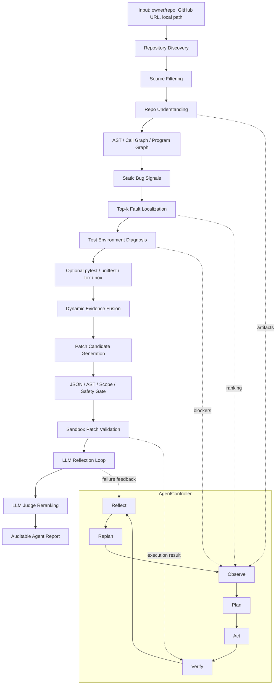

# Code Intelligence Agent

## V3 Real-Bug Benchmark Status

V3 is upgrading the evaluation from deterministic offline fixtures to real
Python defects, real failing tests, and later live-LLM repair trials. Phase 1 is
complete at the data/oracle level:

- 25 fixed-SHA BugsInPy cases imported from 6 repositories with 0 import errors.
- 20 cases independently satisfy bug-target failure, fix-target pass, and fixed
  full-regression pass; 5 cases remain explicit rejections.
- 8 exact Windows CPython/dependency profiles bind all 25 cases.
- Raw checkouts and test logs remain ignored; committed cases contain checksummed
  evidence summaries without local absolute paths.
- These numbers do not represent a live-LLM repair rate. Rule/LLM/Hybrid trials,
  pass@1/pass@3, token cost, latency, and reflection recovery are Phase 3 work.

Evidence: [Phase 1 protocol](docs/v3/phase1_real_bug_benchmark_protocol.md),
[accepted catalog](docs/v3/phase1_real_bug_catalog.md), and
[environment profiles](docs/v3/phase1_environment_profiles.md).

## V3 Repository Startup Status

Phase 2 is complete for the fixed 20-repository startup protocol:

- All 20 fixed-SHA repositories produced structured Agent reports and a test
  command; 19/20 started and explicitly terminated a real pytest process.
- Every started process used a repository-specific virtual environment. The
  runner probe installed only pytest: it requested 0 repository code installs
  and 0 repository dependency installs.
- The remaining Typer case was intentionally not started because the current
  Python 3.13 runtime violates the repository constraint. The execution planner
  now refuses to fall back to the host interpreter when isolated setup is not
  ready.
- Of the 19 started processes, one passed and 18 ended with classified
  environment-layer outcomes. This is expected because the probe does not
  install project dependencies; it measures safe process startup, not suite
  correctness or repair success.
- The paired V2 baseline was 7/20 and V3 is 19/20, but V3 authorizes checkout for
  all 20 cases and uses a new isolated-runner protocol. The +12-case result must
  always be reported together with that protocol-change warning.

Evidence: [Phase 2 protocol](docs/v3/phase2_repository_startup_protocol.md),
[machine-readable metrics](docs/v3/phase2_repository_startup_metrics.json), and
[verification record](docs/v3/phase2_verification.md).

## V3 Real-Bug Localization Status

Phase 4 now evaluates function-level fault localization on the 20 accepted
real defects using case-pinned Python runtimes and actual failing-test traces:

- All 20 cases produced real failing runtime coverage; 19 are function-rankable
  and one fix-only added-function case remains in the file-level denominator.
- Repositories are disjoint across development (7), validation (8), and frozen
  test (5) splits. Weight search uses seven function-rankable validation cases
  only; test ground truth is never supplied to profile selection.
- The frozen test Fusion result is Top-1 `0.6000`, Top-3 `0.8000`, Top-5
  `1.0000`, MRR `0.7067`, MAP `0.6144`, and EXAM `0.0036`.
- Runtime Dynamic, deterministic Semantic, and Complexity/ChangeHistory signals
  show positive frozen-test ablation contributions. Static Rule and Graph
  receive zero validation-selected Fusion weight, so no gain is attributed to
  those families in this experiment.
- Every committed test Top-5 row retains raw signals, frozen weights,
  per-signal contributions, clamp adjustment, and an exact score reconstruction.
  LLM-only localization is explicitly `not_applicable`; Semantic-only is not
  presented as an LLM result.

Reproduce with:

```powershell
python -m code_intelligence_agent v3-localization-eval outputs_v3/localization_phase4 `
  --coverage-timeout 180 `
  --release-docs-dir docs/v3
```

Evidence: [Phase 4 protocol](docs/v3/phase4_fault_localization_protocol.md),
[evaluation report](docs/v3/phase4_difficult_localization.md),
[machine-readable metrics](docs/v3/phase4_localization_metrics.json), and
[test Top-5 attribution](docs/v3/phase4_test_top5_attribution.json). The
[verification record](docs/v3/phase4_verification.md) pins the exact test counts,
runtime, release gates, signal version, and artifact hashes.

## V3 Patch Semantic Validation Status

Phase 5 now prevents a targeted-test and regression pass from automatically
becoming a verified-repair claim:

- Required post-regression gates cover AST-derived API/type contracts, static
  semantic risk, actual patched-workspace consistency, cross-file removed-symbol
  imports, changed-line minimality, bug-versus-patch target behavior, and
  per-edit reverse mutation.
- Supported rule candidates receive deterministic generated boundary/property
  probes. Benchmark-authored semantic commands are restricted to pinned
  pytest/unittest module execution; unsupported probes remain explicitly
  `not_applicable`.
- A semantic failure is attributed to the semantic layer. A blocker or missing
  required oracle returns an unverified suggestion. Only a complete semantic
  pass can produce `verified_repair`.
- Human-fix calibration on two real PySnooper defects accepted both known-correct
  fixes with `0` false rejections and killed all `3/3` edit reversions. This is
  validator calibration, not Agent-generated repair success or live-LLM pass@k.

Reproduce with:

```powershell
python -m code_intelligence_agent v3-semantic-eval `
  outputs_v3/phase5_semantic_calibration `
  --case-id bugsinpy-pysnooper-1 `
  --case-id bugsinpy-pysnooper-3 `
  --release-docs-dir docs/v3 `
  --require-pass
```

Evidence: [Phase 5 protocol](docs/v3/phase5_semantic_validation_protocol.md),
[calibration report](docs/v3/phase5_semantic_calibration.md), and
[machine-readable calibration](docs/v3/phase5_semantic_calibration.json). The
[verification record](docs/v3/phase5_verification.md) pins the exact test,
release-hygiene, calibration, limitation, and artifact-hash evidence.

## V3 Memory and Repository Security Status

Phase 6 makes memory authority and hostile-repository handling explicit:

- `structured_relevance_v2` assigns every memory record an execution,
  advisory, or audit-only role. Stale commit evidence is filtered before
  ranking; conflicting constraints become audit-only and require clarification.
- Cross-repository repair patterns aggregate sandbox-observed successes and
  failures with a conservative 95% Wilson lower bound. They remain
  `advisory_only` and cannot directly select an action or command.
- On seven controlled memory cases, completion is `0.4286` without memory and
  `1.0000` with structured retrieval. Stale reuse, conflict execution, and
  advisory execution are all `0`.
- Repository-derived prompt content has no instruction authority. Injection
  signals are replaced by hash markers, and the Safety Gate rejects any LLM
  override influenced by flagged repository text.
- Repository subprocesses receive an allowlisted environment without host API
  keys. External Python sockets are blocked while loopback remains available;
  path traversal and symlinks are rejected; timeout termination covers runaway
  processes.
- All 8 hostile fixtures were rejected, isolated, or accurately reported. This
  is process-level defense in depth, not a claim of container-grade isolation.
  Native child-process network denial and hard Windows CPU/memory/disk quotas
  still require a container or Windows Job Object.

Reproduce with:

```powershell
python -m code_intelligence_agent v3-memory-eval `
  datasets/memory_evaluation/v3_memory_generalization_cases.json `
  outputs_v3/phase6_memory `
  --require-pass

python -m code_intelligence_agent v3-security-eval `
  outputs_v3/phase6_security `
  --require-pass
```

Evidence: [Phase 6 protocol](docs/v3/phase6_memory_and_security_protocol.md),
[memory report](docs/v3/phase6_memory_evaluation.md), and
[security report](docs/v3/phase6_security_evaluation.md).

## V3 Unified Release Status

Phase 7 now aggregates all committed V3 evidence without filling missing live
metrics with Rule, fixture, or calibration results:

- Offline Phase 0-6 evidence is `pass`; complete V3 release is `pending`.
- Benchmark, environment, localization, Rule repair, semantic calibration,
  memory, and security values are labeled by evidence type and source artifact.
- LLM/Hybrid pass@1, pass@3, verified repair, Reflection, token, cost, latency,
  failure taxonomy, and generator attribution remain JSON `null`/`pending` until
  all `120/120` live trials pass RunRecord and completeness audits.
- Wilson 95% intervals expose small-sample uncertainty; V2/V3 differences are
  withheld when protocols differ.
- A nominally passing live artifact with 119 trials, missing model metadata, or
  missing strategy metrics cannot unlock the release gate.

Reproduce the current offline result with:

```powershell
python -m code_intelligence_agent v3-release-eval `
  outputs_v3/phase7_release `
  --root . `
  --require-offline-pass
```

Evidence: [Phase 7 protocol](docs/v3/phase7_release_protocol.md),
[unified report](docs/v3/phase7_unified_evaluation.md), and
[machine-readable report](docs/v3/phase7_unified_evaluation.json). The exact
test, hygiene, artifact-hash, and claim-boundary evidence is recorded in the
[Phase 7 offline verification](docs/v3/phase7_offline_verification.md).

V3 presentation and interview material:

- [Architecture and Agent design](docs/v3/v3_architecture_and_agent_design_cn.md)
- [10-minute demonstration guide](docs/v3/v3_ten_minute_demo_guide_cn.md)
- [Chinese resume and interview pack](docs/career/v3_resume_interview_pack_cn.md)
- [Clean-archive packaging verification](docs/v3/phase7_packaging_verification.md)

These V3 documents use only committed evidence. Live LLM/Hybrid repair metrics
remain pending until all 120 trials satisfy the frozen protocol and unified
release audit.

面向公开 Python GitHub 仓库的代码智能分析与受控修复 Agent。`agent` 子命令接收 `owner/repo` 或 GitHub URL，自动完成仓库发现、源码筛选、结构建模、测试环境诊断、函数级缺陷定位、补丁候选生成、sandbox 验证、反思修复和 blocker 报告；本地路径入口支持静态分析，但不等价于完整 GitHub Agent 执行链。

项目重点不是让模型直接“猜代码怎么改”，而是把程序分析、图建模、测试反馈、受控补丁搜索和 AgentController 决策闭环组合起来，形成可审计的 `Observe -> Plan -> Act -> Verify -> Reflect -> Replan` 流程。

## 当前定位

这个项目适合作为算法向 Agent 项目展示：

- 面向真实 Python GitHub 仓库，而不是只跑玩具样例。
- 核心控制器是 `AgentController`，每次运行都会输出 action registry、policy trace 和决策链。
- 结构建模覆盖 AST、Call Graph、Program Graph、静态规则信号和测试证据。
- 缺陷定位输出函数级 Top-k suspicious ranking，并显式融合 `StaticRuleScore`、`GraphScore`、`TestFailureScore`、`StackTraceScore`、`SBFLScore`、`SemanticScore`、`LLMScore`、`ComplexityScore`、`ChangeHistoryScore` 和风险惩罚；每项都保留权重与贡献分解。
- LLM patch/reflection 只作为候选生成与语义修复组件，所有候选都必须经过 JSON parse、AST/scope/signature/safety gate、patch apply 和 sandbox pytest。
- LLM judge 可以参与候选排序和风险判断，但最终成功标准始终是 `sandbox_pytest_decides_success`。
- 缺少 key、测试、依赖、oracle 或安全条件时，系统输出 blocker 和下一步动作，不伪造修复成功。

## V2 已验证快照

| 验证面 | 结果 | 口径 |
| --- | ---: | --- |
| 陌生公开 Python 仓库 | 20/20 产出结构化报告并完成静态分析 | 固定 commit SHA；7/20 真正启动并终止测试进程 |
| 定位 test + blind cases | 20 | Top-1/3/5、MRR、MAP 均为 1.0000；graph/dynamic 消融没有显示增益 |
| Patch 策略 | 3 cases / 9 runs | Rule/LLM/Hybrid verified rate 为 0.3333/1.0000/1.0000；LLM 为离线确定性 fixture |
| Planner 策略 | 14 cases / 42 runs | 最终已注册动作率、任务完成率和 blocker accuracy 均为 1.0000 |
| Memory 消融 | 8 cases | completion 0.1250 -> 1.0000；重复失败 patch 1.0000 -> 0.0000 |
| 系统消融 | 8/8 对照完成 | Patch、Planner、Graph、Dynamic、Memory、Reflection、Top-k、Budget |

这里的 `success`、`verified` 和 `pass` 均按对应 artifact 的定义解释。受控 fixture 不代表 live 模型真实仓库修复率，静态分析成功也不代表测试通过。完整证据见 [Phase 7 系统评估](docs/v2/phase7_artifacts/phase7_system_evaluation.md)，架构和能力边界见 [V2 架构与算法设计](docs/v2/architecture_and_design.md)，最终 17 项 DoD 见 [Phase 8 发布验收](docs/v2/phase8_release_checklist.md)。

## 架构



## AgentController

`AgentController` 不按固定工作流强行执行所有步骤，而是根据当前 evidence 和 blocker 选择下一步 action。

典型 action 包括：

- `clone_or_load_repository`
- `discover_repository_structure`
- `discover_tests`
- `diagnose_environment`
- `run_repository_tests`
- `localize_fault`
- `generate_llm_patch_candidates`
- `diagnose_llm_provider_failure`
- `retry_llm_patch_generation`
- `generate_hybrid_patch_candidates`
- `validate_patch_in_sandbox`
- `run_llm_patch_reflection_loop`
- `run_llm_patch_judge`
- `emit_blocker_report`
- `generate_final_agent_report`

每个 action 都记录 input requirements、expected artifact、success condition、failure condition、blocker type、retry policy 和 next possible actions。

## 核心输出

单仓库运行会输出一组 JSON/Markdown artifact，便于审计每一步为什么继续、为什么停止、为什么进入 blocker：

| Artifact | 作用 |
| --- | --- |
| `github_repo_intelligence.json/md` | 总报告，汇总仓库状态、分析阶段、定位、测试与修复结果 |
| `github_repo_agent_controller.json/md` | AgentController 决策链，包含 `action_decision_audit`：why selected、confidence、risk、input/output、blocker、next plan |
| `agent_action_registry.json/md` | 可执行 action 列表与条件 |
| `agent_policy_trace.json/md` | 当前状态到 selected action 的映射过程 |
| `agent_execution_trace.json/md` | 每个 Agent action 的 planned / executed / skipped / blocked / failed / verified 状态、命令、returncode、证据文件和下一步决策 |
| `agent_memory_report.json/md` | 五层证据记忆报告，覆盖 Working / Session / Repo / Repair / Cross-repo Pattern Memory、Top-k 检索轨迹以及 patch/reflection/replan 复用证据 |
| `agent_decision_report.json/md` | Agent 决策报告，汇总规则 selected action、LLM planner decision、安全门控、执行状态和下一步计划 |
| `repository_profile.json/md` | 仓库画像、layout profile、配置文件、依赖与 runner 信号 |
| `repository_structure.json/md` | 源码、模块、函数、类和结构摘要 |
| `repo_graph.json/md` | 仓库图、函数调用和程序图摘要 |
| `fault_localization.json/md` | Top-k suspicious functions 与分数来源 |
| `repository_test_environment.json/md` | 测试环境、依赖、runner 和 blocker 诊断 |
| `repository_test_command.json/md` | 推荐测试命令 quick validation、monorepo working dir 与执行结果 |
| `repository_test_execution_plan.json/md` | 推荐测试命令、monorepo working dir、范围和风险 |
| `repository_test_execution_result.json/md` | pytest/unittest 执行结果 |
| `repository_test_patch_candidates.json/md` | 规则/LLM/hybrid 补丁候选与生成审计 |
| `repository_test_patch_validation.json/md` | sandbox 验证结果、失败类型和成功补丁 |
| `reflection_trace.json/md` | 失败补丁到 refined candidate 的反思轨迹 |
| `agent_session.json` | 当前 Agent 会话元数据，包括 session_id、repo、ref、输出目录、运行配置和当前状态 |
| `agent_memory.json` | 持久化记忆，包括仓库画像、Top-k、测试结果、blocker、补丁尝试、用户意图、压缩摘要和每轮决策轨迹 |
| `agent_evidence_memory.json` | 统一证据记忆条目，每条包含 source、time、repo/ref、evidence path、confidence、validation authority 和失效状态 |
| `agent_memory_retrieval.json` | 当前任务检索出的 Top-k 记忆、相关度分解、使用原因及被过滤的过期/跨版本记录 |
| `agent_session_report.md` | 多轮会话审计报告，包括 session timeline、memory usage evidence、intent history、patch history 和 blocker evolution |

## 历史 V1/P6 受控证据

以下 P6 readiness 与 62-case showcase 是冻结的 V1 历史受控证据，用于保留回归基线，不是当前 V2 的陌生仓库成功率，也不能解释为 live LLM 在真实仓库上的修复率。最新 V2 结论以本 README 的 V2 快照和 Phase 7 artifact 为准。

| 项目 | 结果 |
| --- | ---: |
| P6 readiness checks | 24/24 pass |
| Real GitHub onboarding cases | 10 |
| Onboarding matrix checks | 12/12 pass |
| Repair/evaluation cases | 30 |
| LLM direct success cases | 5 |
| LLM reflection success cases | 4 |
| LLM blocker cases | 21 |
| Reflection evidence complete | 3 |
| Declared catalog cases matched | 20/20 |
| Sandbox authority | `sandbox_pytest_decides_success` |

### Historical Showcase Overview

| Metric | Value |
| --- | --- |
| Benchmark Cases | 62 |
| Top-1 Localization | 1.0000 |
| Top-3 Localization | 1.0000 |
| MAP | 1.0000 |
| Patch Success Rate | 1.0000 |
| Beam Success Rate | 0.9516 |
| Cross-function Data-flow Cases | 22 |
| Program Slice Cases | 62 |
| Slice-grounded Cases | 62 |
| Average Top-1 Slice Support | 0.9839 |
| Generated Hard Cases | 5 |
| Generated Score Inversions | 2 |
| Generated Diversity-Assisted Successes | 1 |
| Generated Diversity Success Lift | 3.0000 |
| Generated Diversity Success Bonus | 0.5900 |
| Ablation-linked Generated Cases | 5 |

### V1 Target Dataset

| Target | Dataset | Count |
| --- | --- | ---: |
| Public GitHub onboarding cases | `datasets/github_cases/repo_intelligence_v1_onboarding_30.example.json` | 30 |
| Repair/evaluation cases | `datasets/github_cases/llm_repair_case_catalog_v1_50.example.json` | 50 |
| Required evaluation metric contracts | onboarding, repair, suite, validation, reflection, cost artifacts | 9 |

The v1 target dataset audit checks case count, scenario coverage, repair class
coverage, blocker category coverage, and metric contracts for
`onboarding_success_rate`, `topk_localization_accuracy`, `pass_at_1`,
`pass_at_k`, `reflection_uplift`, `blocker_accuracy`,
`sandbox_success_rate`, `average_runtime_ms`, and `llm_cost_usd`.

Current V1 evidence snapshot:

| Metric Area | Result |
| --- | ---: |
| GitHub onboarding repositories | 30/30 |
| Repair/evaluation cases | 50 |
| Required metric contracts | 9/9 |
| Directly measured metrics | 9/9 |
| Proxy metrics | 0 |
| Missing evidence metrics | 0 |

V1 baseline 将数据集 readiness、9 项评估指标、完整目标审计、当前 Git
候选集的发布卫生检查和完整 pytest 回归统一写入
`baseline_metrics.json/md`。在已有 V1 evidence artifacts 的工作区中，可用
一条命令重新生成：

```powershell
python -m code_intelligence_agent.evaluation.v1_baseline `
  outputs/v1_baseline `
  --run-tests `
  --require-pass
```

完整测试当前约需 12 分钟；生成目录 `outputs/` 已加入 `.gitignore`。不希望
重新运行测试时，可以显式提供已完成回归的 passed count 和 duration，但正式
baseline/tag 必须来自一次完整测试结果。

The audit command is:

```bash
python -m code_intelligence_agent.evaluation.v1_readiness_dataset_audit ^
  datasets/github_cases/repo_intelligence_v1_onboarding_30.example.json ^
  datasets/github_cases/llm_repair_case_catalog_v1_50.example.json ^
  outputs_smoke/v1_readiness_dataset_audit ^
  --require-pass
```

After the readiness audit, merge available runtime evidence into a v1 metric
summary. The onboarding input can be either a full suite report or a slice
aggregate report:

```bash
python -m code_intelligence_agent.evaluation.v1_evaluation_summary ^
  outputs/v1_evaluation_summary ^
  --readiness-audit outputs/v1_readiness_dataset_audit/v1_readiness_dataset_audit.json ^
  --onboarding-suite outputs/v1_onboarding_aggregate/v1_onboarding_slice_aggregate.json ^
  --repair-metrics outputs/v1_repair/llm_repair_metrics_report.json ^
  --repair-catalog-audit outputs/v1_repair/llm_repair_case_catalog_audit.json ^
  --localization-report outputs/v1_repair/phase4_search_evaluation.json ^
  --llm-cost-report outputs/v1_cost/llm_cost_evidence.json
```

The summary marks each metric as `measured`, `proxy`, or `missing_evidence`
instead of fabricating numbers when an evidence artifact is absent.

For long 30-repository onboarding runs, use resumable slices:

```bash
python -m code_intelligence_agent.evaluation.github_repo_intelligence_suite ^
  datasets/github_cases/repo_intelligence_v1_onboarding_30.example.json ^
  outputs/v1_onboarding_slice_0_5 ^
  --start-index 0 ^
  --limit-runs 5
```

Then aggregate one or more slice reports before feeding them into the v1 metric
summary:

```bash
python -m code_intelligence_agent.evaluation.v1_onboarding_slice_aggregate ^
  datasets/github_cases/repo_intelligence_v1_onboarding_30.example.json ^
  outputs/v1_onboarding_aggregate ^
  outputs/v1_onboarding_slice_0_5_suite.json
```

The aggregate report records completed, failed, and missing manifest rows and
prints the next `--start-index` / `--limit-runs` command. Partial slice
aggregates are intentionally treated as proxy evidence by
`v1_evaluation_summary`; only a complete 30-run aggregate should be used for
final `onboarding_success_rate` and `average_runtime_ms` claims.

If LLM provider usage tokens are available but pricing was not configured during
the request, build standalone cost evidence before the v1 metric summary:

```bash
python -m code_intelligence_agent.evaluation.llm_cost_evidence ^
  outputs/v1_cost ^
  outputs/v1_repair/repository_test_patch_candidates.json ^
  --input-usd-per-1k-tokens 0.001 ^
  --output-usd-per-1k-tokens 0.002 ^
  --require-pass
```

The cost value is a configured pricing estimate and should only be presented as
provider cost when the supplied rates match the run's billing model.

关键验证文件由以下命令生成：

```bash
python -m code_intelligence_agent.evaluation.github_repo_intelligence_suite ^
  datasets/github_cases/repo_intelligence_p6_onboarding_readiness.example.json ^
  outputs_smoke/repo_intelligence_p6_onboarding_readiness_current ^
  --format json --require-success
```

如果已经有本地运行报告，可以使用缓存聚合：

```bash
python -m code_intelligence_agent.evaluation.github_repo_intelligence_suite ^
  datasets/github_cases/repo_intelligence_p6_onboarding_readiness.example.json ^
  outputs_smoke/repo_intelligence_p6_onboarding_readiness_cached ^
  --format json --require-success --reuse-existing-reports
```

## 快速运行

### 干净环境安装

```powershell
py -3.11 -m venv .venv
.\.venv\Scripts\Activate.ps1
python -m pip install --upgrade pip
python -m pip install -r requirements-dev.txt
```

先确认 CLI 与核心发布测试可运行：

```powershell
python -m code_intelligence_agent agent --help
python -m pytest -q tests/test_readme_showcase_consistency.py tests/test_v1_goal_completion_audit.py
```

完整的 10 分钟演示、LLM 环境变量和失败降级步骤见 [Phase 8 现场演示指南](docs/v2/phase8_demo_guide_cn.md)。

一键 Agent 模式：

```bash
python -m code_intelligence_agent ^
  https://github.com/pytest-dev/pluggy ^
  --agent ^
  --preset mining ^
  --format markdown
```

也可以使用子命令写法：

```bash
python -m code_intelligence_agent agent pypa/sampleproject --format markdown
```

多轮会话与记忆系统：

每次 GitHub repo Agent 分析都会自动生成 `agent_session.json`、
`agent_memory.json`、`agent_evidence_memory.json`、
`agent_memory_retrieval.json` 和 `agent_session_report.md`。本地还会维护
`.code_intelligence_agent/sessions/index.json`，用于通过 `session_id`
恢复历史会话；该目录已加入 `.gitignore`，不会作为发布内容上传。

第一轮先分析仓库：

```bash
python -m code_intelligence_agent agent pypa/sampleproject ^
  outputs_smoke/sampleproject_agent_session ^
  --execution-profile agent-auto ^
  --preset mining ^
  --format markdown
```

随后可以基于同一个 `session_id` 继续交互，不需要从零重新分析：

```bash
python -m code_intelligence_agent chat ^
  --session <session_id> ^
  --message "解释上一次失败原因" ^
  --format markdown

python -m code_intelligence_agent chat ^
  --session <session_id> ^
  --message "不要修改公共 API" ^
  --format markdown

python -m code_intelligence_agent chat ^
  --session <session_id> ^
  --message "继续修复 Top-1 函数" ^
  --format markdown

python -m code_intelligence_agent chat ^
  --session <session_id> ^
  --message "重新运行 pytest" ^
  --execute ^
  --format markdown

python -m code_intelligence_agent chat ^
  --session <session_id> ^
  --message "use alternative repair strategy" ^
  --format markdown

python -m code_intelligence_agent resume ^
  --session <session_id> ^
  --format markdown
```

也可以直接进入终端连续聊天；输入 `exit` 退出，`:execute on` / `:execute off`
只控制是否允许本轮启动命令：

```bash
python -m code_intelligence_agent chat-ui ^
  --session <session_id> ^
  --format markdown
```

当前多轮接口会在 `Observe` 阶段读取 session memory，在 `Plan` 阶段将用户输入解析成
`inspect_status`、`explain_failure`、`continue_repair`、`rerun_tests`、
`narrow_scope`、`change_constraints`、`change_repair_strategy`、
`generate_report`、`inspect_function`、`explain_localization`、
`compare_patch_candidates`、`rollback_last_action`、`stop_execution` 或
`ask_for_clarification`，在 `Act/Verify/Reflect/Replan` 阶段记录本轮动作、
记忆使用证据、下一步命令和 replan 原因。默认情况下
`chat` 只生成下一步动作和命令；显式传入 `--execute` 时，命令型动作会被执行，
并把 return code、stdout/stderr 摘要写入本轮记忆。
当意图 LLM 凭据可用时，`Plan` 使用强制 `route_agent_intent` Function Calling；
模型只能返回 JSON Schema 允许的意图和参数。路径、函数名、置信度和字段白名单
校验失败时，系统回退到规则解析；低于 `0.65` 或多意图输入会进入
`ask_for_clarification`。命令型意图还必须映射到 Action Registry，未注册动作不会执行。
当用户选择继续修复时，chat 输出会给出 `CIA_AGENT_PATCH_MEMORY` 环境变量；
hybrid/LLM patch generation 会读取该 `agent_memory.json`，把失败补丁指纹、
patch attempt history 和用户约束写入 LLM repair context，避免重复生成同类失败补丁。

V2 记忆不是把完整历史直接拼进 Prompt。系统先把状态规范化为五层证据条目：

- `Working Memory`：当前 observation、阶段、action、verify 和 replan。
- `Session Memory`：用户目标、显式约束、作用域、策略偏好和压缩后的对话摘要。
- `Repo Memory`：当前 commit 的仓库画像、Program Graph、Top-k、测试命令和动态结果。
- `Repair Memory`：补丁指纹、sandbox 结果、失败类型和 reflection 证据。
- `Cross-repo Pattern Memory`：只接收经过 sandbox pytest 验证成功的通用修复模式。

每轮 Planner 和 hybrid/LLM patch generation 都会运行
`structured_relevance_v2`：先按 session/repo/commit/status/expiry 做结构化过滤，
再使用 confidence、关键词重合、layer prior、任务类型和 evidence 可追溯性计算相关度，
只注入 Top-k 记录。commit 不匹配的 Repo/Repair Memory 会作为
`stale_repository_version` 被过滤；失败补丁指纹仍作为完整安全去重集合保留。
当保留的原始 turn 超过 40 条时，系统将旧 turn 聚合为 intent/action 计数摘要，
保留最近 24 条；用户约束独立持久化，不因压缩丢失。当前实现先使用结构化检索，
没有为了展示而引入向量数据库。

查看、删除或重置记忆：

```bash
python -m code_intelligence_agent memory-show ^
  --session <session_id> ^
  --query "本轮修复使用了哪些约束和失败补丁" ^
  --top-k 8 ^
  --format markdown

python -m code_intelligence_agent memory-delete ^
  --session <session_id> ^
  --memory-id <memory_id> ^
  --yes ^
  --format json

python -m code_intelligence_agent memory-reset ^
  --session <session_id> ^
  --scope session ^
  --yes ^
  --format json
```

复现 With Memory / Without Memory 受控消融：

```bash
python -m code_intelligence_agent.evaluation.memory_ablation_evaluation ^
  datasets/memory_evaluation/v2_memory_ablation_cases.json ^
  outputs/phase3_memory_ablation ^
  --format markdown ^
  --require-pass
```

消融报告衡量结构化检索和 policy hints 是否保留约束、规避已知失败补丁并拒绝
过期 commit 证据；它不代表 live LLM 推理质量或真实 GitHub 仓库修复成功率。
Phase 3 的验收证据位于 `docs/v2/phase3_memory_metrics.json` 和
`docs/v2/phase3_evidence_memory.md`。

### V2 证据融合缺陷定位

`evidence_v2` 将 V1 的混合 graph score 拆成可独立审计和消融的信号。最终分数为：

```text
FinalScore = clamp(
    w_sbfl * SBFLScore
  + w_graph * GraphScore
  + w_static * StaticRuleScore
  + w_semantic * SemanticScore
  + w_llm * effective_LLMScore
  + w_test * TestFailureScore
  + w_traceback * StackTraceScore
  + w_complexity * ComplexityScore
  + w_history * ChangeHistoryScore
  - w_risk * RiskScore
)
```

`TestFailureScore` 只接受真实执行后记录的 failing test ID，`StackTraceScore`
只接受动态解析的生产代码 stack frame；缺失证据时两项严格为零。图传播默认最多三跳、
每跳按 `0.5` 衰减。LLM 定位信号必须有静态、SBFL、真实失败、真实 traceback 或
语义证据支撑，且加权贡献上限为 `0.10`，不能覆盖程序证据。每个 Top-k 函数都输出
`contribution_*`、`weight_*`、可用性标记和 FinalScore 重建值。

权重只在 15 个 CPython validation case 上选择；profile 冻结后，在 10 个
TheAlgorithms test case 和 10 个 Click/Pluggy blind case 上评估。当前三段的
V2 Top-1/Top-3/Top-5/MRR/MAP 均为 `1.0000`，与 V1 持平，non-regression gate
通过。当前 mutation benchmark 刻意采用规则可检测缺陷，因此 rule-only 同样为
`1.0000`；该结果不能用于宣称 fusion 优于 rule-only。本轮也未配置 live LLM
localization scorer，LLM-only 行不能解释为模型能力。

复现独立 split、权重冻结、V1 对照和消融：

```powershell
python -m code_intelligence_agent.evaluation.localization_split_evaluation `
  datasets/localization_v2/split_protocol.json `
  outputs/v2_phase4_localization `
  --require-non-regression
```

完整公式、Git history 计算、指标和实验边界位于
`docs/v2/phase4_evidence_localization.md`；机器可读验收记录位于
`docs/v2/phase4_localization_metrics.json`。

### V2 自适应补丁生成与严格验证

Phase 5 不再把 Hybrid 固定为 rule-first。系统根据 Top-k 中可修复规则、
static/semantic/traceback evidence、LLM 可用性和候选预算选择
`adaptive_rule_first`、`adaptive_llm_first` 或 `adaptive_rule_fallback`，并记录
每个 generator 的计划预算、实际预算、产出数量和候选 provenance。

Rule、LLM 和 reflection 候选统一经过 AST/scope/signature、授权文件、测试保护、
敏感文件、危险 API、依赖授权、diff 完整性、失败指纹和 semantic diff 安全门。
验证层依次覆盖 syntax、import、targeted tests、full repository regression 和受支持的
boundary probe。只有目标测试和完整回归都通过时才输出 `verified_repair`；只通过目标
测试时仅输出 `repository_test_candidate.patch` 和
`targeted_candidate_unverified`。LLM Judge 始终是非权威风险信号。

离线复现 Rule / LLM / Hybrid 补丁策略契约：

```powershell
python -m code_intelligence_agent.evaluation.patch_strategy_evaluation `
  datasets/patch_evaluation/v2_patch_strategy_controlled_cases.json `
  outputs/v2_phase5_patch_strategy `
  --format markdown `
  --require-pass
```

当前受控集包含 3 个缺陷、9 次独立运行，覆盖规则直接修复、LLM 语义直接修复和
LLM reflection 修复；所有获胜候选的 generator attribution 一致。该评估使用离线
确定性 LLM fixture，只证明编排、安全、反思、归因和 sandbox contract，不代表 live
模型质量或真实 GitHub 修复率。完整设计与实验边界位于
`docs/v2/phase5_patch_generation_and_validation.md`，机器可读结果位于
`docs/v2/phase5_patch_metrics.json`。

### V2 陌生 GitHub 仓库鲁棒性

Phase 6 使用 20 个未参与前五阶段实现的公开 Python 仓库作为固定 SHA holdout，
覆盖 `src`/flat layout、多包项目、CLI、Web、数据处理、原生扩展以及 tox/nox。
系统在 GitHub Tree API 限流时可以回退到固定提交 archive；未授权测试 checkout 的
仓库只进行源码读取，强制关闭测试、环境安装和自动重试，不会因为网络回退而执行仓库代码。

最终 20/20 仓库生成结构化报告并完成静态分析，20/20 发现源码根，12/20 发现测试命令，
7/20 真正启动并终止测试进程；13 个部分结果和 6 个测试失败均给出明确 blocker 或
environment/code failure layer。这里的 `success` 只表示“静态分析完成且测试进程真实启动并
终止”，不表示测试通过或修复成功。完整协议、算法边界和复现命令位于
`docs/v2/phase6_unfamiliar_repository_robustness.md`，机器可读指标位于
`docs/v2/phase6_unfamiliar_repository_metrics.json`。

### V2 系统评估与消融

Phase 7 从固定实现提交 `a47e37b` 运行统一评估，覆盖以下八组对照：

- Rule / LLM / Hybrid Patch。
- Rule / LLM / Hybrid Planner。
- Fusion / Without Graph。
- Fusion / Without Dynamic Evidence。
- With / Without Memory。
- With / Without Reflection。
- Top-k context 为 1、3、5。
- action budget 和 candidate budget 为 1、2、3。

主要结果如下：

- 20 个 test + blind localization case 上，Fusion 的 Top-1/Top-3/Top-5/MRR/MAP
  均为 `1.0000`；移除 GraphScore 或动态证据后仍为 `1.0000`。当前数据集以规则可检测
  mutation 为主，因此只能得出“无回归”，不能宣称 graph 或 dynamic evidence 带来提升。
- 3 个受控补丁案例中，Rule、LLM、Hybrid 的 verified repair rate 分别为
  `0.3333`、`1.0000`、`1.0000`；LLM/Hybrid 的 reflection recovery rate 为
  `0.3333`。这些 LLM 输出来自确定性离线 fixture，只验证生成、归因、安全门、反思和
  pytest sandbox 契约，不代表 live model 修复率。
- 14 个 Planner case、42 次运行中，三种 Planner 的任务完成率、最终已注册动作率和
  blocker 分类准确率均为 `1.0000`。LLM 与 Hybrid 各记录 1,560 个 fixture token 和
  `$0.0156` 受控成本估计；所有非法或低置信度提议都经过 Safety Gate 或 fallback。
- 8 个 Memory case 中，受控任务完成率从 `0.1250` 提升到 `1.0000`，重复失败补丁率从
  `1.0000` 降到 `0.0000`。该结果衡量结构化检索和 policy hints，不代表模型推理能力。
- 单案例敏感性实验中，reflection 从 0 轮增加到 1 轮后完成 verified repair；目标函数位于
  rank 3 时，Top-k=1 失败而 Top-k=3/5 成功；candidate budget=1/2 失败而 3 成功；
  三步控制器任务在 action budget=1/2 时如实停止，budget=3 时完成，已注册动作率
  `1.0000`、重复动作率 `0.0000`。
- V1 与 V2 只在相同 localization split 上做量化比较，15 个可比指标 delta 均为
  `0.0000`；不同 case/protocol 的 repair 指标明确标记为不可比较，不计算虚假 uplift。

一键复现统一评估并发布紧凑 artifact：

```powershell
python -m code_intelligence_agent.evaluation.system_evaluation `
  outputs_v2/phase7 `
  --repository-root . `
  --publication-dir docs/v2/phase7_artifacts `
  --format markdown `
  --require-pass
```

主报告位于
[`docs/v2/phase7_artifacts/phase7_system_evaluation.md`](docs/v2/phase7_artifacts/phase7_system_evaluation.md)，
机器可读汇总位于
[`docs/v2/phase7_artifacts/phase7_system_metrics.json`](docs/v2/phase7_artifacts/phase7_system_metrics.json)。
报告内的每项结论均链接到 Planner、Memory、Localization、Patch 和 Budget 原始 artifact，
失败运行保留在原始分母中。Phase 7 聚焦测试为 `12 passed in 44.69s`，完整回归为
`1226 passed in 1186.59s`；验收记录位于
[`docs/v2/phase7_verification.md`](docs/v2/phase7_verification.md)。

分析一个公开 GitHub 仓库：

Repair strategy memory:

`change_repair_strategy` stores `repair_strategy_preferences` in
`agent_memory.json`, exposes them through Session Memory and Repair Memory,
and injects them into the hybrid/LLM patch-generation `dynamic_oracle`.
When `CIA_AGENT_PATCH_MEMORY` or `CIA_AGENT_REPAIR_STRATEGY` is present, the
LLM prompt includes a repair-strategy constraint so the next patch is
meaningfully different from previous failed attempts.

```bash
python -m code_intelligence_agent.evaluation.github_repo_intelligence ^
  https://github.com/pytest-dev/pluggy ^
  outputs_smoke/pluggy_agent_report ^
  --execution-profile agent-auto ^
  --preset mining ^
  --format markdown
```

使用 `owner/repo`：

```bash
python -m code_intelligence_agent.evaluation.github_repo_intelligence ^
  pypa/sampleproject ^
  outputs_smoke/sampleproject_agent_report ^
  --execution-profile agent-auto ^
  --preset mining ^
  --format markdown
```

运行 P6 LLM direct-success suite：

```bash
python -m code_intelligence_agent.evaluation.github_repo_intelligence_suite ^
  datasets/github_cases/repo_intelligence_p6_llm_direct_success.example.json ^
  outputs_smoke/p6_llm_direct_success ^
  --format json --require-success
```

运行 P6 LLM reflection-success suite：

```bash
python -m code_intelligence_agent.evaluation.github_repo_intelligence_suite ^
  datasets/github_cases/repo_intelligence_p6_llm_reflection_success.example.json ^
  outputs_smoke/p6_llm_reflection_success ^
  --format json --require-success
```

## LLM 配置

API key 只能通过环境变量注入，不能写入代码、README、测试或输出报告。

支持的典型配置：

```bash
set CIA_LLM_PROVIDER=deepseek
set CIA_LLM_MODEL=deepseek-chat
set CIA_LLM_API_KEY=<your_key>

set CIA_JUDGE_PROVIDER=deepseek
set CIA_JUDGE_MODEL=deepseek-chat
set CIA_JUDGE_API_KEY=<your_key>

set CIA_LLM_REPLAN_ENABLED=1
set CIA_REPLAN_LLM_PROVIDER=deepseek
set CIA_REPLAN_LLM_MODEL=deepseek-chat
set CIA_REPLAN_LLM_API_KEY=<your_key>

set CIA_INTENT_LLM_ENABLED=1
set CIA_INTENT_LLM_PROVIDER=deepseek
set CIA_INTENT_LLM_MODEL=deepseek-chat
set CIA_INTENT_LLM_API_KEY=<your_key>
```

`CIA_REPLAN_LLM_*` 用于可选的 LLM Planner / Replanner。LLM 会输出结构化 `planner_decision`：`selected_action`、`reason`、`confidence`、`risk`、`required_evidence` 和 `next_plan`；规则控制器仍保留最终安全门控，`safety_gate` 会记录 LLM 推荐 action 是否注册、是否匹配 controller action、是否请求 override，以及最终采用的规则 action。也可以使用 OpenAI-compatible 或 DashScope-compatible endpoint。报告只记录 provider、model、key presence 和短 fingerprint，不记录原始 key。

`CIA_INTENT_LLM_*` 用于多轮聊天的 Function Calling 意图路由。未设置独立值时，
provider/model/key/base URL 会回退到对应的 `CIA_LLM_*`；凭据存在时自动启用，
设置 `CIA_INTENT_LLM_ENABLED=0` 可强制使用规则路由。可选超时变量为
`CIA_INTENT_LLM_TIMEOUT`。意图路由数据集位于
`datasets/intent_routing/v2_intent_routing_112.json`，覆盖 112 条中英输入、
别名、否定约束、多意图和无关输入。

Agent-auto planning behavior:

- In `agent-auto` / `--agent` mode, the LLM Planner is treated as the default
  planning proposer when replan credentials are available.
- The planner prompt includes compact session memory, repo memory, repair
  memory, repository profile, Top-k localization, static and graph signals,
  pytest/traceback evidence, executed actions, failed patch fingerprints, user
  constraints, and remaining action/time/cost budgets.
- The planner response is schema-gated and must contain `selected_action`,
  `arguments`, `reason`, `confidence`, `risk`, `required_evidence`,
  `expected_outcome`, `fallback_action`, `termination_condition`,
  `memory_used`, and `next_plan`.
- `--planner-mode rule` never calls the planning model. `llm` adopts a safe
  registered alternative at confidence `>= 0.65`. `hybrid` compares the model
  proposal with the rule action and requires confidence `>= 0.75` when they
  disagree.
- Every model-selected action must exist in the Action Registry. The Safety
  Gate validates its argument allowlist, transition, risk, confirmation
  requirement, executor availability, repeated-state history, and remaining
  budget before adoption.
- If the LLM is unavailable or no replan key is configured, the controller
  falls back to the rule-selected action and records
  `fallback_to_rule_planner=true`; the safety gate still shows the adopted
  controller action.
- Provider failures, response-schema failures, safety rejections, planner-rule
  disagreements, fallbacks, token usage, and estimated cost are preserved in
  `planner_trace`, `planner_resolution`, and `planner_metrics`.
- The LLM never bypasses Action Registry, risk policy, action/time/cost budget,
  or sandbox validation.

受预算约束的 Hybrid Planner 运行示例：

```powershell
python -m code_intelligence_agent agent pypa/sampleproject `
  outputs_smoke/sampleproject_hybrid_planner `
  --execution-profile agent-auto `
  --planner-mode hybrid `
  --auto-controller-max-actions 4 `
  --agent-time-budget-seconds 600 `
  --agent-llm-cost-budget-usd 0.50 `
  --user-goal "定位失败测试并生成经过 sandbox 验证的最小补丁" `
  --preset mining `
  --format markdown
```

离线复现 Rule / LLM / Hybrid 的受控对比：

```powershell
python -m code_intelligence_agent.evaluation.planner_strategy_evaluation `
  datasets/planner_evaluation/v2_planner_controlled_cases.json `
  outputs/phase2_planner_eval `
  --format markdown `
  --require-pass
```

Phase 2 的机器可读指标与验收说明位于
`docs/v2/phase2_planner_metrics.json` 和
`docs/v2/phase2_planner_metrics.md`。

## 目录结构

| 路径 | 说明 |
| --- | --- |
| `code_intelligence_agent/agents` | AgentController、LLM patch/reflection 组件 |
| `code_intelligence_agent/analysis` | AST、图建模、规则信号、定位相关模块 |
| `code_intelligence_agent/evaluation` | GitHub repo intelligence、suite、P6 audit、metrics |
| `datasets/github_cases` | 真实仓库 suite manifest 和 catalog |
| `tests` | 单元测试、集成测试和 P6 manifest/audit 测试 |
| `docs/showcase` | GitHub 展示材料 |
| `docs/examples` | 典型仓库报告样例说明 |
| `docs/v2` | V2 架构、阶段验收、案例、演示和系统消融 artifact |
| `docs/career` | 中文简历、系统学习和面试追问材料 |
| `RESUME_AGENT_PROJECT.md` | 简历写法 |
| `INTERVIEW_QA_AGENT_PROJECT.md` | 面试问答 |

## 简历写法入口

- [RESUME_AGENT_PROJECT.md](RESUME_AGENT_PROJECT.md)
- [INTERVIEW_QA_AGENT_PROJECT.md](INTERVIEW_QA_AGENT_PROJECT.md)
- [docs/showcase/github_release_guide.md](docs/showcase/github_release_guide.md)
- [docs/examples/README.md](docs/examples/README.md)
- [docs/examples/v1_sample_reports.md](docs/examples/v1_sample_reports.md)
- [docs/examples/v1_readiness_audit.md](docs/examples/v1_readiness_audit.md)
- [docs/examples/v1_evaluation_summary.md](docs/examples/v1_evaluation_summary.md)
- [docs/examples/top_level_agent_live_smoke.md](docs/examples/top_level_agent_live_smoke.md)
- [docs/examples/llm_repair_readiness.md](docs/examples/llm_repair_readiness.md)
- [docs/examples/agent_demo_artifact_checklist.md](docs/examples/agent_demo_artifact_checklist.md)
- [docs/v2/architecture_and_design.md](docs/v2/architecture_and_design.md)
- [docs/v2/phase8_case_studies.md](docs/v2/phase8_case_studies.md)
- [docs/v2/phase8_demo_guide_cn.md](docs/v2/phase8_demo_guide_cn.md)
- [docs/v2/phase8_release_checklist.md](docs/v2/phase8_release_checklist.md)
- [docs/career/v2_resume_interview_pack_cn.md](docs/career/v2_resume_interview_pack_cn.md)
- [docs/career/agent_project_study_interview_guide.md](docs/career/agent_project_study_interview_guide.md)

## Release Hygiene Gate

Run this before publishing the repository:

```bash
python -m code_intelligence_agent.evaluation.release_hygiene_audit ^
  outputs_smoke/release_hygiene_audit_current ^
  --format json ^
  --require-pass
```

This gate checks the Git candidate set for raw API keys, tracked local outputs,
binary Word artifacts, misleading LLM-judge authority claims, and visible
assistant/tool generation signatures in public docs.

Run the final V1 completion audit after the evidence artifacts are generated:

```bash
python -m code_intelligence_agent.evaluation.v1_goal_completion_audit ^
  outputs_smoke/v1_goal_completion_audit_current ^
  --format json ^
  --require-pass
```

This audit checks the V1 metrics, a new public-repository Agent smoke,
AgentController loop evidence, sandbox authority, public sample reports,
resume/interview packaging, and release hygiene in one report.

推荐一句话：

> 构建面向公开 Python GitHub 仓库的代码智能 Agent，融合 AST / Call Graph / Program Graph、多证据函数级 Top-k 定位、LLM Planner、五层证据记忆和 Rule/LLM/Hybrid 补丁生成，通过 `Observe -> Plan -> Act -> Verify -> Reflect -> Replan` 闭环与 pytest sandbox 输出可审计修复或 blocker；在 20 个固定 SHA 陌生仓库和 8 类系统消融上完成实证评估。

## 能力边界

这个项目不承诺：

- 任意语言仓库都支持。
- 任意 GitHub 仓库都能 100% 自动发现并修复真实 bug。
- 没有 failing test、test oracle 或可复现环境时仍能给出可靠修复。
- 不要把 LLM judge 写成最终成功标准，或写成 pytest sandbox 替代品。
- 可以把 API key 写入仓库或输出报告。

准确表述是：系统面向公开 Python GitHub 仓库做智能分析、测试诊断、函数级定位、受控补丁验证和 blocker 报告。当仓库缺少 Python 源码、测试命令、依赖环境、failing evidence 或安全修复条件时，Agent 会输出可审计 blocker 和下一步建议。
