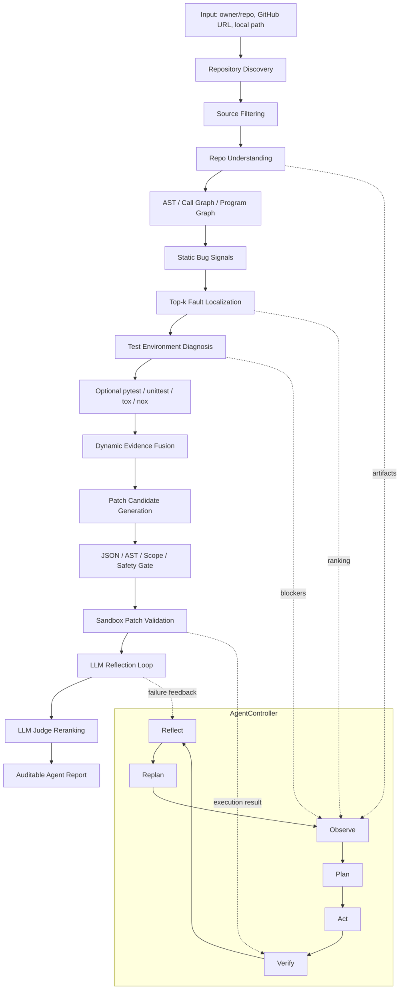

# Code Intelligence Agent

面向公开 Python GitHub 仓库的代码智能分析与修复 Agent。用户输入 `owner/repo`、GitHub URL 或本地仓库路径后，系统会自动完成仓库发现、源码筛选、结构建模、测试环境诊断、函数级缺陷定位、补丁候选生成、sandbox 验证、反思修复和 blocker 报告。

项目重点不是让模型直接“猜代码怎么改”，而是把程序分析、图建模、测试反馈、受控补丁搜索和 AgentController 决策闭环组合起来，形成可审计的 `Observe -> Plan -> Act -> Verify -> Reflect -> Replan` 流程。

## 当前定位

这个项目适合作为算法向 Agent 项目展示：

- 面向真实 Python GitHub 仓库，而不是只跑玩具样例。
- 核心控制器是 `AgentController`，每次运行都会输出 action registry、policy trace 和决策链。
- 结构建模覆盖 AST、Call Graph、Program Graph、静态规则信号和测试证据。
- 缺陷定位输出函数级 Top-k suspicious ranking，并融合 `StaticRuleScore`、`GraphScore`、`DynamicEvidenceScore`、`SBFLScore` 和 `FinalScore`。
- LLM patch/reflection 只作为候选生成与语义修复组件，所有候选都必须经过 JSON parse、AST/scope/signature/safety gate、patch apply 和 sandbox pytest。
- LLM judge 可以参与候选排序和风险判断，但最终成功标准始终是 `sandbox_pytest_decides_success`。
- 缺少 key、测试、依赖、oracle 或安全条件时，系统输出 blocker 和下一步动作，不伪造修复成功。

## 架构



## AgentController

`AgentController` 不按固定工作流强行执行所有步骤，而是根据当前 evidence 和 blocker 选择下一步 action。

典型 action 包括：

- `clone_or_load_repository`
- `discover_repository_structure`
- `discover_tests`
- `diagnose_environment`
- `run_repository_tests`
- `localize_fault`
- `generate_llm_patch_candidates`
- `generate_hybrid_patch_candidates`
- `validate_patch_in_sandbox`
- `run_llm_patch_reflection_loop`
- `run_llm_patch_judge`
- `emit_blocker_report`
- `generate_final_agent_report`

每个 action 都记录 input requirements、expected artifact、success condition、failure condition、blocker type、retry policy 和 next possible actions。

## 核心输出

单仓库运行会输出一组 JSON/Markdown artifact，便于审计每一步为什么继续、为什么停止、为什么进入 blocker：

| Artifact | 作用 |
| --- | --- |
| `github_repo_intelligence.json/md` | 总报告，汇总仓库状态、分析阶段、定位、测试与修复结果 |
| `github_repo_agent_controller.json/md` | AgentController 决策链 |
| `agent_action_registry.json/md` | 可执行 action 列表与条件 |
| `agent_policy_trace.json/md` | 当前状态到 selected action 的映射过程 |
| `repository_profile.json/md` | 仓库画像、配置文件、依赖与 runner 信号 |
| `repository_structure.json/md` | 源码、模块、函数、类和结构摘要 |
| `repo_graph.json/md` | 仓库图、函数调用和程序图摘要 |
| `fault_localization.json/md` | Top-k suspicious functions 与分数来源 |
| `repository_test_environment.json/md` | 测试环境、依赖、runner 和 blocker 诊断 |
| `repository_test_execution_plan.json/md` | 推荐测试命令、范围和风险 |
| `repository_test_execution_result.json/md` | pytest/unittest 执行结果 |
| `repository_test_patch_candidates.json/md` | 规则/LLM/hybrid 补丁候选与生成审计 |
| `repository_test_patch_validation.json/md` | sandbox 验证结果、失败类型和成功补丁 |
| `reflection_trace.json/md` | 失败补丁到 refined candidate 的反思轨迹 |

## P6 验证结果

最新 P6 readiness 聚合已经通过：

| 项目 | 结果 |
| --- | ---: |
| P6 readiness checks | 24/24 pass |
| Real GitHub onboarding cases | 10 |
| Onboarding matrix checks | 12/12 pass |
| Repair/evaluation cases | 30 |
| LLM direct success cases | 5 |
| LLM reflection success cases | 4 |
| LLM blocker cases | 21 |
| Reflection evidence complete | 3 |
| Declared catalog cases matched | 20/20 |
| Sandbox authority | `sandbox_pytest_decides_success` |

关键验证文件由以下命令生成：

```bash
python -m code_intelligence_agent.evaluation.github_repo_intelligence_suite ^
  datasets/github_cases/repo_intelligence_p6_onboarding_readiness.example.json ^
  outputs_smoke/repo_intelligence_p6_onboarding_readiness_current ^
  --format json --require-success
```

如果已经有本地运行报告，可以使用缓存聚合：

```bash
python -m code_intelligence_agent.evaluation.github_repo_intelligence_suite ^
  datasets/github_cases/repo_intelligence_p6_onboarding_readiness.example.json ^
  outputs_smoke/repo_intelligence_p6_onboarding_readiness_cached ^
  --format json --require-success --reuse-existing-reports
```

## 快速运行

分析一个公开 GitHub 仓库：

```bash
python -m code_intelligence_agent.evaluation.github_repo_intelligence ^
  https://github.com/pytest-dev/pluggy ^
  outputs_smoke/pluggy_agent_report ^
  --execution-profile agent-auto ^
  --preset mining ^
  --format markdown
```

使用 `owner/repo`：

```bash
python -m code_intelligence_agent.evaluation.github_repo_intelligence ^
  pypa/sampleproject ^
  outputs_smoke/sampleproject_agent_report ^
  --execution-profile agent-auto ^
  --preset mining ^
  --format markdown
```

运行 P6 LLM direct-success suite：

```bash
python -m code_intelligence_agent.evaluation.github_repo_intelligence_suite ^
  datasets/github_cases/repo_intelligence_p6_llm_direct_success.example.json ^
  outputs_smoke/p6_llm_direct_success ^
  --format json --require-success
```

运行 P6 LLM reflection-success suite：

```bash
python -m code_intelligence_agent.evaluation.github_repo_intelligence_suite ^
  datasets/github_cases/repo_intelligence_p6_llm_reflection_success.example.json ^
  outputs_smoke/p6_llm_reflection_success ^
  --format json --require-success
```

## LLM 配置

API key 只能通过环境变量注入，不能写入代码、README、测试或输出报告。

支持的典型配置：

```bash
set CIA_LLM_PROVIDER=deepseek
set CIA_LLM_MODEL=deepseek-chat
set CIA_LLM_API_KEY=<your_key>

set CIA_JUDGE_PROVIDER=deepseek
set CIA_JUDGE_MODEL=deepseek-chat
set CIA_JUDGE_API_KEY=<your_key>
```

也可以使用 OpenAI-compatible 或 DashScope-compatible endpoint。报告只记录 provider、model、key presence 和短 fingerprint，不记录原始 key。

## 目录结构

| 路径 | 说明 |
| --- | --- |
| `code_intelligence_agent/agents` | AgentController、LLM patch/reflection 组件 |
| `code_intelligence_agent/analysis` | AST、图建模、规则信号、定位相关模块 |
| `code_intelligence_agent/evaluation` | GitHub repo intelligence、suite、P6 audit、metrics |
| `datasets/github_cases` | 真实仓库 suite manifest 和 catalog |
| `tests` | 单元测试、集成测试和 P6 manifest/audit 测试 |
| `docs/showcase` | GitHub 展示材料 |
| `docs/examples` | 典型仓库报告样例说明 |
| `RESUME_AGENT_PROJECT.md` | 简历写法 |
| `INTERVIEW_QA_AGENT_PROJECT.md` | 面试问答 |

## 简历写法入口

- [RESUME_AGENT_PROJECT.md](RESUME_AGENT_PROJECT.md)
- [INTERVIEW_QA_AGENT_PROJECT.md](INTERVIEW_QA_AGENT_PROJECT.md)
- [docs/showcase/github_release_guide.md](docs/showcase/github_release_guide.md)
- [docs/examples/README.md](docs/examples/README.md)

推荐一句话：

> 构建面向公开 Python GitHub 仓库的代码智能 Agent，结合 AST / Call Graph / Program Graph、静态规则、动态测试证据和 SBFL-style scoring 实现函数级 Top-k 缺陷定位，并通过 AgentController 的 `Observe -> Plan -> Act -> Verify -> Reflect -> Replan` 闭环调度 LLM patch generation、sandbox validation、reflection repair 和 blocker reporting；P6 验证覆盖 10 个真实仓库 onboarding case、30 个 repair/evaluation case、5 个 LLM direct success、4 个 LLM reflection success 和 21 个 blocker case。

## 能力边界

这个项目不承诺：

- 任意语言仓库都支持。
- 任意 GitHub 仓库都能 100% 自动发现并修复真实 bug。
- 没有 failing test、test oracle 或可复现环境时仍能给出可靠修复。
- LLM judge 可以替代 pytest sandbox。
- 可以把 API key 写入仓库或输出报告。

准确表述是：系统面向公开 Python GitHub 仓库做智能分析、测试诊断、函数级定位、受控补丁验证和 blocker 报告。当仓库缺少 Python 源码、测试命令、依赖环境、failing evidence 或安全修复条件时，Agent 会输出可审计 blocker 和下一步建议。
