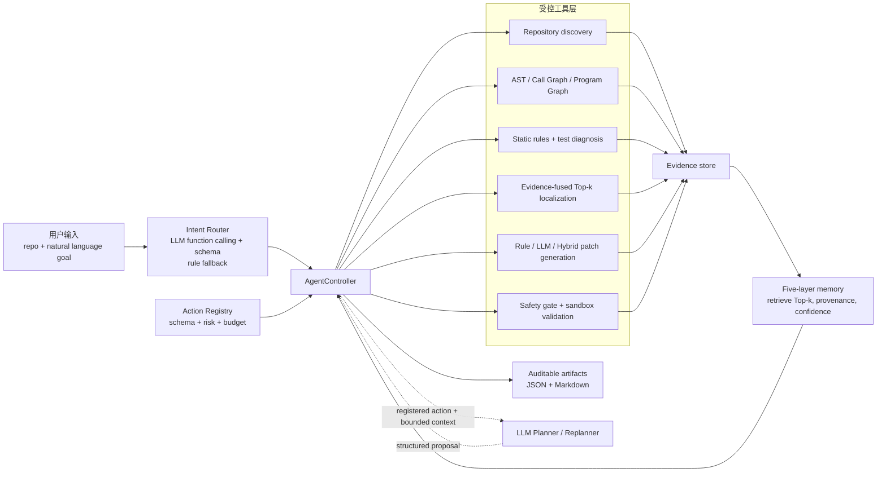
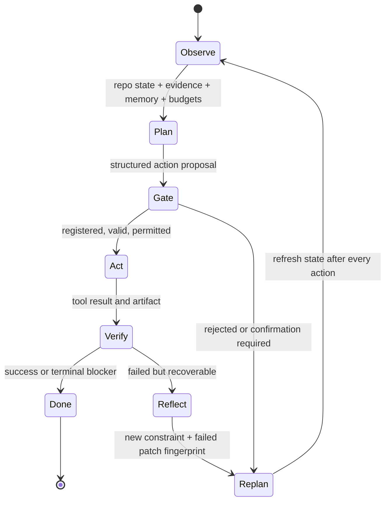
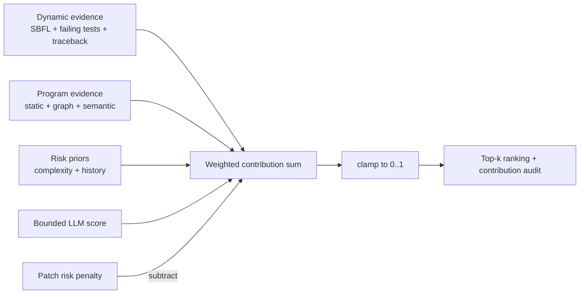
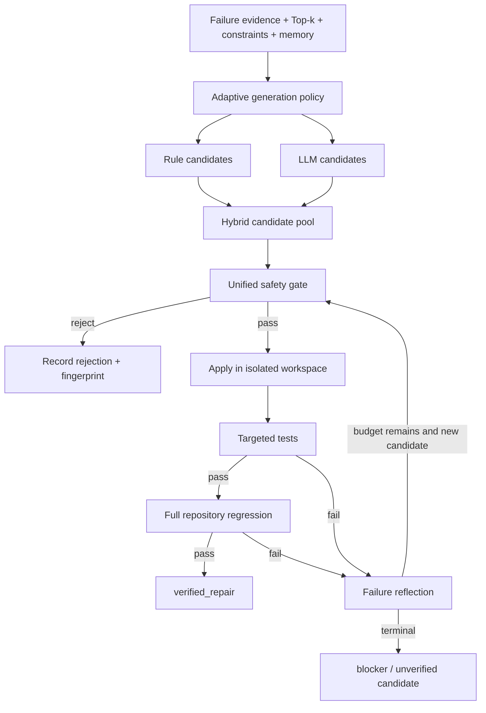
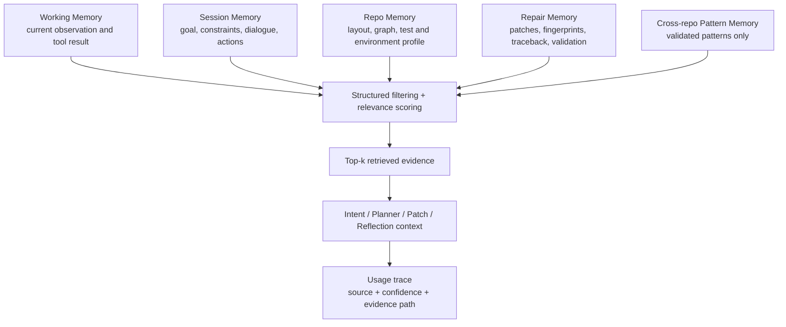

# Code Intelligence Agent V2 架构与算法设计

本文给出当前 V2 的实现边界、Agent 决策闭环、缺陷定位算法、补丁验证链路和证据记忆设计。它描述的是仓库中已经实现并经过测试的能力，不把受控 fixture 指标解释为真实模型在任意仓库上的修复率。

## 1. 系统目标与边界

系统接收公开 Python GitHub 仓库、本地 Python 仓库或单文件，以及用户自然语言目标。完整 GitHub Agent 入口负责仓库发现、源码筛选、结构建模、测试诊断、函数级 Top-k 定位、受控补丁生成、sandbox 验证、失败反思、记忆检索和审计报告；本地单文件入口只执行静态分析，不等价于完整 Agent。

系统的成功定义分为三类：

1. `verified_repair`：至少目标失败测试与完整回归均通过，并通过 AST、范围、签名和安全门。
2. `analysis_ready` 或 clean-repo 结果：仓库理解和证据报告完成，但没有可验证缺陷，不生成虚假补丁。
3. `blocked` 或 partial 结果：静态分析仍可完成，同时准确记录依赖、网络、权限、配置、测试或证据 blocker。

系统不承诺自动修复所有仓库，不支持任意语言，也不允许 LLM 直接执行任意 Shell 命令。

## 2. 总体架构



### 2.1 为什么它不是固定流水线

固定流水线会无条件按预定顺序执行所有步骤。当前控制器每轮都重新读取 observation：仓库是否可解析、测试命令是否存在、失败是否属于应用代码、Top-k 是否有足够证据、LLM 是否可用、候选是否安全、预算是否剩余。不同状态会产生不同动作，例如：

- 测试通过且无缺陷信号：停止修复，输出 clean-repo 分析结果。
- 缺少依赖：生成环境修复计划并等待外部环境变化。
- 有失败测试和可疑函数：进入候选生成与 sandbox 验证。
- 初始候选失败但仍有预算：读取失败反馈并进入 reflection。
- LLM 提议未注册动作：拒绝提议，采用安全的规则 fallback。

## 3. Agent 决策闭环



### 3.1 Observe

输入不是一段自由文本摘要，而是结构化状态：用户目标、仓库画像、源码根、Program Graph 摘要、Top-k 函数、静态规则、pytest 与 traceback、当前 blocker、动作历史、失败补丁指纹、用户约束以及动作、时间和 LLM 成本预算。

### 3.2 Plan

支持 `rule`、`llm` 和 `hybrid` 三种模式。LLM 只能返回结构化对象，包括 `selected_action`、`arguments`、`reason`、`confidence`、`risk`、`required_evidence`、`expected_outcome`、`fallback_action`、`termination_condition` 和 `memory_used`。解析或 Schema 校验失败时，不执行模型原文，而是回退规则规划器。

### 3.3 Safety Gate

控制器检查：动作是否注册、参数是否在 allowlist、状态迁移是否允许、风险等级是否需要确认、执行器是否存在、动作是否在同一失败状态重复、预算是否足够。LLM 是提议者，不是执行权限持有者。

### 3.4 Act 与 Verify

Act 只调用 Action Registry 中的工具。Verify 读取工具返回值和持久化 artifact；补丁是否成功由真实 targeted tests 和 full regression 决定。LLM Judge 只提供排序和风险意见，不能把失败测试改写成成功。

### 3.5 Reflect 与 Replan

验证失败后，系统抽取 return code、stdout/stderr、traceback、失败 nodeid、失败类别和新约束，保存失败补丁 fingerprint。只有仍有候选、反思和动作预算时才继续；否则输出明确终止原因，防止无界循环。

## 4. 仓库理解与程序图

仓库理解先识别 `src`/flat/monorepo/多包布局、Python 源码根、测试目录、配置文件和 runner。随后使用 Python AST 提取模块、类、函数、调用、导入、控制结构和数据依赖，构建 Call Graph 与 Program Graph。

图结构用于两类任务：

- 定位：通过数据依赖、控制流、PageRank、调用者影响、模块依赖和异步调用形成结构先验。
- 解释：报告一个函数为何被失败测试、traceback 或相邻调用节点影响，保留传播距离与衰减。

动态证据与图先验严格分离。图上“接近失败节点”不等于真实出现在 traceback 中；没有实际失败测试时，`TestFailureScore` 和 `StackTraceScore` 必须为零。

## 5. 函数级缺陷定位算法

### 5.1 信号定义

| 信号 | 计算或来源 | 证据边界 |
| --- | --- | --- |
| `StaticRuleScore` | `1 - product(1 - confidence_i)` | 只来自检测器实际 finding |
| `SBFLScore` | 函数级 Ochiai；statement/branch/path 取可用粒度中的最大值 | 无失败测试或覆盖时为 0 |
| `GraphScore` | 数据依赖、控制流、中心性、PageRank、调用者影响、模块依赖、异步调用的归一化组合 | 结构先验，不冒充运行证据 |
| `TestFailureScore` | 真实失败测试命中为 1；图邻居按距离传播 | 只有执行后的 failing test ID 才启用 |
| `StackTraceScore` | 真实生产代码 stack frame 命中或有限传播 | 只有动态解析 frame 才启用 |
| `SemanticScore` | 失败文本 token 与函数 token 的 cosine-style overlap | 无 query overlap 时为 0 |
| `LLMScore` | 可选语义评分器输出 | 必须有 fault-specific 程序证据支撑 |
| `ComplexityScore` | 仓库内归一化 `log1p(cyclomatic_complexity - 1)` | 风险先验，不是缺陷证明 |
| `ChangeHistoryScore` | commit 多样性、密度与 180 天半衰期 recency | Git 不可用时为 0 并报告缺失 |
| `RiskScore` | 归一化生产调用者入度 | 作为修改影响面的负向惩罚 |

结构分数内部公式为：

```text
GraphScore = clamp(
    0.18 * DataDependency
  + 0.18 * ControlFlow
  + 0.14 * Centrality
  + 0.14 * PageRank
  + 0.16 * CallerImpact
  + 0.10 * ModuleDependency
  + 0.10 * AsyncCall
)
```

图传播最多三跳，默认衰减 `0.5`：`propagated(d) = 0.5 ** max(0, d - 1)`。

### 5.2 FinalScore



```text
FinalScore = clamp(
    w_sbfl       * SBFLScore
  + w_graph      * GraphScore
  + w_static     * StaticRuleScore
  + w_semantic   * SemanticScore
  + w_llm        * effective_LLMScore
  + w_test       * TestFailureScore
  + w_traceback  * StackTraceScore
  + w_complexity * ComplexityScore
  + w_history    * ChangeHistoryScore
  - w_risk       * RiskScore
)
```

当前 `evidence_v2` 权重来自 validation split 选择，冻结后才用于 test 与 blind split：

| Profile | SBFL | Graph | Static | Semantic | LLM | Test failure | Traceback | Complexity | History | Risk penalty |
| --- | ---: | ---: | ---: | ---: | ---: | ---: | ---: | ---: | ---: | ---: |
| Coverage-aware | 0.22 | 0.18 | 0.15 | 0.05 | 0.05 | 0.15 | 0.10 | 0.05 | 0.05 | 0.05 |
| Static-only | 0.00 | 0.25 | 0.45 | 0.10 | 0.05 | 0.00 | 0.00 | 0.10 | 0.05 | 0.05 |

LLM 原始分先裁剪到 `[0, 1]`，且必须至少有 Static、SBFL、TestFailure、StackTrace 或 Semantic 信号为正。加权 LLM 贡献上限为 `0.10`；当前权重下实际最大贡献为 `0.05`。

每个结果保存 raw signal、active weight、`contribution_<signal>`、`score_reconstruction` 和 clamp adjustment。因此面试中可以用具体贡献回答“为什么 A 排在 B 前面”，而不是只展示一个不可解释的总分。

## 6. 补丁生成、门控与验证



Rule 模式用于确定性已知模式；LLM 模式处理规则覆盖不到的语义修改；Hybrid 根据规则可修复数量、semantic/traceback pressure、LLM 可用性和候选预算选择 `adaptive_rule_first`、`adaptive_llm_first` 或 fallback，而不是永久 rule-first。

统一门控依次检查 Python AST、修改范围、授权文件、公共签名、测试保护、敏感文件、危险 API、依赖授权、diff 完整性、改动规模和历史失败 fingerprint。候选 provenance 保存 generator、定位证据、父候选和生成策略，避免把 rule 成功错误归因给 LLM。

没有可运行测试时最多输出 `candidate patch` 或 `unverified suggestion`。只有 targeted tests 与 full regression 都通过，才允许 `verified_repair`。

## 7. 五层证据记忆



每条记忆包含来源、仓库与 ref、时间、证据路径、置信度、验证权威和失效状态。系统先做结构化过滤和相关度排序，不把全部历史直接塞入 prompt。失败补丁 fingerprint 用于去重；只有 sandbox 验证成功的经验才能进入长期可复用记忆；仓库 commit 变化会使不兼容记录失效。

Phase 7 的 8 个受控 memory case 中，启用记忆后任务完成率从 `0.1250` 到 `1.0000`，重复失败补丁率从 `1.0000` 到 `0.0000`。该结果证明结构化检索影响了控制策略，不代表真实模型推理质量。

## 8. 输出与审计

一次完整运行至少生成仓库画像、结构与图摘要、Top-k 定位、测试诊断、候选与安全门、sandbox 验证、reflection trace、controller/planner trace、memory usage 和最终报告。JSON 供自动评估，Markdown 供人工审计。

关键原则是“结论与证据同存”：每个 selected action、blocker、补丁归因和成功声明都必须能回到原始 artifact。输出目录是运行产物，不提交到 Git；可发布的紧凑实验证据位于 [`phase7_artifacts`](phase7_artifacts/phase7_system_evaluation.md)。

## 9. 已验证结果与诚实边界

- 20 个固定 SHA 陌生公开仓库全部产出结构化报告并完成静态分析；7 个真正启动并终止测试进程，13 个为 partial。
- 20 个 test + blind localization case 的 Top-1/3/5、MRR、MAP 都为 `1.0000`；移除 Graph 或动态证据后仍为 `1.0000`，因此只能声明无回归，不能声明增益。
- 3 个离线受控补丁案例中 Rule/LLM/Hybrid verified rate 为 `0.3333/1.0000/1.0000`；LLM 输出是确定性 fixture，只验证编排与验证契约。
- 14 个 planner case、42 次运行中最终已注册动作率、任务完成率和 blocker 分类准确率均为 `1.0000`，并保留非法提议、fallback、token 与成本记录。

完整实验、失败分母和复现命令见 [`phase7_system_evaluation.md`](phase7_artifacts/phase7_system_evaluation.md)。

## 10. 主要实现入口

| 能力 | 实现位置 |
| --- | --- |
| AgentController 与规划门控 | `code_intelligence_agent/agents/controller.py` |
| Action Registry | `code_intelligence_agent/agents/action_registry.py` |
| LLM intent routing | `code_intelligence_agent/agents/intent_router.py` |
| 五层证据记忆 | `code_intelligence_agent/agents/evidence_memory.py` |
| 函数级定位与分数贡献 | `code_intelligence_agent/core/fault_localizer.py` |
| Program Graph | `code_intelligence_agent/core/program_graph.py` |
| 自适应补丁策略 | `code_intelligence_agent/agents/patch_generation_policy.py` |
| 语义补丁验证 | `code_intelligence_agent/tools/semantic_patch_validation.py` |
| 系统消融评估 | `code_intelligence_agent/evaluation/system_evaluation.py` |
