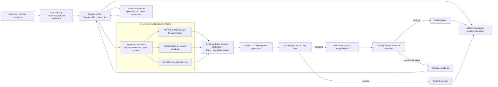
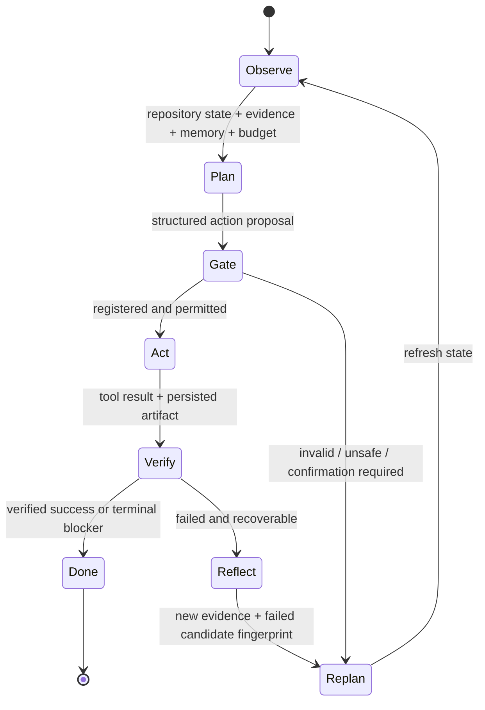
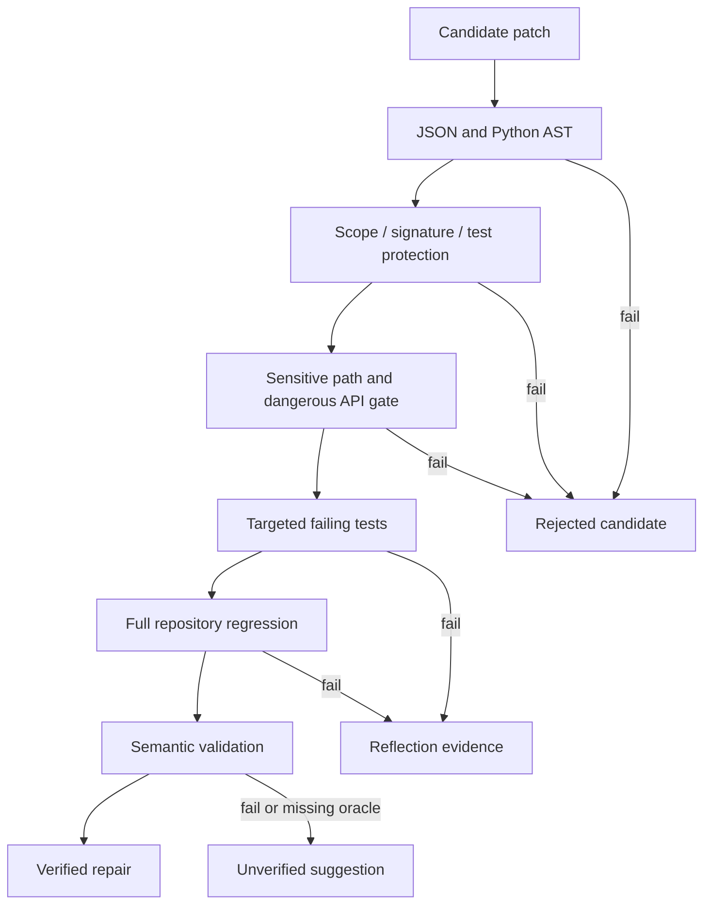

# Code Intelligence Agent V3 架构与 Agent 设计

## 1. 项目目标与当前发布状态

V3 面向真实 Python 缺陷，目标是把仓库理解、函数级缺陷定位、补丁生成、
真实测试验证、失败反思和长期证据记忆组合为一个受控代码智能 Agent。
系统保留 `Observe -> Plan -> Act -> Verify -> Reflect -> Replan` 闭环，LLM
负责语义不确定部分，规则控制器和 sandbox 负责执行权限与成功判定。

当前 V3 的两层证据均已完成：

- **离线发布门通过**：Phase 0-6 的 benchmark、环境、定位、Rule 基线、语义
  校准、记忆和安全证据均通过统一审计。
- **真实模型发布门通过**：20 个案例上的 60 次 LLM 和 60 次 Hybrid 独立
  trial 已全部完成，`120/120` trial、`423/423` RunRecord 和精确模型
  `deepseek-v4-pro` 均通过发布审计。

完整状态以
[`phase7_unified_evaluation.json`](phase7_unified_evaluation.json) 为准，任何
简历或演示材料必须同时保留失败分母、置信区间和策略归因，不能把 Rule、
人工修复或旧版 fixture 指标混入 live repair rate。

## 2. 总体架构



这套架构有两个执行平面：

1. **交互式仓库 Agent**：接收 `owner/repo`、自然语言目标和预算，每轮根据
   当前 observation 选择动作，支持终端多轮会话。
2. **V3 实验与发布平面**：在固定 SHA 的真实 bug benchmark 上执行可重复的
   Rule/LLM/Hybrid trial，统一统计定位、修复、成本、失败和安全指标。

二者共享程序分析、控制器、安全门、补丁验证和 artifact 契约，但实验平面
额外冻结模型、Prompt、案例、trial identity 和统计分母，避免把一次交互演示
误写成可复现修复率。

## 3. Agent 决策闭环



### 3.1 Observe

Observation 不是自由文本摘要，而是结构化状态，至少包含：

- 仓库 URL、固定 revision、源码根、包布局和测试 runner；
- AST、调用关系、程序图邻域和函数级候选；
- failing test、coverage、traceback 和环境 blocker；
- 用户约束、已执行动作、历史失败补丁 fingerprint；
- action、时间、Reflection 轮数和 LLM 成本预算；
- 本仓库记忆、当前 session 记忆和只读跨仓库经验。

### 3.2 Plan

规划支持 `rule`、`llm` 和 `hybrid`。LLM Planner 只返回结构化 proposal，
包括动作、参数、理由、置信度、风险、所需证据、预期结果、fallback 和终止
条件。解析失败、Schema 失败、动作未注册或证据不足时，不执行模型原文，
而是拒绝或回退规则规划器。

### 3.3 Gate 与 Act

Action Registry 是执行权限边界。控制器检查：

- action 是否注册，执行器是否存在；
- 参数是否符合 Schema 与 allowlist；
- 当前状态是否允许该迁移；
- 风险是否需要人工确认；
- 是否重复了相同失败状态；
- 动作、时间、资源和模型成本是否仍在预算内。

因此，LLM 可以参与决策，但不能自行创建工具、执行任意 Shell 或绕过测试。

### 3.4 Verify、Reflect 与 Replan

Verify 读取真实 return code、pytest nodeid、stdout/stderr 摘要、traceback、
patch diff 和语义检查结果。失败后，Reflection 必须引入新的失败证据和旧
候选 fingerprint；下一候选需要与旧候选实质不同。预算耗尽、没有新证据或
出现终止 blocker 时停止，不进行无限重试。

## 4. 真实缺陷 Benchmark

V3 从 BugsInPy 候选中形成 20 个 accepted case、5 个 rejected case，覆盖
6 个真实仓库。每个 accepted case 固定 bug SHA、fix SHA、Python 版本、目标
测试、ground-truth 文件/函数和 provenance。

一个案例只有同时满足以下条件才可进入正式分母：

1. 在全新 bug checkout 上，至少一个目标测试真实失败；
2. 在独立 fix checkout 上，目标测试通过；
3. fix checkout 的完整回归通过且测试数非零；
4. 所需测试支持文件显式声明并校验哈希；
5. 模型上下文不包含 gold patch、fix commit 内容或 ground-truth 选择信息。

无法复现的案例进入 rejected catalog 并保留原因，不通过删除失败案例提高
修复率。原始 checkout、虚拟环境和测试输出不提交到 Git。

## 5. 仓库环境与测试启动

环境层识别 pytest、unittest、tox、nox、Poetry、uv、editable install、extras、
monorepo 工作目录和 Python 版本约束。每个仓库使用独立运行环境 fingerprint，
缓存按 repo、commit、Python 和依赖输入失效。

固定 20 仓库评估中：

- 20/20 输出结构化报告；
- 20/20 发现测试命令；
- 19/20 测试进程真实启动并终止；
- 1 个未启动案例被分类为明确 environment blocker；
- 没有为了提高启动率而自动执行仓库高风险安装脚本。

V2 的原始数字是 7/20，但 V3 改变了隔离运行时和启动协议，因此统一报告把
两者标为 `not_comparable`，不宣称因果提升 60 个百分点。

## 6. 函数级缺陷定位算法

### 6.1 输入信号

| 信号 | 计算来源 | 证据边界 |
| --- | --- | --- |
| `StaticRuleScore` | 静态 finding 的置信度聚合 | 没有 finding 时为 0 |
| `GraphScore` | 数据/控制依赖、调用邻域、中心性与 PageRank | 结构先验，不冒充运行证据 |
| `SBFLScore` | 真实 failing/passing coverage 的 Ochiai | 没有 coverage 时为 0 |
| `TestFailureScore` | 失败测试命中与受限图传播 | 只使用真实执行结果 |
| `StackTraceScore` | 生产代码 stack frame 命中与受限传播 | 没有 traceback 时为 0 |
| `SemanticScore` | 失败文本与函数文本的确定性词法相似度 | 当前不是 LLM 指标 |
| `LLMScore` | 可选受限模型语义评分 | V3 定位实验中未启用 |
| `ComplexityScore` | 仓库内归一化复杂度 | 风险先验，不是缺陷证明 |
| `ChangeHistoryScore` | 变更密度与时间衰减 | Git 不可用时为 0 |
| `RiskScore` | 修改影响面 | 可作为负向惩罚 |

每个函数都保存 raw signal、active weight、逐项 contribution、最终分数和排序，
因此可以从 artifact 重建排名。

### 6.2 V3 权重选择

V3 不沿用 V2 手工展示权重。系统在 validation split 上搜索 141 个候选 profile，
目标函数为：

```text
0.25 * MAP
+ 0.25 * MRR
+ 0.20 * nDCG@3
+ 0.15 * Top1
+ 0.10 * Top3
+ 0.05 * (1 - EXAM)
```

搜索只读取 8 个 validation case，5 个 test case 的 ground truth 不传入搜索器。
冻结后的 `simplex-021` 为：

```text
FinalScore = clamp(
    0.225 * SBFLScore
  + 0.250 * SemanticScore
  + 0.175 * TestFailureScore
  + 0.100 * StackTraceScore
  + 0.125 * ComplexityScore
  + 0.125 * ChangeHistoryScore
)
```

该 profile 中 Graph、Static、LLM 和 Risk 权重为 0。这里的“0”是 validation
选择结果，不代表这些模块没有实现，也不能声称 Graph 对所有任务无效。

### 6.3 冻结测试结果与消融

冻结 test split 的函数级结果为：

| 指标 | 结果 |
| --- | ---: |
| Top-1 | 0.60 |
| Top-3 | 0.80 |
| Top-5 | 1.00 |
| MRR | 0.706667 |
| MAP | 0.614359 |
| nDCG@3 | 0.622629 |
| EXAM | 0.003639 |

消融中，移除 Dynamic 后 Top-1 相对下降 0.40，移除 Semantic 后下降 0.20，
移除 Auxiliary 后下降 0.20。Graph 和 Rule 在被选 profile 中权重为 0，移除
后没有变化。测试集只有 5 个案例且来自一个仓库，因此这些结论是当前固定
benchmark 的证据，不是对任意 Python 缺陷的普遍证明。

## 7. Rule / LLM / Hybrid 补丁生成

### 7.1 Rule

Rule patcher 将已识别 finding 映射到确定性补丁模板。优点是可复现、成本为
零、修改范围小；缺点是只能覆盖已编码 bug pattern。当前 20-case Rule 基线
为 pass@1=0、pass@3=0、verified repair=0。这是正式结果，不能隐藏。

### 7.2 LLM

LLM 只接收经审计的 bounded context：Top-k 函数、必要图邻域、失败测试、
traceback、用户约束、历史失败 fingerprint 和输出 Schema。它不接收 gold
patch、fix commit 或未授权本地路径。模型输出候选 diff/结构化替换，不获得
写盘、测试或 Shell 权限。

### 7.3 Hybrid

Hybrid 保持 Rule 与 LLM 候选来源分离，通过 candidate provenance 记录真正的
generator family。规则候选通过测试时不归因给 LLM；LLM 候选成功也不会记为
Rule。provider retry 属于同一 trial，不会增加 pass@k 分母。

### 7.4 冻结真实模型结果

| 策略 | pass@1 | pass@3 / verified case | Reflection recovery | 成本 |
| --- | ---: | ---: | ---: | ---: |
| LLM | 8/20 (0.40) | 10/20 (0.50) | 7/20 (0.35) | $1.839613 |
| Hybrid | 6/20 (0.30) | 9/20 (0.45) | 3/20 (0.15) | $1.006873 |

这里的 pass@1/pass@3 都以 20 个 case 为分母。LLM 有 25 个成功 trial，包含
16 个直接成功和 9 个 Reflection 成功；Hybrid 有 22 个成功 trial，包含 19 个
直接成功和 3 个 Reflection 成功。Hybrid 的 22 个 verified winning record 全部
来自 LLM generator family，Rule 候选没有产生 verified repair。因此本实验不
声称 Hybrid 优于 LLM，也不把规则候选的前置筛选归因为成功来源。

### 7.5 最终 live 边界

冻结协议要求每个案例 1 次 Rule、3 次 LLM、3 次 Hybrid。最终评估已完成
20 次 Rule、60 次 LLM 与 60 次 Hybrid trial，模型评估矩阵为 120/120，且所有
trial identity 均完整。连同候选与审计记录共生成 423 条 RunRecord，423/423
通过审计。因此本节可以报告真实模型修复率；这些结果仍只适用于冻结的
20-case、6-repository 数据集、指定模型和协议，不外推为任意 Python 缺陷的成功率。

## 8. 补丁验证与语义正确性



语义层包含公共 API/签名兼容、静态语义 diff、workspace 一致性、补丁最小性、
新旧行为 differential 和 reverse-mutation sensitivity；有 manifest oracle 时
还可运行 boundary/property 命令。缺少适用 oracle 时只能输出
`unverified_suggestion`。

Phase 5 使用 2 个人工 fix 做 validator 校准，2/2 通过、3/3 reverse mutation
被杀死。它证明验证器没有拒绝这两个已知正确修复，不是 Agent 修复了两个案例。

## 9. 记忆与安全边界

记忆分为 Working、Session、Repo、Repair 和 Cross-repo Pattern 五层。V3 的
`structured_relevance_v2` 先按 repo/ref、证据来源、状态和有效期过滤，再计算
结构化相关度。跨仓库策略只能作为 `advisory_only`，不能直接授权执行。

受控记忆实验中，无记忆 completion 为 3/7，结构化记忆为 7/7；过期复用、
冲突执行和 advisory 越权均为 0。embedding 未展示额外必要收益，因此未为了
技术名词接入向量数据库。

仓库内容始终视为不可信数据。安全层覆盖 prompt injection、恶意 build hook、
路径穿越、符号链接、敏感环境变量、Python 外部 socket 和资源耗尽。8/8 受控
fixture 被拒绝、隔离或准确报告。当前是进程级纵深防御，不是 Windows 上的
容器级安全边界；native child 的完整网络、CPU、内存和磁盘硬隔离仍需容器或
Job Object。

## 10. RunRecord 与发布审计

每个 trial 使用稳定 identity：`case_id + strategy + trial_index`。RunRecord
保存 revision、输入 fingerprint、候选来源、模型 provider/model/Prompt hash、
token、成本、延迟、测试、语义结果、Reflection、失败层和时间戳。

统一发布器执行以下拒绝规则：

- 缺少任一 Phase 0-6 证据：离线发布失败；
- live artifact 只有 119/120 trial：完整发布失败；
- provider、精确 model ID 或 Prompt hash 偏离冻结协议：完整发布失败；
- LLM/Hybrid 任一策略不是 20 case、60 trial：完整发布失败；
- 缺少成本、延迟、token、失败分类或 generator attribution：完整发布失败；
- 人工校准、Rule 结果或旧 fixture 不能填充 live 指标。

## 11. 当前可审计结果

| 维度 | 当前结果 | 边界 |
| --- | ---: | --- |
| 真实 bug benchmark | 20 accepted / 5 rejected / 6 repos | BugsInPy 固定案例 |
| 仓库测试启动终止 | 19/20 | 与 V2 协议不可直接比较 |
| 定位 Top-1/3/5 | 0.60 / 0.80 / 1.00 | 5 个冻结 test case |
| Rule pass@1 | 0/20 | 真实测量的零 |
| LLM pass@1 / pass@3 | 0.40 / 0.50 | Wilson 95%: [0.2188, 0.6134] / [0.2993, 0.7007] |
| Hybrid pass@1 / pass@3 | 0.30 / 0.45 | Wilson 95%: [0.1455, 0.5190] / [0.2582, 0.6579] |
| RunRecord | 423/423 audit pass | 1 个 provider timeout 单独分类并保留 |
| 语义校准 | 2/2 human fixes | 不是 Agent repair |
| 结构化记忆 completion | 3/7 -> 7/7 | 受控 fixture |
| 安全处理 | 8/8 | 受控 fixture，非容器证明 |
| 完整回归 | 见 Phase 7 final verification | 与 live repair rate 分开记录 |

## 12. 权威证据入口

- 实验协议：[`experiment_protocol.json`](../../datasets/v3_real_bugs/experiment_protocol.json)
- Benchmark：[`phase1_verification.json`](phase1_verification.json)
- 环境：[`phase2_verification.json`](phase2_verification.json)
- Rule 离线基线：[`phase3_offline_verification.json`](phase3_offline_verification.json)
- 定位与消融：[`phase4_localization_metrics.json`](phase4_localization_metrics.json)
- 语义验证：[`phase5_verification.json`](phase5_verification.json)
- 记忆与安全：[`phase6_verification.json`](phase6_verification.json)
- 统一发布状态：[`phase7_unified_evaluation.json`](phase7_unified_evaluation.json)
- 最终发布验证：[`phase7_final_verification.json`](phase7_final_verification.json)
