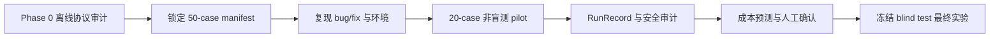
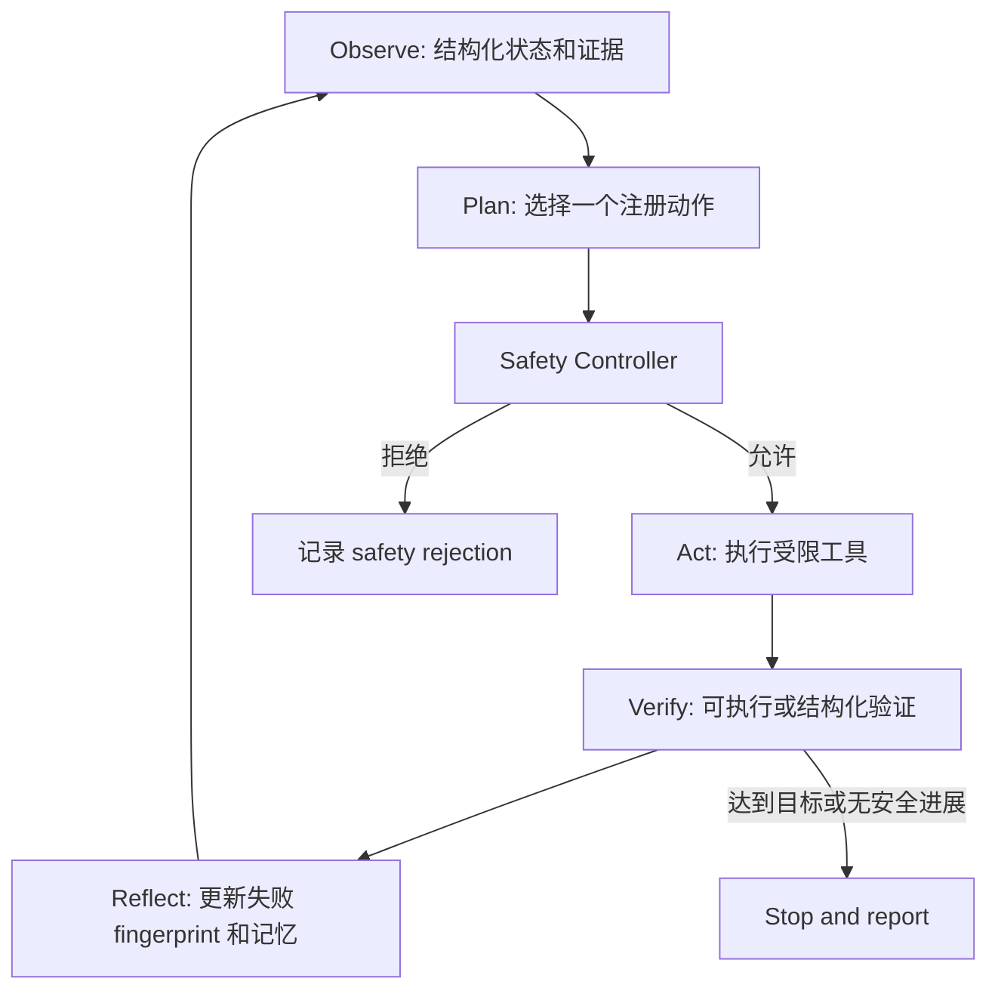
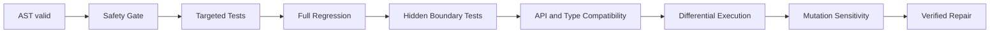

# Code Intelligence Agent V4 Phase 0 实验协议

## 1. Phase 0 的目的

V4 的目标不是继续堆叠工具，而是回答一个可以被实验检验的问题：

> 在模型、缺陷案例、候选数、token、成本、时间和动作预算相同的条件下，
> 能根据观察结果自主选择下一步动作的 Full Agent，是否比固定修复流程更有效？

这个问题必须在运行付费模型前冻结。否则，看到结果后再修改 Prompt、预算、
数据划分或成功标准，会使实验无法复现，也无法区分收益究竟来自 Agent 决策、
更高预算还是数据泄漏。

Phase 0 因此只完成协议、Prompt、Schema、审计和文档冻结，不调用外部模型，
也不产生新的修复率结论。

## 2. 冻结的 V3 基线

- baseline tag：`v3-baseline`
- baseline commit：`43268748cbfb4abb1f54c2e8d41da96e5ba1d92a`
- 真实缺陷：20 个案例，来自 6 个仓库
- 仓库测试启动：19/20
- LLM：pass@1 为 0.40，pass@3 为 0.50，修复 10/20
- Hybrid：pass@1 为 0.30，pass@3 为 0.45，修复 9/20
- 真实模型评估：60 次 LLM trial 和 60 次 Hybrid trial，120/120 完成
- RunRecord：423/423 审计通过
- 完整测试：1412 passed，2 skipped

V4 只允许在相同案例与相同协议口径下比较 V3 数字。V3 的 20-case 结果不能
直接与 V4 的 50-case 结果比较，也不能外推为任意 Python 缺陷的成功率。

## 3. 可机读协议

主协议位于：

`datasets/v4_agent_effectiveness/experiment_protocol.json`

它冻结以下内容：

1. V3 baseline tag 和完整 commit SHA。
2. Python、依赖文件及关键 V3/V4 评估脚本哈希。
3. 模型、温度、重试策略、Prompt、Prompt 哈希和费率快照。
4. 50-case benchmark 的规模、难度类型和仓库隔离划分。
5. 三组实验的方案、trial 数和等预算映射。
6. 可执行动作白名单和模型不能越过的安全边界。
7. V4 trial 级 RunRecord Schema。
8. verified repair 的全部验证门。
9. Graph、Routed Hybrid 和语义记忆的保留或移除条件。
10. 20-case pilot、最终实验和 50 个冷启动仓库的启动门。

协议使用 canonical JSON SHA-256 防漂移。当前指纹为：

`3375dda3486f617262a5ec68245ffc5e8f1d7dc37e4f4308f963935fb361395b`

任何字段、Prompt 或冻结文件变化都会使审计失败。合理修改必须提升协议版本、
重新计算哈希并说明原因，不能静默覆盖。

## 4. Benchmark 设计

### 4.1 规模与划分

最终 benchmark 至少包含 50 个可复现真实 Python 缺陷，来自至少 15 个仓库：

| Split | Case 数 | 用途 |
| --- | ---: | --- |
| Development | 10 | 调试实现、检查数据和 Prompt 格式 |
| Validation | 15 | 搜索融合权重、阈值和 Router 参数 |
| Blind test | 25 | 只用于冻结后的最终结论 |

划分单位是 repository，而不是 case。一个仓库不能同时出现在两个 split，避免
同仓库结构、命名和测试习惯泄漏到测试集。

### 4.2 困难缺陷类型

50 个案例必须覆盖：

- `static_negative`：静态规则不能直接命中的语义缺陷。
- `cross_function`：失败现象和根因跨函数传播。
- `dataflow`：错误值沿数据流传播后才触发失败。
- `multi_file`：正确修复涉及多个源文件的一致修改。
- `root_error_separated`：traceback 报错位置不是根因位置。
- `high_similarity_candidates`：存在多个表面相似的候选函数。
- `real_traceback`：具有真实 failing test 和 traceback 证据。

每个案例必须保存 bug SHA、fix SHA、目标测试、回归测试、ground-truth 文件和
函数、许可证、来源以及复现证据。bug SHA 必须按预期失败，fix SHA 必须通过
目标测试；无法复现的案例进入 rejected catalog，不能悄悄从分母中删除。

## 5. 等预算实验

所有对照方案共享同一个 `repair_equal_budget_v4` 上限：

| 预算项 | 每个 case/allocation/trial 上限 |
| --- | ---: |
| 模型输入 token | 180,000 |
| 模型输出 token | 20,000 |
| 模型总 token | 200,000 |
| 补丁候选 | 3 |
| Agent 动作 | 12 |
| Reflection 轮次 | 2 |
| 墙钟时间 | 1,800 秒 |
| 模型成本 | 1.00 USD |

预算是硬上限，不要求每个方案强行消耗完。较早解决问题而少用动作、token 或
成本，本身就是 Agent 的效率收益；但任何方案都不能获得更高上限。

### 5.1 主实验：Agent 是否有效

| 方案 | Case | 独立 trial/case | 总 trial |
| --- | ---: | ---: | ---: |
| Fixed Workflow | 50 | 3 | 150 |
| Full Agent | 50 | 3 | 150 |

总计 300 个 trial。两者均使用 LLM patch generation。Fixed Workflow 按冻结的
静态动作序列运行；Full Agent 使用 LLM Planner，根据 Observe、Verify 和当前
预算选择注册动作，同时保留确定性 Safety Controller 的最终控制权。

这个实验回答整体系统问题，但不单独归因 Planner、Reflection 或 Memory。

### 5.2 组件消融：收益来自哪里

在预先选定的 20 个困难案例上比较：

| 方案 | Planner | Reflection | Memory |
| --- | --- | --- | --- |
| Fixed Workflow | 固定序列 | 关闭 | 无 |
| Rule Planner | 规则 | 关闭 | 无 |
| LLM Planner | LLM | 关闭 | 无 |
| No Reflection | LLM | 关闭 | 结构化 |
| No Memory | LLM | 开启 | 无 |
| Full Agent | LLM | 开启 | 结构化 |

每个方案运行 20 × 3 = 60 个 trial，六个方案总计 360 个 trial。

- Rule Planner 对比 LLM Planner，观察模型规划相对规则规划的差异。
- LLM Planner 对比 No Reflection，观察结构化记忆在无 Reflection 条件下的影响。
- No Reflection 对比 Full Agent，隔离 Reflection 的边际贡献。
- No Memory 对比 Full Agent，隔离结构化 Memory 的边际贡献。
- Fixed Workflow 对比 Full Agent，衡量完整 Agent 闭环的总体价值。

困难案例名单必须在 live 调用前冻结，不能根据某方案的结果挑选案例。

### 5.3 Routed Hybrid：为什么选择这个生成器

比较三种 patch strategy：

| Strategy | 行为 | 总 trial |
| --- | --- | ---: |
| LLM-only | 所有候选来自 LLM | 150 |
| Naive Hybrid | 固定分配 Rule 和 LLM 候选 | 150 |
| Routed Hybrid | 根据证据与风险动态分配候选 | 150 |

总计 450 个 trial。Router 只接收结构化特征：规则置信度、定位熵、失败类型、
动态证据强度、补丁风险、候选多样性、历史失败 fingerprint 和剩余预算。

Routed Hybrid 只在以下任一条件满足时保留：

1. verified repair rate 至少提高 5 个百分点；或
2. 修复率下降不超过 3 个百分点，同时单位成功修复成本至少降低 20%。

否则将 Hybrid 从默认策略移除，并保留负结果。

### 5.4 付费调用停止门

三组最终实验的名义规模合计为 1,110 个 trial。协议不允许直接启动全部调用：



Pilot 使用 development/validation 案例，不接触 blind test。任何 provider、成本、
Schema、身份完整性或安全问题都必须在 pilot 阶段解决。

## 6. V4 Agent 的动作与安全边界

LLM Planner 每次只能返回一个注册动作或 stop。动作包括仓库加载、结构发现、
测试发现、环境诊断、测试运行、动态证据收集、缺陷定位、候选生成、沙箱验证、
Reflection 和报告生成。



模型不能自由执行 Shell，不能选择白名单外动作，不能覆盖 Safety Controller，
也不能把仓库文本中的指令当作系统指令。API Key 不进入仓库测试进程。

## 7. Trial 级 RunRecord

V3 的记录更偏候选级；V4 采用“一条记录对应一个 case/allocation/trial”的粒度，
以便完整审计 Agent 的动作选择和总预算。

每条记录至少包含：

- `case`：仓库、bug/fix SHA、split。
- `experiment`：实验、trial identity、是否进入分母。
- `policy`：Planner、Reflection、Memory 和 patch strategy。
- `budget`：冻结上限、实际消耗、耗尽维度。
- `action_trace`：顺序动作、选择者、reason code、证据引用、Safety 与 Verify 状态。
- `candidates`：生成器归因、父候选、Reflection 轮次、patch hash、触及文件。
- `model/usage/cost/timing`：模型、Prompt hash、provider token、实际费率与延迟。
- `validation/outcome/failure`：所有验证门、最终状态和失败层。
- `model_context/artifacts/timestamps`：防泄漏声明和可追溯 artifact。

记录只保存结构化 reason code 和 evidence reference，不保存私有思维链或原始
provider response。所有 provider、environment、safety 和 budget blocker 都保留
在分母中，不能只统计成功启动的 trial。

## 8. verified repair 的权威判据

V4 不允许仅凭 LLM Judge 或目标测试通过就声明修复成功：



任何一层失败都不能计为 verified repair。没有完整 semantic oracle 时，即使现有
测试通过，也只能输出 `unverified_suggestion`。这样可以区分“通过当前测试”和
“具有足够语义证据的修复”。

## 9. 陌生仓库验收

另选 50 个不参与 benchmark 和开发调试的冷启动仓库，覆盖 Poetry、uv、tox、
nox、monorepo、多 package、多 Python 版本、原生扩展和外部服务依赖。

验收目标：

- 至少 45/50 成功启动测试，或输出与实际原因一致的 blocker。
- 未授权危险动作执行数为 0。
- 使用 Linux 容器、只读源挂载、独立临时目录和默认禁网。
- 限制 CPU、内存、磁盘、进程数和时间。

该评估衡量的是安全启动与准确停止能力，不把“对不兼容仓库强行运行”算作成功。

## 10. 审计命令

```powershell
python -m code_intelligence_agent v4-protocol-audit `
  datasets\v4_agent_effectiveness\experiment_protocol.json `
  docs\v4\phase0_verification `
  --root . `
  --format markdown `
  --require-pass
```

当前审计结果：`pass`，0 errors，0 warnings。生成文件：

- `docs/v4/phase0_verification.json`
- `docs/v4/phase0_verification.md`

相关测试：

```powershell
pytest -q tests\test_v4_experiment_protocol.py tests\test_main_cli.py
```

定向结果：20 passed。

## 11. 当前结论边界与下一阶段

Phase 0 证明的是实验合同可审计，不是 Full Agent 已经优于固定流程。当前不能写：

- “V4 Agent 修复率高于 V3”。
- “LLM Planner 优于 Rule Planner”。
- “Routed Hybrid 提升 5 个百分点”。
- “Graph、Memory 或 Reflection 有显著收益”。

下一阶段必须完成 50-case benchmark 的来源发现、复现、拒绝目录、仓库隔离划分
和 manifest lock。只有 manifest 哈希冻结、20-case pilot 审计通过且用户重新授权
V4 数据外发后，才能启动最终真实模型实验。
